# Unitat 1. Dispositius digitals, sistemes operatius i de comunicació

Vivim en una era digital. Des que ens aixecam fins que ens colgam, estam envoltats de tecnologia: mòbils que sonen amb alarmes, ordinadors que ens esperen per a les classes en línia i rellotges intel·ligents que ens recorden les passes que hem fet durant el dia. Però t'has aturat mai a pensar com funcionen tots aquests dispositius? Què hi ha darrere d'aquesta pantalla tàctil o del videojoc al qual jugues amb els amics?

En aquesta unitat ens endinsarem en el món dels dispositius digitals, els sistemes operatius i la comunicació en línia. Descobriràs com estan dissenyats els ordinadors, com es connecten a internet i com diferents dispositius, des del teu mòbil fins a la gelera de ca teva, poden «parlar» entre ells en el que anomenam *internet de les coses* (IoT, de l'anglès *Internet of Things*).

## 1.1. Arquitectura d'ordinadors

L'**arquitectura d'un ordinador** és la manera com tots els seus components es connecten i treballen junts.

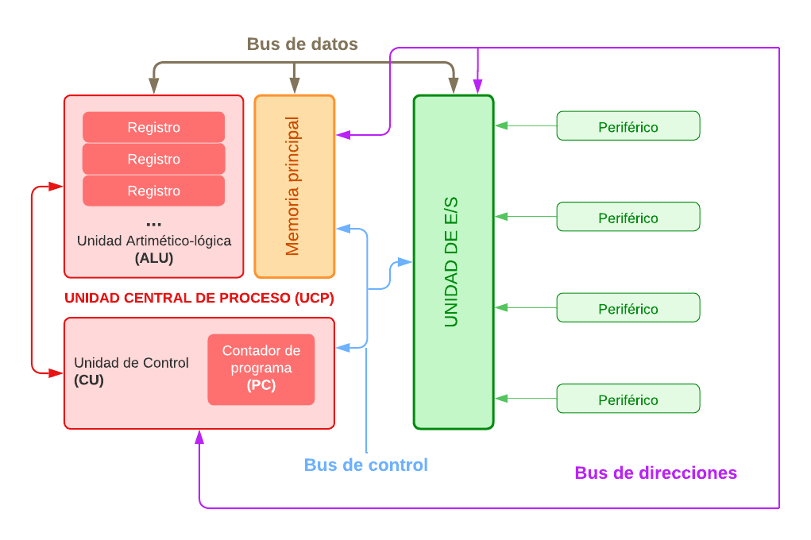

### 1.1.1. Elements principals

Un ordinador és com una ciutat: hi ha edificis diferents amb funcions específiques (els components) i carrers que els connecten (els circuits). Com que cada component electrònic té un paper imprescindible, vegem quins són els més importants per entendre millor per què formen part de l'ordinador.

#### CPU (unitat central de procés)

La CPU (de l'anglès *Central Processing Unit*) és el cervell de l'ordinador. És on es prenen totes les decisions i es processa la informació. Com més ràpid sigui el processador, més instruccions podrà processar en menys temps i, per tant, més ràpid hauria d'anar l'ordinador. La seva velocitat de processament es mesura en **GHz** (gigahertzs).

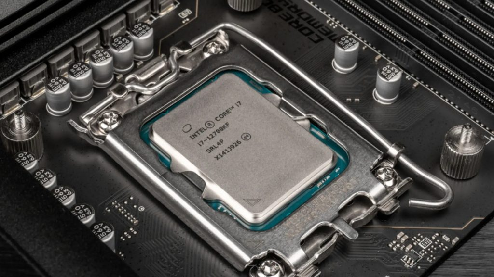{ width="480" }

*Aspecte de la CPU d'un ordinador. A sobre s'hi col·locaria un dissipador perquè no s'escalfi massa.*

!!! example "Exemple"
    Quan jugues a un videojoc de futbol a la consola o a l'ordinador, cada passada, cada gol i cada moviment dels jugadors els processa la CPU. És el cervell que decideix ràpidament què ha de passar a continuació en el joc.

{ width="480" }

#### Memòria RAM

La RAM (de l'anglès *Random Access Memory*, memòria d'accés aleatori) és com la nostra memòria a curt termini. Aquí es guarden les dades que l'ordinador està utilitzant en aquell moment. És una memòria volàtil: quan apagues l'ordinador, tot el que hi havia a la RAM desapareix. Com més gran i ràpida sigui, millor funcionarà l'ordinador. La seva velocitat es mesura en **MHz** (megahertzs) i la seva capacitat en **GB** (gigabytes).

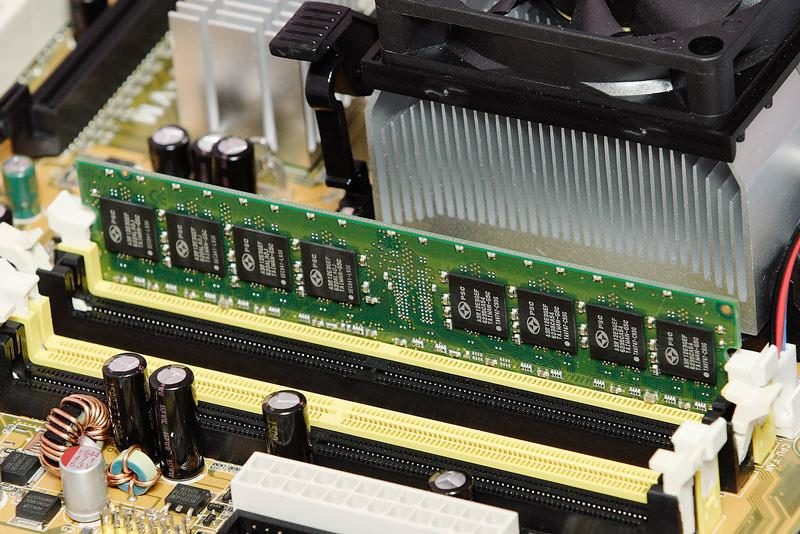{ width="480" }

*Mòdul de memòria RAM al costat de tres ranures buides.*

!!! example "Exemple"
    Imagina que edites un vídeo per a TikTok. Mentre hi treballes, tots els clips, la música i les transicions són a la RAM, i així hi pots accedir ràpidament. Però si no desau el projecte a la memòria del dispositiu i l'apagues, ho perdràs tot!

{ width="560" }

#### Disc dur (HDD o SSD)

És el magatzem principal de l'ordinador. Aquí s'hi guarda tot de manera permanent, des del sistema operatiu fins a les fotografies de les darreres vacances. Serà millor o pitjor segons l'ús que li vulguem donar, i per això hem de triar la tecnologia de fabricació. Els dos tipus fonamentals són l'HDD (*Hard Disk Drive*) i l'SSD (*Solid State Drive*). La seva capacitat es mesura en **GB** o en **TB** (terabytes).

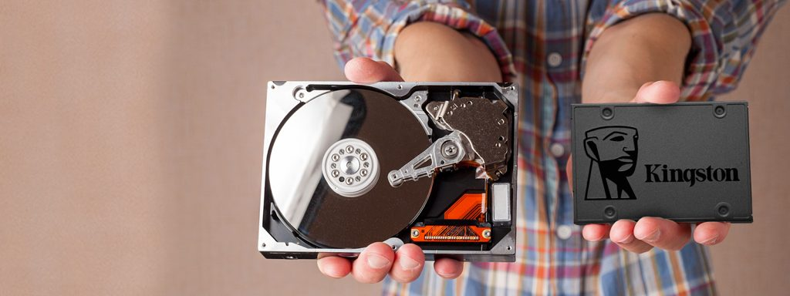{ width="480" }

*Aspecte d'un disc dur HDD sense carcassa i d'un disc dur SSD.*

Diferències entre SSD i HDD:

| SSD | HDD |
| --- | --- |
| Més ràpid | Més lent |
| Menys durada | Més durada |
| Més car | Més econòmic |
| No mecànic (memòria *flash*) | Mecànic (peces mòbils) |
| Resistent als cops | Fràgil |
| Adequat per al sistema operatiu, els jocs i els arxius d'ús freqüent | Adequat per guardar dades addicionals, com pel·lícules, fotografies i documents |

#### Targeta gràfica

S'encarrega de convertir les dades en les imatges i els vídeos que veus a la pantalla. Té el seu propi cervell, un processador gràfic anomenat GPU, que és el seu element principal. Serà millor o pitjor segons la velocitat a la qual treballi la GPU (**MHz** o **GHz**), la mida de la seva memòria interna, anomenada VRAM (**GB**), i la velocitat a la qual és capaç de transportar les dades (**GB/s**).

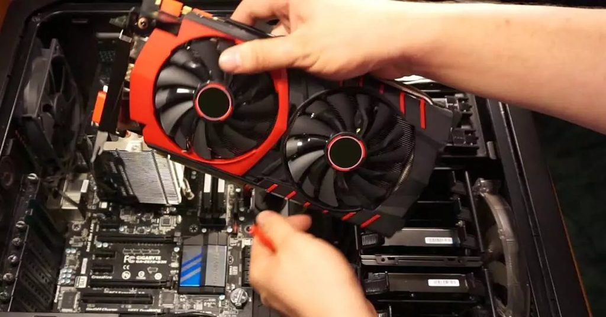{ width="480" }

*Targeta gràfica de darrera generació a punt de ser inserida a la seva ranura.*

!!! example "Exemple"
    Si t'agraden els videojocs amb gràfics realistes, com *Assassin's Creed* o *Red Dead Redemption*, has de saber que aquests gràfics tan detallats són possibles gràcies a la potència de les targetes gràfiques avançades.

{ width="480" }

:material-movie-open: Aquí tens un vídeo molt complet on s'explica de manera senzilla com funciona cadascun dels elements principals d'un ordinador:

<iframe src="https://www.youtube-nocookie.com/embed/0zkX6nlpiSk" title="Components de l'ordinador explicats de manera senzilla" loading="lazy" allowfullscreen></iframe>

### 1.1.2. Muntatge d'un ordinador

Muntar un ordinador és com construir-lo des de zero. Cal precisió i cura perquè tots els components quedin al lloc correcte i la comunicació entre ells sigui l'adequada.

Al llarg del procés et pots trobar amb contratemps, com peces que no encaixen o errors del sistema. Però, amb paciència, podràs resoldre aquests problemes i tenir un ordinador totalment funcional.

Vegem algunes de les fases clau del muntatge:

- **Preparatius**: abans de començar, és fonamental tenir una superfície de treball neta i ordenada. Algunes persones utilitzen polseres antiestàtiques per evitar fer malbé els components amb electricitat estàtica.

    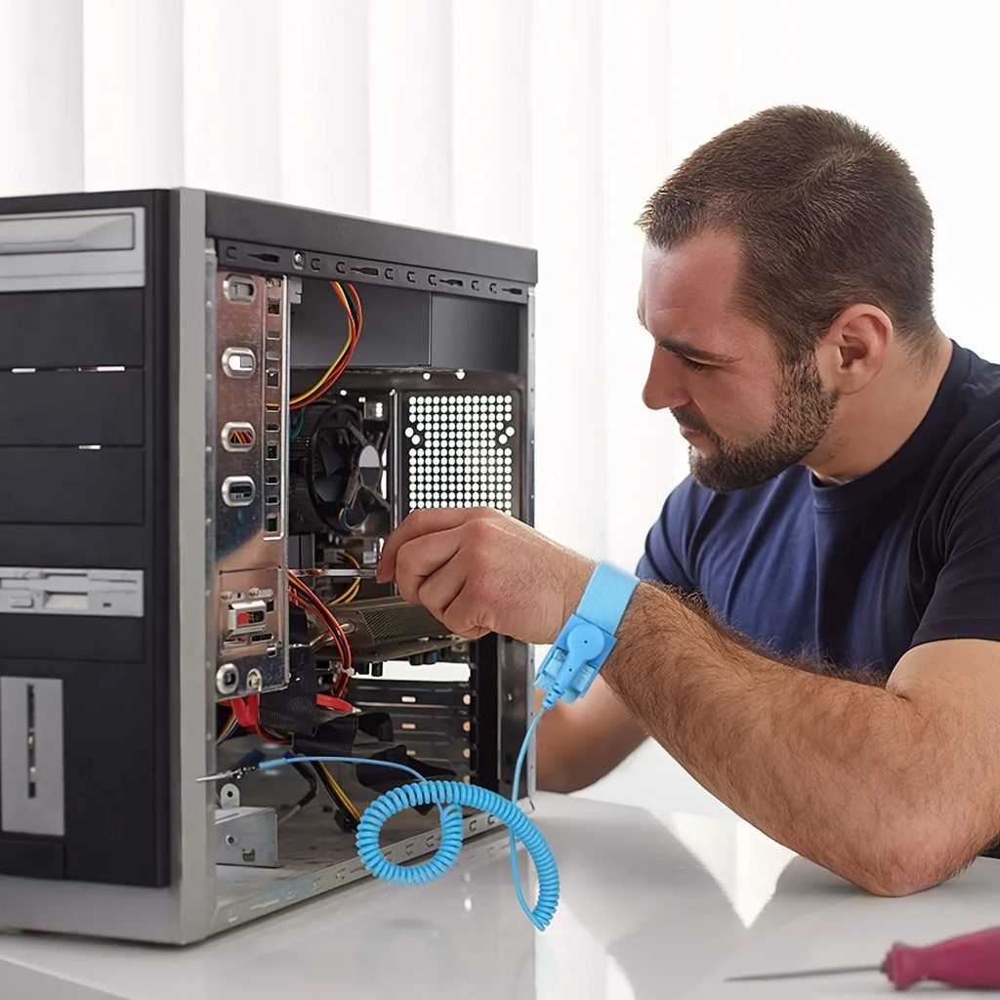{ width="360" }

- **Caixa o torre**: és l'esquelet de l'ordinador. Aquí s'hi col·locaran tots els components. Algunes duen la font d'alimentació ja instal·lada i d'altres no.

    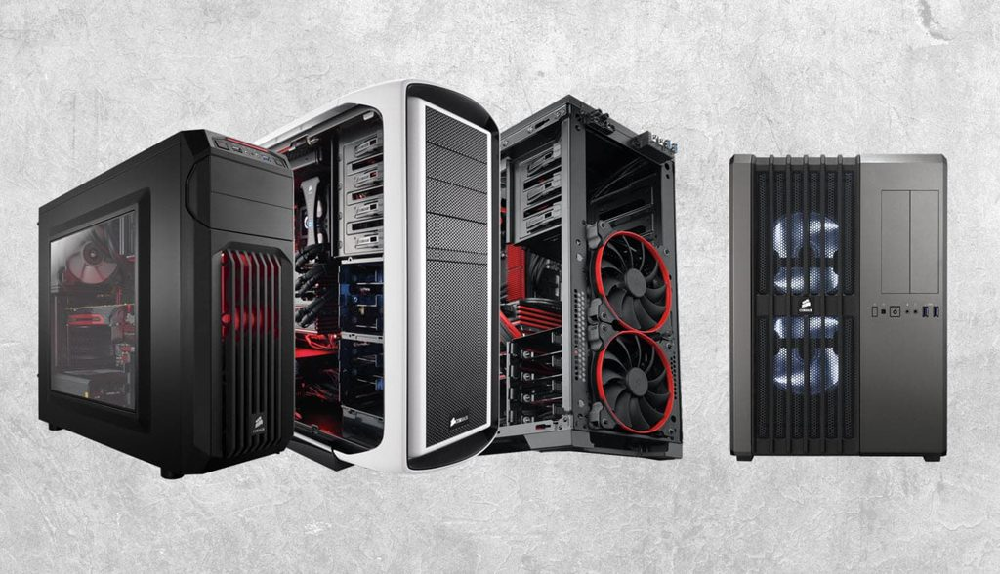{ width="480" }

- **Placa base**: és el component al qual connectarem la resta de components. Es col·loca dins la caixa, alineant-la amb els forats i els cargols corresponents.

    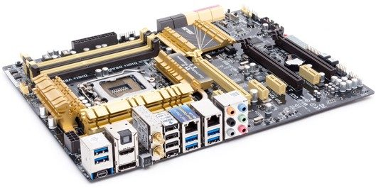{ width="480" }

- **CPU i RAM**: com ja hem vist, són el cervell i la memòria a curt termini. S'instal·len a la placa base, cadascuna a la seva ranura. La CPU sol necessitar pasta tèrmica i un ventilador o dissipador per evitar que s'escalfi massa.
- **Targeta gràfica i disc dur**: s'instal·len a les ranures i a les safates previstes a la placa base i a la caixa, respectivament.
- **Connexions**: un cop tot és al seu lloc, es connecten els cables de la font d'alimentació als components i a la placa base.

:material-movie-open: Segur que ja te n'has fet una idea, però amb aquest vídeo, que explica de manera molt senzilla com muntar un ordinador modern comprat per peces, tindràs més clar tot el procés:

<iframe src="https://www.youtube-nocookie.com/embed/1oanoHjzFwA" title="Guia pas a pas per muntar un ordinador per peces" loading="lazy" allowfullscreen></iframe>

### 1.1.3. Configuració

Un cop muntat, l'ordinador és com un llenç en blanc, a punt per ser configurat i personalitzat. Segueix aquests passos per configurar correctament el teu ordinador acabat de muntar.

#### Accés a la BIOS o UEFI

La BIOS (*Basic Input/Output System*) és el programari que s'executa primer quan engegues l'ordinador. La seva feina és **comprovar que tots els components** del sistema (disc dur, memòria RAM, processador…) **funcionen correctament** abans de carregar el sistema operatiu (Windows, Linux, macOS…). Es troba físicament en un xip de memòria de la placa base.

La UEFI (*Unified Extensible Firmware Interface*) és la versió moderna de la BIOS. Està dissenyada per superar algunes de les seves limitacions, arrencar més ràpid i oferir una interfície gràfica més amigable.

Totes dues permeten configurar ajustaments avançats del sistema que afecten el rendiment de l'ordinador i ens ajuden a protegir l'equip d'amenaces.

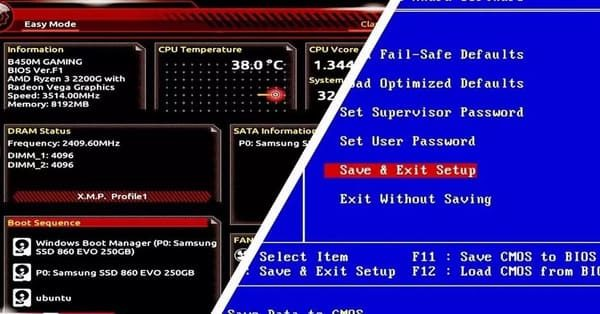{ width="560" }

Per accedir-hi, en engegar l'ordinador hem de prémer repetidament una tecla concreta. Depèn de l'equip, però sovint és ++delete++, ++f2++, ++f10++, ++f8++, ++f12++ o ++esc++.

#### Configurar l'ordre d'arrencada

Per instal·lar el sistema operatiu necessitam que l'ordinador arrenqui des d'una unitat externa, perquè el seu disc dur ara mateix és completament buit. Per això hem de canviar l'ordre d'arrencada perquè no intenti arrencar des del disc dur, sinó des d'un CD, un llapis de memòria USB o la xarxa.

Per fer-ho, a la BIOS o UEFI, ves al **menú d'arrencada** (normalment *Boot menu* o similar) i posa en primer lloc de la llista el dispositiu que conté el sistema operatiu que vols instal·lar.

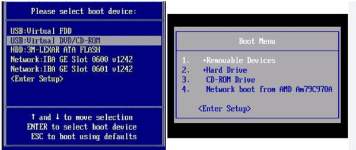{ width="560" }

#### Instal·lació del sistema operatiu

Un cop configurat l'ordre d'arrencada, desa els canvis de la BIOS o UEFI, insereix el suport on tens el sistema operatiu i reinicia l'ordinador. L'ordinador arrencarà des d'aquest dispositiu i començarà la instal·lació.

Al llarg del procés has de fer dues coses: (1) seguir les instruccions de la pantalla i (2) investigar què has de fer quan no coneguis alguna de les opcions que t'ofereix. En qualsevol cas, no pateixis, que no espatllaràs l'ordinador: si la instal·lació no surt bé i el sistema operatiu no arrenca, el tornes a instal·lar i llest.

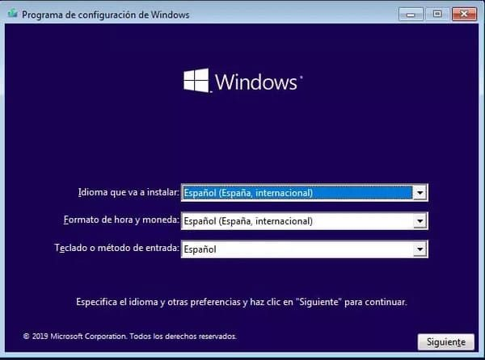{ width="480" }

#### Instal·lació dels controladors

Els **controladors** (en anglès, *drivers*) són petits programes que necessiten els components de l'ordinador per funcionar correctament.

Encara que molts controladors s'instal·len automàticament amb el sistema operatiu, alguns components específics (com les targetes gràfiques avançades) poden necessitar-ne de propis.

Per aconseguir-los, visita el web del fabricant del component (per exemple, NVIDIA o AMD per a les targetes gràfiques) i descarrega el controlador adequat. Executa l'arxiu descarregat i segueix les instruccions per instal·lar-lo.

Moltes vegades, com en el cas dels portàtils, pots anar al web del fabricant, introduir-hi el model i et permetrà descarregar tots els controladors sense haver de cercar-los un per un.

{ width="480" }

#### Actualitzacions

És fonamental mantenir el sistema operatiu actualitzat per garantir la seguretat i el rendiment. A Windows, per exemple, pots anar a ***Configuració > Actualització i seguretat*** i comprovar si hi ha actualitzacions disponibles.

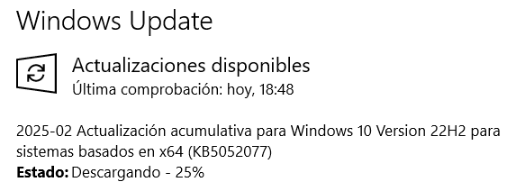{ width="480" }

L'ideal és configurar-les perquè s'instal·lin automàticament i oblidar-te'n.

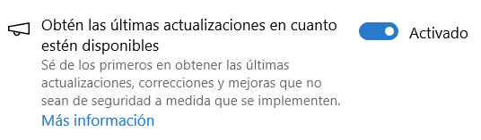{ width="480" }

#### Instal·lació dels programes bàsics

A partir d'aquí, ja tens un ordinador totalment funcional amb el més important configurat. Ara es tracta d'instal·lar les aplicacions que consideris útils. Tanmateix, n'hi ha algunes que tots necessitam en el dia a dia:

- **Navegador web**: Google Chrome, Mozilla Firefox, Microsoft Edge.
- **Paquet ofimàtic**: Microsoft Office, LibreOffice.
- **Antivirus**: tot i que el Windows Defender (inclòs a Windows) és força eficaç, pots considerar altres opcions, com Avast o AVG.
- **Lector de PDF**: Adobe Reader, Foxit Reader.
- **Compressor d'arxius**: 7-Zip, WinRAR.

#### Configuracions addicionals

Altres configuracions que pots fer ja depenen de necessitats molt personals: canviar el fons de l'escriptori o el protector de pantalla, configurar una xarxa domèstica o connectar-te a una xarxa wifi, establir les preferències d'energia (especialment útil en els portàtils) o instal·lar impressores i altres perifèrics.

#### Crear punts de restauració

Finalment, és important estar preparats per si l'ordinador pateix una fallada del maquinari o si algun programa, com un virus, el deixa inutilitzable. Algunes de les coses més importants que podem fer són **fer còpies de seguretat periòdiques** i **crear punts de restauració** després d'instal·lar i configurar-ho tot correctament. Aquests punts són molt importants perquè permeten «tornar enrere» el sistema fins a un estat anterior en què tot funcionava bé.

Per crear un punt de restauració, prem la tecla ++windows++ i escriu «*Crea un punt de restauració*» a la barra de cerca. Obre el resultat i segueix els passos d'aquesta finestra.

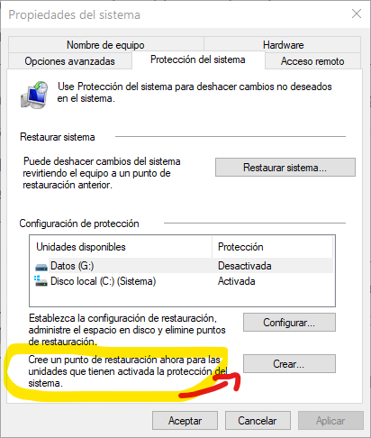{ width="420" }

Per restaurar el sistema a un punt de restauració creat abans, només cal tornar a aquesta finestra, clicar ***Restauració del sistema*** i seguir els passos per triar el punt de restauració que vulguis.

Després de fer tot això, tindràs un ordinador completament configurat i a punt per fer-lo servir cada dia. Recorda que és important fer còpies de seguretat de les teves dades amb regularitat i mantenir actualitzats tant els programes com el sistema operatiu.

<iframe src="https://www.youtube-nocookie.com/embed/83przgnXq4Y" title="La primera arrencada després del muntatge de l'ordinador" loading="lazy" allowfullscreen></iframe>

### 1.1.4. Resolució de problemes

La resolució de problemes és una part fonamental del manteniment d'un ordinador. Vegem en detall alguns dels problemes més habituals i com podem intentar solucionar-los.

??? failure "L'ordinador no s'engega"
    - **Comprovació visual**: assegura't que tots els cables estan ben connectats, inclòs el cable d'alimentació de l'ordinador.
    - **Font d'alimentació**: prova amb un altre cable o un altre endoll. Si la font d'alimentació té un interruptor, comprova que està en la posició «I» (engegat).
    - **Botó d'engegada**: pot ser que el botó estigui defectuós o mal connectat a la placa base. Revisa'n la connexió.

??? failure "L'ordinador s'engega, però no es veu res a la pantalla"
    - **Connexions**: assegura't que el cable del monitor està ben connectat tant a l'ordinador com al monitor.
    - **Sortida de vídeo**: si tens una targeta gràfica independent i també gràfics integrats, comprova que connectes el monitor a la sortida correcta.
    - **Monitor**: prova amb un altre monitor per descartar que el problema sigui del mateix monitor.

??? failure "El sistema es bloqueja o mostra la pantalla blava (BSOD)"
    - **Programari recent**: si has instal·lat algun programa fa poc, podria estar causant conflictes. Prova de desinstal·lar-lo.
    - **Temperatura**: un sobreescalfament pot provocar bloquejos. Assegura't que tots els ventiladors funcionen i que no hi ha pols acumulada.
    - **Memòria RAM**: utilitza eines com el *Diagnòstic de memòria de Windows* per comprovar si hi ha errors a la RAM.

??? failure "L'ordinador fa renous estranys"
    - **Ventiladors**: un renou constant pot ser causat per un ventilador defectuós o per la pols acumulada.
    - **Disc dur**: un «clic» repetitiu pot indicar un problema al disc dur. Fes còpia de seguretat de les teves dades com més aviat millor.

??? failure "L'ordinador s'escalfa massa"
    - **Ventiladors**: assegura't que estan nets i funcionen correctament.
    - **Pasta tèrmica**: potser s'ha de substituir la pasta tèrmica que hi ha entre la CPU i el dissipador.
    - **Entorn**: comprova que l'ordinador no és en un lloc massa tancat o sense una ventilació adequada.

??? failure "L'ordinador va lent"
    - **Programes en segon pla**: tanca els programes que no utilitzis. Fes servir l'Administrador de tasques per veure quins programes consumeixen més recursos.
    - **Disc dur ple**: allibera espai eliminant arxius innecessaris o traslladant-los a un altre dispositiu d'emmagatzematge.
    - **Programari maliciós**: fes una anàlisi completa amb un antivirus.

??? failure "Problemes amb la connexió a internet"
    - **Comprovacions bàsiques**: assegura't que el cable Ethernet està ben connectat o, si és una connexió wifi, que estàs connectat a la xarxa correcta.
    - **Encaminador (*router*)**: reinicia l'encaminador o el mòdem i comprova si altres dispositius tenen el mateix problema.
    - **Controladors**: pot ser que hagis d'actualitzar els controladors de la targeta de xarxa.

??? failure "El so es distorsiona o no se sent"
    - **Connexions**: assegura't que els altaveus o els auriculars estan ben connectats.
    - **Controladors**: actualitza o reinstal·la els controladors de so.
    - **Configuració**: al Tauler de control o a la configuració de so, comprova que la sortida d'àudio està configurada correctament.

Aquests són passos bàsics per resoldre alguns problemes habituals dels ordinadors. Recorda que, si no et sents segur fent alguna d'aquestes accions o el problema persisteix, és recomanable demanar ajuda a un professional o a un servei tècnic.

## 1.2. Sistemes operatius

Un **sistema operatiu** (sovint abreujat com a **SO**) és el programa principal que fa funcionar l'ordinador. És el programari més important de qualsevol dispositiu informàtic perquè en gestiona tots els recursos, des del processador fins a la memòria RAM, passant pels perifèrics com el teclat, el ratolí o la impressora. Sense ell, simplement no podríem comunicar-nos amb la màquina ni executar les aplicacions que necessitam cada dia. El seu paper és tan important que condiciona l'experiència d'ús, l'estabilitat del sistema i el rendiment general de l'ordinador.

Hi ha molts de sistemes operatius, però ens centrarem en els tres més utilitzats en ordinadors personals:

- **Windows**: un dels més utilitzats a tot el món. Probablement molts de vosaltres el teniu a casa. El produeix Microsoft i és conegut per les seves finestres i pel menú d'inici.

    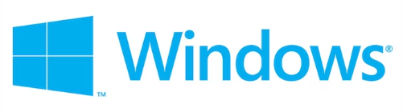{ width="260" }

- **macOS**: és el sistema operatiu dels ordinadors d'Apple, com els MacBook o els iMac. Té un disseny elegant i és conegut per la seva fiabilitat i el seu entorn gràfic cridaner.

    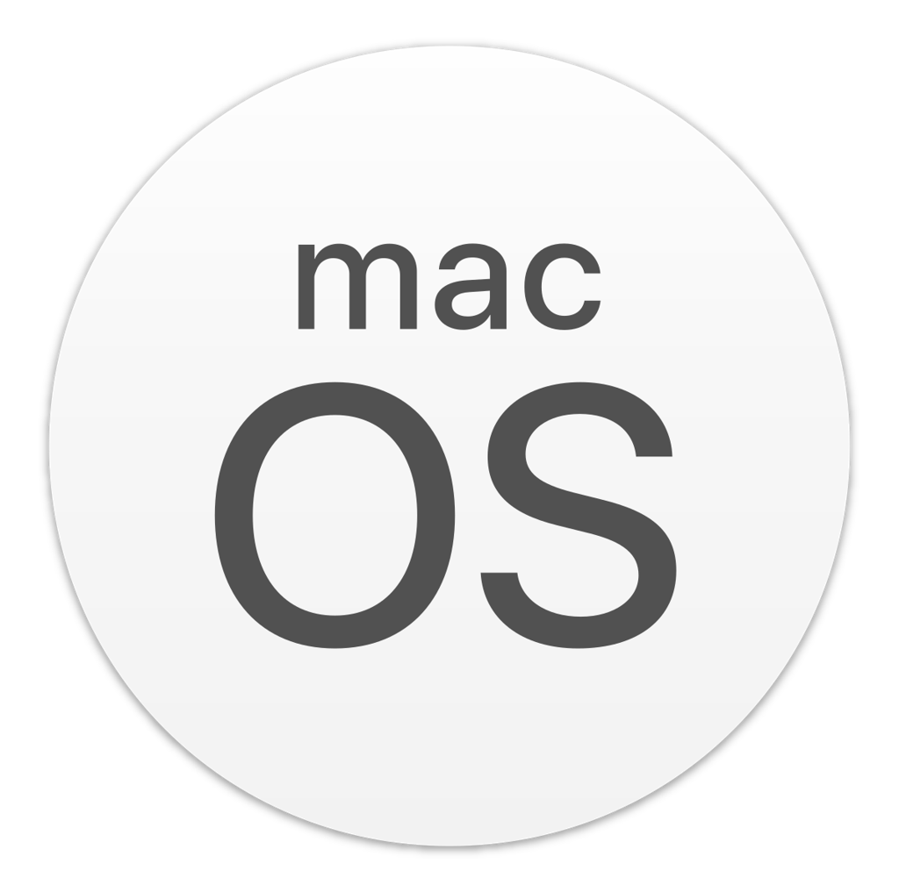{ width="140" }

- **Linux**: a diferència de Windows o macOS, Linux és de codi obert, és a dir, qualsevol persona en pot veure i modificar el codi. N'hi ha diverses *distribucions*, com Ubuntu o Linux Mint, que són versions adaptades del sistema original.

    { width="260" }

A aquests sistemes operatius d'ordinador s'hi han d'afegir molts d'altres, com **Android** i **iOS** (per a dispositius mòbils), **watchOS** i **Wear OS** (per a rellotges intel·ligents), **Google TV** i **Android TV** (per a televisors intel·ligents), **Raspberry Pi OS** (per a plaques de desenvolupament) i molts més.

### 1.2.1. Instal·lació d'un sistema operatiu

La instal·lació d'un sistema operatiu té molts de passos comuns a tots, però cada un té les seves particularitats. En aquestes línies generals ens centrarem en la instal·lació de Windows, perquè és el sistema operatiu que és més probable que instal·leu.

**Què necessitam per començar?**

- Un ordinador.
- Un dispositiu d'emmagatzematge (USB, CD, DVD) o una connexió Ethernet, amb almenys 8 GB d'espai.
- Una còpia de l'instal·lador de Windows, que podem descarregar del web oficial de Microsoft.

**Passos previs**

1. **Còpia de seguretat**: abans de qualsevol instal·lació, és molt recomanable fer una còpia de seguretat de totes les dades importants en un disc extern o al núvol.
2. **Crear un llapis USB d'instal·lació**: utilitza l'**[eina de creació de mitjans de Microsoft](https://support.microsoft.com/ca-es/windows/crear-medios-de-instalaci%C3%B3n-para-windows-99a58364-8c02-206f-aa6f-40c3b507420d)**. Un cop descarregada, l'executam i triam «*Crea un mitjà d'instal·lació per a un altre PC*». Seguim els passos i triam l'opció de gravar-lo en un llapis USB.

**Passos de la instal·lació**

1. **Arrencar des de l'USB**: insereix el llapis USB a l'ordinador i reinicia'l. En engegar-lo, prem repetidament la tecla que et permet accedir al menú d'arrencada (depèn del fabricant: ++f2++, ++f12++, ++esc++…). Tria arrencar des del llapis USB.
2. **Triar l'idioma i el format**: un cop arrencat des de l'USB, veuràs la primera pantalla de l'instal·lador de Windows. Tria l'idioma, el format d'hora i moneda i el teclat. Després, clica «***Següent***».
3. **Instal·lar ara**: clica el botó «***Instal·la ara***».
4. **Introduir la llicència**: si tens una llicència de Windows, introdueix-la en aquest pas. Si no en tens, tria «***No tinc cap clau de producte***». La podràs activar més endavant.

    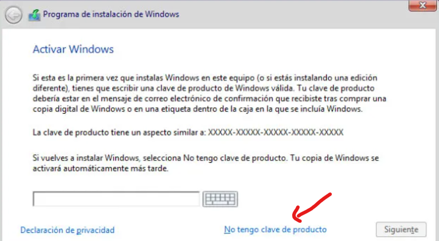{ width="480" }

5. **Triar la versió**: si no has introduït cap llicència, tria la versió de Windows que vols instal·lar.
6. **Acceptar les condicions**: llegeix i accepta les condicions de la llicència.
7. **Tipus d'instal·lació**: tria «***Personalitzada***».
8. **Triar on instal·lar-lo**: aquí veuràs les particions del disc dur. Si no tens coneixements avançats, simplement tria la partició on vols instal·lar Windows (normalment, la més gran) i clica «***Següent***». Si vols fer una instal·lació més avançada, aquí pots esborrar o crear particions. Però compte! Si esborres una partició, eliminaràs totes les dades que contengui.

    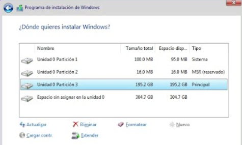{ width="480" }

9. **Inici de la instal·lació**: un cop triada la partició, Windows començarà a instal·lar-se. Durant el procés l'ordinador es reiniciarà diverses vegades. No t'espantis, és normal.
10. **Configuració inicial**: un cop instal·lat, et demanarà que configuris algunes opcions bàsiques: la connexió a una xarxa, la privacitat, crear un compte Microsoft o iniciar-hi la sessió, etc. Segueix les instruccions de la pantalla.
11. **Escriptori**: quan acabis totes les configuracions, arribaràs a l'escriptori de Windows. Enhorabona! Ja tens Windows instal·lat.

### 1.2.2. Configuració d'usuaris

Si instal·les el sistema operatiu perquè l'utilitzin diverses persones, la configuració d'usuaris és un pas important després de la instal·lació, perquè defineix l'accés, els permisos i la personalització de cadascú. A continuació tens els passos per configurar usuaris a Windows.

1. **Accedir als comptes d'usuari**
    - Clica el botó d'***Inici*** (la icona de la finestra a la cantonada inferior esquerra).
    - Escriu «*comptes*» a la barra de cerca i tria «***Comptes d'usuari***».
2. **Crear un compte nou**
    - A la finestra que s'obre, clica «***Gestiona un altre compte***».
    - Després, tria «***Crea un compte nou***».
3. **Nom i tipus de compte**
    - Introdueix un nom per al compte nou. És important que sigui fàcil de reconèixer, sobretot si diversos membres de la família o de l'empresa faran servir el mateix equip.
    - Decideix el tipus de compte:
        - **Administrador**: té accés total a l'equip. Pot instal·lar programes, modificar la configuració del sistema i accedir a tots els arxius. En general, es recomana tenir només un o dos comptes d'administrador i utilitzar-los només quan sigui necessari.
        - **Usuari estàndard**: pot utilitzar la majoria de programes i canviar configuracions que no afectin altres usuaris ni la seguretat de l'equip. És el tipus de compte recomanat per a l'ús diari.
4. **Establir una contrasenya (opcional, però recomanat)**
    - Clica el compte que acabes de crear.
    - Tria «***Crea una contrasenya***».
    - Introdueix la contrasenya i confirma-la. Pots afegir-hi una pista, però assegura't que no reveli massa coses sobre la contrasenya.
5. **Personalitzar el compte**
    - **Imatge de perfil**: pot ser una fotografia personal, el logotip de l'empresa o qualsevol imatge que t'identifiqui.
    - **Fons i temes**: cada usuari pot tenir un fons de pantalla, uns colors i uns sons diferents.
6. **Privacitat i seguretat**: segons l'ús que es faci del compte, pots establir controls parentals, restriccions de compra o limitacions per instal·lar programes.
7. **Aplicacions i programes**: els programes instal·lats des d'un compte d'administrador estaran disponibles per a tots els usuaris, però cada compte pot tenir els seus propis programes i arxius. Si un membre de la família descarrega un joc, per exemple, no apareixerà al compte de la feina.
8. **Acabar**: quan hagis configurat el compte segons les teves necessitats, tanca el tauler de control i reinicia l'equip perquè els canvis tenguin efecte.

És fonamental que en els equips compartits cada persona mantengui el seu compte segur amb una contrasenya robusta. A més, el fet que cada usuari tengui el seu propi compte ajuda a mantenir la informació organitzada i a garantir la privacitat de cadascú.

## 1.3. Sistemes de comunicació i internet

Internet, avui dia, és com l'aire que respiram. És a tot arreu: als vostres mòbils, als ordinadors, a les consoles de videojocs i, fins i tot, a les bombetes. Si alguna vegada t'has demanat com arriba el senyal d'internet al teu dispositiu, ets al lloc adequat. A partir d'aquí estudiarem el món de les xarxes per entendre una mica millor com es connecten entre ells els dispositius que feim servir cada dia per compartir informació.

### 1.3.1. Dispositius principals d'una xarxa domèstica

Ca nostra és com un petit univers digital. A cada racó hi ha un dispositiu esperant connectar-se a internet i fer alguna cosa que sembla màgia. Comencem repassant els aparells que intervenen en tot aquest procés.

#### Encaminador (*router*)

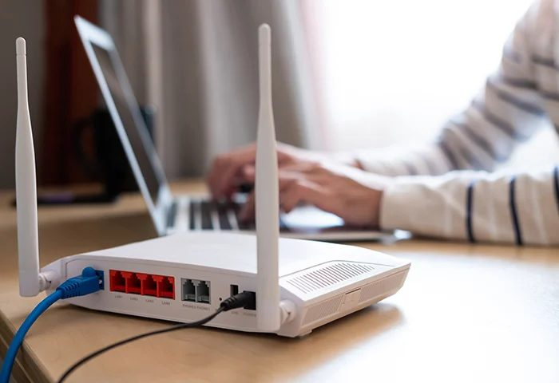{ width="480" }

L'encaminador és com el cor de la nostra xarxa domèstica. És el dispositiu que envia les dades d'internet als dispositius de casa. Gràcies a ell pots veure Netflix a la televisió, jugar en línia amb la consola o fer videotrucades amb el mòbil.

Imagina l'encaminador com un repartidor en una central de paquets. Aquest repartidor rep paquets d'internet i decideix a quin dispositiu de casa ha d'anar cada paquet. Si mires un vídeo de YouTube al mòbil, l'encaminador s'encarrega que aquestes dades arribin correctament al teu mòbil i no a la consola del teu germà.

Per tant, l'encaminador és l'encarregat que cada paquet d'informació arribi al dispositiu correcte.

#### Dispositius finals

Són tots els aparells que utilitzam cada dia i que es connecten a internet: mòbils, ordinadors, videoconsoles, televisors intel·ligents, tauletes, rellotges intel·ligents, altaveus intel·ligents, càmeres de seguretat, etc.

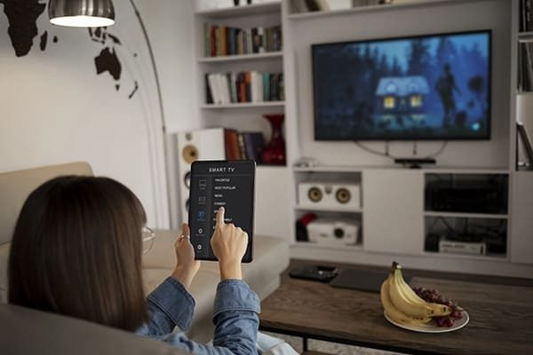{ width="480" }

Aquests dispositius **es connecten a l'encaminador per accedir a internet**. Cada un té una adreça única (com la matrícula d'un cotxe o el teu DNI) que l'encaminador reconeix i utilitza per enviar-li la informació correcta.

#### Commutador (*switch*)

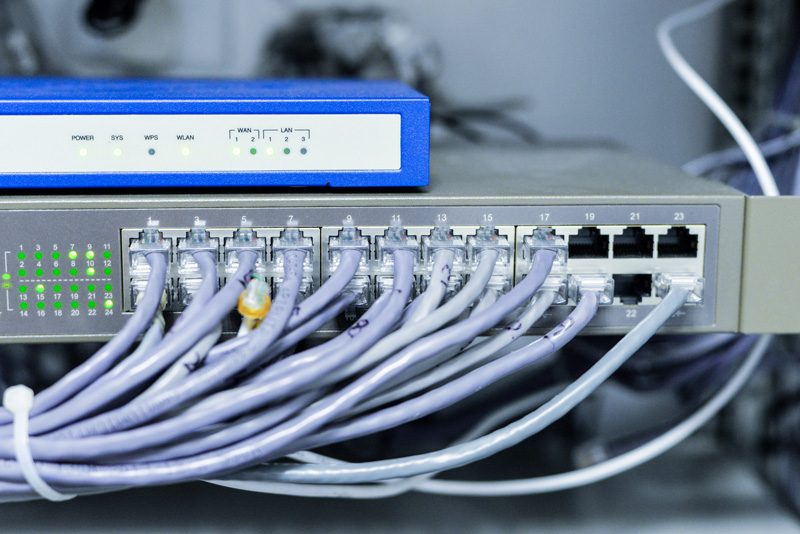{ width="480" }

En els llocs on hi ha molts d'ordinadors connectats a internet per cable, un commutador és imprescindible.

És un dispositiu que amplia el nombre de connexions Ethernet que es poden tenir en una xarxa. Si el teu encaminador té, per exemple, 4 ports i necessites connectar 10 dispositius per cable, faries servir un commutador.

Al capdavall, és com una regleta d'endolls, però en lloc de cables de corrent elèctric, amb cables d'internet. Si tens més dispositius dels que pots connectar directament a l'encaminador, el commutador et dona més «endolls» per connectar-los tots.

#### Cablejat

Tots aquests dispositius s'han de connectar entre ells o amb altres dispositius. Hi ha moltíssims tipus de cables, però els més utilitzats són aquests dos:

- **Cable de parell trenat**: a dins hi ha quatre parells de fils entrellaçats per reduir les interferències. Al seu extrem s'hi col·loca un **connector RJ45**. A més, cada fil té un color específic i l'ordre en què es col·loquen segueix la norma **T568A** o **T568B**.

    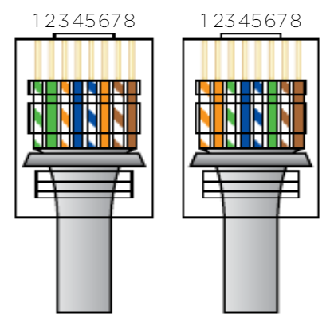{ width="320" }

- **Cable de fibra òptica**: està format per una o diverses fibres de vidre o de plàstic per les quals viatja **un feix de llum**. Suporta una gran amplada de banda i proporciona una connexió molt més estable. Normalment, **la fibra òptica s'utilitza per cablejar grans distàncies (des del proveïdor fins a l'encaminador), i el cable de parell trenat per a distàncies curtes (des de l'encaminador fins als dispositius finals, com ordinadors, televisors, consoles, impressores, etc.)**.

    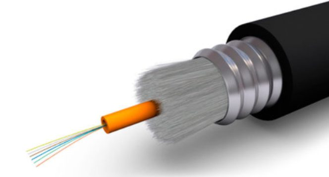{ width="400" }

### 1.3.2. Configuració bàsica d'una xarxa domèstica

Quan anam a viure a una casa nova o canviam de proveïdor d'internet, sovint ens toca configurar una xarxa domèstica. Però com funciona aquest procés? Com aconseguim que tots els nostres dispositius es connectin de manera segura? Vegem-ho.

#### Ubicació òptima de l'encaminador

El primer pas és instal·lar l'encaminador. L'hem de col·locar en un lloc central de la casa: si el posam en un extrem, les habitacions més llunyanes podrien tenir poc senyal. També és important mantenir-lo elevat i lluny d'obstacles (com parets gruixades o electrodomèstics grans) que puguin interferir en el senyal. Pel que fa a la ubicació, l'encaminador és com un llum: si el poses en un racó amagat, no il·luminarà tota l'habitació; però si el poses al centre i elevat, la llum arribarà a tots els racons.

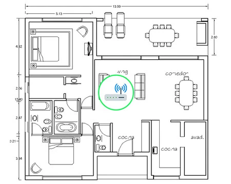{ width="420" }

Un detall més: per què alguns encaminadors tenen tantes antenes? Com les hem de col·locar? Segur que aquesta imatge et donarà la resposta.

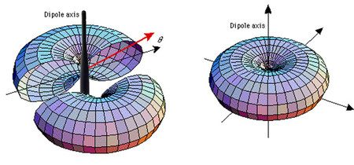{ width="480" }

Efectivament, el senyal de les antenes es propaga en un pla perpendicular a l'antena. Per tant, si el teu encaminador té més d'una antena, l'ideal és orientar-les en angles diferents per arribar a una zona més àmplia:

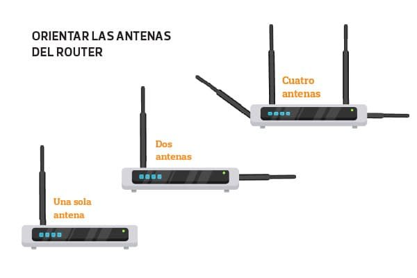{ width="420" }

#### Configuració bàsica

És important personalitzar el nom de la xarxa (**SSID**) i establir-hi una contrasenya segura.

- **Accedeix a la interfície de l'encaminador**: la majoria d'encaminadors permeten accedir a la seva interfície des d'un navegador web. A la caixa de l'encaminador o al manual hi hauria d'haver una adreça (com ***192.168.1.1***) i les credencials d'accés. Escriu aquesta adreça al navegador.

    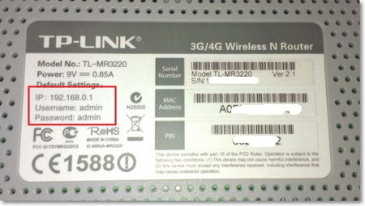{ width="400" }

- **Nom de la xarxa (SSID)**: al menú de l'encaminador, cerca una opció com «Configuració sense fil» o «WLAN». Aquí pots canviar el nom de la xarxa.
- **Contrasenya**: a la mateixa secció hi hauria d'haver una opció per establir o canviar la contrasenya. Tria una combinació robusta de lletres, nombres i símbols.

!!! example "Pensa-ho així"
    La xarxa és com ca teva. El nom de la xarxa és com l'adreça de la casa, i la contrasenya és com el pany de la porta. No vols que hi entri qualsevol sense permís, oi? Doncs posa la contrasenya més difícil que siguis capaç de recordar.

#### Connexió de dispositius a la xarxa

Amb la xarxa configurada, és el moment de connectar-hi tots els dispositius.

- **Cerca la teva xarxa**: al dispositiu que vulguis connectar, ves a la secció de xarxes o de wifi i cerca el nom de la teva xarxa.
- **Introdueix la contrasenya**: quan seleccionis la xarxa, et demanarà la contrasenya que has configurat abans.

#### Configuracions addicionals

Hi ha algunes configuracions addicionals que poden ser útils per optimitzar i protegir la xarxa.

- **Filtre MAC**: permet indicar quins dispositius es poden connectar a la xarxa a partir de la seva **adreça MAC** (un identificador únic de cada dispositiu assignat pel fabricant). Així, **encara que algú conegui la contrasenya, si la seva adreça MAC no és a la llista, no s'hi podrà connectar**.

    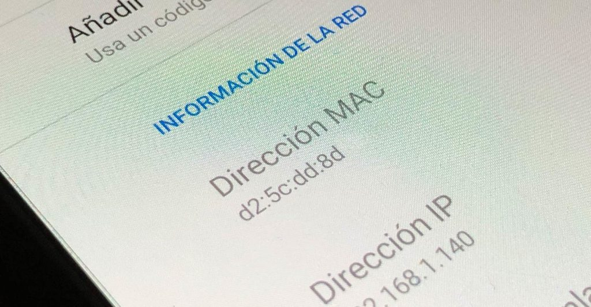{ width="400" }

- **Canals wifi**: de vegades, **si hi ha moltes xarxes a prop, es poden produir interferències**. Canviant el canal wifi de l'encaminador pots millorar el senyal. És com canviar de carril en una autopista quan un està molt congestionat.

    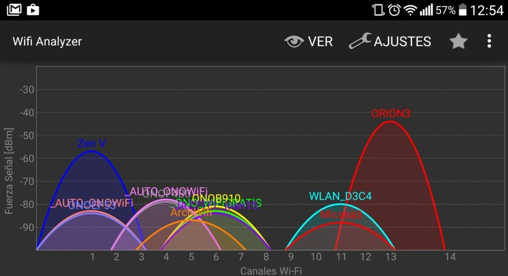{ width="480" }

Configurar una xarxa domèstica pot semblar complicat al principi, però amb aquests passos i una bona dosi de paciència aconseguiràs una xarxa eficient i segura.

### 1.3.3. Connexió avançada de dispositius

A més dels ordinadors i dels mòbils, ara tenim televisors intel·ligents, càmeres de seguretat, equips de so i molts d'altres aparells que ens fan la vida més còmoda. Però, per connectar alguns dispositius, no sempre ens serviran les opcions que feim servir per connectar el mòbil o el portàtil. Vegem quins altres tipus de connexió tenim a l'abast per treure el màxim profit de tots els nostres dispositius.

#### Tipus de connexió

- **Connexió per cable (Ethernet)**: l'opció més estable. Ideal per a dispositius que necessiten una velocitat alta i constant, com les consoles de videojocs o els ordinadors d'alt rendiment. No depèn de la qualitat del senyal sense fil, de manera que té menys interrupcions.

    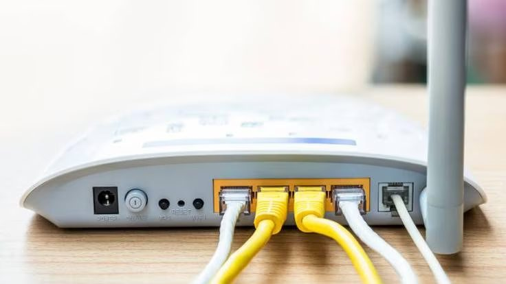{ width="400" }

- **Connexió wifi**: l'opció més versàtil, ideal per a mòbils, tauletes i alguns electrodomèstics intel·ligents.
- **Connexió Bluetooth**: s'utilitza principalment per a la comunicació de curt abast, com altaveus, teclats, ratolins o auriculars.

    { width="360" }

#### Xarxa per a convidats

De vegades, quan tenim visites a casa, volem donar-los accés a internet sense posar en risc la seguretat de la xarxa principal; és a dir, volem oferir internet sense haver de dir la contrasenya a ningú. Amb una xarxa per a convidats ho podem fer.

Per crear una **xarxa per a convidats**, accedeix a la interfície de l'encaminador, com hem vist abans, i cerca l'opció «Xarxa per a convidats» o similar. Activa-la i assigna-li un SSID i una contrasenya. Llest! Ja tens una xarxa addicional per a les visites.

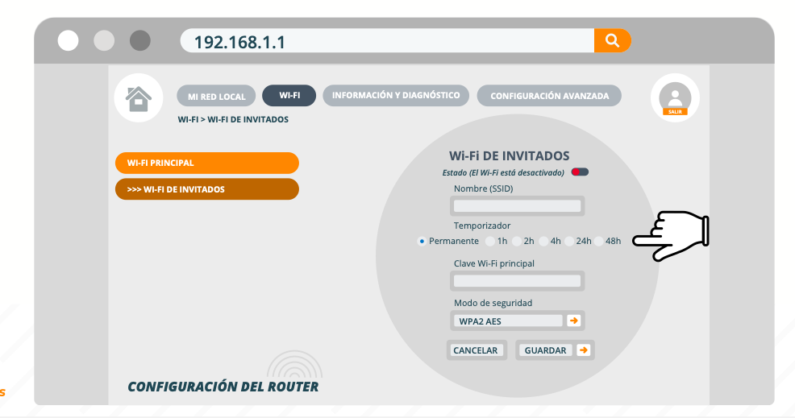{ width="480" }

#### Connexió d'altres dispositius

- **Televisors intel·ligents**: solen tenir un menú de configuració que et guia pas a pas per connectar-los a la xarxa wifi. Tingues la contrasenya a mà. Un cop connectat, podràs gaudir de serveis de *streaming*, com Netflix o HBO, directament al televisor. Si a més l'encaminador és a prop del televisor, et recoman que **el connectis per cable**, perquè la reproducció de vídeo serà molt més estable.
- **Equips de so**: aparells com els de la marca Sonos o l'Amazon Echo solen tenir aplicacions pròpies que et guien en la connexió i la configuració.
- **Càmeres de seguretat**: es poden connectar per wifi o per cable Ethernet. Un cop a la xarxa, podràs veure'n les imatges des del mòbil o l'ordinador, fins i tot quan no siguis a casa.

#### Millorar el senyal amb repetidors

Si en alguna part de la casa el senyal wifi és feble, pots utilitzar un **repetidor** per amplificar-lo.

Com funciona? Col·loca el repetidor a mig camí entre l'encaminador i la zona amb poc senyal. El repetidor captarà el senyal de l'encaminador i el retransmetrà amplificat.

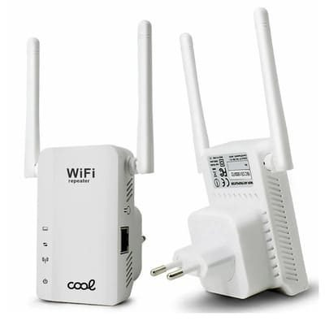{ width="320" }

Una altra opció molt interessant és la **tecnologia PLC**. Es tracta d'un petit dispositiu que **es connecta a qualsevol endoll de la casa i utilitza el cablejat elèctric per transmetre les dades d'internet**. Com ho sents!

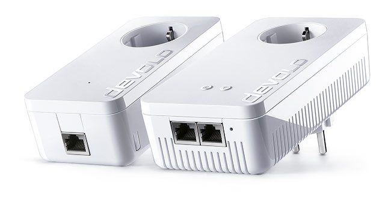{ width="360" }

#### Control parental i prioritat de dispositius

És possible que a casa hi hagi dispositius que necessitin més amplada de banda que d'altres. A més, si hi ha infants, voldreu controlar a què poden accedir.

- **Prioritat**: des de la interfície de l'encaminador pots decidir quins dispositius tenen prioritat a la connexió. Per exemple, si fas una videoconferència, pots donar prioritat al teu ordinador per evitar talls.
- **Control parental**: molts d'encaminadors ofereixen opcions per limitar l'accés a determinats webs o aplicacions. Així pots assegurar-te que els més petits naveguen de manera segura.

## 1.4. Dispositius connectats (IoT i *wearables*)

El nombre de dispositius que es poden connectar a internet, més enllà dels ordinadors i els mòbils de tota la vida, creix sense aturar. Aquesta revolució, coneguda com a **internet de les coses** (IoT, de l'anglès *Internet of Things*), juntament amb els dispositius ***wearables*** (tecnologia que es duu posada), ens permet interactuar d'una manera nova amb els objectes quotidians. Des de geleres que ens avisen quan s'acaba la llet fins a rellotges que controlen la nostra salut, les aplicacions d'aquestes tecnologies són cada vegada més sorprenents.

### 1.4.1. Internet de les coses (IoT)

Imagina un món on els fanals del carrer s'encenen tots sols quan es pon el sol, o on un pagès rep un avís al mòbil si un sensor detecta que les seves plantacions necessiten reg. Aquest món ja és una realitat gràcies a la internet de les coses. Però què és exactament la IoT?

#### Concepte

La IoT és la interconnexió digital d'objectes quotidians amb internet per poder controlar-ne el funcionament o extreure informació útil del seu ús. No es tracta només de connectar dispositius electrònics, com mòbils i ordinadors, sinó també objectes que tradicionalment no estaven connectats, com electrodomèstics, vehicles o fins i tot la roba (*wearables*).

#### Funcionament bàsic

El funcionament de la IoT es basa en tres pilars:

- **Sensors**: recullen dades de l'entorn. Poden ser sensors de temperatura, moviment, humitat, lluminositat, etc.

    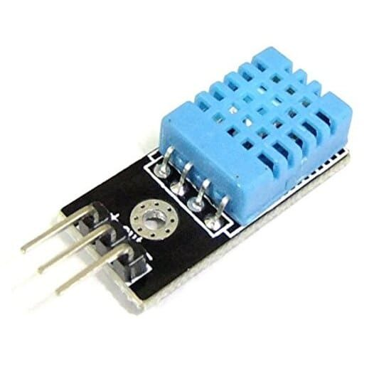{ width="300" }

- **Connexió**: els dispositius es connecten a internet mitjançant diverses tecnologies, com el wifi, el Bluetooth o el 5G.
- **Processament**: un cop recollides, les dades s'envien a plataformes de processament per analitzar-les. Segons aquestes dades, es poden activar diferents accions automàtiques, com l'enviament d'un correu electrònic, un missatge de Telegram o un senyal acústic.

    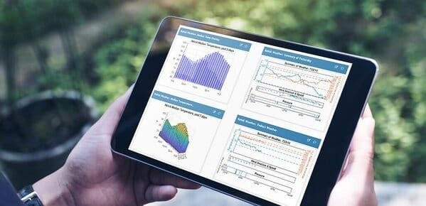{ width="440" }

#### Aplicacions pràctiques

La IoT s'aplica a moltíssimes indústries i àmbits de la nostra vida. Repassem-ne alguns dels més habituals:

- **Llar intel·ligent**: climatització automàtica segons la temperatura exterior, reg automàtic, persianes automàtiques, geleres que fan la compra, il·luminació que s'ajusta tota sola…
- **Salut**: dispositius que controlen constantment la nostra salut i que, si detecten algun problema, avisen automàticament un centre de salut o la família.

    { width="400" }

- **Agricultura**: sensors en finques que detecten moltes magnituds, com la humitat del sòl, la temperatura, el color del fruit o la qualitat de l'aire, i que, segons els paràmetres configurats, activen altres dispositius per corregir la situació (engegar una bomba d'aigua, obrir un hivernacle, aplicar insecticida…).

    { width="440" }

- **Ciutats intel·ligents**: papereres que avisen quan són plenes, semàfors que canvien la temporització segons el trànsit, fonts que s'activen quan detecten que algú s'hi acosta, previsió del pas del següent transport públic, optimització de rutes, localització d'aparcament, senyals visuals o sonors…

    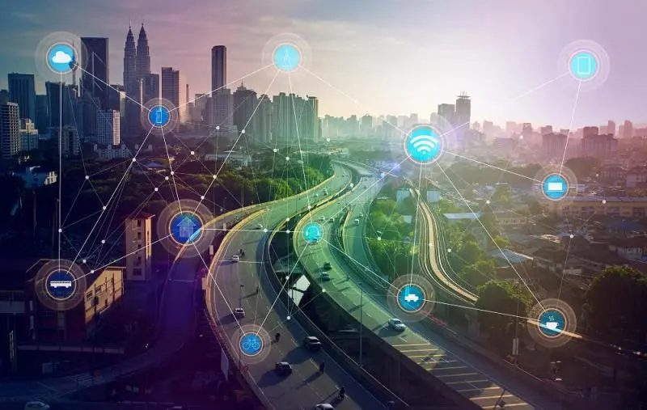{ width="440" }

#### Avantatges de la IoT

- **Automatització i control**: moltes tasques es poden automatitzar, cosa que ens fa la vida més còmoda.
- **Eficiència energètica**: alguns dispositius només funcionen quan cal, i així s'estalvia energia.
- **Estalvi econòmic**: optimitzant l'ús dels recursos, podem reduir costos.
- **Informació**: disposar de dades constantment ens permet prendre decisions més ben informades.

#### Inconvenients de la IoT

- **Seguretat**: com més dispositius connectats, més punts d'entrada per a possibles atacs informàtics.
- **Privacitat**: els dispositius recullen moltes dades sobre els nostres hàbits i no sabem què se'n fa.
- **Interoperabilitat**: no tots els dispositius són compatibles entre ells.

:material-movie-open: [Alguns dels projectes IoT més innovadors](https://youtu.be/1GcMAiIMQYU) (vídeo en castellà).

### 1.4.2. *Wearables* (tecnologia que es duu posada)

*Wearable* és una paraula anglesa que vol dir «que es pot dur posat». Fa referència als dispositius electrònics que incorporam a la roba o que duim damunt el cos. Sovint estan connectats a internet o al mòbil i ens ofereixen moltes funcions, des de mostrar notificacions fins a controlar diferents magnituds del nostre cos.

#### Tipus principals de *wearables*

- **Rellotges intel·ligents**: com un rellotge normal, però amb més funcions. Poden mostrar missatges, fer trucades, controlar la música o fins i tot pagar a les botigues. Per exemple, l'Apple Watch o el Samsung Galaxy Watch.

    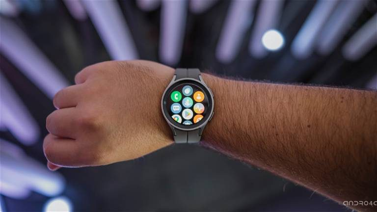{ width="400" }

- **Polseres d'activitat**: dissenyades principalment per controlar l'activitat física, compten les passes i mesuren la qualitat de la son, el ritme cardíac i molt més. Per exemple, la Fitbit Charge o la Xiaomi Mi Band.

    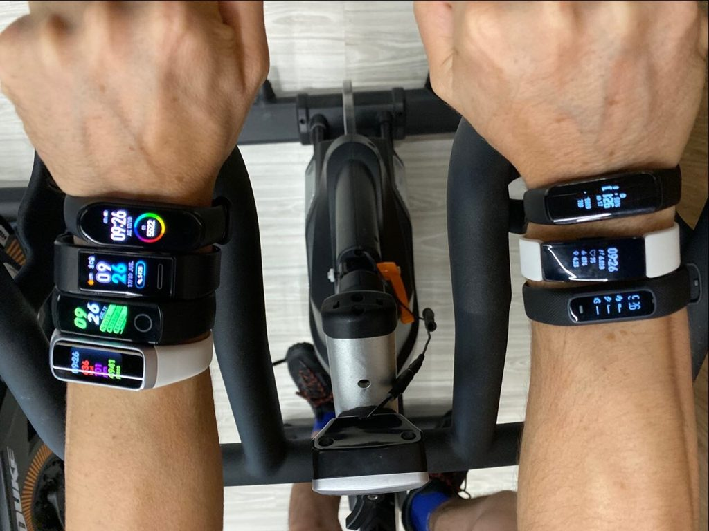{ width="360" }

- **Ulleres intel·ligents**: encara que són menys habituals, aquestes ulleres mostren informació a les lents i poden gravar vídeo o donar indicacions de navegació. Les Ray-Ban Meta en són un exemple, tot i que n'hi ha d'altres més orientades a la realitat augmentada, com les HoloLens de Microsoft.

    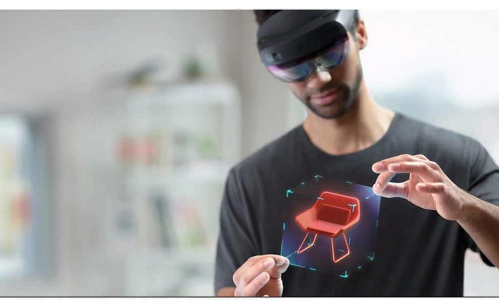{ width="400" }

- ***Hearables***: no només serveixen per escoltar música sense fils; alguns models ja incorporen assistents virtuals, sensors de salut, traducció simultània a centenars d'idiomes o cancel·lació de renou adaptativa, com els AirPods Pro o els Sony WF-1000XM4.

    { width="400" }

Els *wearables* són una prova més de com la tecnologia s'integra cada vegada més en el nostre dia a dia. Ens ofereixen comoditat i funcionalitat i ens obren portes a noves maneres d'interactuar amb el món digital. Però, com passa amb tota tecnologia, és molt important utilitzar-los de manera informada.

:material-movie-open: [Alguns dels *wearables* més destacats dels darrers anys](https://youtu.be/DQ3_bdwltq0) (vídeo en castellà).

### 1.4.3. Beneficis i reptes

Els dispositius connectats són un exemple clar de com la informàtica es pot integrar de manera gairebé imperceptible en la nostra vida. Els seus beneficis són evidents, però també és fonamental tenir en compte els reptes que plantegen.

Els beneficis no són menyspreables: ens aporten comoditat i practicitat, ens poden motivar i ens ajuden a adquirir hàbits saludables. A més, molts ens ajuden a detectar situacions de perill o a localitzar-nos si tenim problemes, per la qual cosa també augmenten la nostra seguretat.

A l'altre plat de la balança hi ha inconvenients importants, com la privacitat de les nostres dades, que de vegades pot provocar la pèrdua d'informació molt valuosa. També ens fan encara més dependents de la tecnologia i ens poden dur a gastar en dispositius i accessoris que no sempre aporten un benefici clar. Finalment, tenen un impacte social important, ja que es perden interaccions humanes i això fa que s'atrofiïn els nostres instints.

Com en tots els àmbits de la vida, hem de ser crítics i equilibrats en l'ús que feim de la tecnologia: aprofitar-ne el millor, però tenint molt presents les seves febleses per protegir-nos dels seus efectes indesitjables.

---

!!! quote "Font"
    Unitat traduïda i adaptada de [«Tema 1. Dispositivos digitales, sistemas operativos y de comunicación»](https://lopegonzalez.es/eso-y-bachillerato/digitalizacion-4o-eso/tema-1-dispositivos-digitales-sistemas-operativos-y-de-comunicacion/), de Lope González Vázquez ([CC BY-NC-SA 4.0](https://creativecommons.org/licenses/by-nc-sa/4.0/deed.ca)). Canvis: traducció al català, adaptació al currículum de les Illes Balears, reorganització del format, taula SSD/HDD refeta en català, supressió de les recomanacions de compra i de la referència al sistema operatiu educatiu andalús. Alguns esquemes conserven textos en castellà i els vídeos són en castellà.
