# Unitat 2. Gestió de la informació

En un món hiperconnectat, la informació s'ha convertit en una de les monedes més valuoses de la nostra societat. Cada vegada que llisques el dit per la pantalla del mòbil, cerques una recepta de cuina o vols saber l'horari de la pròxima pel·lícula al cinema, interactues amb oceans enormes de dades. Però com sabem quina és la informació adequada? I, un cop la trobam, què en feim?

Suposem que organitzes una festa per al teu millor amic. Necessites idees per a la decoració, la música, el menjar, la beguda, etc. Aquest procés de cercar detalls concrets a internet és el que anomenam ***cerca d'informació* (2.1)**. Un cop tenguis tota aquesta informació, hauràs de decidir com l'ordenes, potser en carpetes o en llistes al mòbil: això és l'***administració de la informació* (2.2)**. Però la cosa no acaba aquí: hauràs de decidir què fas primer, amb quins proveïdors contactes, com i quan. És el que coneixem com a ***gestió de la informació* (2.3)**.

Segur que trobaràs moltíssimes opcions per a cada detall de la festa. Hauràs de triar les més adequades i descartar les que no encaixin amb el teu pla: això és la ***selecció de la informació* (2.4)**. I, finalment, quan hagi passat la festa, voldràs guardar les fotografies, les llistes i potser algunes notes per a la pròxima vegada. Aquí entra en joc l'***arxiu de la informació* (2.5)**.

Al llarg d'aquesta unitat aprendrem a moure'ns per tots aquests processos, a fer-los part de les nostres habilitats quotidianes i a gestionar-los amb confiança.

## 2.1. Cerca d'informació

La cerca d'informació és una habilitat clau en la nostra societat digital. De la mateixa manera que cal saber cercar en una biblioteca, saber cercar a internet és essencial per trobar la informació que necessitam de manera eficient.

### 2.1.1. Per què és important?

Posem-nos en una situació típica: fas un projecte per a l'institut sobre el canvi climàtic i necessites dades actualitzades i opinions d'experts. Podries escriure simplement *canvi climàtic* al teu cercador preferit, però quina garantia tens que la informació que trobis serà rellevant, precisa o, fins i tot, veraç?

D'altra banda, imagina que sents una cançó a la ràdio i només en recordes una frase de la lletra, però no el títol. Si sabessis cercar-la bé, la podries trobar en pocs segons.

### 2.1.2. Eines de cerca

En l'era digital, les eines de cerca han evolucionat molt més enllà dels antics directoris o índexs.

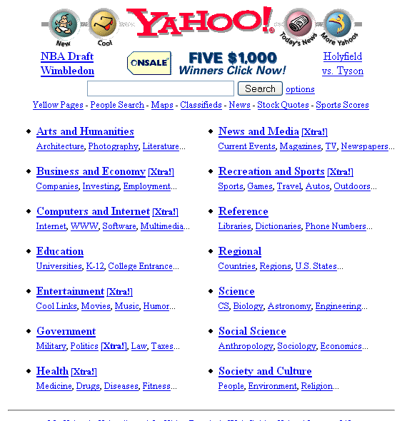{ width="420" }

*Aspecte d'un directori que organitzava la informació abans de l'arribada dels cercadors.*

Avui no només tenim cercadors molt potents, sinó també plataformes i bases de dades especialitzades que ens donen accés a una quantitat enorme d'informació. Vegem-ne algunes.

**Cercadors generals**

- **Google**: és el cercador més popular i utilitzat del món. El seu algorisme avançat ofereix resultats precisos basats en la **rellevància i l'autoritat del contingut**. A més, té eines addicionals com [Google Acadèmic](https://scholar.google.es/) (per a treballs acadèmics) o [Google Imatges](https://images.google.com/) (per cercar imatges).

    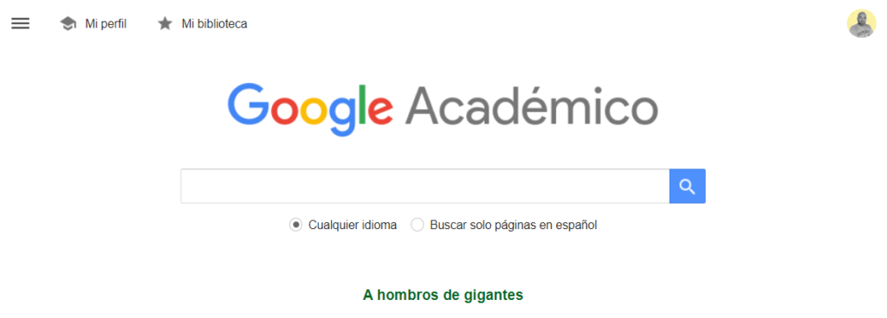{ width="560" }

- **Bing**: gestionat per Microsoft, és un altre cercador molt utilitzat que ofereix funcions diverses, com la **integració amb Microsoft Office** i suggeriments de cerca basats en les tendències del moment.
- **DuckDuckGo**: és conegut per ser un cercador que **respecta la privacitat de l'usuari**, ja que evita el seguiment i l'acumulació de dades personals. El seu objectiu principal és oferir resultats objectius, sense personalitzar-los segons l'historial de cerca de l'usuari.

    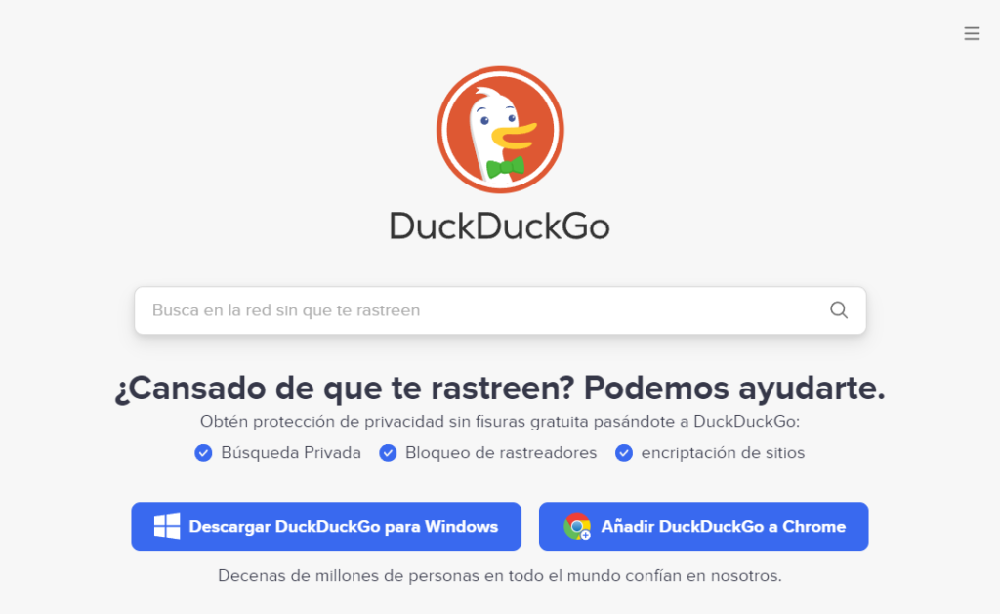{ width="480" }

**Bases de dades especialitzades**

- **PubMed**: base de dades gratuïta de referències d'articles de revistes, principalment de medicina. És molt útil per a estudiants i professionals de l'àmbit de la salut.
- **JSTOR** (*Journal Storage*): base de dades digital que dona accés a milers de revistes acadèmiques, llibres i fonts primàries d'humanitats, ciències socials i altres àrees.
- **ERIC** (*Education Resources Information Center*): recurs molt valuós per a l'àmbit de l'educació, amb accés a investigacions i publicacions sobre el tema.

**Les xarxes socials com a eines de cerca**

Encara que tradicionalment no es consideren eines de cerca, les xarxes socials poden ser clau per trobar informació actualitzada, tendències i opinions en temps real.

- **X**: és especialment útil per a **notícies d'última hora i tendències actuals**. Amb les etiquetes (*hashtags*) pots seguir temes o esdeveniments concrets en temps real.
- **LinkedIn**: serveix per cercar **informació professional, empreses i treballadors**, o fins i tot temes de recerca i articles relacionats amb sectors concrets.
- **Instagram i Pinterest**: són plataformes basades en imatges i són **útils per cercar inspiració visual**, des de moda fins a decoració d'interiors.
- **YouTube, Twitch i TikTok**: són plataformes de vídeo amb una quantitat immensa de continguts que podem filtrar per categories amb canals, etiquetes o tendències. La primera se centra en **vídeos d'una certa durada**, la segona en la **retransmissió en directe (*streaming*)** i la tercera en **vídeos curts** amb una capacitat sorprenent de fer-se virals.

**Repositoris i arxius digitals**

- **Internet Archive**: una **biblioteca digital** que conté milions de llibres gratuïts, pel·lícules, programari i música, a més de còpies de **pàgines web al llarg del temps** gràcies a la seva eina *Wayback Machine*.
- **Google Llibres**: una eina molt potent per **cercar dins del contingut dels llibres**. Encara que no sempre es pot accedir al llibre complet, és útil per localitzar fonts i referències.

    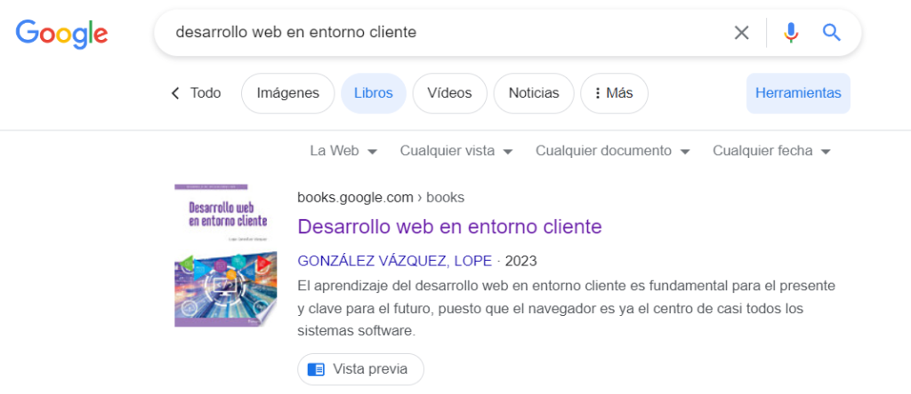{ width="560" }

- **Butlletins (*newsletters*)**: els butlletins han tornat a agafar força perquè donen als creadors el control sobre el seu contingut, lluny dels algorismes de les xarxes socials. Permeten una connexió personalitzada, amb menys saturació i models de finançament directe. S'adapten a públics molt concrets i el seu format és versàtil. En un món amb un excés d'informació, els butlletins fan arribar **contingut seleccionat directament a la safata d'entrada, respectant la privacitat**. Algunes de les plataformes més conegudes són [Mailchimp](https://mailchimp.com/es/), [Brevo](https://www.brevo.com/es/products/marketing-platform/) i [Substack](https://substack.com/).

<iframe src="https://www.youtube-nocookie.com/embed/dtIkUy7li_4" title="Vídeo sobre els butlletins electrònics" loading="lazy" allowfullscreen></iframe>

Si entens i domines aquestes eines, milloraràs la teva capacitat d'accedir a informació precisa i rellevant. És com tenir la clau d'una biblioteca immensa i saber exactament a quina prestatgeria trobaràs el llibre que necessites.

### 2.1.3. Tècniques de cerca efectiva

En la immensitat d'internet, saber trobar informació precisa i rellevant és una habilitat molt important que va més enllà d'escriure paraules en un cercador. Les tècniques de cerca efectiva són **eines que ens permeten navegar filtrant el soroll, evitant la desinformació i anant directament a allò que realment necessitam**. Si les dominam, no només estalviam temps i esforç, sinó que també milloram la qualitat i la fiabilitat dels resultats.

**Paraules clau**

Igual que tries l'ingredient principal d'una recepta, has d'identificar les paraules clau de la teva cerca. Si cerques la data d'estrena d'una pel·lícula, el títol i «data d'estrena» serien les teves paraules clau. A més, cal tenir en compte coses de sentit comú: si vols trobar la pel·lícula de Super Mario Bros., no pots escriure només «Mario Bros», perquè et sortiran jocs, llibres, productes de marxandatge i fins i tot pel·lícules antigues. El més efectiu seria cercar «*pel·lícula Super Mario Bros 2023*».

Fixa-t'hi: com més específica és la cerca, més precisos són els resultats. «*Sabatilles dona Adidas Gazelle roses número 36*» donarà resultats molt millors que «*Adidas dona*», que és el que se sol cercar. Aquestes cerques tan concretes s'anomenen cerques ***long tail*** o de cua llarga. Fes-les servir sempre per obtenir resultats més propers al que esperes.

<iframe src="https://www.youtube-nocookie.com/embed/cmg192VAzOs" title="Vídeo sobre les paraules clau" loading="lazy" allowfullscreen></iframe>

**Operadors de cerca**

Són símbols o paraules que pots utilitzar per afinar la cerca. Vegem-ne alguns exemples:

| Operador | Funció | Exemple |
| --- | --- | --- |
| `" "` (cometes) | Cerca exacta | `"Guerra de les Galàxies"` cerca exactament aquesta frase, sense canvis ni paraules enmig. |
| `*` (asterisc) | Comodí | `"Les * del destí"` substitueix l'asterisc per qualsevol paraula: «Les rodes del destí», «Les forces del destí»… |
| `-` (menys) | Excloure paraules | `jaguar -cotxe` mostra resultats sobre l'animal i exclou els del cotxe Jaguar. |
| `OR` | Cerca alternativa | `universitat Palma OR Girona` dona resultats de totes dues ciutats. |
| `site:` | Cerca dins un lloc web | `site:wikipedia.org Renaixement` mostra pàgines sobre el Renaixement només a la Wikipedia. |
| `related:` | Webs relacionats | `related:as.com` mostra webs amb contingut semblant al del diari As. |
| `info:` | Informació sobre un web | `info:20minutos.es` dona informació general i enllaços relacionats amb aquest diari digital. |
| `cache:` | Versió desada | `cache:theobjective.com` mostra la darrera versió desada de la pàgina principal d'aquest diari. |
| `define:` | Definició | `define:epistemologia` mostra la definició del terme. |
| `filetype:` | Tipus d'arxiu | `"història del bitcoin" filetype:pdf` cerca documents PDF sobre aquest tema. |

!!! warning "Atenció"
    Google ha deixat d'admetre l'operador `cache:`, i altres, com `related:` o `info:`, poden no funcionar. Si no et donen resultats, no és culpa teva. La resta continuen essent molt útils.

Dominar aquests operadors pot marcar la diferència en la qualitat i la precisió dels resultats. És com aprendre a utilitzar les eines adequades per a cada feina: a partir d'ara, les teves cerques ja no seran les mateixes.

**Filtres**

La majoria de cercadors permeten filtrar els resultats per data, tipus de contingut o, fins i tot, ubicació. Aquests filtres són especialment útils quan cerques notícies recents o fonts concretes.

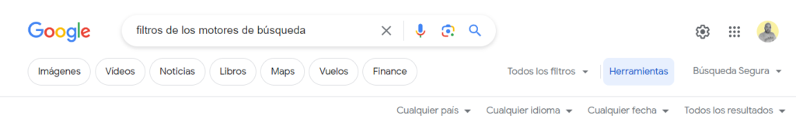

### 2.1.4. Avaluació de la informació

Vivim en l'era de la informació, en què l'accés a dades i continguts és immediat i massiu. Però aquesta abundància comporta un repte: destriar la veracitat, la rellevància i la qualitat del que trobam a internet. Saber avaluar la informació s'ha convertit en una habilitat fonamental, que actua com un filtre entre nosaltres i la jungla de desinformació en què de vegades es converteix internet.

Tingues en compte aquests sis criteris per començar a avaluar correctament la informació que trobis.

1. **Font de la informació**
    - **Origen**: pensa sempre **d'on ve la informació**. És una font fiable? És una institució reconeguda, un expert en la matèria o simplement una opinió personal? Les fonts acadèmiques, els centres de recerca i les organitzacions reconegudes solen ser més fiables.
    - **Autoritat**: **investiga l'autor o l'entitat que hi ha darrere de la informació**. Un expert en un tema concret o una organització dedicada a un àmbit determinat solen tenir més autoritat que una font generalista.
2. **Actualitat**
    - **Data de publicació**: la informació, sobretot en camps com la ciència o la tecnologia, pot quedar obsoleta ràpidament. Comprova quan es va publicar o **actualitzar per darrera vegada**.
    - **Rellevància temporal**: **alguns temes requereixen informació més actual que d'altres**. Per exemple, no és el mateix una notícia sobre un fet recent que una anàlisi històrica.
3. **Objectivitat**
    - **Biaix**: qualsevol font pot tenir un biaix. És important identificar **si la informació es presenta de manera objectiva o si està influïda per** opinions, afiliacions polítiques o **interessos** comercials.
    - **Intenció**: esbrina el propòsit del contingut. Vol informar, convèncer, vendre o entretenir? Conèixer-ne la intenció t'ajuda a valorar-ne l'objectivitat.
4. **Precisió i veracitat**
    - **Contrast**: **comprova la informació en diverses fonts**. Si diverses fonts fiables coincideixen, és probable que la informació sigui precisa.
    - **Referències**: les afirmacions que es basen en estudis seriosos, investigacions o experts en la matèria solen ser més fiables. **Cerca referències o cites que avalin la informació**.
5. **Cobertura**
    - **Profunditat**: pensa si el contingut tracta el tema de manera **superficial** o si en fa una **anàlisi a fons**.
    - **Completesa**: una font de qualitat **ha de tractar els aspectes principals d'un tema**. Desconfia de les fonts que ometen informació clau o que només en presenten un punt de vista.
6. **Disseny i presentació**
    - **Professionalitat**: encara que no és un indicador definitiu, **un disseny web professional i una bona redacció** solen indicar que hi ha inversió i esforç al darrere, cosa que pot fer la font més fiable.
    - **Errors**: si hi ha molts d'errors gramaticals, ortogràfics o de format, pot ser un indici de manca de rigor. **Una notícia mal redactada, o fins i tot amb paraules en un altre idioma, és un senyal d'alarma claríssim de *fake news***.

Saber avaluar la informació és una habilitat fonamental. Si entens i aplicau aquests criteris, no només et protegiràs de la desinformació, sinó que també t'asseguraràs que el coneixement que adquireixes és valuós i fiable.

En resum, cercar informació de manera efectiva és molt més que escriure paraules en un cercador. És una combinació de tècniques, eines i sentit crític. Amb la pràctica, aquesta habilitat es convertirà en una eina molt potent que et permetrà trobar el que necessites en l'immens mar de dades que és internet.

!!! example "Exercici 2.1. La veritat sobre la xocolata"
    Fa poc has vist a les xarxes socials una notícia que afirma que «Menjar xocolata augmenta la intel·ligència». La primera reacció és d'alegria, és clar. Però, abans de compartir-la amb els amics, decideixes investigar i comprovar si és veritat.

    **Eines de cerca**

    1. Amb Google, troba almenys tres fonts que parlin d'aquesta afirmació.
    2. Fes una cerca a Google Acadèmic per trobar estudis o investigacions sobre la xocolata i la intel·ligència.
    3. Utilitza les xarxes socials (per exemple, X o LinkedIn) per trobar opinions o debats sobre el tema.

    **Tècniques de cerca efectiva**

    1. Utilitza paraules clau i operadors de cerca per afinar els resultats. Per exemple, pots fer servir «xocolata» i «intel·ligència» com a paraules clau, i operadors com les cometes per cercar la frase exacta o el signe menys (-) per excloure paraules (o qualsevol altre operador que et sigui útil).
    2. Utilitza filtres per afinar encara més els resultats, per exemple per data o per tipus de contingut.

    **Avaluació de la informació**

    1. **Font**: d'on ve la informació? És una font fiable? Qui és l'autor o l'entitat que hi ha al darrere?
    2. **Actualitat**: quan es va publicar o actualitzar per darrera vegada? És rellevant per al tema?
    3. **Objectivitat**: hi ha algun biaix? Quina és la intenció del contingut?
    4. **Precisió i veracitat**: la informació es basa en estudis o investigacions? Coincideix en diverses fonts?
    5. **Cobertura**: el contingut és superficial o en fa una anàlisi a fons? Tracta tots els aspectes del tema o només un punt de vista?
    6. **Disseny i presentació**: valora la professionalitat del disseny i de la redacció. Hi ha errors gramaticals o ortogràfics?

    A partir de la teva investigació, consideres que l'afirmació «Menjar xocolata augmenta la intel·ligència» és veraç i rellevant? Justifica la resposta amb almenys tres arguments basats en la teva investigació. Compartiries la notícia original a les teves xarxes socials? Per què?

    *Nota: podeu fer l'exercici de manera individual o en grups de tres persones com a màxim.*

## 2.2. Administració de la informació

En un món on la informació es genera a una velocitat vertiginosa, administrar-la bé és essencial per evitar el caos i la sobrecàrrega. Administrar la informació no vol dir només emmagatzemar dades, sinó fer-ho de manera organitzada, accessible i segura. És un procés vital tant en l'àmbit professional com en el personal, sobretot per als joves que creixeu en l'era digital, en què distingir entre dades útils i trivials pot marcar la diferència.

### 2.2.1. Classificació de la informació

Divideix la informació en grups temàtics o **categories rellevants**. Per exemple, un estudiant podria fer servir «Matemàtiques», «Història», «Projectes» o «Lectures pendents».

Utilitza etiquetes o paraules clau per identificar la informació i recuperar-la fàcilment. Per exemple, un document podria dur etiquetes com «examen», «juny» o «urgent».

Aquests dos nivells de classificació, **categories i etiquetes**, són els que fan servir tots els diaris digitals, les botigues en línia i també les xarxes socials, perquè formen una estructura molt flexible i molt útil alhora. No ho oblidis.

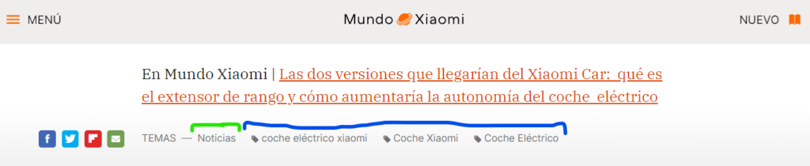

*En verd, la categoria; en blau, les etiquetes triades per a una notícia sobre un nou vehicle elèctric de Xiaomi.*

### 2.2.2. Emmagatzematge i organització

Utilitza carpetes i subcarpetes a l'ordinador o al dispositiu per guardar la informació de manera sistemàtica. L'estructura ha de ser intuïtiva i reflectir la importància i la freqüència d'ús.

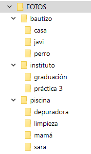

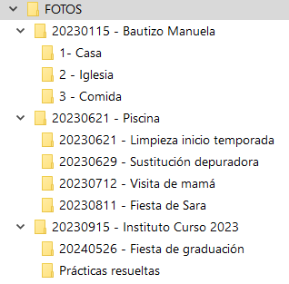

*A l'esquerra, una organització poc útil; a la dreta, una organització útil.*

Utilitza aplicacions de gestió de la informació, com [Evernote](https://evernote.com/es-es), [Notion](https://www.notion.so/es-es) o [Google Drive](https://www.google.com/intl/ca/drive/), per centralitzar les teves dades i accedir-hi des de qualsevol dispositiu. En general, **utilitza qualsevol aplicació que et permeti classificar el contingut d'alguna manera per trobar-lo ràpidament**.

Per exemple, moltes aplicacions al núvol per guardar fotografies et permeten afegir paraules clau a cada imatge. D'aquesta manera, encara que tenguis les fotos ordenades per data, sempre pots cercar el nom del teu ca i obtenir gairebé a l'instant totes les fotos on surt.

{ width="360" }

### 2.2.3. Accés i recuperació

Familiaritza't amb les eines i tècniques de cerca per localitzar ràpidament arxius o informació al teu sistema. Pots utilitzar les eines del sistema operatiu o instal·lar aplicacions específiques. Una bona estructura de carpetes des del principi t'ajudarà molt a trobar els arxius ràpidament.

Assegura la disponibilitat de la informació fent **còpies de seguretat periòdiques** en dispositius externs o al núvol. Així, si has de canviar de dispositiu, t'has infectat amb un virus o has esborrat un arxiu per error, sempre podràs recuperar la còpia de seguretat i tornar a tenir tots els arxius.

### 2.2.4. Seguretat de la informació

Utilitza contrasenyes fortes i diferents per a cada servei o dispositiu i planteja't fer servir un **gestor de contrasenyes** per guardar-les de manera segura.

Per exemple, aquestes contrasenyes tenen una estructura segura, perquè combinen majúscules, minúscules, nombres i símbols: `R2#d8!aLp0z&3Yq`, `G4!wQ*8sF@lD^9tZ`, `k9&Q#3Lp8!jA^7s`. En canvi, aquestes són molt mala idea: `123456`, `password`, `nom123`, `01012000`, `abc123`. Són habituals i previsibles i sovint apareixen a les [llistes de contrasenyes més utilitzades](https://www.xatakamovil.com/seguridad/lista-contrasenas-usadas-espana-demuestra-que-a-mucha-gente-le-preocupa-muy-poco-su-seguridad), la qual cosa les fa vulnerables als atacs.

!!! warning "Compte"
    No utilitzis mai les contrasenyes d'exemple d'aquesta pàgina: com que són públiques, ja no són segures.

Mantén el **programari i els sistemes operatius actualitzats** per protegir-te de vulnerabilitats que puguin posar en perill les teves dades.

### 2.2.5. Neteja i depuració

Dedica temps de manera regular a revisar i eliminar la informació obsoleta o repetida. Així no només alliberes espai, sinó que també fas més fàcil gestionar les dades rellevants i accedir-hi.

Planteja't arxivar la informació que ja no utilitzes cada dia però que et pot ser útil en el futur. D'aquesta manera, el sistema es manté àgil sense perdre dades valuoses.

### 2.2.6. Ús ètic i responsable

Respecta sempre els drets d'autor i les llicències quan utilitzis, comparteixis o redistribueixis informació.

Sigues conscient de la informació personal i sensible que manipules. No comparteixis ni guardis dades que no vulguis que acabin en mans d'altres persones.

Administrar la informació és una competència vital en la societat actual. Qui domini aquestes habilitats no només estarà més preparat per al món acadèmic i professional, sinó que també gaudirà d'una vida digital més ordenada, eficient i segura.

!!! example "Exercici 2.2. Administrant la informació del segle XX"
    Has de fer un projecte sobre «Els invents més importants del segle XX». Per fer-lo, has de recollir, organitzar, emmagatzemar, recuperar i protegir la informació sobre el tema.

    **Classificació de la informació**

    1. Divideix la informació recollida en categories rellevants: «Tecnologia», «Medicina», «Transport», «Comunicació», etc.
    2. Etiqueta cada font o document amb paraules clau que permetin identificar-los fàcilment. Per exemple: «transistor», «penicil·lina», «avió de reacció», «televisió».

    **Emmagatzematge i organització**

    1. Crea una estructura de carpetes i subcarpetes al teu dispositiu que reflecteixi les categories que has establert.
    2. Utilitza una aplicació de gestió de la informació (per exemple, Google Drive) per guardar-hi tots els documents i fonts. Etiqueta cada arxiu o document amb les paraules clau corresponents.

    **Accés i recuperació**

    1. Fes cerques amb les eines del sistema operatiu o de l'aplicació per trobar ràpidament documents concrets.
    2. Fes una còpia de seguretat del projecte en un dispositiu extern o al núvol.

    **Seguretat de la informació**

    1. Estableix una contrasenya forta i única per accedir al projecte.
    2. Actualitza els programes o aplicacions que facis servir per assegurar-te que estan protegits contra vulnerabilitats.

    **Neteja i depuració**

    1. Revisa la informació recollida i elimina les dades repetides o obsoletes.
    2. Arxiva la informació que no facis servir ara però que consideris útil per més endavant.

    **Ús ètic i responsable**

    1. Cita correctament totes les fonts que utilitzis i respecta els drets d'autor.
    2. No comparteixis informació personal o sensible relacionada amb el projecte o amb els seus membres.

    Lliura el document amb el projecte final i una reflexió sobre com has aplicat els principis d'administració de la informació i què n'has après. Pots incloure-hi captures de pantalla, gràfics o infografies.

    *S'avaluarà la capacitat d'organitzar i classificar la informació, l'estructura i la lògica de les carpetes, la seguretat aplicada i l'ús ètic i responsable de la informació.*

## 2.3. Gestió de la informació

Gestionar la informació va més enllà d'administrar-la i emmagatzemar-la. Implica entendre-la, processar-la i utilitzar-la de manera efectiva per prendre decisions, resoldre problemes i, en general, millorar la qualitat de la nostra vida quotidiana i laboral. En l'entorn digital actual, saber gestionar la informació és fonamental per aprofitar al màxim les oportunitats i evitar obstacles. Per als joves d'avui, dominar aquesta habilitat és clau per adaptar-se a un món en canvi constant.

### 2.3.1. Interpretació i anàlisi

En l'era digital, l'allau d'informació que rebem cada dia exigeix una bona capacitat d'interpretació i d'anàlisi. Cada vegada que entres en una xarxa social, en una pàgina web o fins i tot en un xat, t'enfrontes a dades, opinions i fets. Però com pots destriar el que és cert del que és fals?

**Interpretar és** més que llegir: és **comprendre, contextualitzar i relacionar**. És entendre les implicacions que hi ha darrere d'un text o d'una imatge.

Quan un alumne investiga per a un treball acadèmic, per exemple, pot trobar moltes fonts que tracten un tema des de punts de vista diferents. Aquí entra en joc l'anàlisi crítica: és essencial qüestionar, comparar i valorar la veracitat, la rellevància i la fiabilitat de la informació abans d'acceptar-la com a certa.

Aquestes habilitats no només són vitals en l'àmbit acadèmic, sinó també per moure's pel món actual, on la desinformació pot ser molt present.

### 2.3.2. Integració de fonts diverses

El mateix alumne que fa el treball de recerca s'enfronta a diversos reptes: no només ha de trobar dades, sinó que les ha d'integrar de manera coherent.

Per exemple, si investiga sobre el canvi climàtic, trobarà milers d'articles, estudis, opinions i teories.

Algunes fonts parlaran de les causes humanes del canvi climàtic, mentre que d'altres se centraran en les conseqüències o en les solucions. Integrar vol dir combinar totes aquestes dades en un relat coherent i comprensible, identificant-ne els punts en comú i les discrepàncies. Però què passa si dues fonts fiables presenten dades contradictòries? Aquí, la capacitat de l'estudiant per destriar, comparar i valorar esdevé clau. No es tracta només d'acumular dades, sinó de teixir-les en un coneixement ben fonamentat.

### 2.3.3. Ús pràctic de la informació

Accedir a la informació és només el principi. La veritable habilitat és **com s'utilitza** i s'aplica. Suposem que un jove troba una guia detallada sobre alimentació saludable. Llegir-la i entendre-la és valuós, però el benefici real arriba quan utilitza aquesta informació per canviar la seva dieta o ajudar la família a prendre decisions alimentàries més saludables.

Qualsevol informació, sigui un tutorial de YouTube, una lliçó a classe o un consell d'un amic, té un potencial pràctic. Saber gestionar la informació implica reconèixer aquest potencial i actuar en conseqüència.

A més, aquesta capacitat no és estàtica: s'ha d'adaptar i evolucionar a mesura que canvien les circumstàncies i les necessitats de cadascú. És un procés dinàmic i continu d'aprenentatge, adaptació i aplicació.

### 2.3.4. Comunicació efectiva

La gestió de la informació no és un procés aïllat. Sovint, després de recollir i processar informació, arriba el moment de compartir-la. En el teu dia a dia, això pot ser presentar un projecte a classe, debatre un tema amb els amics o publicar una opinió a les xarxes socials.

Una comunicació efectiva requereix que la informació es presenti de manera clara, coherent i adaptada al públic. Cal ser conscient del mitjà, del missatge i del receptor.

A més, avui dia, en què el contingut visual té un gran impacte, és molt important saber utilitzar eines digitals per millorar la comunicació, com presentacions gràfiques o infografies.

### 2.3.5. Actualització constant

En un món en què la informació canvia i evoluciona ràpidament, és clau mantenir-se al dia. El que fa una dècada es considerava un fet indiscutible, avui pot haver estat desmentit o modificat.

Per a tu, això pot voler dir **actualitzar els apunts**, **revisar fonts recents** abans d'un examen o **informar-te de les darreres novetats** abans d'un debat a classe.

Gestionar bé la informació implica acceptar que la informació és canviant i estar disposat a aprendre, desaprendre i tornar a aprendre sempre que calgui.

### 2.3.6. Responsabilitat i ètica

L'era digital ha multiplicat la nostra capacitat d'accedir a la informació, compartir-la i distribuir-la. Però aquest poder comporta una gran responsabilitat. Cada vegada que comparteixes un mem, republiques una publicació o escrius un comentari, interactues amb informació i **la propagues**.

És vital que entenguis les implicacions ètiques del que fas. Això vol dir respectar els drets d'autor, citar correctament les fonts i reconèixer la propietat intel·lectual.

A més, en un món en què la desinformació es pot fer viral ràpidament, **tens la responsabilitat ètica de comprovar la veracitat de la informació abans de compartir-la**. Aquesta consciència ètica és essencial no només per ser un ciutadà digital ben informat, sinó també per mantenir la integritat i la fiabilitat de la informació digital.

!!! example "Exercici 2.3. El problema de TikTok"
    L'objectiu d'aquest exercici és aplicar els conceptes de gestió de la informació a l'ús i el consum de continguts a TikTok, especialment pel que fa a l'addicció a aquesta xarxa social.

    **Interpretació i anàlisi**

    1. Investiga i recull informació de diverses fonts sobre l'addicció a TikTok i els seus efectes en els adolescents.
    2. Identifica dades, opinions i fets en la informació recollida.
    3. Quins arguments trobes sobre les causes de l'addicció? Són vàlids tots aquests arguments? Argumenta què és cert i què és fals.

    **Integració de fonts diverses**

    1. Analitza les fonts recollides i destaca-hi les diferents perspectives sobre el tema.
    2. Integra totes aquestes dades en un relat breu i coherent que expliqui l'addicció a TikTok i les seves implicacions.

    **Ús pràctic de la informació**

    1. A partir de la informació analitzada, proposa estratègies pràctiques per fer un ús més saludable de TikTok, evitant-ne l'addicció i aprofitant-ne els aspectes positius.

    **Comunicació efectiva**

    1. Elabora una presentació digital o una infografia sobre l'addicció a TikTok amb eines digitals com Canva o Genially (o una altra que triïs).
    2. Assegura't que el contingut sigui clar, coherent i adaptat a un públic de la teva edat.

    **Actualització constant**

    1. Investiga si hi ha hagut canvis recents en les característiques de TikTok que puguin influir en el seu potencial addictiu. Com podria aquesta informació nova influir en la teva anàlisi?

    **Responsabilitat i ètica**

    1. Cita correctament totes les fonts d'informació que utilitzis.
    2. Assegura't que la informació que comparteixes és veraç i avala cada afirmació amb dades o evidències.
    3. Reflexiona sobre l'impacte ètic de compartir contingut addictiu en plataformes com TikTok i proposa mesures per combatre la difusió d'informació enganyosa o perjudicial.

    Elabora un document que inclogui tot el que es demana en els passos anteriors.

    **Avaluació**: es valorarà la qualitat de la investigació, la precisió i la profunditat de l'anàlisi, l'eficàcia de les propostes pràctiques, la claredat i la creativitat de la presentació o infografia i la consciència ètica i responsable a l'hora de tractar el tema.

    *Nota: durant l'exercici, pots compartir les teves pròpies experiències i opinions sobre l'ús de TikTok, però recorda que és important mantenir un enfocament crític i basat en evidències.*

## 2.4. Selecció de la informació

En un món inundat de dades, saber seleccionar la informació adequada és una habilitat difícil d'aprendre però del tot necessària. No es tracta només de filtrar la informació, sinó de **destriar què és rellevant** i valuós per a les nostres necessitats concretes. En aquest apartat veurem l'art i la ciència de seleccionar informació: per què és important i quines eines i estratègies podem fer servir.

### 2.4.1. La importància de seleccionar la informació

Abans de l'era digital, l'accés a la informació era limitat i, en molts de casos, molt laboriós. Avui, en canvi, amb l'expansió de la digitalització, el repte ja no és trobar informació, sinó seleccionar la més precisa. Qualsevol cerca senzilla al nostre cercador habitual ens dona, normalment, milions de resultats. Sense l'habilitat de seleccionar correctament la informació, molta gent se sent desbordada i, per això, sovint acaba utilitzant informació poc rellevant o inexacta. Per tant, seleccionar la informació no és només una comoditat, sinó una necessitat per moure's de manera eficient per la internet d'avui.

### 2.4.2. Criteris de selecció

Seleccionar informació no és una tasca arbitrària: requereix criteris clars, com aquests:

- **Rellevància**: la informació té relació directa amb el tema o la pregunta que ens interessa?
- **Fiabilitat**: la font és reconeguda i respectada en el seu àmbit?
- **Actualitat**: la informació és recent o està desfasada?
- **Objectivitat**: la informació és imparcial o té un biaix evident?

Si té en compte aquests criteris, qualsevol usuari no només pot filtrar la informació innecessària, sinó que també pot assegurar-se que la informació que tria és de qualitat.

Vegem un exemple pràctic. En Jaume, estudiant de 4t d'ESO, ha de fer un treball sobre la Mallorca musulmana (Madina Mayurqa). Està molt motivat, perquè li encanta la història de les Illes: n'ha llegit molt, ha vist documentals i s'hi fixa també a les notícies i a les xarxes socials. Tanmateix, quan cerca «Mallorca musulmana» a DuckDuckGo, obté milers de resultats. En Jaume s'adona que alguns resultats parlen de temes d'actualitat que, encara que tenen relació amb el passat andalusí de l'illa, no ofereixen una visió general del tema. Decideix centrar-se en articles i webs que donen una visió general de la història de la Mallorca musulmana i de com els seus vestigis han arribat fins als nostres dies.

En revisar els resultats, en Jaume troba webs de moltes organitzacions. Decideix donar prioritat a les fonts d'institucions reconegudes, com el Govern de les Illes Balears, el Consell de Mallorca, el Ministeri de Cultura o la Universitat de les Illes Balears, i a alguns autors de prestigi reconegut. També evita els webs amb informació no contrastada, els blogs petits i els treballs d'altres alumnes. Tot i que troba un article detallat del 2005, decideix cercar informació més recent: el tema és un àmbit de recerca actiu, les excavacions arqueològiques aporten dades noves i les conclusions poden haver canviat en els darrers anys. A més, s'adona que alguns articles tenen un to molt emocional o esbiaixat, que minimitza les aportacions de la cultura musulmana o que la presenta de manera idealitzada. Cerca fonts que presentin dades i fets de manera equilibrada, evitant el sensacionalisme.

Després d'aplicar aquests criteris, en Jaume aconsegueix reduir la cerca a uns pocs articles i webs de qualitat que li donen una visió clara i ben fonamentada del tema. Gràcies a la seva habilitat per seleccionar informació, ara pot començar el projecte amb confiança, sabent que **basa la seva feina en fonts fiables i rellevants**.

### 2.4.3. Eines i tècniques de selecció

Hi ha diverses eines i tècniques que ens poden ajudar a seleccionar informació. Per exemple, molts cercadors ofereixen filtres per limitar els resultats per data, tipus de contingut o fins i tot ubicació geogràfica. També podem utilitzar cercadors especialitzats, com Google Acadèmic, centrat en publicacions acadèmiques. Una altra alternativa són eines com [Feedly](https://feedly.com/), molt útil per a la curació de continguts: et permet tenir filtrats els mitjans que consideres de confiança, subscriure't a fonts diferents i classificar-les.

<iframe src="https://www.youtube-nocookie.com/embed/kC2n7dgm4Ns" title="Vídeo sobre Feedly" loading="lazy" allowfullscreen></iframe>

A més, hi ha eines de curació de continguts que recullen i organitzen informació sobre temes concrets i faciliten la selecció, com Evernote. Conèixer aquestes eines pot ser molt útil per a qualsevol persona, sobretot per als estudiants que comencen treballs de recerca.

Ja hem vist què són els operadors de cerca i com es fan servir. Doncs bé, combinar-los és una de les tècniques més eficaces per seleccionar informació. També ho són els filtres per data, llicència, mida o rellevància. A més, podem anar més enllà i comparar tendències amb [Google Trends](https://trends.google.es/trends/) per saber si l'interès per un tema puja o baixa. Així podries descobrir, per exemple, quin futbolista desperta més interès a les cerques de YouTube:

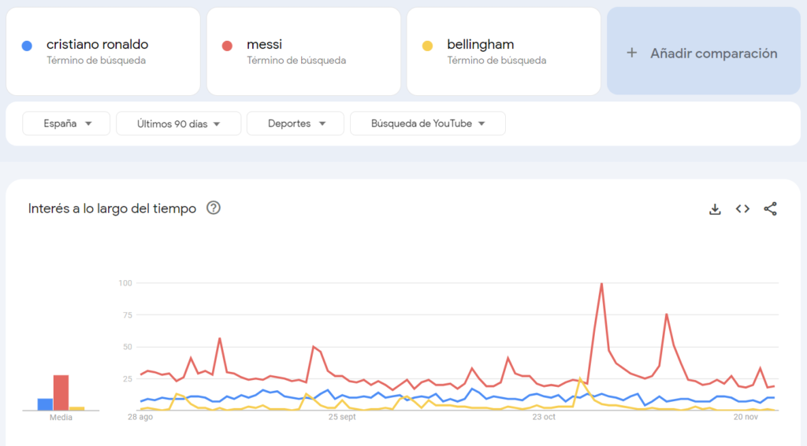

!!! info "Nota"
    Antigament es consultaven indicadors com el PageRank públic de Google o el rànquing d'Alexa per saber com de rellevant era un web. Tots dos han desaparegut: avui s'utilitzen eines d'anàlisi web i de posicionament (SEO).

### 2.4.4. Reptes en la selecció de la informació

L'era digital ens ha donat un accés a la informació sense precedents, però aquesta abundància també comporta reptes importants:

1. **Volum aclaparador d'informació**: amb milers de milions de pàgines web i un contingut digital que no para de créixer, sovint ens sentim desbordats. Aquest volum fa difícil destriar quina informació és la més rellevant i fiable i ens pot portar a la «paràlisi per anàlisi»: sentir-nos incapaços de decidir per excés d'opcions.
2. **Desinformació**: vivim en l'era de les *fake news* i la desinformació. Les xarxes socials i altres webs poden difondre informació falsa o enganyosa, normalment de manera intencionada, però de vegades per accident. Aquesta marea d'informació incorrecta fa imprescindible aprendre a verificar les fonts i desenvolupar un escepticisme saludable.
3. **Biaix de confirmació**: és un fenomen psicològic pel qual les persones tendim a cercar, interpretar i recordar la informació de manera que confirmi el que ja pensam. Per exemple, si ja tenim una opinió sobre un tema, potser evitarem inconscientment les fonts que la contradiuen i ens acostarem a les que la reforcen. Aquest biaix ens pot donar una visió estreta d'un tema, polaritza la societat i genera problemes de convivència importants.

    

    <iframe src="https://www.youtube-nocookie.com/embed/2uCNW8s57nU" title="Vídeo sobre el biaix de confirmació" loading="lazy" allowfullscreen></iframe>
    

4. **Cerques superficials**: per obtenir informació ràpidament, de vegades no aprofundim prou i ens refiam dels primers resultats. Això ens pot portar a una comprensió superficial del tema i a deixar passar informació valuosa que és a pocs clics.
5. **Reptes tècnics**: encara que molts siguem nadius digitals, no tothom coneix igual les eines i tècniques avançades de cerca i selecció. Hi ha persones que no saben utilitzar operadors de cerca, filtrar resultats per data o accedir a bases de dades acadèmiques, i això limita la qualitat i la rellevància de la informació que seleccionen.
6. **Influència dels algorismes**: els cercadors i les xarxes socials utilitzen algorismes per personalitzar el contingut que mostren. Pot semblar còmode, però també vol dir que sovint quedam atrapats en una ***bombolla de filtres***, en què només veiem informació d'acord amb els nostres interessos i creences, i es redueix la diversitat de perspectives. És un altre problema social enorme que es mira de resoldre amb diverses iniciatives legislatives.

    

    <iframe src="https://www.youtube-nocookie.com/embed/N1ogM42ieQU" title="Vídeo sobre la bombolla de filtres" loading="lazy" allowfullscreen></iframe>
    

Entendre aquests reptes i afrontar-los és fonamental per seleccionar la informació de manera efectiva i crítica en l'entorn digital d'avui.

### 2.4.5. Reflexió i responsabilitat

Finalment, és essencial desenvolupar una **actitud reflexiva i responsable a l'hora de seleccionar informació**. La selecció no és un acte passiu, sinó una decisió activa amb conseqüències. Quan triam una font en lloc d'una altra, prenem una posició, i és vital ser-ne conscients i actuar amb integritat.

1. **Reconèixer la subjectivitat**: cap selecció d'informació és completament objectiva. Cada tria que feim està influïda per les nostres experiències, creences, cultura i emocions. Reconèixer aquesta subjectivitat és el primer pas per ser més reflexius i responsables.
2. **Conseqüències de les nostres tries**: quan triam una font i en descartam una altra, donam poder i legitimitat a aquella informació. Això té conseqüències que van més enllà de la nostra recerca personal: pot influir en les opinions i les creences de les persones amb qui la compartim.
3. **Validació**: actuar amb responsabilitat implica assegurar-nos que la informació que seleccionam i compartim és precisa i fiable. Hem de dedicar temps a validar les fonts, contrastar perspectives diferents i estar disposats a rectificar si descobrim que hem compartit informació errònia.
4. **Responsabilitat social**: la informació té el poder d'influir en les opinions i les accions de les persones. Quan seleccionam i compartim informació, hem de ser conscients de l'impacte que pot tenir en la societat, ja sigui reforçant estereotips, difonent falsedats o alimentant divisions.
5. **Empatia informativa**: en un món interconnectat, és essencial aprendre a posar-se al lloc dels altres i pensar com poden percebre la informació públics diferents. Això implica ser sensible a les qüestions culturals, religioses i personals que poden influir en la interpretació de la informació.
6. **Autoreflexió constant**: la reflexió no ha de ser un acte puntual, sinó una pràctica constant. Ens hauríem de demanar regularment per què triam unes fonts determinades, quines inclinacions o biaixos podem tenir i com poden afectar els altres les nostres decisions.
7. **Actualització contínua**: el panorama informatiu canvia constantment. Per ser responsables, cal estar al dia de les tendències en mitjans i tecnologia i adaptar les nostres tècniques de selecció als canvis de l'entorn.

En resum, seleccionar informació en l'era digital va molt més enllà de trobar la resposta correcta. És un acte complex que requereix reflexió, empatia, consciència i, sobretot, un sentit profund de responsabilitat cap a un mateix i cap a la societat.

!!! example "Exercici 2.4. L'èxode de youtubers a Andorra"
    Fa un temps, diversos youtubers espanyols van anunciar públicament que se n'anaven a viure a Andorra. Entre altres arguments, destacaven que a Andorra els imposts són més baixos que a Espanya, cosa que els permet estalviar molts de doblers. La notícia va generar opinions molt diverses a la societat i als mitjans de comunicació.

    La teva tasca és investigar i analitzar aquesta situació aplicant les habilitats i els conceptes d'aquest apartat.

    **Cerca d'informació**

    Fes una cerca al teu cercador habitual amb la consulta que consideris adequada. Anota quants de resultats obtens i descriu breument quin tipus de fonts hi apareixen (blogs, diaris, fòrums, etc.).

    **Selecció de la informació**

    Aplica els criteris de rellevància, fiabilitat, actualitat i objectivitat per seleccionar cinc fonts adequades per a la teva investigació.

    **Eines i tècniques de selecció**

    Explica breument si has utilitzat alguna eina o tècnica concreta durant la cerca i per què.

    **Anàlisi de la informació**

    - **Reptes**: descriu dos reptes que t'hagis trobat durant la cerca i la selecció. Hi havia massa informació? Has trobat *fake news* o desinformació?
    - **Biaix de confirmació**: tenies una opinió prèvia sobre el tema? Creus que ha influït en la selecció de les fonts?
    - **Influència dels algorismes**: has notat repeticions en els resultats o algun patró en el tipus de fonts que et sortien? Reflexiona sobre com els algorismes poden influir en la informació a la qual tens accés.

    **Reflexió i responsabilitat**

    - **Subjectivitat**: creus que la teva selecció ha estat completament objectiva? Per què?
    - **Validació**: com t'has assegurat que la informació seleccionada és precisa i fiable?
    - **Impacte en la societat**: tenint en compte que la informació pot influir en les opinions, quin impacte creus que té la decisió d'aquests youtubers en la societat?
    - **Empatia informativa**: com creus que veuen la situació els youtubers? I el públic general? Hi ha diferències en la manera de percebre-la?

    A partir de la teva investigació i anàlisi, escriu una conclusió breu sobre la decisió dels youtubers de traslladar-se a Andorra i les seves implicacions. Hi has d'incloure totes les reflexions que es proposen al llarg de l'exercici.

    *Nota: en acabar l'exercici farem un debat a classe sobre el tema, així que prepara tres arguments a favor o en contra del trasllat d'aquests youtubers.*

## 2.5. Arxiu de la informació

Saber arxivar la informació és fonamental avui dia. No es tracta només de guardar dades, sinó d'organitzar-les, classificar-les i protegir-les perquè siguin fàcils de trobar i segures en el futur. Vegem-ho en detall.

### 2.5.1. Importància d'un bon arxiu

En un món inundat de dades, saber arxivar de manera efectiva és més important que mai. Un arxiu ben organitzat permet **recuperar la informació ràpidament**, garantir-ne la conservació i compartir-la amb altres persones de manera eficient. Sense un bon sistema d'arxiu, ens podem veure desbordats per les dades, perdre temps cercant informació que ja teníem o, pitjor encara, perdre dades importants.

### 2.5.2. Mètodes d'arxiu

Arxivar la informació és essencial per gestionar dades i recursos de manera eficient. Com més informació manejam, més necessitam mètodes d'arxiu efectius. Vegem-ne els principals.

#### Jeràrquic

Aquest mètode s'assembla a l'estructura d'un arbre, amb carpetes principals que es ramifiquen en subcarpetes, i així successivament.

Imagina un company de classe que vol organitzar els apunts per assignatures. Podria tenir una carpeta principal anomenada «4t ESO» i, a dins, subcarpetes com «Matemàtiques», «Llengua» i «Història». Dins «Matemàtiques» hi podria haver altres subcarpetes, com «Àlgebra» i «Geometria».

- **Avantatges**: facilita l'organització visual i lògica de grans quantitats d'informació. És intuïtiu, sobretot per a qui està acostumat als sistemes operatius.
- **Inconvenients**: es pot complicar si hi ha massa subcarpetes i, si no es manté, pot acabar amb informació repetida o desorganitzada.

#### Etiquetatge

En lloc de dependre d'una estructura jeràrquica, aquest mètode **utilitza etiquetes o paraules clau per classificar la informació**.

Pensa en una plataforma de fotografia com Instagram. En lloc de guardar totes les fotos en carpetes concretes, s'etiqueten amb paraules clau com **#vacances**, **#amics** o **#natura**. Després, en cercar una etiqueta, apareixen totes les fotos relacionades.

- **Avantatges**: és flexible, perquè un mateix element pot tenir diverses etiquetes. Facilita la cerca i el filtratge de la informació.
- **Inconvenients**: cal ser constant en l'ús de les etiquetes perquè funcioni. Poden aparèixer etiquetes repetides o semblants que confonguin el sistema. D'altra banda, hi ha eines que ens indiquen quines etiquetes s'utilitzen més per a unes paraules clau determinades.

#### Base de dades

Les bases de dades són **sistemes estructurats que permeten emmagatzemar, recuperar i manipular conjunts de dades**.

Imagina una biblioteca digital. En lloc de tenir tots els llibres en un únic lloc, es guarden en una base de dades on cada llibre té atributs com l'autor, el gènere o la data de publicació. Quan un estudiant vol trobar llibres d'un autor concret, només ha de fer una consulta a la base de dades.

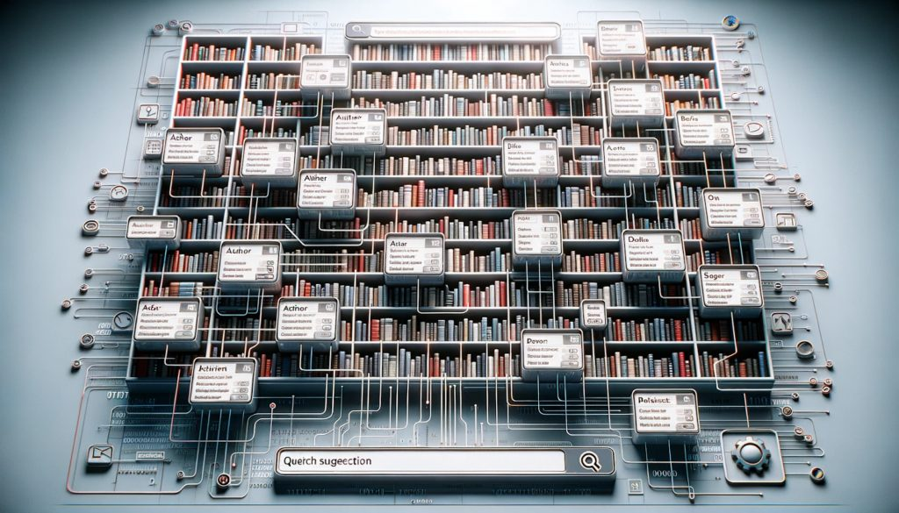

- **Avantatges**: és molt eficient per gestionar grans quantitats de dades estructurades. Permet cerques complexes i relacions entre conjunts de dades diferents.
- **Inconvenients**: requereix coneixements tècnics per crear-la i gestionar-la. Pot ser excessiva per a necessitats d'arxiu senzilles.

En conclusió, el mètode d'arxiu que triem depèn del tipus d'informació, de les necessitats de l'usuari i de les eines disponibles. És important entendre cada enfocament per aplicar el més adequat en cada situació.

### 2.5.3. Eines modernes d'arxiu

En una societat cada vegada més connectada, aquestes eines s'han tornat imprescindibles per a professionals, estudiants i el públic en general. Vegem-ne algunes amb més detall.

#### Emmagatzematge al núvol

Els serveis d'emmagatzematge al núvol permeten guardar arxius en servidors remots i accedir-hi des de qualsevol dispositiu amb connexió a internet. Google Drive, Dropbox i OneDrive són algunes de les opcions més populars.

A més de la **facilitat d'accés** des de qualsevol lloc, permeten la **col·laboració en temps real**: diverses persones poden treballar alhora en un mateix document. També serveixen de **còpia de seguretat en cas de pèrdua** o avaria dels dispositius físics.

Per exemple, un alumne pot guardar un projecte a Google Drive, compartir-ne l'enllaç amb els companys de classe i que tots hi contribueixin alhora sense haver de ser al mateix lloc.

#### Gestors de referències

Aquestes eines ajuden a organitzar i citar fonts bibliogràfiques, un recurs essencial per a la recerca acadèmica. Zotero i Mendeley són molt conegudes en el món acadèmic.

Permeten guardar, organitzar i citar publicacions de manera eficient. A més, faciliten la creació de bibliografies i adapten les cites a diferents estils de referència.

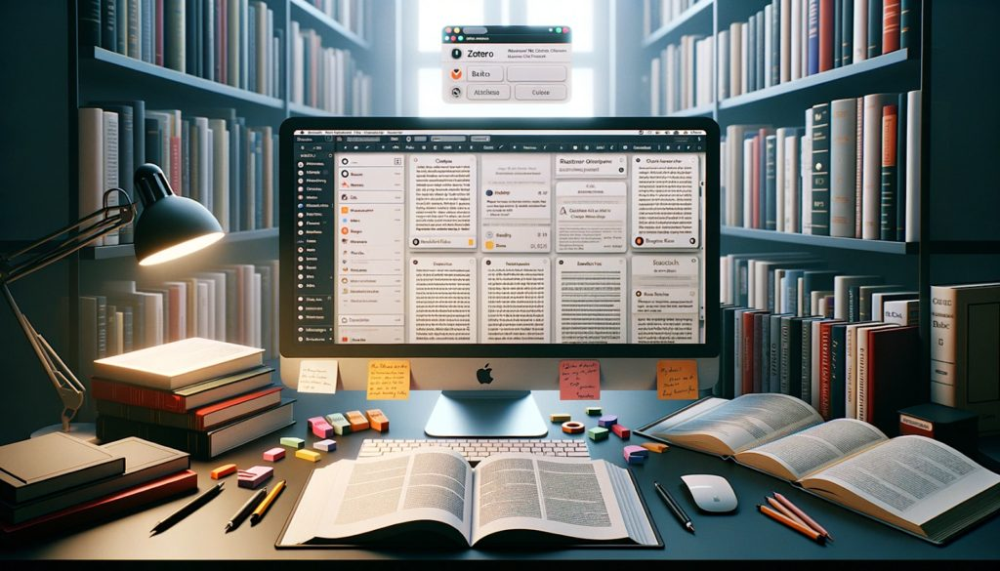

Per exemple, un alumne que fa un treball de recerca pot utilitzar Mendeley per guardar tots els articles i llibres que ha consultat. Quan els hagi de citar, l'eina generarà automàticament la cita adequada.

#### Sistemes de gestió de continguts (CMS)

Els CMS permeten crear, editar i gestionar el contingut de llocs web sense necessitat de coneixements tècnics avançats. WordPress, Joomla o Google Sites en són alguns dels exemples més populars.

Ofereixen plantilles i extensions que faciliten la personalització dels webs. Són ideals per a blogs, botigues en línia, portafolis i molt més.

Per exemple, un adolescent que vol compartir les seves opinions sobre cinema podria utilitzar WordPress per crear un blog personal. Amb les eines integrades, pot arxivar les seves ressenyes per categories, etiquetes, dates i molt més, i facilitar així la navegació als lectors.

Aquestes eines són només la punta de l'iceberg de les solucions disponibles per a l'arxiu digital. La tria dependrà de les necessitats de cada usuari i del tipus d'informació que s'hagi de gestionar. És essencial estar al dia i adaptar-se a les novetats constants d'aquest camp.

### 2.5.4. Seguretat de l'arxiu

Els riscs de pèrdua, d'accés no autoritzat o de manipulació de les dades fan necessari **establir protocols de seguretat robustos**. Vegem-ne algunes consideracions.

- **Còpies de seguretat (*backups*)**: consisteixen a fer còpies de la informació i guardar-les en llocs o suports diferents. Els dispositius poden fallar, i poden passar imprevists com atacs, errors del programari o catàstrofes naturals. **Una còpia de seguretat actualitzada garanteix que la informació es pot recuperar**. És fonamental fer còpies de seguretat regularment i, si és possible, automatitzar-les. També és aconsellable guardar una còpia fora del lloc principal, al núvol o en discs externs situats en llocs diferents.
- **Xifratge**: el xifratge **converteix la informació en un codi per evitar-hi l'accés no autoritzat**. En un món on els ciberatacs són freqüents, protegir les dades sensibles és vital. El xifratge garanteix que, encara que algú accedeixi a la informació, no la podrà llegir sense la clau adequada. Per això, utilitza [programes o serveis que ofereixin un xifratge sòlid](https://www.adslzone.net/reportajes/software/que-es-encriptar-cifrar-programas/), sobretot per a dades sensibles com la informació financera, les dades personals o la informació confidencial d'una empresa.
- **Control d'accés**: determina qui té permís per veure, modificar o eliminar la informació. No tota la informació ha de ser accessible per a tothom. Limitar-ne l'accés garanteix que només les persones autoritzades hi puguin interactuar i redueix el risc de manipulació, eliminació o filtració. Per fer-ho, cal **establir nivells de permisos**: per exemple, alguns usuaris només poden veure la informació, mentre que d'altres la poden editar. També és recomanable revisar i actualitzar regularment la llista de persones amb accés.
- **Actualitzacions i pedaços**: el programari, especialment els sistemes operatius, publica sovint actualitzacions amb **pedaços de seguretat**. Mantenir els sistemes al dia és important per protegir-se de vulnerabilitats conegudes que altres persones podrien aprofitar amb males intencions. Configura les actualitzacions automàtiques sempre que puguis i estigues atent als avisos d'actualització de les aplicacions.
- **Formació i conscienciació**: formar les persones en bones pràctiques de seguretat és clau per mantenir una cultura de la prevenció i evitar errors. Sovint, els errors humans són la causa de les fallades de seguretat més greus.

    

    <iframe src="https://www.youtube-nocookie.com/embed/PN0j35dbG-8" title="Vídeo sobre formació en seguretat informàtica" loading="lazy" allowfullscreen></iframe>
    

    Estar informat i ser conscient dels riscs els redueix molt. Fer tallers o cursos periòdics de seguretat informàtica i fomentar una cultura de la seguretat en l'organització o en el teu entorn és una bona pràctica.

La seguretat de la informació no és una cosa estàtica: requereix vigilància constant i capacitat d'adaptació a unes amenaces que canvien contínuament. Cal abordar-la de manera proactiva i amb les precaucions necessàries per garantir la integritat i la confidencialitat de les dades arxivades. A més, és una bona idea consultar o subscriure't a les novetats de l'**Institut Nacional de Ciberseguretat** (INCIBE), que publica regularment [avisos de vulnerabilitats](https://www.incibe.es/incibe-cert/alerta-temprana/avisos).

### 2.5.5. Reflexió i ètica en l'arxiu de la informació

Igual que la selecció, l'arxiu de la informació requereix reflexió i responsabilitat sobre les nostres decisions: actuar amb integritat en arxivar és essencial per construir un entorn digital segur, just i fiable.

- **Privacitat**: la privacitat implica protegir la informació personal. Vivim en un món en què **les dades personals es consideren un bé molt preuat**. Respectar la privacitat és fonamental per mantenir la confiança i el respecte cap als altres. Arxivar dades privades sense permís o compartir-les pot tenir conseqüències legals i ètiques. Assegura't de tenir un consentiment clar abans d'arxivar informació personal i utilitza eines de xifratge i de control d'accés per protegir la informació emmagatzemada.

    

    <iframe src="https://www.youtube-nocookie.com/embed/yGBJGJJk1R4" title="Vídeo sobre la privacitat de les dades" loading="lazy" allowfullscreen></iframe>
    

- **Drets d'autor**: són la protecció legal que tenen els creadors i els propietaris de continguts originals. No respectar-los pot comportar sancions legals i perjudicar la reputació. A més, respectar-los és una manera de **valorar i reconèixer la feina intel·lectual dels altres**. Quan arxivis contingut, assegura't que tens els drets necessaris per fer-ho. Si comparteixes o reprodueixes material d'altres, demana el permís necessari i cita'n correctament l'autoria.

    

- **Durabilitat i obsolescència**: la durabilitat fa referència a quant de temps es conserva la informació emmagatzemada, i l'obsolescència, a la tendència de la informació a perdre rellevància amb el temps. Arxivar informació que pot quedar obsoleta pot confondre qui hi accedeixi en el futur. A més, la tecnologia canvia ràpidament i els formats d'arxiu actuals podrien no ser accessibles d'aquí a uns anys. Revisa i actualitza regularment la informació emmagatzemada perquè continuï essent rellevant. També has de tenir en compte la **compatibilitat a llarg termini** a l'hora de triar els formats d'arxiu: **.arj**, **.fli** o **.dbf** van ser formats molt importants fa uns anys i avui gairebé no es poden obrir amb cap aplicació si no es van convertir a temps.
- **Responsabilitat i consciència**: implica ser conscient de les implicacions ètiques i morals de les decisions d'arxiu. El que decidim arxivar, i com i per què ho feim, pot tenir repercussions que van més enllà de la nostra intenció inicial, perquè afecta la memòria col·lectiva, la història i la cultura. Reflexiona de tant en tant sobre les teves pràctiques d'arxiu. Pensa en la diversitat, l'equitat i la inclusió, i demana't si hi representes una varietat de perspectives i opinions.

L'arxiu de la informació ha evolucionat amb l'expansió de la tecnologia digital. És una habilitat imprescindible per a tots nosaltres, no només en la vida acadèmica, sinó també en la personal i la professional. Com totes les habilitats relacionades amb la informació, requereix una combinació de coneixement tècnic, reflexió ètica i adaptació constant a les eines i tendències noves.

!!! example "Exercici 2.5. Tota l'ESO a la mà"
    En Manel ha acabat i aprovat tota l'ESO i s'adona que al llarg d'aquests anys ha acumulat moltíssima informació i recursos: apunts, projectes, redaccions, imatges, vídeos i molt més. Vol organitzar-ho i arxivar-ho tot de manera que hi pugui accedir fàcilment en el futur i, alhora, garantir-ne la seguretat i la privacitat. És pràcticament segur que haurà de repassar alguna cosa al batxillerat.

    La teva missió és ajudar en Manel a dissenyar un sistema d'arxiu digital aplicant els conceptes d'aquest apartat.

    **Mètode d'arxiu**

    Decideix quin mètode o mètodes (jeràrquic, etiquetatge, base de dades) faries servir per organitzar la informació d'en Manel. Justifica la tria.

    **Estructura de l'arxiu**

    A partir del mètode triat, dissenya una estructura d'arxiu. Per exemple, si tries el mètode jeràrquic, quines serien les carpetes principals i les subcarpetes? Si tries l'etiquetatge, quines etiquetes faries servir?

    **Eines d'arxiu**

    Tria almenys dues eines modernes d'arxiu que en Manel podria utilitzar (per exemple, emmagatzematge al núvol, gestors de referències o CMS) i explica com les faria servir.

    **Seguretat**

    Fes almenys tres recomanacions basades en les consideracions de seguretat que hem vist. Per exemple, com faria en Manel les còpies de seguretat? Quines mesures prendria per xifrar la informació?

    **Reflexió i ètica**

    A partir de l'apartat de reflexió i ètica, comenta almenys dues consideracions ètiques que en Manel hauria de tenir en compte en arxivar la informació. Per exemple, com garantiria la privacitat de determinats documents? Què faria amb el contingut protegit per drets d'autor?

    Escriu un document que reculli totes les reflexions que es demanen i, per acabar, resumeix el sistema d'arxiu proposat per a en Manel i defensa per què és una bona solució.

---

!!! quote "Font"
    Unitat traduïda i adaptada de [«Tema 2. Gestión de la información»](https://lopegonzalez.es/eso-y-bachillerato/digitalizacion-4o-eso/tema-2-gestion-de-la-informacion/), de Lope González Vázquez ([CC BY-NC-SA 4.0](https://creativecommons.org/licenses/by-nc-sa/4.0/deed.ca)). Canvis: traducció al català, adaptació al currículum de les Illes Balears i reorganització del format. L'exemple de la Còrdova musulmana s'ha substituït per la Mallorca musulmana; s'han afegit avisos sobre els operadors de Google que ja no funcionen, sobre la desaparició del PageRank públic i d'Alexa i sobre les contrasenyes d'exemple. Els vídeos són en castellà.
