# Unitat 3. Edició i creació de continguts

Quan ens endinsam en el món de la **creació de continguts digitals**, som a la cruïlla entre la innovació tecnològica i l'expressió creativa. Estudiar aquest tema no només ens aportarà coneixements tècnics, sinó que també fomentarà la nostra creativitat.

La **digitalització**, en essència, és la conversió de la informació a un format digital. Això en facilita la manipulació, la distribució i l'emmagatzematge, i obre un ventall enorme de possibilitats. En aquesta unitat tractarem diferents aspectes de la creació de continguts digitals, començant per entendre'n la importància i els diferents tipus que hi ha. Des de textos i gràfics fins a aplicacions mòbils i llocs web, els continguts digitals són presents a tot arreu en el nostre dia a dia.

Aprofundirem en les eines de **productivitat i de disseny gràfic**: aprendrem programari d'ofimàtica i explorarem eines de disseny gràfic i d'edició d'imatges, imprescindibles per a la comunicació visual.

El **desenvolupament d'aplicacions mòbils** i el **desenvolupament web bàsic** són dos camps que han guanyat una importància sense precedents en els darrers anys. Aquí tindrem l'oportunitat d'entrar en el món de la programació, des dels fonaments fins a la creació d'interfícies i l'experiència d'usuari. La programació per a mòbils i el desenvolupament web són habilitats molt valorades al mercat laboral, i entendre'n les bases és un actiu important per a qualsevol estudiant.

La **realitat virtual (RV)**, la **realitat augmentada (RA)** i la **realitat mixta (RM)** són tecnologies emergents que estan canviant la manera com interactuam amb el món digital. N'estudiarem els conceptes bàsics, les diferències i les aplicacions pràctiques, cosa que ens permetrà entendre com estan transformant sectors com l'educació, la salut o l'entreteniment.

## 3.1. Introducció a la creació de continguts digitals

Quan parlam de **continguts digitals**, ens referim a qualsevol tipus d'informació que es crea, s'emmagatzema i es comparteix en format digital. Aquesta definició inclou des de textos i gràfics fins a vídeos i aplicacions interactives.

### 3.1.1. Importància i abast

En la nostra societat, marcada per la presència constant de la tecnologia, la creació de continguts digitals ha adquirit una rellevància extraordinària. Aquest fenomen no es limita a un sector o àmbit concret: el seu impacte arriba a gairebé tots els aspectes de la vida quotidiana, especialment per a vosaltres, que estau en contacte constant amb aquests continguts.

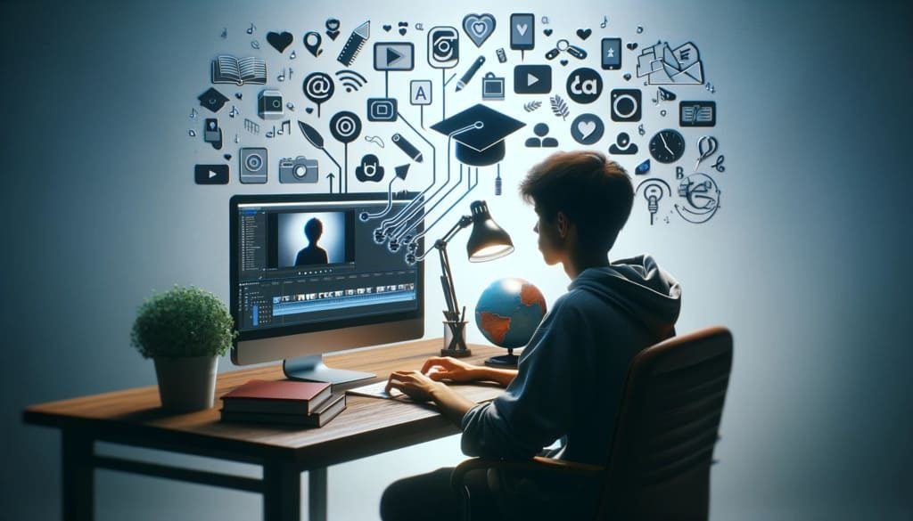{ width="560" }

La importància de la creació de continguts digitals es veu en diversos aspectes:

1. **Comunicació**: els joves d'avui utilitzau continguts digitals per expressar les vostres idees, emocions i experiències. Plataformes com Instagram i TikTok són exemples clars de com creau i compartiu contingut per expressar-vos i connectar amb altres persones.
2. **Educació**: la digitalització dels materials educatius ha revolucionat la manera d'aprendre. Continguts digitals com els tutorials de YouTube, els pòdcasts educatius o els blogs especialitzats són recursos habituals per a qualsevol persona que vulgui entendre conceptes nous o aprofundir en els seus interessos. Avui ja és possible aprendre habilitats tan complexes com programar ordinadors amb una llista de reproducció de YouTube.
3. **Participació en la societat digital**: saber crear continguts digitals és clau per participar activament en la societat actual. Les persones que saben crear i compartir informació de manera efectiva estan més preparades per intervenir en debats, tirar endavant els estudis o participar en projectes solidaris.
4. **Preparació per al futur professional**: en un mercat laboral cada vegada més digitalitzat, conèixer els fonaments de la creació de continguts digitals marca la diferència. Per a un adolescent a punt d'arribar a la universitat o al món laboral, habilitats com l'edició de vídeo, el disseny gràfic o l'edició d'àudio són actius valuosos que augmenten les seves possibilitats de trobar feina.

Comprendre i dominar les habilitats de la creació digital no només ens permet adaptar-nos al món d'avui, sinó que també ens dona eines que seran imprescindibles en el món de demà.

### 3.1.2. Tipus de continguts digitals

La diversitat de continguts digitals reflecteix la riquesa i la complexitat del món digital en què vivim. Cada tipus de contingut té les seves característiques i usos i és adequat per a formes de comunicació diferents. Vegem-los:

- **Textos digitals**: els trobam gairebé a tot arreu. L'escriptura digital no només ens permet expressar idees, sinó que també ens ajuda a desenvolupar habilitats de redacció i d'argumentació. Alguns dels formats de text més utilitzats són **.txt**, **.docx**, **.pdf** o **.odt**. I entre les aplicacions més utilitzades per llegir o elaborar textos digitals hi ha **Google Docs**, **Microsoft Word**, **LibreOffice Writer**, **Apple Pages** o **Adobe Acrobat Reader**.
- **Imatges**: la fotografia digital i els gràfics tenen un paper clau en la comunicació visual. Les fotografies que fem amb el mòbil i compartim a plataformes com Instagram formen part de la nostra expressió social. D'altra banda, gràfics com les infografies i les presentacions ajuden a sintetitzar i comunicar informació de manera efectiva, tant en l'àmbit acadèmic com en el personal.

    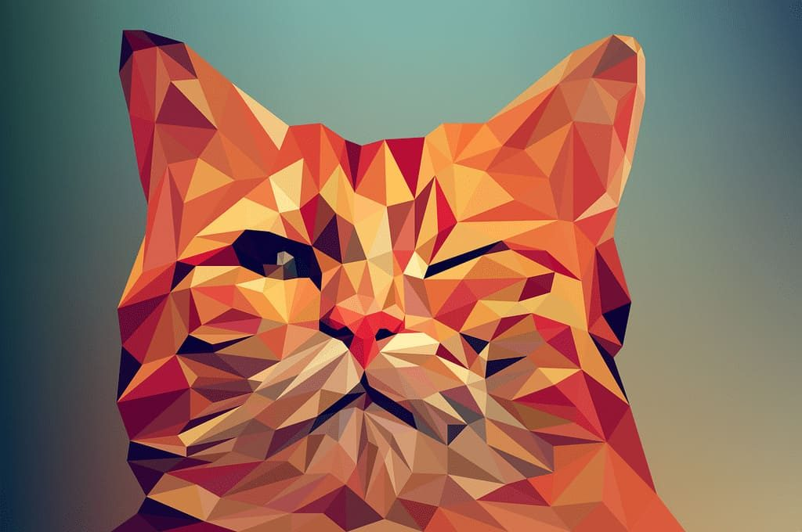{ width="440" }

- **Vídeos**: són un dels mitjans més populars i versàtils avui dia. Tant si miram tutorials a YouTube, com si cream i compartim vídeos a TikTok o participam en projectes escolars que requereixen produir-ne, estam en contacte constant amb aquest format. Els vídeos no només serveixen per entretenir, sinó que són una eina educativa molt potent. :material-link: [15 canals de YouTube amb continguts educatius](https://convivenciadigital.cl/los-mejores-15-canales-de-youtube-con-videos-educativos/) (en castellà)
- **Continguts interactius**: inclouen aplicacions mòbils, jocs, llocs web interactius i tecnologies immersives com la realitat virtual i l'augmentada. Amb aquests continguts podem aprendre de manera lúdica, com amb les aplicacions educatives que gamifiquen l'aprenentatge, o desenvolupar habilitats concretes, com les que ens ofereixen les plataformes interactives per aprendre programació o idiomes.

    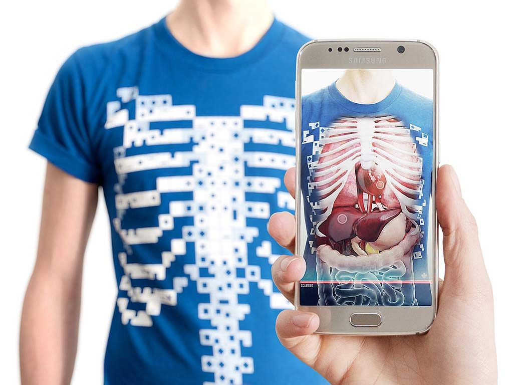{ width="360" }

- **Àudio**: el contingut en format d'àudio, com els **pòdcasts**, és una altra àrea que ha guanyat molta popularitat darrerament. Els pòdcasts ofereixen una manera nova d'aprendre i d'entretenir-se sobre qualsevol tema que se t'acudeixi.

Tots aquests tipus de continguts digitals ofereixen maneres diferents d'expressar-se i d'aprendre, i són clau per al vostre desenvolupament en una societat cada vegada més digitalitzada. Familiaritzant-te amb aquests formats et prepares per al futur i enriqueixes el present, explorant noves formes de comunicació, creativitat i coneixement.

## 3.2. Eines de productivitat

Ens centram ara en les **eines de productivitat** que faciliten i optimitzen la creació, la gestió i l'intercanvi de continguts digitals. Aquestes eines, que inclouen programari d'ofimàtica i aplicacions de disseny gràfic, són imprescindibles en tots els àmbits de la vida: els estudis, la feina i la vida personal.

Familiaritzar-nos amb aquestes eines vol dir adquirir habilitats que van molt més enllà de l'aula. Per això, aquest apartat no tracta només l'ús tècnic de les eines, sinó també la seva importància per desenvolupar habilitats de comunicació, organització i creativitat.

### 3.2.1. Programari d'ofimàtica

El **programari d'ofimàtica** és un conjunt d'eines digitals pensades per a tasques d'oficina. Tanmateix, la seva utilitat va més enllà de la feina i arriba a l'àmbit educatiu i personal.

<div class="video">
<iframe src="https://www.youtube-nocookie.com/embed/cNU5NEcrzsw" title="Vídeo sobre el programari d'ofimàtica" loading="lazy" allowfullscreen></iframe>
</div>

Per a un estudiant de 4t d'ESO, el programari d'ofimàtica és un gran aliat per a moltes activitats. Programes com Microsoft Office, amb components clau com Word, Excel i PowerPoint, o alternatives gratuïtes com LibreOffice i Google Workspace, són fonamentals en la vostra vida acadèmica, i ho continuaran essent quan acabi.

Per exemple, podries utilitzar processadors de text com Microsoft Word o **Google Docs** per escriure redaccions, informes de recerca, una publicació per a les xarxes socials o el teu propi currículum.

Aquestes eines no només faciliten l'escriptura i l'edició de textos, sinó que també ofereixen funcions avançades, com la correcció ortogràfica i gramatical, que milloren la qualitat dels teus treballs escrits.

Excel i **Google Sheets**, en canvi, són fulls de càlcul, excel·lents per treballar amb dades i fer càlculs matemàtics. Els podries utilitzar en projectes de ciències on hagis de recollir, analitzar i presentar dades. També són útils per a tasques quotidianes, com gestionar un pressupost personal o planificar un viatge amb els amics.

PowerPoint, Google Slides, Canva o Genially són eines clau per a les presentacions a classe. No només et permeten transmetre informació, sinó també desenvolupar habilitats de disseny i de presentació visual. Una presentació ben dissenyada pot fer que un projecte sigui més atractiu i comuniqui millor les idees.

En l'àmbit personal, pots utilitzar aquestes eines per gestionar els teus propis projectes i aficions. Per exemple, si t'interessa l'escriptura creativa, els guions per a vídeos de YouTube, les puntuacions d'un torneig o col·laborar amb una associació solidària, totes aquestes activitats es poden gestionar amb alguna de les eines d'ofimàtica que veurem.

En aquesta matèria ens centrarem en les eines d'ofimàtica de Google Workspace en la seva versió *for Education*. Lope González en té pràctiques guiades (en castellà):

1. [Google Workspace for Education](https://lopegonzalez.es/eso-y-bachillerato/digitalizacion-4o-eso/tema-3-edicion-y-creacion-de-contenido/google-workspace-for-education/)
2. [Gmail](https://lopegonzalez.es/eso-y-bachillerato/digitalizacion-4o-eso/tema-3-edicion-y-creacion-de-contenido/gmail/)
3. [Google Drive](https://lopegonzalez.es/eso-y-bachillerato/digitalizacion-4o-eso/tema-3-edicion-y-creacion-de-contenido/google-drive/)
4. [Google Docs](https://lopegonzalez.es/eso-y-bachillerato/digitalizacion-4o-eso/tema-3-edicion-y-creacion-de-contenido/google-docs/)
5. [Google Sheets](https://lopegonzalez.es/eso-y-bachillerato/digitalizacion-4o-eso/tema-3-edicion-y-creacion-de-contenido/google-sheets/)
6. [Google Forms](https://lopegonzalez.es/eso-y-bachillerato/digitalizacion-4o-eso/tema-3-edicion-y-creacion-de-contenido/google-forms/)

Aquí feim una aturada: començam les pràctiques i, quan acabem, tornarem per continuar amb la unitat.

### 3.2.2. Eines de disseny gràfic i d'edició d'imatges

Les eines de disseny gràfic i d'edició d'imatges són la base de la creació de contingut visual en la societat actual. Permeten manipular i millorar fotografies i crear gràfics i dissenys per a llocs web, aplicacions i publicitat.

Fixau-vos, per exemple, en el web d'una botiga en línia com Amazon o AliExpress: tots els bàners publicitaris, les imatges dels productes i els reclams promocionals s'han dissenyat amb molta cura per captar la nostra atenció.

Les aplicacions d'aquestes eines són innombrables i les trobam en molts d'aspectes de la vida diària. Avui gairebé tothom edita les fotos abans de publicar-les a xarxes socials com Instagram. En l'àmbit educatiu, es fan constantment dissenys amb eines com Canva o Genially per crear material didàctic atractiu que capti l'atenció de l'alumnat, i també per elaborar els treballs dels mateixos alumnes. Els organismes públics dissenyen els seus cartells amb aquest tipus d'eines, i també les impremtes, les editorials, els senyals de trànsit, els videojocs… pràcticament tots els sectors productius que puguis imaginar.

Així, l'edició i el disseny gràfic no només són fonamentals per als professionals de l'art i la publicitat, sinó també per a la nostra comunicació diària en el món digital. Per tot això, està plenament justificat estudiar aquestes eines i practicar-les fins a assolir-ne, com a mínim, una competència bàsica.

Com a creadors de contingut digital, presents i futurs, en les pròximes setmanes aprendreu a utilitzar aquestes eines no només per expressar les vostres idees creatives, sinó també per entendre millor com els mitjans visuals influeixen en la nostra percepció del món. Recordau sempre que heu de cercar l'originalitat i respectar els drets d'autor en les vostres creacions.

És un bon moment per aprendre la diferència entre una **imatge de mapa de bits** i una **imatge vectorial**, perquè és el primer concepte que has d'entendre a l'hora de triar una eina o una altra.

<div class="video">
<iframe src="https://www.youtube-nocookie.com/embed/RZywV73MDGM" title="Diferència entre imatges de mapa de bits i vectorials" loading="lazy" allowfullscreen></iframe>
</div>

Ara sí, vegem algunes de les eines més importants que s'utilitzen professionalment per al disseny gràfic i l'edició d'imatges:

| Eina | Descripció |
| --- | --- |
| 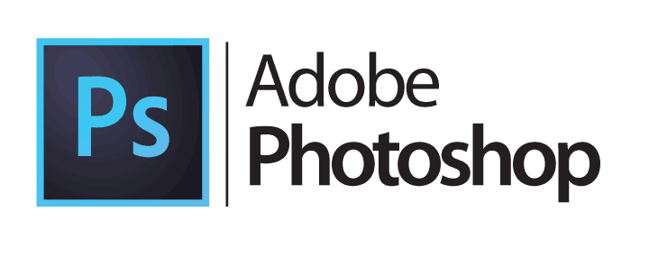{ width="180" } | **Adobe Photoshop** és el rei indiscutible de l'edició d'imatges. Ofereix moltíssimes funcions, des de l'edició i l'optimització de fotografies fins a la creació d'il·lustracions i conceptes en 2D i 3D. A més, també permet editar i crear vídeos. És assequible fins i tot per a principiants, sobretot en conceptes bàsics com el treball amb capes. |
| 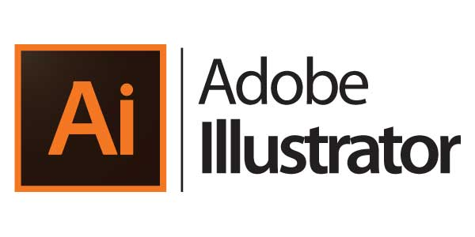{ width="180" } | **Adobe Illustrator** és fonamental per dissenyar logotips, dibuixos, tipografies i il·lustracions mitjançant la vectorització. Això li permet cobrir projectes molt diversos, des d'icones web fins a dissenys per a revistes i llibres. |
| { width="180" } | **Adobe InDesign**, un altre component del paquet d'Adobe, és clau per als treballs editorials. És especialment útil per maquetar pàgines i compondre textos, i és ideal per crear fullets, revistes i llibres, tant en format digital com imprès. |
| 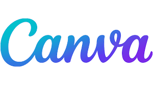{ width="160" } | **Canva** s'ha convertit en una de les eines preferides de molta gent per la seva facilitat d'ús i la seva bona interfície. Permet crear dissenys ràpids i de qualitat a partir d'una enorme varietat de plantilles. La versió gratuïta ja n'inclou milers. |
| { width="180" } | **Freepik** és com el Google dels dissenyadors: una biblioteca enorme de recursos gratuïts i de pagament. Permet descarregar i editar molts de recursos, com arxius PSD, vectors, fotografies, vídeos i GIF animats. |
| { width="200" } | **Google Fonts** és una eina imprescindible per trobar tipografies que s'ajustin als teus projectes de disseny gràfic digital i els facin lluir. Ofereix una gran varietat de tipografies de codi obert. |
| 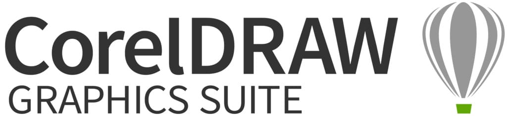{ width="180" } | **CorelDRAW**: encara que Adobe lidera el sector, és un dels programes clàssics del disseny des del 1992. Té moltes eines per crear il·lustracions vectorials i editar fotografies, una interfície amigable i molts de recursos formatius. És una opció sòlida, especialment per a qui treballa en impremtes. |

Aquestes són les eines líders en cada especialitat, però en l'àmbit educatiu és una recomanació molt estesa **utilitzar sempre que es pugui una alternativa de codi obert**. Així doncs, excepte Canva, Freepik i Google Fonts, que es poden utilitzar gratuïtament des del navegador, vegem quines alternatives d'escriptori tenim per a la resta:

| Eina | Descripció |
| --- | --- |
| 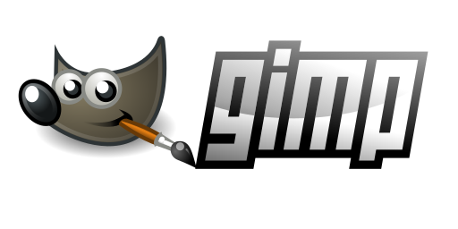{ width="180" } | **GIMP** (*GNU Image Manipulation Program*) és una eina d'edició d'imatges molt potent que ofereix moltes de les funcions de Photoshop, com l'edició i la composició d'imatges i la creació de gràfics en 2D i 3D. |
| { width="180" } | **Inkscape** és una aplicació de gràfics vectorials i una alternativa excel·lent a Illustrator, ideal per crear logotips, il·lustracions i tipografies. |
| { width="180" } | **Scribus** és un programa de maquetació de pàgines que serveix per dissenyar fullets, revistes i llibres, de manera semblant a InDesign. |
| 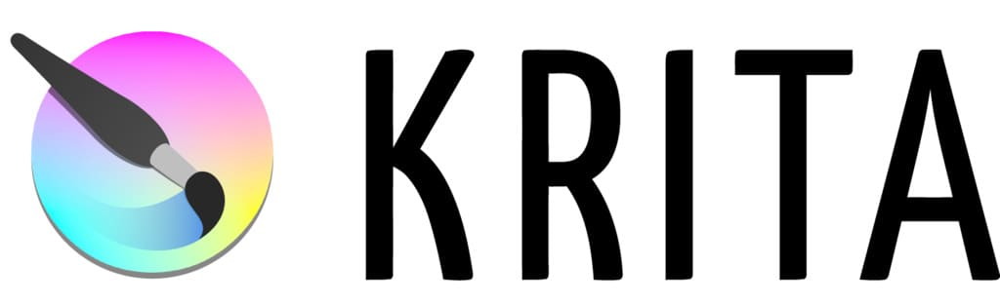{ width="180" } | **Krita** està més orientat a la pintura digital i al dibuix, però també té funcions de disseny gràfic i pot ser una bona alternativa a CorelDRAW per a algunes tasques de disseny vectorial. |

A les pràctiques guiades d'aquest apartat descobrirem les funcions més importants de **GIMP** i les tècniques més utilitzades per a diverses tasques d'edició d'imatges. A més, aprendrem els conceptes bàsics del disseny vectorial amb **Inkscape**. Pràctiques de Lope González (en castellà):

- [Pràctiques amb GIMP](https://lopegonzalez.es/eso-y-bachillerato/digitalizacion-4o-eso/tema-3-edicion-y-creacion-de-contenido/practicas-con-gimp/)
- [Pràctiques amb Inkscape](https://lopegonzalez.es/eso-y-bachillerato/digitalizacion-4o-eso/tema-3-edicion-y-creacion-de-contenido/practicas-con-inkscape/)

## 3.3. Desenvolupament bàsic d'aplicacions mòbils

En el món actual, en què la tecnologia avança a passes de gegant (només cal veure com ha evolucionat la intel·ligència artificial en els darrers anys), el mòbil s'ha convertit en una extensió de nosaltres mateixos. No és només una eina de comunicació, sinó una porta enorme a tot el coneixement que existeix, directament al palmell de la mà. És una bogeria.

En aquest context, el desenvolupament d'aplicacions mòbils és una disciplina clau, capaç de transformar idees innovadores en solucions pràctiques que ens faciliten i enriqueixen la vida quotidiana. Des d'aplicacions que ens permeten demanar el sopar amb un parell de tocs fins a les que converteixen el mòbil en un entrenador personal de butxaca, les possibilitats són infinites.

La importància d'estudiar aquests continguts està tant en adquirir les habilitats tècniques per crear aplicacions funcionals com en entendre l'impacte profund que tenen en la societat. Per exemple, pensem en WhatsApp: va començar com una simple eina de missatgeria entre uns pocs usuaris i s'ha convertit en l'aplicació que connecta més gent del món cada dia.

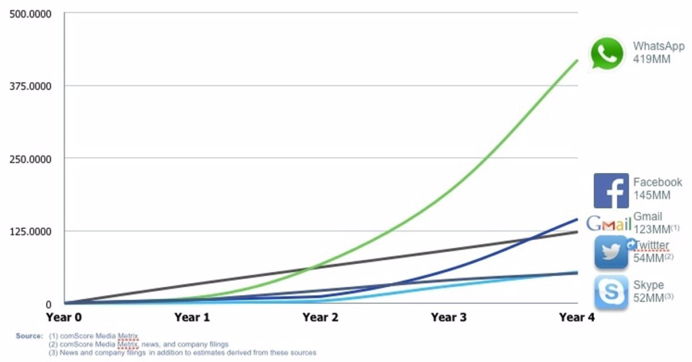{ width="560" }

*Creixement d'usuaris de les aplicacions més populars durant els seus primers anys.*

Qui sap? Potser alguna de les aplicacions que desenvolupareu a classe acaba essent el pròxim TikTok.

### 3.3.1. Plataformes i eines de desenvolupament

En el desenvolupament d'aplicacions mòbils, les plataformes i les eines de desenvolupament són els pilars de qualsevol solució innovadora. Faciliten la feina i obren un ventall de possibilitats perquè els desenvolupadors donin vida a les seves idees.

#### Varietat de plataformes

Triar la plataforma de desenvolupament és un dels primers passos, i dels més importants, a l'hora de crear una aplicació mòbil. Bàsicament hi ha dos grans ecosistemes:

- **Android**: desenvolupat per Google, és el sistema operatiu més utilitzat del món. La seva plataforma de desenvolupament, **Android Studio**, ofereix un conjunt d'eines complet amb editor de codi, emuladors i eines de diagnòstic imprescindibles.
- **iOS**: el sistema operatiu d'Apple per a l'iPhone i l'iPad té el seu propi entorn de desenvolupament, **Xcode**, que integra el disseny, el desenvolupament i la publicació d'aplicacions a l'App Store.

Aquests dos entorns **són els que s'utilitzen professionalment** i s'hi programa escrivint codi font en mode text, com aquest:

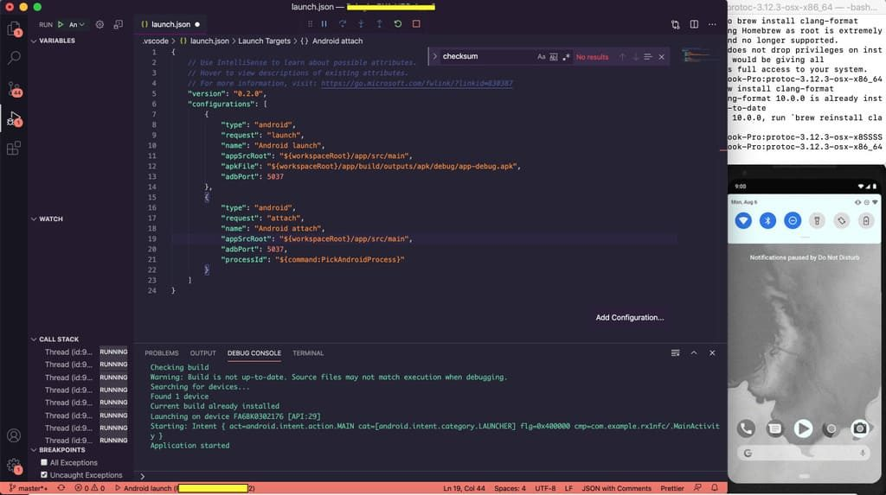{ width="560" }

Però també hi ha entorns de desenvolupament en què no s'escriuen les instruccions en mode text, sinó en **mode blocs**. El programador dissenya l'aplicació arrossegant i deixant anar components de manera visual i després programa amb blocs predefinits el comportament de cada component. Així:

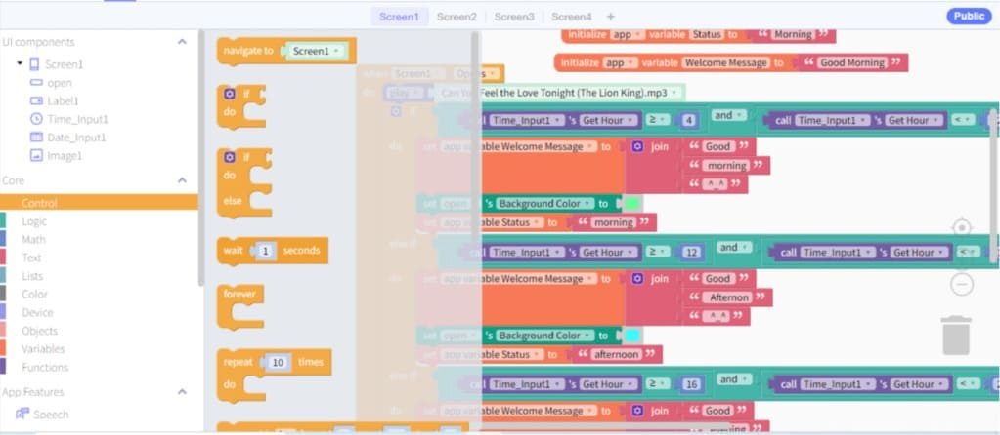{ width="560" }

D'aquesta manera, el desenvolupament d'aplicacions mòbils és molt més senzill. En aquest tipus d'eines en destaquen tres:

1. [MIT App Inventor](https://appinventor.mit.edu/)
2. [Thunkable](https://thunkable.com/)
3. [AppyBuilder](https://appybuilder.com/index.html)

Aquests ecosistemes no només varien pel sistema operatiu i els dispositius, sinó també per les pautes de disseny i les normes de publicació de les aplicacions, cosa que influeix directament en el procés de desenvolupament.

#### Evolució i tendències

El desenvolupament d'aplicacions mòbils és un camp que evoluciona ràpidament, impulsat per les tecnologies noves i per la demanda d'experiències més riques i interactives.

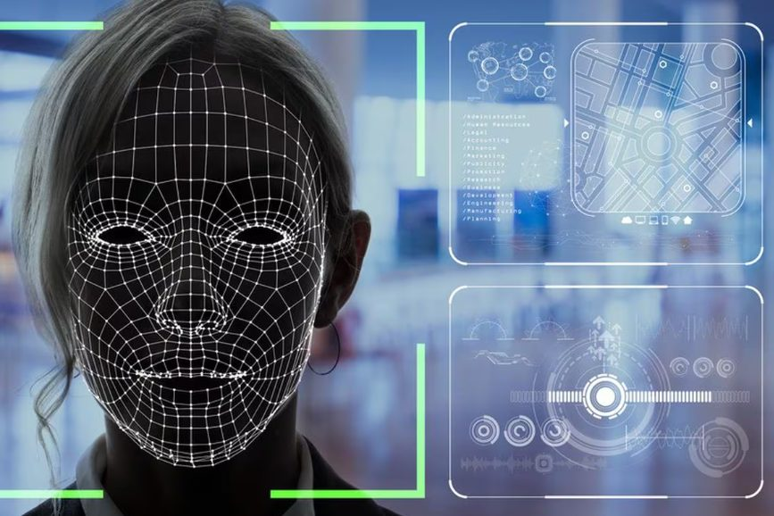{ width="440" }

Les eines de desenvolupament no només s'han hagut d'adaptar a canvis tecnològics com l'augment de la potència dels mòbils o les pantalles d'alta resolució, sinó també a tendències més àmplies com l'auge de la **intel·ligència artificial (IA)** i l'**aprenentatge automàtic**, incorporant funcions que permeten als desenvolupadors afegir aquestes tecnologies a les seves aplicacions de manera més senzilla.

### 3.3.2. Fonaments de programació per a mòbils

Abans de començar a dissenyar aplicacions mòbils, és imprescindible entendre els fonaments de la programació per a aquests dispositius. Aquesta base ens dona les eines necessàries per construir aplicacions funcionals i ens permet entendre les dificultats pròpies del desenvolupament per a mòbils. Repassem-ne els fonaments.

#### Llenguatges de programació

Triar el llenguatge de programació és un punt de partida molt important.

Per a Android, tradicionalment s'ha utilitzat **Java**, tot i que **Kotlin** s'ha consolidat com una alternativa moderna i ara és el preferit de Google.

<div class="grid" markdown>

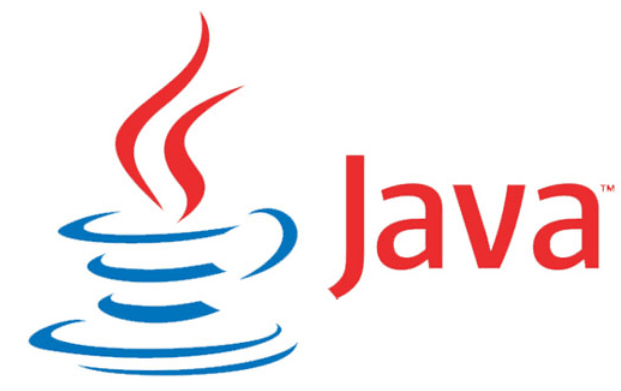{ width="200" }

{ width="200" }

</div>

D'altra banda, el desenvolupament per a iOS es basa en **Objective-C** i **Swift**. Apple recomana el segon per la seva sintaxi concisa i la seva seguretat.

<div class="grid" markdown>

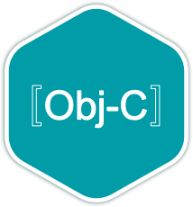{ width="140" }

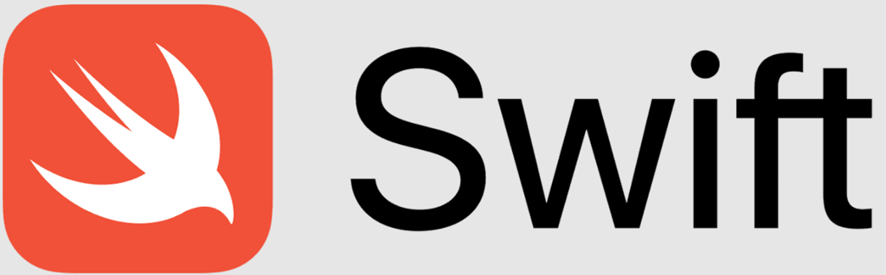{ width="200" }

</div>

Tanmateix, com hem vist més amunt, també podem utilitzar altres tipus de llenguatges, per exemple de blocs, que són multiplataforma: construïm l'aplicació en un llenguatge «neutre» i després l'exportam per a Android o iOS. És la mateixa eina de desenvolupament la que fa internament la «traducció» a un llenguatge o a l'altre.

#### Gestió de la interfície d'usuari (UI)

Crear una interfície d'usuari intuïtiva i atractiva és fonamental en les aplicacions mòbils. Això implica saber utilitzar elements com botons, vistes i animacions. Els desenvolupadors han de conèixer les pautes de disseny de cada plataforma (Material Design per a Android i les *Human Interface Guidelines* d'Apple per a iOS) per crear interfícies coherents amb el que esperen els usuaris.

#### Gestió d'esdeveniments

Les aplicacions mòbils són interactives per naturalesa. Aprendre a gestionar esdeveniments, com tocar la pantalla, lliscar el dit o fer gestos, és fonamental. Cal entendre els sistemes d'esdeveniments d'Android i iOS i saber programar les respostes per aconseguir una experiència d'usuari fluida.

<video class="animacio" autoplay loop muted playsinline width="420" aria-label="Animació de diversos gestos tàctils sobre la pantalla d'un mòbil">
  <source src="../img/d3/gestos.mp4" type="video/mp4">
</video>

Bàsicament, un **esdeveniment** és qualsevol acció que feim sobre el dispositiu: prémer un botó, tocar la pantalla, parlar-li, inclinar-lo, donar-li més llum, girar-lo, orientar-lo…

El programa de l'aplicació tindrà preparada una **resposta** per a cada un d'aquests esdeveniments, com mostrar un missatge, enviar un avís, baixar la brillantor de la pantalla, etc.

Tu, com a programador de l'aplicació, t'encarregaràs de **preparar aquestes respostes per quan es produeixin els esdeveniments**.

#### Cicle de vida de l'aplicació

Entendre el cicle de vida d'una aplicació mòbil és clau per gestionar bé les transicions entre els seus diferents estats, com l'inici, la pausa i la represa. Una bona gestió del cicle de vida ajuda a estalviar recursos del dispositiu i a oferir una experiència d'usuari sense interrupcions.

#### Gestió de l'estat i emmagatzematge de dades

Sovint, les aplicacions mòbils han de guardar dades, ja sigui temporalment en l'estat de l'aplicació o de manera permanent a l'emmagatzematge local o al núvol. Per a algunes aplicacions és important conèixer les diferents opcions d'emmagatzematge, com SharedPreferences a Android o UserDefaults a iOS, i també bases de dades més sofisticades.

#### Connectivitat

Les aplicacions mòbils sovint consumeixen dades d'internet. Això implica fer peticions a **API web** (serveis externs als quals ens connectam per obtenir dades), gestionar-ne les respostes i processar dades en formats com JSON.

<video class="animacio" autoplay loop muted playsinline width="420" aria-label="Animació d'una aplicació de mapes que mostra una ruta en temps real">
  <source src="../img/d3/gps.mp4" type="video/mp4">
</video>

Pensa en una aplicació que mostra el temps que farà. D'on treu la informació meteorològica de cada ciutat? Està connectada en temps real a un servei en línia de l'AEMET (Agència Estatal de Meteorologia), que li proporciona les dades perquè l'aplicació només les hagi de presentar a l'usuari d'una manera atractiva.

O et pensaves que el programador les introduïa a mà cada matí?

Dominar aquestes tècniques és fonamental per integrar funcions externes i dades en temps real a les aplicacions.

#### Optimització i rendiment

Les aplicacions mòbils han de ser ràpides i eficients. Això vol dir optimitzar l'ús de la memòria, reduir el consum de bateria i assegurar-se que l'aplicació funciona bé en dispositius molt diversos. Conèixer les bones pràctiques d'optimització és clau per a l'èxit d'una aplicació amb molts d'usuaris.

#### Seguretat

La seguretat és essencial en el desenvolupament d'aplicacions mòbils. Els fonaments del xifratge de dades, l'autenticació d'usuaris i la protecció contra vulnerabilitats són molt importants per protegir la informació personal dels usuaris i garantir-ne la confiança en l'aplicació.

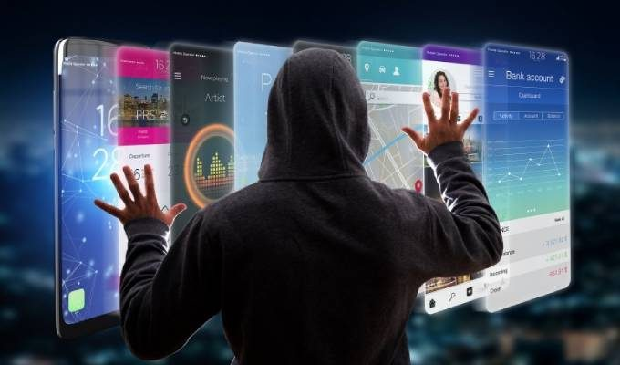{ width="440" }

I també perquè no et duguin als tribunals.

Probablement moltes d'aquestes consideracions no les arribareu a veure ni a patir mai, perquè depenen de contextos de programació molt concrets: videojocs d'alt rendiment, aplicacions amb milions d'usuaris, aplicacions en temps real, etc. Les altres, però, sí que les treballarem a les pràctiques d'aquesta unitat.

### 3.3.3. Disseny d'interfícies i experiència d'usuari

El **disseny d'interfícies (UI)** i l'**experiència d'usuari (UX)** són elements crítics en el desenvolupament d'aplicacions mòbils, perquè determinen conjuntament com els usuaris interactuen amb una aplicació i com la perceben.

Aquest enfocament inclou, d'una banda, l'estètica visual i, de l'altra, la funcionalitat, la usabilitat i l'accessibilitat, per aconseguir que l'aplicació sigui intuïtiva, eficient i agradable d'utilitzar. A les pràctiques veurem com es combinen aquests elements per crear aplicacions que no només compleixen la seva funció, sinó que també ofereixen una experiència satisfactòria.

#### Principis de disseny d'interfícies

El **disseny d'interfícies** se centra en la presentació visual i la interactivitat de l'aplicació. Elements com la paleta de colors, les tipografies, els botons, les icones i els espais en blanc es trien i es col·loquen amb cura per crear una interfície coherent i agradable.

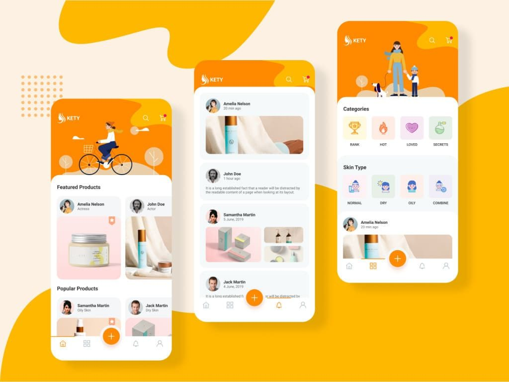{ width="480" }

La clau és seguir principis de disseny com la senzillesa, la coherència i la claredat, que faciliten la navegació i milloren la usabilitat. Eines de disseny com **Sketch**, **Adobe XD** o **Figma** ofereixen als desenvolupadors moltes possibilitats per crear prototips interactius abans de programar.

#### Importància de l'experiència d'usuari

La **UX**, en canvi, se centra en l'experiència global de l'usuari quan interactua amb l'aplicació. Això inclou entendre les necessitats i els comportaments dels usuaris, dissenyar fluxos de treball lògics i assegurar-se que l'aplicació respon ràpidament i amb precisió a les accions de l'usuari.

L'experiència d'usuari va més enllà del que és visual: té a veure amb com se sent l'usuari en cada interacció amb l'aplicació. Un aspecte fonamental de la UX és el disseny centrat en l'usuari, que implica fer proves d'usabilitat i recollir opinions de manera repetida per ajustar l'aplicació a les necessitats reals dels usuaris.

#### Optimització de la interacció

La interacció entre l'usuari i l'aplicació ha de ser intuïtiva. Els gestos tàctils, com lliscar, tocar o pessigar, s'han de programar de manera que resultin naturals i previsibles. La resposta visual o hàptica (vibració) a les accions de l'usuari ajuda a confirmar les interaccions i millora la sensació de control.

#### Accessibilitat

Un aspecte sovint oblidat però important del disseny UI/UX és l'accessibilitat: aconseguir que l'aplicació la puguin utilitzar persones amb capacitats diverses, incloses les que tenen discapacitats visuals, auditives, motrius o cognitives.

<video class="animacio" autoplay loop muted playsinline width="420" aria-label="Animació d'una aplicació mòbil controlada per veu">
  <source src="../img/d3/accessibilitat.mp4" type="video/mp4">
</video>

Això implica funcions com un contrast de color adequat, opcions de conversió de text a veu i la possibilitat de navegar per l'aplicació amb assistents de veu o altres controls d'accessibilitat.

#### Adaptabilitat

Les aplicacions mòbils s'han de dissenyar perquè s'adaptin a moltes mides i orientacions de pantalla, des dels mòbils fins a les tauletes. Una bona UI i UX tenen en compte aquesta varietat perquè l'aplicació no només es vegi bé, sinó que també funcioni de manera òptima en qualsevol dispositiu.

:material-link: [Pràctiques de desenvolupament bàsic d'aplicacions mòbils](https://lopegonzalez.es/eso-y-bachillerato/computacion-y-robotica-1o-eso/tema-2-desarrollo-movil/#26-proyectos-de-desarrollo-movil) (Lope González, en castellà)

## 3.4. Desenvolupament bàsic d'aplicacions web

Des dels primers dies del web als laboratoris del CERN, quan **Tim Berners-Lee** va idear una manera d'interconnectar la informació mitjançant l'hipertext, fins a l'univers digital dinàmic en què ens movem avui, el web ha estat testimoni i protagonista de revolucions silencioses i explosives.

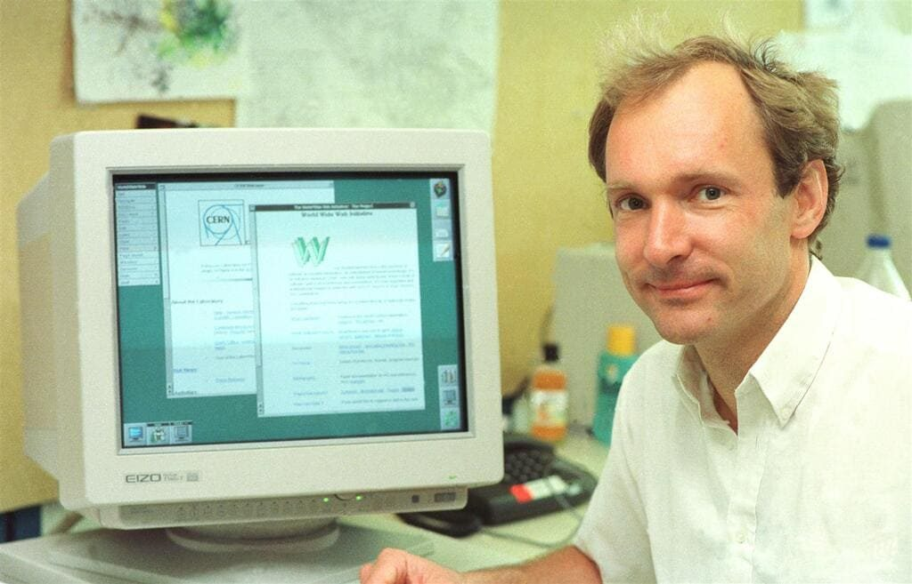{ width="400" }

*Tim Berners-Lee als laboratoris del CERN.*

Però què fa el web tan important avui dia? La resposta no és només la seva capacitat per emmagatzemar i transmetre informació, sinó com ha redefinit les relacions humanes, el comerç, l'educació i fins i tot la nostra percepció de la realitat. Amb exemples actuals, com l'impacte de les xarxes socials en la política i la societat o l'aparició de l'economia col·laborativa, veiem que el web no és un simple canal d'informació, sinó un espai d'interacció humana sense precedents.

Cada pàgina web que visitam, cada aplicació que utilitzam i cada servei en línia al qual accedim són peces d'un trencaclosques que ens ajuda a entendre el món on vivim. Estudiar el web és, per tant, explorar com la tecnologia modela la societat i a l'inrevés.

El web, tal com el coneixem avui, és un entramat complex de tecnologies, protocols i pràctiques pensat per connectar les persones amb la informació. Mirarem d'entendre'l una mica millor descrivint-ne algunes característiques principals.

### 3.4.1. Característiques del web

El web no és una via de comunicació d'una sola direcció: permet la **interacció entre els usuaris i els sistemes**.

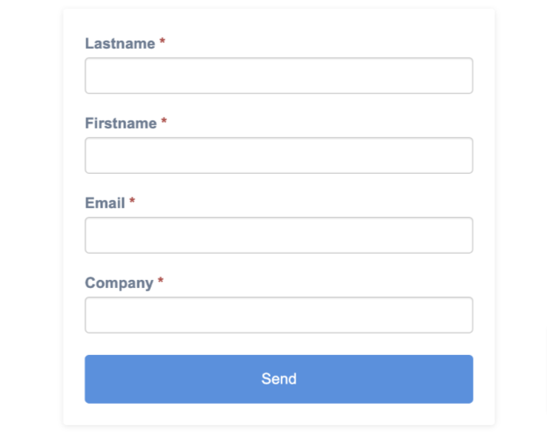{ width="320" }

Els formularis web, que recullen informació dels usuaris per oferir-los una experiència personalitzada, en són un exemple.

Un dels objectius del web és que hi pugui accedir qualsevol persona, des de qualsevol lloc i amb qualsevol dispositiu o navegador, és a dir, que sigui **accessible**. Un exemple clar és la *Web Accessibility Initiative* (WAI), que promou pautes perquè el web sigui accessible per a les persones amb discapacitat.

Els llocs web poden canviar i actualitzar-se en temps real i oferir **contingut dinàmic** segons les accions de l'usuari o els esdeveniments externs. Els diaris digitals que actualitzen els titulars a mesura que passen les coses en són un exemple senzill, però ho veiem encara més clar a les xarxes socials, aplicacions en què el contingut és completament diferent d'un usuari a un altre.

El web s'estructura al voltant del concepte d'**hipertext**, que permet enllaçar documents entre ells. La Wikipedia és l'exemple emblemàtic de com l'hipertext facilita l'accés a quantitats enormes d'informació de manera intuïtiva.

### 3.4.2. Funcionament del web

{ width="400" }

Per entendre com funciona el web, podem imaginar-lo com la cambra de caixes fortes d'un banc; però, en lloc de caixes plenes de béns personals, hi ha servidors plens de pàgines web accessibles des de qualsevol lloc del món. Vegem aquest procés en passes senzilles.

#### 1. La petició de l'usuari

Vols trobar informació sobre el sistema solar. El primer que fas és obrir el navegador web (com Chrome, Firefox o Safari) i escriure la consulta en un cercador com Google, o directament una adreça web que ja coneixes.

Un company t'ha dit que a *cienciaespacial.com* hi ha dades curioses que et poden servir. Així que escrius aquesta adreça al navegador i prems ++enter++:

{ width="420" }

En aquest moment fas una «petició» per veure una pàgina web concreta. Acabes de fer una **petició HTTP** (*HTTP request*).

#### 2. Localitzar el recurs

Cada pàgina web té una adreça única, anomenada **URL** (*Uniform Resource Locator*), que funciona com l'adreça d'una casa; en el nostre cas, *cienciaespacial.com*.

Però, perquè el navegador trobi la pàgina que has demanat, ha de convertir aquesta adreça llegible per les persones en una adreça numèrica, l'**adreça IP** (*Internet Protocol*), que identifica de manera única un servidor a la xarxa.

T'has fixat que les caixes fortes del banc no duen el nom dels propietaris? Tenen un número que les identifica. Amb els servidors passa el mateix: els identificam amb un número en format d'adreça IP, **quatre nombres del 0 al 255 separats per punts**:

**80.123.45.251**

La traducció de l'adreça d'un web a l'adreça IP del servidor que l'allotja la fa el **DNS** (*Domain Name System*), que actua com una guia telefònica que tradueix noms de domini a adreces IP. Aquest procés s'anomena **resolució de noms de domini**.

#### 3. El servidor web respon

Un cop el navegador coneix l'adreça IP del servidor on es troba la pàgina, li envia la petició. Pensa en el servidor com un gran arxiu on es guarden les pàgines web. Quan rep la teva petició, cerca la pàgina que has demanat, processa les dades necessàries per preparar la resposta i la torna al navegador.

Aquesta resposta és una **resposta HTTP** (*HTTP response*).

Tot això passa al **costat del servidor**, on s'allotja el web, i el que ha processat el servidor és el ***backend***, la part privada del web.

#### 4. Carregar la pàgina web

Quan rep la informació del servidor, el navegador comença a carregar la pàgina: textos, imatges, vídeos i qualsevol altre contingut. El navegador interpreta el codi HTML (el llenguatge amb què s'escriuen les pàgines web), l'estilitza amb CSS (que en defineix l'aspecte) i executa el codi JavaScript (que hi afegeix interactivitat) per mostrar-te la pàgina tal com es va dissenyar.

Tot això passa al **costat del client**, és a dir, tu i el teu equip, i el que acaba de fer el navegador és mostrar el ***frontend***, la part pública del web.

#### 5. Interacció i noves peticions

Un cop carregada la pàgina, hi pots interactuar: clicar enllaços, veure vídeos, emplenar formularis, deixar comentaris, etc.

Cada vegada que hi interactues, és possible que el navegador faci noves peticions al servidor; per exemple, si cliques un enllaç per anar a una altra pàgina. El procés torna a començar des del pas 1, i el cicle continua mentre navegues.

Aquest procés, que en teoria pot semblar complicat, passa en qüestió de segons gràcies a l'**arquitectura client-servidor** que acabam de descriure, en què intervenen molts de protocols de comunicació molt eficients.

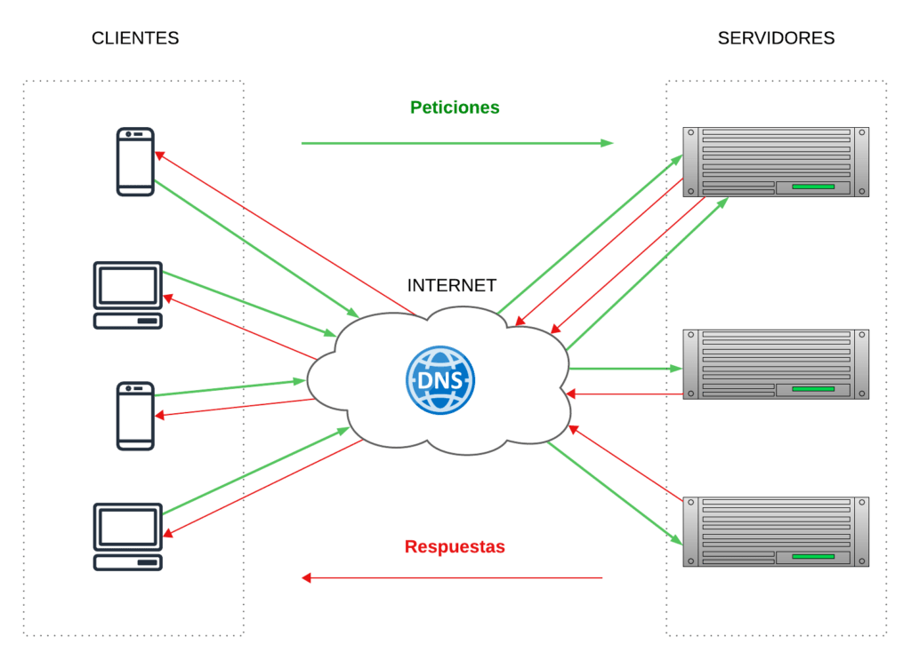{ width="520" }

Molt bé. Ja saps com funciona el web: d'on surt la petició, com troba el servidor que l'atén i com torna un arxiu al navegador perquè el mostri. Però com aconsegueix el navegador mostrar a la pantalla tota la informació d'un web? Aquest és el pas següent.

### 3.4.3. Introducció a HTML, CSS i JavaScript

Són els tres pilars fonamentals del **desenvolupament web al costat del client**, les tecnologies que fan possible crear i dissenyar llocs web:

- **HTML** (*HyperText Markup Language*, llenguatge de marcatge d'hipertext).

    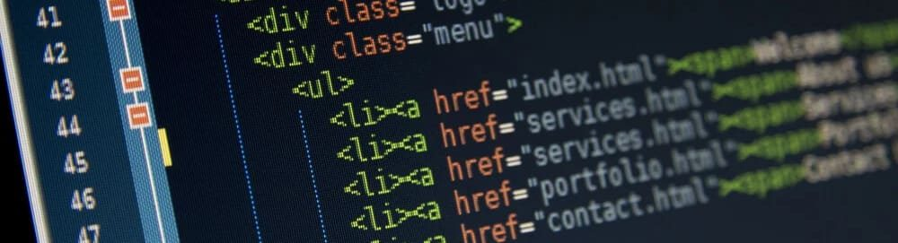{ width="440" }

- **CSS** (*Cascading Style Sheets*, fulls d'estil en cascada).

    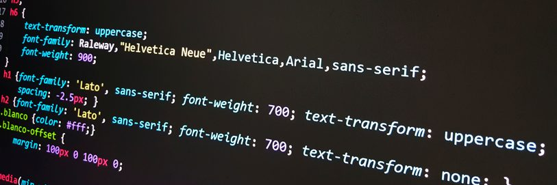{ width="440" }

- **JavaScript** (llenguatge de programació que funciona tant al costat del client com al del servidor).

    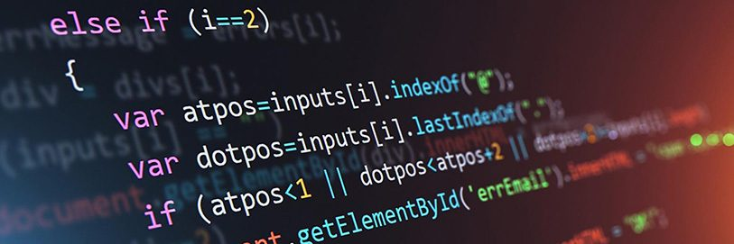{ width="440" }

Aquestes tecnologies són fonamentals per construir i donar estil a les pàgines web i són la base de tots els llocs web moderns. Vegem què són, com funcionen i per què són tan importants.

#### HTML: l'estructura del web

HTML és el llenguatge de marcatge estàndard que s'utilitza per crear i estructurar pàgines web. Amb HTML definim elements com títols, paràgrafs, enllaços, imatges i moltes altres estructures que formen una pàgina web.

Pensa en HTML com l'esquelet d'un lloc web: dona l'estructura bàsica sobre la qual es construeix tota la resta.

```html title="Esquelet bàsic d'una pàgina HTML"
<!DOCTYPE html>
<html lang="ca">
<head>
    <meta charset="utf-8">
    <meta name="viewport" content="width=device-width, initial-scale=1">
    <title>Esquelet d'un web</title>
</head>
<body>
    <!-- Contingut principal -->
</body>
</html>
```

HTML utilitza **etiquetes** (*tags*) per marcar les diferents parts del contingut d'una pàgina web i indicar al navegador com l'ha de mostrar. Per exemple, l'etiqueta `<h1>` s'utilitza per als títols principals, `<p>` per als paràgrafs, `<a>` per als enllaços, i així successivament. Cada etiqueta té una funció concreta i ajuda a organitzar el contingut de manera semàntica.

Aprendre HTML és el primer pas de qualsevol desenvolupador web, perquè en proporciona la base. A més, dominar HTML és imprescindible per a l'accessibilitat web, és a dir, perquè el contingut sigui accessible per a tothom, incloses les persones que utilitzen lectors de pantalla o altres tecnologies d'assistència.

#### CSS: l'estil del web

CSS és el llenguatge que descriu la presentació visual de les pàgines web: colors, marges, fonts, etc. Mentre que HTML s'encarrega de l'estructura, CSS en defineix l'estil i l'aparença.

Pots pensar en CSS com la roba que vesteix l'esquelet de l'HTML i li dona color, forma i estil.

CSS permet aplicar estils als elements HTML seleccionant-los amb selectors i definint-ne propietats i valors. Per exemple, podem posar blau el fons de tots els paràgrafs (`<p>`) amb una regla CSS molt senzilla:

```css title="Posa blau el fons dels paràgrafs"
p { background-color: blue; }
```

El codi CSS es pot incloure directament a l'HTML, enllaçar-lo com un arxiu extern o, fins i tot, escriure'l dins dels mateixos elements.

Dins de l'ecosistema CSS, els ***frameworks*** han aparegut com a eines molt potents que simplifiquen i acceleren la creació d'interfícies atractives. Entre aquests, [Tailwind CSS](https://tailwindcss.com/) destaca perquè permet construir dissenys personalitzats sense sortir de l'HTML, sense haver d'escriure CSS des de zero.

{ width="320" }

L'ús de CSS millora molt l'experiència de l'usuari perquè permet crear pàgines web atractives i d'aspecte professional. A més, CSS té un paper molt important en el disseny web adaptable (*responsive*), que fa que les pàgines es vegin bé en molts de dispositius i mides de pantalla. Dominar CSS vol dir tenir el control de l'aparença d'un lloc web i poder ajustar-ne el disseny per millorar-ne la usabilitat i l'estètica.

#### JavaScript: la interactivitat del web

JavaScript és el llenguatge de programació que s'utilitza per crear contingut dinàmic a les pàgines web. Mentre que HTML dona l'estructura i CSS l'estil, JavaScript hi afegeix interactivitat i permet crear una experiència d'usuari més rica.

Pots entendre JavaScript com el sistema nerviós d'un lloc web, en què HTML seria l'esquelet i CSS la roba. És capaç de **respondre a les accions de l'usuari**, com clics, pulsacions de tecles o moviments del ratolí, i permet una interacció més profunda amb el contingut de la pàgina.

JavaScript s'executa al navegador de l'usuari, és a dir, el codi es processa al dispositiu de l'usuari i no al servidor. Això permet respondre ràpidament a les accions de l'usuari sense haver de tornar a carregar la pàgina.

Amb JavaScript pots fer tasques com aquestes:

- **Manipular el DOM**: permet modificar els elements d'una pàgina web en temps real. Per exemple, pots afegir o eliminar elements, canviar-ne els estils o alterar el contingut de la pàgina segons el que faci l'usuari.

    ```javascript
    // Canvia el text d'un element amb l'identificador "elMeuTitol"
    document.getElementById("elMeuTitol").innerHTML = "Títol nou";

    // Aquest codi cerca a la pàgina l'element amb l'identificador "elMeuTitol"
    // i canvia el seu contingut HTML per "Títol nou".
    ```

- **Validar formularis**: abans d'enviar les dades d'un formulari al servidor, JavaScript les pot comprovar. Així s'assegura que la informació compleix els requisits necessaris, es millora la usabilitat i es redueixen els errors en la introducció de dades.

    ```javascript
    // Funció per validar el camp de correu electrònic d'un formulari
    function validarCorreu() {
        var correu = document.getElementById("correu").value;
        var patro = /^[^\s@]+@[^\s@]+\.[^\s@]+$/;
        if (patro.test(correu)) {
            alert("L'adreça de correu és vàlida.");
        } else {
            alert("L'adreça de correu és incorrecta.");
        }
    }

    // Aquesta funció obté el valor del camp de correu, comprova si compleix un patró bàsic
    // d'adreça de correu electrònic i mostra un avís que indica si és vàlida o no.
    ```

- **Efectes**: permet afegir animacions i efectes visuals a una pàgina web perquè el contingut sigui més atractiu.

    ```javascript
    // Anima un element perquè es desplaci cap a la dreta
    function moureDreta() {
        var element = document.getElementById("animat");
        var posicio = 0;
        var interval = setInterval(pas, 10); // es mou cada 10 ms
        function pas() {
            if (posicio == 350) { // s'atura als 350 px
                clearInterval(interval);
            } else {
                posicio++;
                element.style.left = posicio + "px";
            }
        }
    }

    // Aquest codi mou l'element amb l'identificador "animat" cap a la dreta fins als 350 px.
    ```

- **Crides asíncrones amb AJAX**: és una tècnica que permet a les pàgines web demanar dades al servidor de manera asíncrona, sense tornar a carregar la pàgina. Així es poden actualitzar parts d'una pàgina amb dades noves sense interrompre l'experiència de l'usuari.

    ```javascript
    // Fa una petició GET a una API i en mostra el resultat
    function carregarDades() {
        var xhttp = new XMLHttpRequest();
        xhttp.onreadystatechange = function() {
            if (this.readyState == 4 && this.status == 200) {
                document.getElementById("dades").innerHTML = this.responseText;
            }
        };
        xhttp.open("GET", "https://api.example.com/dades", true);
        xhttp.send();
    }

    // Aquest codi envia una petició GET a "https://api.example.com/dades"
    // i, si la resposta és correcta, en posa el contingut a l'element amb l'identificador "dades".
    ```

JavaScript ha anat més enllà dels navegadors i ara és el cor de tecnologies com **Node.js**, que permet escriure aplicacions del costat del servidor. Dominar JavaScript obre un món de possibilitats en el desenvolupament web, des de llocs web senzills fins a aplicacions web complexes i molt interactives.

### 3.4.4. Creació de pàgines web senzilles

Crear aplicacions web implica **dominar les tres tecnologies** que acabam de veure. Tanmateix, en aquesta matèria no tenim prou temps per aprendre, ni tan sols per sobre, la sintaxi i les particularitats de cada llenguatge.

Per això començarem el camí del desenvolupament web amb una eina ***no-code***. Així ens anirem familiaritzant amb els conceptes bàsics d'aquest tipus de desenvolupament i construirem llocs web atractius sense escriure ni una sola línia de codi.

:material-link: [Pràctiques de desenvolupament bàsic d'aplicacions web](https://lopegonzalez.es/eso-y-bachillerato/digitalizacion-4o-eso/tema-3-edicion-y-creacion-de-contenido/practicas-de-desarrollo-basico-de-aplicaciones-web/) (Lope González, en castellà)

## 3.5. Realitat virtual, augmentada i mixta

En un món cada vegada més digitalitzat, les fronteres entre el que és real i el que és virtual es difuminen a gran velocitat. L'evolució de les tecnologies de **realitat virtual (RV)**, **realitat augmentada (RA)** i **realitat mixta (RM)** està transformant la manera com interactuam amb l'entorn i com resolem problemes. La importància d'estudiar-les no rau només en la seva capacitat d'entretenir, sinó en el seu potencial per revolucionar sectors sencers, des de l'educació fins a la indústria, passant per la salut i el comerç.

Si en coneixem els conceptes principals, estarem més preparats per entendre la pròxima onada de transformacions digitals, que ja està arribant, i per participar-hi activament.

### 3.5.1. Conceptes bàsics

Quan parlam de tecnologies que alteren la nostra percepció de la realitat, entram en un territori fascinant que barreja el món digital i el real. Hi ha tres conceptes fonamentals: **realitat virtual (RV)**, **realitat augmentada (RA)** i **realitat mixta (RM)**. Encara que poden semblar similars, cadascuna ofereix una experiència diferent i s'aplica de maneres diferents. Vegem-les una per una.

#### Realitat virtual (RV)

La realitat virtual crea un entorn completament artificial en què l'usuari se submergeix del tot. Amb dispositius com **ulleres o cascos de RV**, us trobau immersos en un món generat per ordinador que simula la realitat.

Un exemple clàssic són els videojocs, en què podeu explorar mons fantàstics com si hi fóssiu de veritat. Però també s'utilitza en simulacions per formar-se en entorns perillosos, com l'entrenament de pilots.

{ width="440" }

#### Realitat augmentada (RA)

A diferència de la RV, la realitat augmentada superposa informació digital al món real. Això s'aconsegueix amb dispositius com **mòbils o ulleres especials**, que projecten dades i imatges damunt el que veiem.

Un exemple quotidià són les aplicacions que mostren ressenyes de restaurants només apuntant-hi amb la càmera del mòbil. En l'àmbit professional, la RA ajuda els cirurgians a veure informació vital durant les operacions sense apartar la vista del pacient.

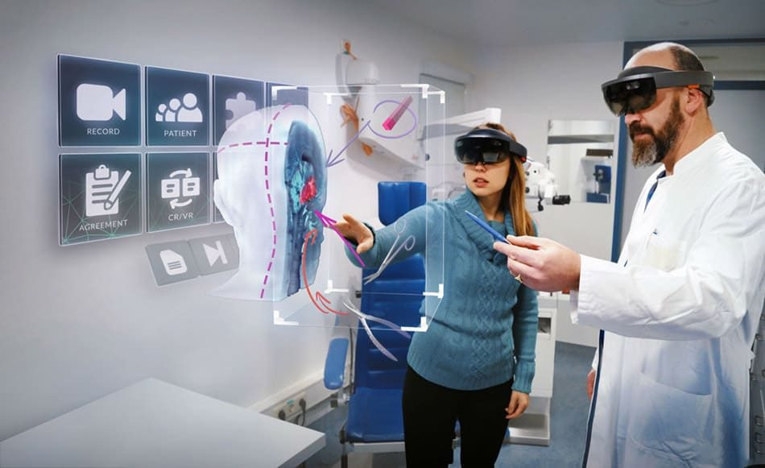{ width="440" }

#### Realitat mixta (RM)

La realitat mixta combina elements de la RV i de la RA i crea escenaris en què objectes virtuals i reals conviuen i poden interactuar en temps real. És una tecnologia més complexa, perquè necessita un **mapatge precís de l'entorn físic** perquè la integració sigui fluida.

Un exemple de RM seria un joc en què podeu manipular un objecte virtual col·locat en un espai real, o moure un moble virtual dins del vostre menjador per veure com quedaria abans de comprar-lo.

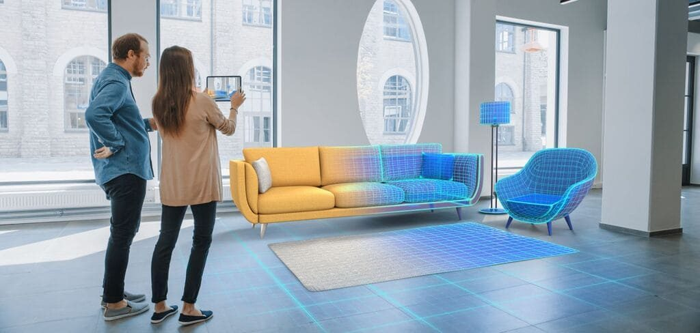{ width="440" }

La diferència clau entre aquestes tecnologies, per tant, és com i en quina mesura barregen el que és real i el que és virtual. La RV substitueix completament la vostra visió del món real, la RA la complementa i la RM va una passa més enllà i permet la interacció entre tots dos mons.

### 3.5.2. Recursos per al desenvolupament

Per desenvolupar aplicacions de realitat virtual, augmentada i mixta, és vital triar les eines adequades per aconseguir una bona experiència d'usuari. Aquestes tecnologies es basen en un conjunt divers de programari i maquinari que permet des de crear prototips senzills fins a desenvolupar aplicacions interactives complexes. Vegem algunes de les plataformes més utilitzades actualment.

#### Eines de desenvolupament de programari

- **Unity**: és un dels motors de joc més populars i versàtils per a la realitat virtual i augmentada. Ofereix un entorn de desenvolupament potent i compatible amb moltes plataformes, que us permet exportar els vostres projectes a gairebé qualsevol dispositiu. S'utilitza per crear experiències immersives en jocs com *Beat Saber* i també aplicacions educatives que simulen operacions quirúrgiques.

    { width="440" }

- **Unreal Engine**: conegut per la seva gran qualitat gràfica, és ideal per a projectes que requereixen molt de detall visual i efectes en temps real. És molt apreciat en el cinema i la televisió per crear efectes visuals. Les empreses d'arquitectura l'utilitzen per fer recorreguts virtuals per edificis que encara no s'han construït, perquè els clients puguin experimentar l'espai abans de fer-lo.

    { width="440" }

- **ARKit (Apple) i ARCore (Google)**: són *frameworks* pensats per desenvolupar aplicacions de realitat augmentada per a iOS i Android, respectivament. Tots dos ofereixen funcions avançades, com el seguiment del moviment, la comprensió de l'entorn o l'estimació de la llum. Aplicacions com *IKEA Place* els utilitzen perquè els usuaris vegin com quedarien els mobles a ca seva abans de comprar-los.

    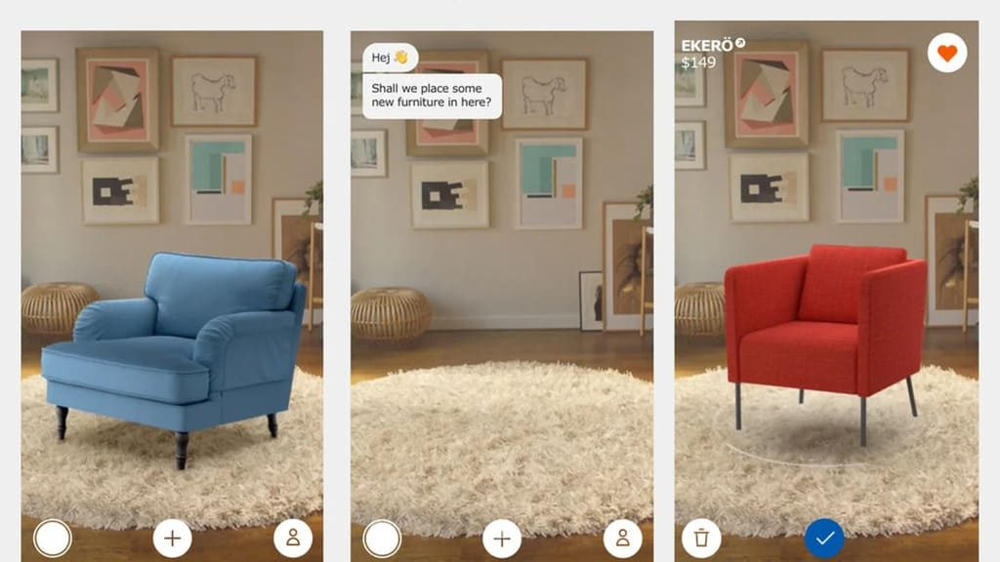{ width="440" }

#### Plataformes de maquinari

- **Meta Quest (abans Oculus)**: són dispositius de realitat virtual desenvolupats per Meta, l'empresa propietària de Facebook. Ofereixen una immersió total, amb seguiment de la posició i comandaments de moviment. S'utilitzen en la formació d'empreses per simular entorns de treball i millorar habilitats pràctiques sense els riscs d'un entrenament real.

    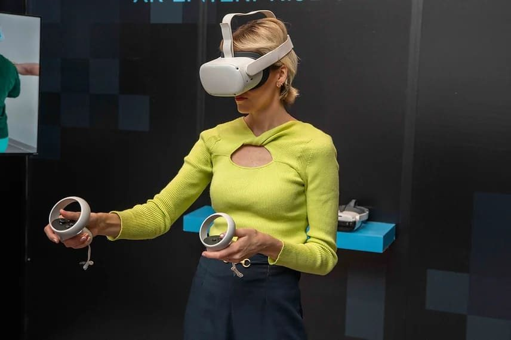{ width="400" }

- **HTC Vive**: semblant a les anteriors, però sovint preferit per la precisió en el seguiment de l'espai i la integració amb SteamVR. En medicina, permet als estudiants fer operacions virtuals per practicar procediments sense riscs per als pacients.

    { width="400" }

- **Microsoft HoloLens**: és un dispositiu de realitat mixta que superposa hologrames digitals al món real i permet interactuar amb tots dos. S'utilitza en entorns professionals, com la indústria, per mostrar instruccions de muntatge directament al camp de visió del treballador, cosa que millora la precisió i redueix el temps de formació.

    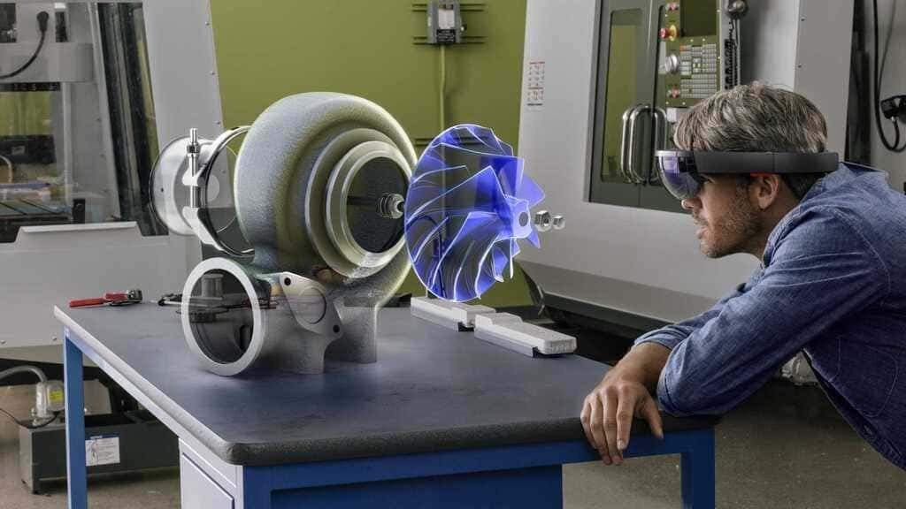{ width="400" }

Aquestes eines són fonamentals per desenvolupar aplicacions que no només entretenen, sinó que també resolen problemes reals en sectors com l'educació, la medicina, l'arquitectura i molts d'altres. Cadascuna té els seus punts forts i s'adapta millor a un tipus de projecte, de manera que la tria s'ha de fer segons les necessitats del desenvolupament i els objectius de l'usuari final.

---

!!! quote "Font"
    Unitat traduïda i adaptada de [«Tema 3. Edición y creación de contenido»](https://lopegonzalez.es/eso-y-bachillerato/digitalizacion-4o-eso/tema-3-edicion-y-creacion-de-contenido/), de Lope González Vázquez ([CC BY-NC-SA 4.0](https://creativecommons.org/licenses/by-nc-sa/4.0/deed.ca)). Canvis: traducció al català (també del codi d'exemple), adaptació al currículum de les Illes Balears, reorganització del format, animacions convertides a vídeo i actualització de la informació sobre Meta Quest. Les pràctiques guiades enllaçades i els vídeos són en castellà.
