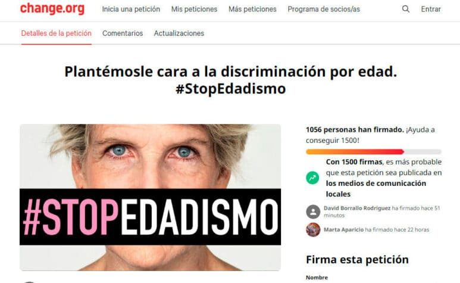
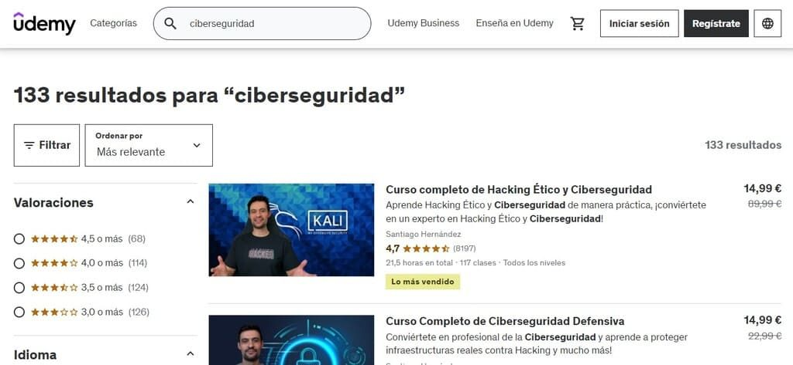
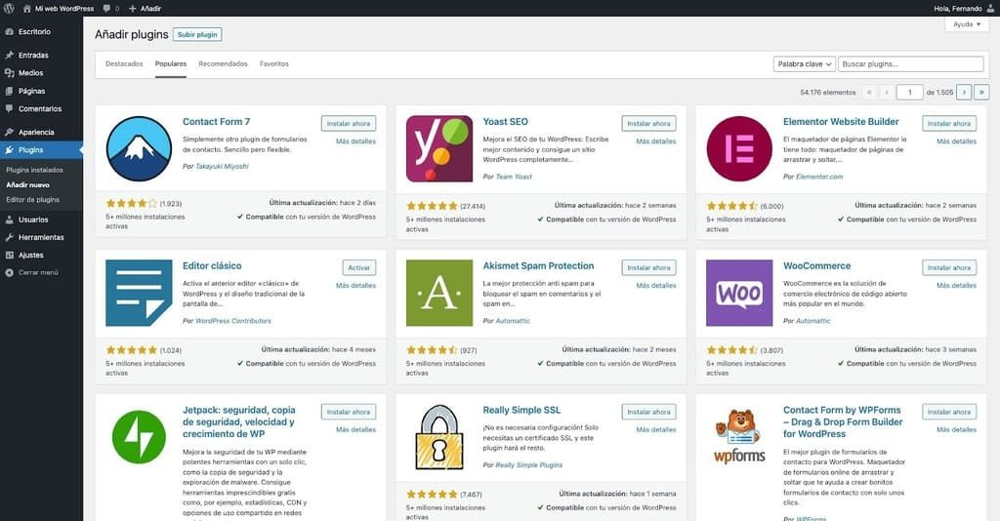
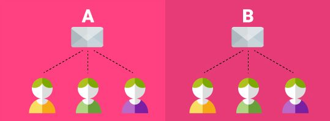
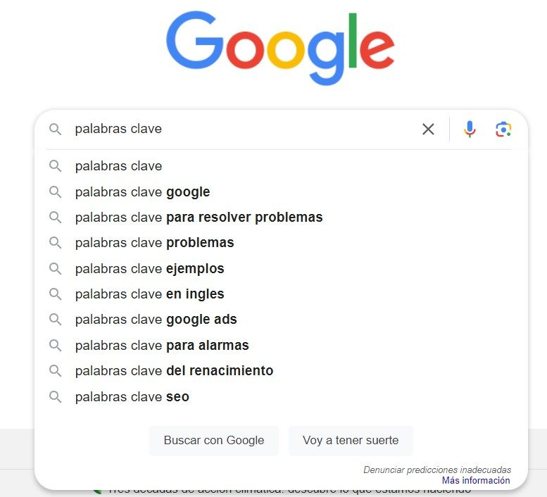
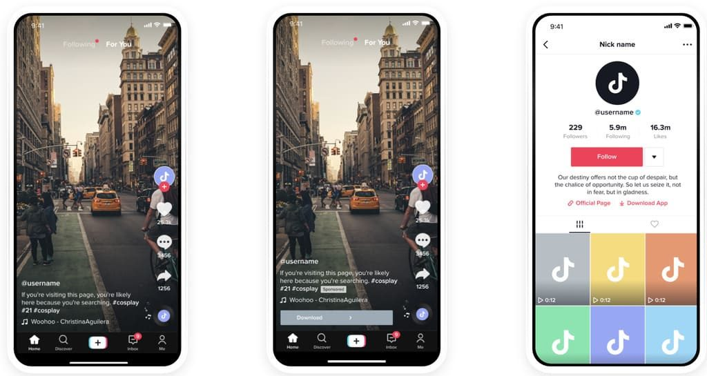

# Unitat 4. Publicació i difusió de continguts

Vivim en un món completament interconnectat. Per això, la **capacitat de comunicar-se eficaçment a través de xarxes digitals** és més que una habilitat: és una necessitat fonamental. La transformació digital ha canviat radicalment com ens relacionam, com treballam i com vivim. Cada dia, milions de persones es connecten en línia no només per socialitzar, sinó també per innovar, aprendre i col·laborar.

Aquest entorn digital ens ofereix **eines espectaculars que eliminen les barreres del temps i de la distància**. Les xarxes socials, els blogs i les aplicacions de missatgeria formen part del nostre dia a dia i permeten una comunicació global instantània. Ara bé, aquesta nova manera de connectar també planteja problemes importants, com la precisió de la informació que es comparteix, la protecció de la privacitat personal i la gestió de la diversitat d'opinions.

En aquest context, comprendre com ens comunicam en xarxa implica també entendre com podem utilitzar aquestes eines de manera responsable per millorar la nostra vida i la dels altres.

## 4.1. Comunicar en xarxa

En aquest apartat veurem com les xarxes han revolucionat la nostra manera de comunicar-nos, tant en l'àmbit personal com en el professional.

La comunicació en xarxa es basa en l'ús d'internet per connectar les persones i permetre'ls intercanviar informació de manera instantània i sense barreres geogràfiques.

Les xarxes socials, els blogs, les pàgines web i les aplicacions de missatgeria són només algunes de les eines que faciliten aquest tipus de comunicació. Vegem-ne algunes de les més habituals:

- **Xarxes socials**: llocs com Facebook, X o LinkedIn permeten no només la comunicació d'un a un, sinó també el diàleg obert i la creació de comunitats al voltant d'interessos comuns.
- **Sistemes de gestió de continguts**: plataformes com WordPress, Joomla o Drupal permeten crear i gestionar continguts (opinions, informacions, estudis, etc.) que arriben a un públic ampli.
- **Aplicacions de missatgeria**: eines com WhatsApp o Telegram faciliten la comunicació directa i en temps real entre les persones.

Comunicar de manera efectiva en xarxa requereix tenir en compte aspectes com la claredat del missatge, la rellevància del contingut per a l'audiència i el to adequat per al context. L'eficàcia de la comunicació en xarxa es pot mesurar pel grau d'interacció o de resposta que genera entre els usuaris.

<iframe src="https://www.youtube-nocookie.com/embed/3nQaCxJSzb0" title="Vídeo: comunicar en xarxa" loading="lazy" allowfullscreen></iframe>

Alguns exemples habituals de comunicació en xarxa:

- **Campanyes de màrqueting digital**: empreses que utilitzen les xarxes socials per llançar productes. La interacció directa amb els consumidors els permet adaptar ràpidament les estratègies a partir de les respostes que reben.

    { width="360" }

- **Moviments socials**: grups activistes que utilitzen plataformes com X o Change.org per mobilitzar la gent. Aprofiten l'abast global per conscienciar sobre causes concretes i aconseguir suports.

    { width="520" }

- **Educació en xarxa**: universitats i centres de formació que utilitzen plataformes d'aprenentatge en línia (*e-learning*) per oferir recursos educatius. Així, l'alumnat pot aprendre al seu ritme i des de qualsevol lloc del món.

    

La comunicació en xarxa té molts d'avantatges: la rapidesa en la transmissió de la informació, un cost baix en comparació amb els mitjans de comunicació tradicionals i la capacitat d'arribar a una audiència global. A més, permet una interacció més gran entre emissor i receptor, cosa que enriqueix l'experiència comunicativa.

Tanmateix, també s'enfronta a reptes complexos. Un dels principals és la gestió de la informació veraç i la prevenció de la difusió de notícies falses. A més, la saturació de continguts pot fer difícil que els missatges importants destaquin enmig de tanta informació.

<iframe src="https://www.youtube-nocookie.com/embed/yAaTngfIGiM" title="Vídeo: reptes de la comunicació en xarxa" loading="lazy" allowfullscreen></iframe>

## 4.2. Col·laborar en xarxa

Com vàrem veure a la unitat anterior, la col·laboració en xarxa s'ha convertit en una part fonamental de molts de processos professionals. Aquesta manera de treballar permet que les persones col·laborin a través de plataformes digitals per assolir objectius comuns, independentment d'on es trobin.

Això implica compartir recursos en temps real o de manera asíncrona. Per fer-ho, són molt útils les eines de gestió de projectes, les plataformes de comunicació i les aplicacions per compartir documents. Repassem algunes de les plataformes més populars:

- **Plataformes de gestió de projectes**: eines com Asana, Trello o Slack permeten organitzar tasques, assignar responsabilitats i fer un seguiment eficient del progrés de l'equip.

    

    <iframe src="https://www.youtube-nocookie.com/embed/09EohQe58wA" title="Vídeo: plataformes de gestió de projectes" loading="lazy" allowfullscreen></iframe>
    

- **Programari de videoconferència**: programes com Zoom, Microsoft Teams o Google Meet faciliten reunions virtuals, conferències i seminaris web, i fan possible la interacció cara a cara malgrat la distància.
- **Serveis d'emmagatzematge al núvol**: Google Drive, Dropbox o OneDrive ofereixen espais on es poden emmagatzemar, editar i compartir documents fàcilment entre els membres de l'equip.

Una col·laboració efectiva permet optimitzar recursos, reduir els temps de lliurament i millorar la qualitat dels resultats. A més, afavoreix un ambient de feina inclusiu i flexible, on les idees es poden compartir i millorar col·lectivament.

Entre els problemes que genera aquest tipus de comunicació hi ha la necessitat de gestionar-la bé per evitar malentesos i l'exigència d'una gran disciplina organitzativa per part de tots els membres de l'equip per complir els terminis i els objectius acordats.

!!! abstract "Idea clau"
    La col·laboració en xarxa és una estratègia de feina que, tot i les dificultats, ofereix moltes oportunitats per fer més eficients les tasques en què estam immersos.

## 4.3. Publicar continguts

Avui dia, publicar continguts és una pràctica fonamental per a moltíssimes persones, empreses i organitzacions de tota mena que volen compartir informació i coneixements o promocionar els seus serveis.

Amb eines com **WordPress**, aquesta tasca s'ha simplificat molt: qualsevol usuari pot crear i gestionar els seus propis continguts de manera efectiva i amb una aparença realment professional.

!!! info "Sabies que...?"
    Més del 40 % de tots els llocs web del món estan fets amb WordPress.

Publicar continguts implica crear i distribuir material informatiu o creatiu en format digital a través de plataformes en xarxa. Això inclou articles de text, gràfics, vídeos i pòdcasts accessibles a una audiència global a través d'internet.

Vegem les eines que tenim a l'abast per publicar continguts de manera fàcil i efectiva:

- **Sistemes de gestió de continguts (CMS)**: WordPress és el líder indiscutible d'aquest tipus de plataformes. Permet dissenyar, gestionar i optimitzar un lloc web propi sense necessitat de coneixements avançats de programació; o, més ben dit, sense haver d'escriure ni una sola línia de codi.
- **Editors multimèdia**: eines com Gutenberg (l'editor integrat de WordPress) ofereixen interfícies intuïtives per compondre i editar continguts de tot tipus.
- **Extensions (*plugins*)**: són petits programes que podem instal·lar al CMS per ampliar les funcions que incorpora per defecte. Per exemple, n'hi ha que ajuden a optimitzar el SEO, a gestionar les xarxes socials o a personalitzar el CMS fins al darrer detall.

Un cop tenim el sistema muntat, hem de ser molt curosos amb el que publicam. **Una publicació efectiva assegura que el missatge arribi clarament a l'audiència a qui s'adreça, i augmenta la implicació i la interacció dels lectors**. També és important consolidar l'autoritat de qui publica, perquè això genera credibilitat. Finalment, pots millorar la visibilitat del teu lloc web aplicant bones pràctiques de SEO.

!!! note "SEO (*Search Engine Optimization*)"
    Conjunt d'estratègies per millorar la visibilitat d'un lloc web i, per tant, la seva posició a les pàgines de resultats dels cercadors com Google. És clau perquè una posició millor pot atreure més visites al lloc web i, amb això, una audiència més gran.

Alguns exemples de publicació de continguts:

- **Blogs**: persones o professionals que comparteixen coneixements o experiències sobre temes concrets com la tecnologia, l'educació o la salut.
- **Webs corporatives**: empreses que publiquen estudis, notícies del sector i novetats dels seus productes per informar i atreure clients potencials.
- **Portafolis**: professionals autònoms (*freelancers*) que utilitzen un lloc web per mostrar la seva feina i facilitar el contacte directe amb possibles clients.

El principal avantatge de tenir un lloc web i publicar-hi contingut periòdicament és poder arribar a una audiència global amb un cost relativament baix. A més, permet actualitzar ràpidament els continguts en resposta als comentaris rebuts o als canvis de l'entorn.

En canvi, les dificultats inclouen mantenir la rellevància i la qualitat del contingut, protegir-ne l'autenticitat i adaptar-lo als diferents dispositius.

## 4.4. Difondre continguts

Després de publicar els nostres continguts en un CMS, el pas següent és aconseguir que arribin al màxim nombre de persones possible. Difondre el que hem creat no només n'amplia l'impacte, sinó que també ens connecta amb la nostra audiència de manera significativa.

**Què vol dir difondre continguts?** Vol dir utilitzar diverses estratègies i canals per promoure que la nostra informació es vegi: xarxes socials, correu electrònic, col·laboracions amb altres creadors, etc.

Vegem algunes estratègies habituals per a una difusió efectiva:

- **Aprofitar les xarxes socials**: cada plataforma té la seva audiència i el seu estil de comunicació. Per exemple:
    - Facebook és ideal per compartir contingut llarg i fomentar el debat.
    - X és perfecta per a missatges breus i ràpids: actualitzacions instantànies i participació en converses en temps real mitjançant etiquetes (*hashtags*).
    - Instagram se centra en allò visual i és adequada per compartir imatges impactants que capten l'atenció a l'instant.
    - YouTube i TikTok lideren el format vídeo: la primera per a vídeos més llargs i la segona per a continguts curts que es fan virals ràpidament.
    - LinkedIn és més adequada per a continguts professionals i articles d'opinió adreçats a professionals del sector.

- **Màrqueting per correu electrònic**: no es tracta només d'enviar correus, sinó de personalitzar el missatge per a diferents grups de subscriptors. Pot incloure:
    - Butlletins periòdics (*newsletters*) que mantenguin informats els seguidors dels continguts nous.
    - Campanyes específiques per promocionar esdeveniments, llançaments o ofertes especials.
    - Segmentació de l'audiència per adaptar els missatges als seus interessos i fer-los més eficaços.

    

- **Col·laboracions**: arribar a audiències noves a través de col·laboracions pot ser molt beneficiós.
    - Publicar com a autor convidat (*guest posting*) en blogs o plataformes d'altres que ja tenen la seva pròpia audiència.
    - Convidar persones expertes a participar a la nostra plataforma per atreure els seus seguidors.
    - Fer seminaris web i pòdcasts conjunts amb persones expertes o *influencers* per ampliar molt l'abast.

    

- **SEO i màrqueting de continguts**: optimitzar el contingut per als cercadors és clau perquè l'audiència el trobi fàcilment.
    - Utilitzar paraules clau rellevants pot millorar molt la visibilitat a les cerques.
    - Crear contingut original i útil pot fer que altres llocs hi enllacin, cosa excel·lent per al SEO.
    - Actualitzar continguts antics amb informació i paraules clau actuals pot tornar-los a fer rellevants i millorar-ne la posició.

    { width="420" }

- **Publicitat de pagament**: invertir en publicitat pot ser una manera ràpida d'augmentar la visibilitat.
    - Els anuncis a xarxes socials permeten triar amb precisió el públic segons l'edat, el lloc o els interessos.
    - Google Ads, Facebook Ads o TikTok Ads poden situar el contingut directament davant de persones que cerquen temes relacionats.

    

Cadascuna d'aquestes estratègies es pot adaptar i combinar segons els objectius de difusió i les característiques de l'audiència a la qual vols arribar. Experimentar amb enfocaments diferents i mesurar-ne els resultats t'ajudarà a descobrir quines tècniques funcionen millor per al teu contingut i el teu públic.

Sens dubte, la dificultat més gran de difondre continguts propis és destacar en un món digital ple d'informació. A més, cal assegurar-se que el contingut s'adapta bé a cada plataforma i en respecta les normes, sense perdre la nostra veu ni diluir el missatge.

## 4.5. Responsabilitat digital

Avui la informació es comparteix a una velocitat enorme, i no sempre els creadors actuen amb responsabilitat quan publiquen i difonen continguts. Aquest apartat tracta de la importància de ser conscients de l'impacte que poden tenir els nostres continguts.

Ser responsable implica entendre l'efecte que la informació publicada pot tenir en altres persones. Això inclou assegurar-ne la precisió, respectar els drets d'autor i tenir en compte les implicacions ètiques del que compartim.

Aquests són alguns principis de responsabilitat que has de tenir presents:

- **Verificació de la informació**: abans de publicar qualsevol contingut, cal comprovar-ne la precisió i la font per evitar difondre notícies falses o enganyoses.
- **Respecte a la privacitat i als drets d'autor**: no publicar informació personal sense consentiment i respectar la propietat intel·lectual, citant correctament les fonts i demanant permís quan calgui.
- **Consciència de les conseqüències**: pensar com pot afectar el contingut altres persones i evitar publicar material ofensiu, discriminatori o que inciti a l'odi.

Mantenir una actitud responsable et protegeix de possibles reclamacions judicials i, alhora, construeix una imatge de credibilitat al teu voltant. Les persones (i les organitzacions) conegudes per la seva integritat solen gaudir d'una fidelitat més gran per part dels seus seguidors.

El gran problema d'avui és la pressa. Tothom vol ser el primer a donar una notícia i que la resta de mitjans el citin, però això xoca amb la verificació de la informació, que requereix temps. Per això, el repte principal és equilibrar la rapidesa de publicació amb la precisió de les dades. En un món digital que valora la immediatesa, dedicar el temps necessari a verificar i revisar un contingut et pot fer perdre algunes oportunitats d'arribar a més públic, però és imprescindible per construir la teva credibilitat.

---

!!! quote "Font"
    Unitat traduïda i adaptada de [«Tema 4. Publicación y difusión de contenidos»](https://lopegonzalez.es/eso-y-bachillerato/digitalizacion-4o-eso/tema-4-publicacion-y-difusion-de-contenidos/), de Lope González Vázquez ([CC BY-NC-SA 4.0](https://creativecommons.org/licenses/by-nc-sa/4.0/deed.ca)). Canvis: traducció al català, adaptació al currículum de les Illes Balears i reorganització del format. Els vídeos són de YouTube i en castellà.
