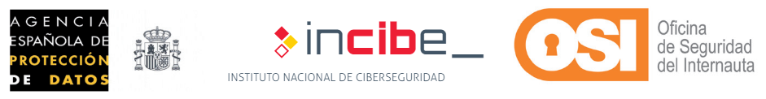
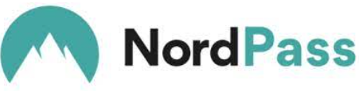
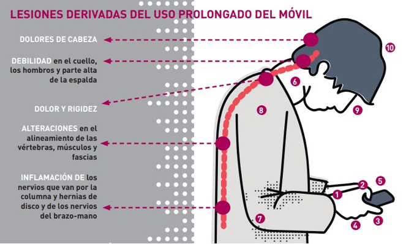

# Unitat 5. Seguretat i benestar digital

Estudiar la seguretat i el benestar digital és important perquè les nostres accions a la xarxa poden tenir conseqüències duradores, tant en l'àmbit personal com en el professional. Aprendre a distingir i aplicar mesures preventives ens ajuda a reduir riscs i a respondre millor davant possibles amenaces. De la mateixa manera, configurar correctament la privacitat a les xarxes socials i gestionar amb cura la nostra identitat digital són aspectes clau per mantenir una presència en línia saludable.

## 5.1. Seguretat dels dispositius

Quan volem dissenyar mesures per protegir els nostres dispositius, hem de saber distingir els dos tipus de mesures que podem prendre: **accions correctives** i **accions preventives**.

Les mesures correctives s'utilitzen per afrontar problemes immediats. Quan sorgeix un problema o un incident, cal actuar ràpidament per arribar a l'arrel del problema i aplicar una solució que l'elimini del tot. Aquestes accions correctives poden ser **reactives** (després que passi un incident) o **proactives** (quan s'aprofundeix en la causa de fons per evitar que el problema es repeteixi en el futur).

En canvi, les mesures preventives tenen com a objectiu identificar, anticipar i reduir problemes potencials abans que es produeixin. En lloc d'aplicar una solució després d'un incident, les accions preventives cerquen reduir les possibilitats que apareguin problemes o, si apareixen, disminuir-ne l'impacte. Són ideals per millorar la productivitat, ja que eviten que ens trobem amb problemes que podrien aturar la feina o tenir un cost molt alt per a una organització.

!!! abstract "Per recordar"
    - **Mesures correctives**: solucions a problemes que ja existeixen.
    - **Mesures preventives**: solucions a llarg termini per evitar problemes futurs.

Com que les situacions que requereixen mesures correctives solen ser molt més perjudicials per als nostres sistemes i no sempre tenen solució, ens centrarem en les preventives: són les que realment ens preparen per a imprevists i en les quals podem aplicar estratègies més eficaces.

### 5.1.1. Mesures preventives

Vegem ara com podem posar en marxa mesures d'aquest tipus.

#### Mantenir el dispositiu actualitzat

Un dispositiu actualitzat és menys vulnerable. Les actualitzacions de programari que publiquen els fabricants tenen com a objectiu, entre altres coses, millorar la seguretat del dispositiu. Per tant, mantenir-lo actualitzat ens garanteix una seguretat més eficaç.

:material-link: [Com mantenir actualitzats Windows, macOS, Android i iOS](https://www.incibe.es/ciudadania/blog/aprende-mantener-actualizados-tus-dispositivos-programas-y-aplicaciones) (INCIBE, en castellà)

#### Protecció davant d'accessos no desitjats

La primera barrera de seguretat per protegir la privacitat dels nostres dispositius mòbils són les contrasenyes i els patrons de desbloqueig.

És fonamental que les claus de desbloqueig i d'accés siguin robustes (difícils de desxifrar), no previsibles i secretes.

La [Guia de privacitat i seguretat a internet](https://www.aepd.es/documento/guia-privacidad-y-seguridad-en-internet.pdf) (en castellà), elaborada per l'Agència Espanyola de Protecció de Dades (AEPD), l'Institut Nacional de Ciberseguretat (INCIBE) i l'Oficina de Seguretat de l'Internauta (OSI), recull consells i recomanacions sobre contrasenyes, patrons i gestors de contrasenyes.

{ width="480" }

Aquestes són, al meu parer, les dues recomanacions més importants:

- **Control d'accés al dispositiu mòbil**: perquè la privacitat del dispositiu no quedi compromesa, és important que estigui bloquejat quan no s'utilitza i que es desbloquegi amb el control d'accés que hàgim establert: un codi, un patró de desbloqueig o un reconeixement biomètric, com l'empremta digital o el reconeixement facial. També és recomanable configurar el mòbil perquè es bloquegi automàticament després d'un temps d'inactivitat. D'aquesta manera es redueixen les amenaces a la nostra privacitat derivades de possibles descuits.
- **Control d'accés als recursos del dispositiu mòbil**: per protegir la privacitat, és interessant establir, sempre que es pugui, un codi d'accés a les aplicacions i als recursos del mòbil, com el correu electrònic, la galeria, etc.

:material-link: [Com posar una contrasenya a una aplicació a Android i iOS](https://www.lowi.es/blog/como-poner-contrasena-app-android-ios/) (en castellà)

!!! example "Exercici 5.1. Aplicació protegida amb contrasenya"
    Segueix els passos de l'enllaç anterior per posar una contrasenya a l'aplicació del teu mòbil que triïs. Després tanca totes les aplicacions i grava un vídeo (una captura de pantalla en vídeo) on es vegi que l'accés està protegit amb contrasenya.

#### Xifratge del contingut del dispositiu mòbil

El **xifratge** garanteix que només pugui accedir al contingut qui conegui la clau per desxifrar-lo. Xifrar el contingut afegeix una barrera més de seguretat a la nostra privacitat.

La majoria de versions dels sistemes operatius Android i iOS ofereixen l'opció de xifrar el contingut del mòbil, de manera que, per accedir a qualsevol informació, cal conèixer la clau que permet desxifrar-la i mostrar-la.

:material-link: [Com xifrar el contingut a Android i iOS](https://axcrypt.net/es/blog/how-to-encrypt-data-on-your-android-and-iOS-phones-in-2024/) (en castellà)

Aquest procés pot durar força temps, per la qual cosa es recomana tenir el dispositiu endollat al corrent. Un cop xifrat, només es podrà accedir als arxius introduint la contrasenya correcta. Si es vol eliminar el xifratge, s'haurà de restablir el dispositiu als valors de fàbrica.

#### Gestió de contrasenyes

Com que bona part de la seguretat depèn de l'accés controlat als dispositius mitjançant contrasenyes, és important que aquestes siguin segures i robustes: triades de manera que no siguin fàcils d'endevinar ni de desxifrar. I, sobretot, **no les has de revelar a ningú**. Pots ampliar la informació a la publicació «[Gestió de contrasenyes segures](https://www.incibe.es/ciudadania/tematicas/contrasenas-seguras)» de l'INCIBE (en castellà).

Ara bé, quan tenim moltes contrasenyes, pot ser complicat recordar-les totes. Per gestionar-les i no oblidar-les, sense caure en la temptació d'apuntar-les, d'usar claus fàcils de recordar o de repetir la mateixa contrasenya a tot arreu, hi ha eines que ens permeten guardar totes les claus de manera segura. Només hem de recordar una única contrasenya: la d'accés al gestor de contrasenyes.

{ width="360" }

[NordPass](https://nordpass.com/es/) és una de les millors eines d'aquest tipus.

!!! example "Exercici 5.2. Contrasenyes segures"
    Aquestes són deu de les contrasenyes més habituals. Indica en cada cas si la contrasenya és segura o no, i per què.

    - 123456
    - contrasenya
    - 123456789
    - qwerty
    - 111111
    - 123123
    - abc123
    - datanaixement
    - 12345678
    - admin

    Després, escriu deu contrasenyes que siguin **segures** i **fàcils de recordar**.

#### Detecció d'accessos o usos no controlats del dispositiu

Per detectar accessos o usos no controlats del dispositiu, es recomana revisar les aplicacions instal·lades al mòbil i comprovar que no n'hi hagi cap que no hàgim instal·lat nosaltres. A més, els mòbils solen oferir eines per consultar el consum de dades, la data i l'hora dels accessos i, fins i tot, quines aplicacions han consumit aquestes dades. També és important revisar la factura per comprovar que no hi hagi cap ús no controlat.

En cas de pèrdua del mòbil, hi ha **eines antirobatori** que permeten, per exemple, veure la darrera ubicació del dispositiu amb connexió, fer-lo sonar encara que estigui en silenci, bloquejar-lo a distància o esborrar-ne el contingut.

:material-link: [Les millors aplicacions antirobatori per a mòbils](https://www.cronista.com/espana/pc-movil/estas-son-las-tres-aplicaciones-gratuitas-antirrobo-para-usar-en-verano/) (en castellà)

### 5.1.2. Eines de protecció

Aquí tens una selecció d'eines gratuïtes recollides al web de l'[INCIBE](https://www.incibe.es/ciudadania/herramientas) que et poden ajudar a protegir els teus dispositius i a comprovar-ne la privacitat. És important tenir en compte que **les aplicacions s'han de descarregar sempre des de les botigues oficials** i s'han de mantenir actualitzades.

Aquestes són algunes de les millors opcions:

| Finalitat | Eina | Sistema |
| --- | --- | --- |
| Protecció davant d'accessos no desitjats | [Secure Gallery](https://www.osi.es/es/herramientas-gratuitas/secure-gallery) | Android |
| Gestió de contrasenyes | [LastPass](https://www.incibe.es/ciudadania/herramientas/lastpass) | Android, iOS |
| Detecció d'accessos o usos no controlats | Lock It Tight | Android, iOS |
| Antivirus | [Malwarebytes Mobile Security](https://www.incibe.es/ciudadania/herramientas/malwarebytes-antimalware) | Android, iOS |
| Anàlisi i neteja | Clean Master | Android |
| Xifratge per a ordinadors | [Windows](https://www.incibe.es/ciudadania/blog/cifrado-y-almacenamiento-seguro-de-ficheros-paso-paso), macOS | Ordinador |

## 5.2. Seguretat de les dades

La nostra presència a internet és tan important com la nostra vida fora de la xarxa. Per això hem de tractar aspectes fonamentals com la **identitat digital**, la **reputació en línia**, la **privacitat** i l'**empremta digital**.

A mesura que interactuam a la xarxa, cada clic, cada publicació i cada registre contribueixen a construir la nostra identitat virtual. És molt important gestionar-ho tot de manera segura i responsable. Aquí tens algunes pautes generals per aconseguir-ho.

### 5.2.1. Identitat digital

La **identitat digital** és la representació virtual de qui som al món digital. Inclou la informació que compartim a internet: el nostre nom, fotografies, perfils a xarxes socials, adreces de correu electrònic, etc. Algunes de les recomanacions més útils per gestionar-la són:

- **Autenticació segura**: utilitza contrasenyes fortes i activa l'autenticació en dos passos als teus comptes per protegir la teva identitat.
- **Control de la informació**: sigues selectiu a l'hora de compartir dades personals a les xarxes socials i a altres llocs web. No revelis detalls sensibles si no és necessari.
- **Seguiment**: cerca periòdicament el teu nom a internet per veure quina informació hi ha disponible públicament sobre tu.

### 5.2.2. Reputació digital

La **reputació digital** es construeix a partir de la informació que hi ha a internet sobre nosaltres. Algunes consideracions que has de tenir en compte:

- **Contingut positiu**: publica contingut positiu i rellevant a les teves xarxes socials. Això pot millorar la teva reputació.

    Per exemple, pots publicar [històries personals o d'altres persones que tenguin un impacte positiu](https://blog.hubspot.es/marketing/contenido-para-redes-sociales), reconèixer els [èxits o les aportacions d'altres persones](https://www.idealist.org/es/accion/5-formas-usar-redes-sociales-generar-impacto-positivo), compartir [consells, tutorials o dades interessants](https://mailchimp.com/es/resources/social-media-post-ideas/) sobre el teu àmbit de coneixement o, fins i tot, fomentar l'humor positiu per crear un ambient agradable a les teves xarxes.

- **Comentaris**: sigues conscient dels comentaris i de les ressenyes que deixes a internet, perquè poden afectar la teva imatge.

    Per exemple, hi ha «[granges de clics](https://www.bbc.com/mundo/noticias-43058719)» que creen comentaris falsos sobre aplicacions mòbils a les botigues de Google i Apple. Evita les [respostes emocionals o defensives](https://blog.hubspot.es/service/ejemplos-respuestas-resenas-negativas) davant de crítiques negatives i, per damunt de tot, [no et converteixis en un trol](https://xicra.es/blog/comentarios-negativos-en-redes-sociales-7-consejos-para-responder/).

- **Privacitat a les xarxes socials**: configura adequadament la privacitat dels teus perfils per controlar qui veu les teves publicacions.

!!! example "Exercici 5.3. Reputació digital"
    Entra a Amazon i cerca un producte que t'agradaria comprar, sigui quin sigui el preu. Després imagina que te l'han comprat, però quan arribes a casa obres el paquet, el proves i no és el que esperaves: no té la qualitat que volies, no funciona bé o la realitat és molt diferent del que mostraven les fotografies. Escriu una valoració negativa del producte **de manera que no afecti la teva reputació digital**. La valoració ha de tenir, com a mínim, 200 paraules.

    Pots fer l'exercici en un document de Google Docs: insereix-hi una captura de pantalla del producte que has triat i escriu-hi la teva valoració a sota.

### 5.2.3. Privacitat a les xarxes socials

Les xarxes socials són un terreny on la identitat i la reputació estan molt exposades. Aquí tens algunes mesures preventives per evitar-hi danys:

- **Configuració de privacitat**: ajusta la configuració de privacitat dels teus perfils. Limita qui pot veure les teves publicacions i fotografies.
- **Publicacions amb cura**: pensa-t'ho abans de publicar. No comparteixis informació personal sensible ni fotografies compromeses.
- **Contactes**: tria bé qui acceptes com a amic o contacte a les xarxes socials. No tothom ha de tenir accés a tota la teva vida a internet.

{ width="520" }

El documental *El estafador de Tinder* (Netflix) il·lustra molt bé aquest darrer punt.

## 5.3. Seguretat en la salut física i mental

Protegir la teva salut física i mental ha de ser una prioritat quan et relaciones amb altres persones a internet. Aquests són alguns riscs i amenaces que has de tenir en compte.

### 5.3.1. Salut física

Assegura't que els dispositius digitals estan col·locats de manera adequada per evitar problemes posturals que acabin provocant lesions. Per exemple, utilitza una cadira i una taula adequades per mantenir una bona postura mentre treballes amb l'ordinador.

Passar moltes hores davant de pantalles pot causar fatiga visual. Fer descansos regulars i ajustar la il·luminació de la pantalla hi pot ajudar.

{ width="560" }

*Font de la imatge: [Quiromasaje Jesús Fernández](https://jesusfernandezquiromasaje.es/).*

### 5.3.2. Salut mental

L'ús excessiu de dispositius digitals pot afectar negativament la salut mental. És important establir límits de temps i desconnectar de tant en tant.

Una de les amenaces més greus per a la salut mental és el **ciberassetjament**. És molt important que no toleris mai aquests comportaments. Si el pateixes o veus que algú el pateix, no ho dubtis ni un segon: demana ajuda immediatament al professorat i a la família.

Una altra amenaça que no deixa de créixer és la difusió d'imatges o vídeos íntims, que provoca problemes emocionals greus a les víctimes. Si pateixes aquest tipus de coaccions, ho has de comunicar com més aviat millor als adults més propers, perquè es tracta d'un delicte greu contra la privacitat i la integritat de les persones.

:material-link: [Conseqüències penals del *sexting* i la sextorsió](https://www.tepongounreto.org/2021/09/sexting-y-sextorsion-ambito-legal-y-consecuencias-penales/) (en castellà)

!!! tip "Si necessites ajuda"
    L'INCIBE té una [línia d'ajuda en ciberseguretat](https://www.incibe.es/linea-de-ayuda-en-ciberseguridad) gratuïta, el **017**, on pots consultar dubtes i problemes de seguretat a internet. Parla-ne també amb el teu tutor o tutora, amb l'orientador o orientadora del centre o amb la teva família.

A més, sovint trobam a internet material inadequat, ofensiu o fraudulent. Mirar cap a una altra banda no és una actitud responsable. A més de denunciar la publicació, és recomanable bloquejar aquestes fonts o filtrar els continguts que se't mostren per evitar-los en el futur.

Ja saps que les nostres accions a internet poden afectar directament la nostra reputació personal. N'has de ser molt conscient, perquè veure la pròpia imatge danyada té efectes seriosos sobre la salut mental. A més, el dany que ens feim amb un mal ús de la xarxa és com un gra d'arena que se suma a una muntanya que després és molt difícil d'enderrocar.

---

!!! quote "Font"
    Unitat traduïda i adaptada de [«Tema 5. Seguridad y bienestar digital»](https://lopegonzalez.es/eso-y-bachillerato/digitalizacion-4o-eso/tema-5-seguridad-y-bienestar-digital/), de Lope González Vázquez ([CC BY-NC-SA 4.0](https://creativecommons.org/licenses/by-nc-sa/4.0/deed.ca)). Canvis: traducció al català, adaptació al currículum de les Illes Balears, reorganització del format i afegit el requadre «Si necessites ajuda». Els enllaços externs són en castellà.
