# Unitat 6. Comerç electrònic

El **comerç electrònic** (en anglès, ***e-commerce***) és un fenomen global que ha canviat radicalment la manera com entenem el comerç i les relacions comercials en el món actual. Aquesta modalitat de negoci ha facilitat l'accés a una gran varietat de productes i serveis a escala mundial i, alhora, ha revolucionat les estratègies de les empreses, la logística i l'experiència dels consumidors. Amb un creixement ràpid i continu, el comerç electrònic ofereix oportunitats de negoci il·limitades.

{ width="480" }

En aquesta unitat aprofundirem en els diversos aspectes del comerç electrònic: des de la seva evolució històrica i la diversitat de models de negoci fins a les tecnologies que el fan possible i les dificultats a què s'enfronta. Analitzarem com s'adapten els diferents tipus de plataformes i negocis digitals a les necessitats canviants dels consumidors i com es gestionen aspectes clau com les transaccions econòmiques, la seguretat o la integració de tecnologies noves i molt disruptives, com les criptomonedes.

## 6.1. Introducció al comerç electrònic

El **comerç electrònic** és una de les revolucions més importants en la manera com es relacionen avui les empreses i els consumidors. Des d'uns inicis modestos fins a convertir-se en una força dominant del món empresarial, ha evolucionat per oferir una gran varietat de plataformes i oportunitats que superen les barreres tradicionals del comerç.

Per explorar aquest sector enorme, és important entendre com va sorgir el comerç electrònic, quins en són els fonaments i com continua transformant el panorama econòmic mundial.

### 6.1.1. Definició i context històric

El comerç electrònic és la compra i venda de béns i serveis a través d'internet. En lloc de fer les transaccions en botigues físiques, les persones poden accedir a plataformes digitals per adquirir productes, contractar serveis o fer operacions comercials.

El comerç electrònic té les arrels en dècades passades, i la seva evolució ha estat realment explosiva:

- **Anys seixanta**: els primers sistemes de transferència electrònica de fons (EFT) van permetre a les empreses fer transaccions financeres electròniques, tot i que es limitaven principalment a les entitats financeres.
- **Anys setanta**: van aparèixer les xarxes de comunicació electrònica, com el sistema EDI (intercanvi electrònic de dades), que permetia a les empreses intercanviar documents comercials electrònicament.
- **Anys vuitanta**: amb la popularització dels ordinadors personals es van posar les bases del comerç electrònic tal com el coneixem avui. Es van crear els primers sistemes de pagament en línia i les primeres botigues virtuals.
- **Anys noranta**: l'expansió d'internet i del World Wide Web va revolucionar el comerç. **Amazon** i **eBay** es van fundar en aquesta època i van marcar l'inici d'una nova era. Les empreses van començar a vendre productes i serveis per internet de manera massiva.

    { width="320" }

    *Jeff Bezos, fundador d'Amazon.*

- **Segle XXI**: el comerç electrònic s'ha diversificat moltíssim. Ara, a més de les botigues en línia, hi ha models com el *dropshipping*, l'afiliació, els *marketplaces* o els negocis de subscripció. Les criptomonedes també han influït en les transaccions digitals.

Avui el comerç electrònic és a tot arreu. Aquests són alguns dels gegants que dominen els principals sectors:

- **Amazon**: el gegant del comerç electrònic ofereix una gran varietat de productes i serveis.
- **Alibaba**: un *marketplace* global que connecta compradors i venedors de tot el món.
- **Uber Eats**: plataforma per demanar menjar a domicili.
- **Airbnb**: permet reservar allotjaments en línia.
- **Shopify**: eina líder per crear botigues en línia personalitzades en pocs minuts.

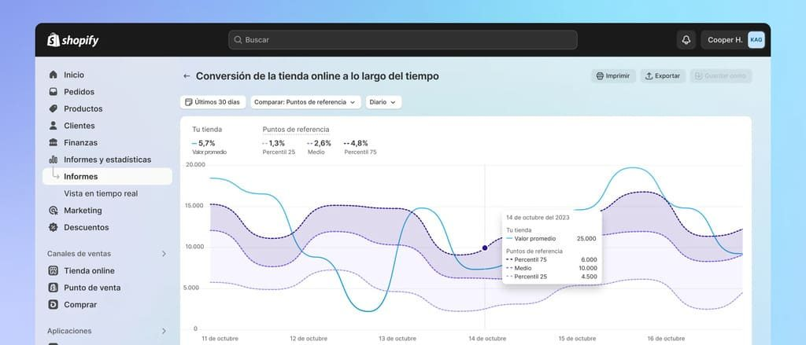{ width="520" }

*Exemple d'informe de vendes al tauler d'administració d'una botiga en línia feta amb Shopify.*

### 6.1.2. Avantatges i inconvenients del comerç electrònic

Com a usuari d'aquest tipus de comerç, segur que ja en coneixes alguns avantatges. Tot i així, repassem-ne els més importants perquè els tenguis de referència:

- **Accés global**: el comerç electrònic permet a les empreses arribar a clients de tot el món sense restriccions geogràfiques. Una botiga en línia està oberta les 24 hores del dia, els 7 dies de la setmana, en pilot automàtic i sense necessitat d'empleats. És difícil competir-hi.
- **Reducció de costos**: les botigues en línia no tenen les despeses dels locals físics, com el lloguer, el manteniment o el personal. A més, els processos automatitzats poden reduir els costos de funcionament. Les principals plataformes d'automatització són **IFTTT** i **Zapier**.

    

    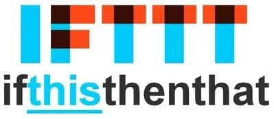{ width="260" }

    { width="260" }

    

- **Més competitivitat**: les empreses petites poden competir a internet amb els gegants del mercat. La qualitat del producte i l'experiència del client són factors clau per a l'èxit. T'has demanat mai com és possible que una empresa espanyola com PcComponentes sigui capaç de competir ni més ni menys que amb Amazon?

    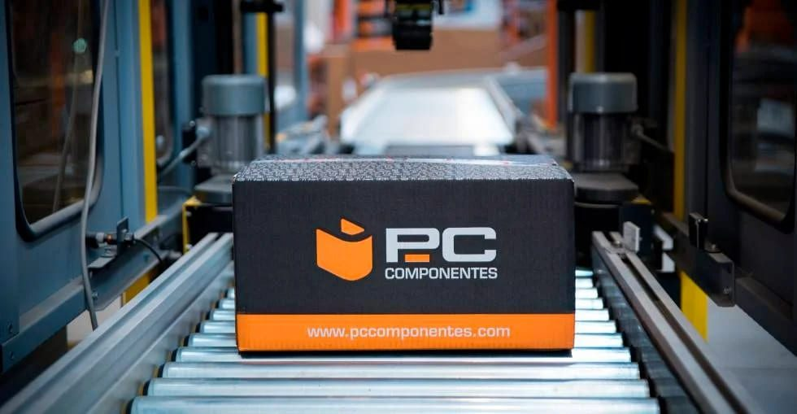{ width="400" }

- **Personalització**: les plataformes de comerç electrònic poden seguir el comportament del client i oferir-li recomanacions personalitzades. Això millora l'experiència de compra.
- **Facilitat per comparar**: els consumidors poden comparar preus, característiques i opinions dels productes abans de decidir la compra.

    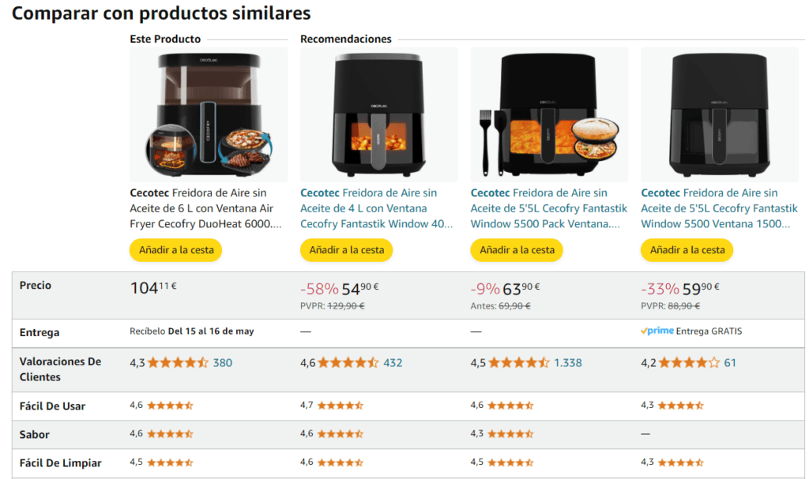{ width="520" }

    *Comparativa de fregidores d'aire a Amazon.*

Tot això és molt positiu tant per a les empreses com per als clients, però no sempre som conscients de les vulnerabilitats que ens amenacen quan utilitzam aquestes plataformes sense cura. Vegem-ne els principals inconvenients:

- **Seguretat i privacitat**: les transaccions digitals poden ser vulnerables a ciberatacs i al robatori de dades. Protegir la informació personal és fonamental. **No oblidis mai que tot el que està connectat a internet pot ser atacat, sigui el que sigui**.
- **Dependència de la connectivitat**: el comerç electrònic necessita accés a internet. Els talls de connexió poden afectar les vendes i la satisfacció del client.

    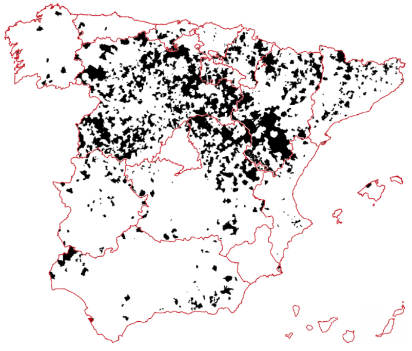{ width="400" }

    *La «Espanya sense cobertura» el 2017, segons [El Mundo](https://www.elmundo.es/sociedad/2017/04/24/58fa3de946163f36758b4639.html).*

- **Manca d'experiència tàctil**: els clients no poden tocar ni provar els productes abans de comprar-los. Això pot ser un obstacle per a alguns tipus de producte. Per això tenen tant d'èxit models de negoci com el de **Shein**, en què pots tornar qualsevol producte sense cost. Això sí, no tots els tipus de productes poden seguir aquest model.
- **Retards en el lliurament**: encara que els enviaments són cada vegada més ràpids, alguns clients poden patir retards per dificultats socials, polítiques o geogràfiques molt diverses. Un exemple de les febleses del comerç electrònic global és el de 2021, quan el vaixell *Ever Given*, de la companyia Evergreen, va encallar i va bloquejar el canal de Suez durant una setmana, cosa que va ser catastròfica per a una part important del comerç mundial:

    

    <iframe src="https://www.youtube-nocookie.com/embed/CEttsMPwBgw" title="El bloqueig del canal de Suez per l'Ever Given" loading="lazy" allowfullscreen></iframe>
    

- **Saturació del mercat**: la competència a internet és ferotge. Les empreses s'han de diferenciar per destacar entre la multitud. Quina seria la teva estratègia comercial si fossis el propietari d'una botiga en línia i arribàs el *Black Friday*?

Si tens al cap una idea de negoci digital, no oblidis tenir en compte tots aquests aspectes i estudiar bé com funciona per aprofitar-ne els avantatges i reduir-ne els inconvenients. Revisar-los amb detall pot fer-te canviar la perspectiva segons el context en què et moguis.

### 6.1.3. Tendències actuals

Molts dels negocis digitals que trobaràs explicats en cursos de YouTube o en plataformes de *coaching* digital ja estan desfasats, i és probable que arribis tard per treure'n profit. Per això és important que coneguis els sectors que creixen més actualment.

#### Personalització i experiència del client

Les plataformes de comerç electrònic utilitzen algorismes per oferir recomanacions basades en l'historial de compres i el comportament de l'usuari. Per exemple, Amazon suggereix productes relacionats amb les cerques anteriors, i Netflix utilitza algorismes per recomanar pel·lícules i sèries segons els gusts de cada usuari.

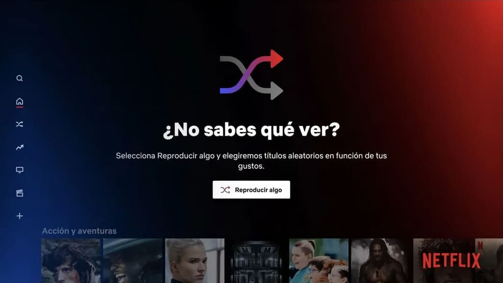{ width="480" }

Si no tens un sistema automatitzat que ofereixi a cada usuari el que és més probable que consumeixi, seràs menys interessant que la competència.

#### Bots de conversa i assistents virtuals

Les empreses fan servir bots de conversa (*chatbots*) per interactuar amb els clients en temps real. Aquests assistents automàtics poden respondre preguntes, ajudar a cercar productes i processar comandes.

Hi ha eines molt populars que no paren de créixer perquè pots descriure-hi amb text què vols i el seu assistent, potenciat amb intel·ligència artificial, et proposa una solució personalitzada sense que hagis de perdre molt de temps cercant-la tu mateix. És un avantatge competitiu clar que, a més, estalvia costos a les empreses.

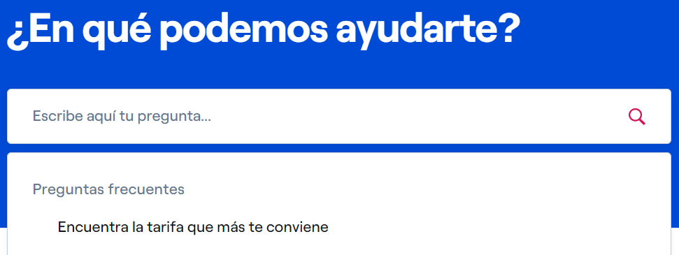{ width="440" }

*Atenció al client al web d'Endesa.*

#### Comerç social

Plataformes com Instagram, Facebook o TikTok permeten comprar productes directament des de les publicacions i els anuncis. Els enllaços de compra porten a les botigues en línia corresponents. És a dir, aprofiten el seu ús massiu per ajudar a vendre i la plataforma es queda una comissió. A més, sovint ja no són les empreses les que venen els seus productes, sinó les persones amb més influència de cada plataforma, els ***influencers***, que promocionen productes als seus perfils i cobren comissions per les vendes que generen. Això ha impulsat el creixement del màrqueting d'afiliació (veurem aquest model de negoci més endavant).

{ width="440" }

A més, encara que no t'ho creguis, es ven qualsevol cosa. Moltes vegades no importa tant què vens, sinó com ho fas. Per exemple, segur que penses que vendre botelles d'aigua no és gaire rendible, però tot depèn de com ho facis: què faries per vendre botelles d'aigua?

#### Omnicanalitat

Els venedors cerquen una experiència fluida per als clients, sigui quin sigui el canal que facin servir (web, aplicació mòbil o botiga física). Per exemple, comprar per internet i recollir-ho a la botiga física, com fa Starbucks.

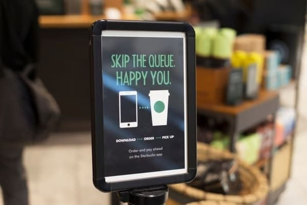{ width="360" }

A més, els clients esperen que el seu historial de compres, les preferències i les dades de pagament estiguin disponibles en tots els canals, com passa amb les aplicacions de Carrefour o Lidl, que a més fan descomptes o avisen quan baixa de preu algun dels productes que compres habitualment.

#### Sostenibilitat

Cada vegada més consumidors valoren les pràctiques sostenibles. Les empreses adopten embalatges ecològics i opcions d'enviament més respectuoses amb el medi ambient. Fins i tot hi ha un mercat ampli de clients que cerquen marques socialment responsables i transparents, amb polítiques salarials ètiques i una remuneració justa als productors, com la marca de roba Patagonia.

{ width="440" }

!!! example "Exercici 6.1. *Product placement*"
    De vegades, la promoció d'un producte ni tan sols necessita que l'*influencer* de moda te'l recomani perquè el compris: te'l fiquen al cap gairebé sense que te n'adonis.

    Investiga què és el ***product placement*** i cerca'n cinc exemples.

## 6.2. Tipus de negocis digitals

El comerç electrònic ha anat més enllà de les simples transaccions digitals i inclou una **gran varietat de formats** que aprofiten la tecnologia per connectar venedors i compradors de manera eficient en un espai sense fronteres.

En aquest context, és fonamental entendre els diversos **models de negoci digital**, perquè conèixer-los és clau per decidir amb informació on hi ha les millors oportunitats.

La diversitat de negocis digitals no només reflecteix les moltes oportunitats de mercat, sinó també les necessitats i els comportaments tan variats dels consumidors actuals. Estudiant-los, veurem com cada tipus de negoci aprofita la tecnologia per crear valor i com s'integra en l'ecosistema més ampli del comerç electrònic.

### 6.2.1. Botigues en línia (*e-commerce*)

Les **botigues en línia** són plataformes digitals on les empreses venen productes o serveis directament… als consumidors? No necessàriament: hi ha molts de tipus de botigues en línia que potser no coneixes. Vegem els tres models comercials principals:

- **B2C (*Business to Consumer*)**: empreses que venen directament als consumidors finals. Exemples coneguts són Amazon, Zara o Zalando.
- **B2B (*Business to Business*)**: transaccions entre empreses. Per exemple, una empresa que ven programari a una altra empresa, com Microsoft.
- **C2C (*Consumer to Consumer*)**: plataformes on els consumidors venen productes entre ells. Exemples populars són Segunda Mano, Wallapop o Vinted.

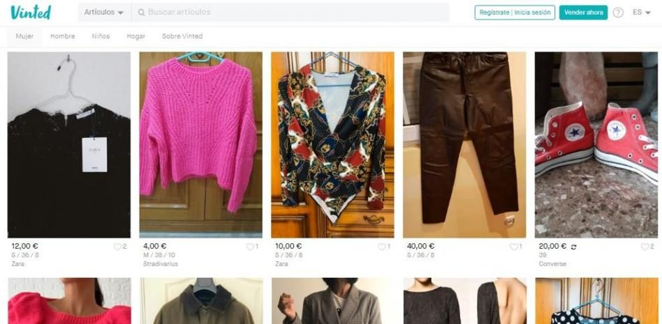{ width="440" }

Cadascun d'aquests models ha transformat la manera com compram i venem, i el seu impacte continua creixent. És a dir, quan comences en el món dels negocis digitals, no has de pensar necessàriament en el consumidor final: potser el producte o servei que vols vendre és més interessant en un altre model comercial.

### 6.2.2. *Dropshipping*

El ***dropshipping*** és un model de negoci digital en què el venedor no té els productes físicament, sinó que els compra a un proveïdor o majorista que els envia directament al client final.

Funciona així: el venedor crea la seva botiga en línia i hi publica els productes que vol vendre (el client no ho sap, però **el venedor NO TÉ aquests productes**). Quan un client fa una compra, el venedor compra el producte al proveïdor o majorista, que és qui l'empaqueta i l'envia directament al client.

El venedor guanya el marge que aplica sobre el preu del proveïdor i s'ha d'encarregar del màrqueting del producte (el cost d'aconseguir clients) i de tancar la venda.

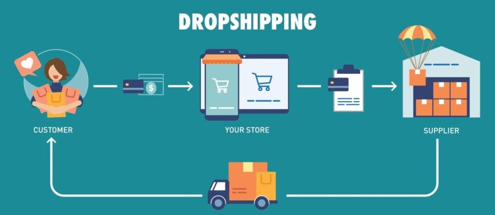{ width="560" }

Pot semblar un negoci molt interessant:

- No cal invertir grans quantitats en un inventari de productes. Només es compra un producte quan ja s'ha venut i el client l'ha pagat.
- Com que no es manipulen els productes físicament, no cal gestionar l'emmagatzematge, els enviaments ni les devolucions.
- No hi ha costos fixos associats a l'inventari.

Però també té inconvenients seriosos, de vegades massa costosos:

- En un sector tan competitiu com el digital, aconseguir un client pot sortir molt car: publicitat, un web atractiu i seriós, xarxes socials actives, etc.
- Com que no controles l'empaquetatge ni l'enviament, la presentació del producte en pot sortir perjudicada i danyar la imatge de marca.
- Les devolucions són un autèntic maldecap i és el venedor qui n'assumeix tots els costos.
- Depens de l'estoc d'un altre, de manera que l'automatització és complexa i no sempre saps quantes unitats hi ha disponibles.
- Els temps de lliurament són més llargs que quan gestiones el teu propi inventari, i això també et fa perdre competitivitat.

El *dropshipping* és una opció atractiva per a emprenedors que volen començar un negoci digital sense grans inversions inicials, però **cal anar amb molt de compte amb els productes i els proveïdors que es trien** perquè els inconvenients siguin mínims i el negoci continuï essent rendible.

### 6.2.3. Afiliació

El **màrqueting d'afiliació** és un model de negoci digital en què un afiliat promociona els productes o serveis d'una empresa als llocs que gestiona (el seu web, blog, xarxes socials, etc.). A canvi, l'afiliat rep una comissió per cada venda, clic, descàrrega o acció que faci el visitant com a resultat de la promoció.

Per concretar una mica més:

- L'empresa ofereix un producte o servei concret i vol augmentar-ne les vendes i la visibilitat.
- L'empresa s'associa amb un afiliat (tu), que promocionarà el producte o servei.
- L'afiliat utilitza estratègies de màrqueting de continguts, com webs, blogs, butlletins o xarxes socials, per generar vendes. Cada promoció es fa amb enllaços de seguiment especials.
- Quan es tanca una venda al web de l'empresa, s'analitza l'enllaç d'on ve el client i la venda s'assigna a l'afiliat. A final de mes, l'empresa paga a l'afiliat totes les comissions que ha generat.

Aquest model permet a les empreses externalitzar el màrqueting i als afiliats cobrar comissions per la seva feina. Encara que al principi els afiliats podien obtenir grans beneficis, actualment gairebé tots els programes d'afiliació estan molt mal remunerats i hi ha molt poques ocasions en què l'esforç de captar clients surti a compte.

La clau de la rendibilitat d'aquest model és ser capaç de generar molt de trànsit web i estar associat a moltes plataformes. **Si no aconsegueixes atreure una quantitat important de visites, l'esforç no pagarà la pena**.

#### Exemple: Amazon

El programa d'afiliats d'Amazon s'anomena [Amazon Associates](https://affiliate-program.amazon.com/).

Quan t'hi dones d'alta, pots triar un **identificador d'afiliat**. A partir d'aquell moment, cada vegada que entres a Amazon et surt una barra nova a la part superior del web:

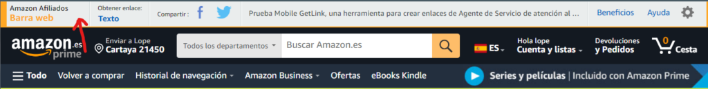

Quan vols promocionar un article, vas a la seva pàgina, per exemple aquesta:

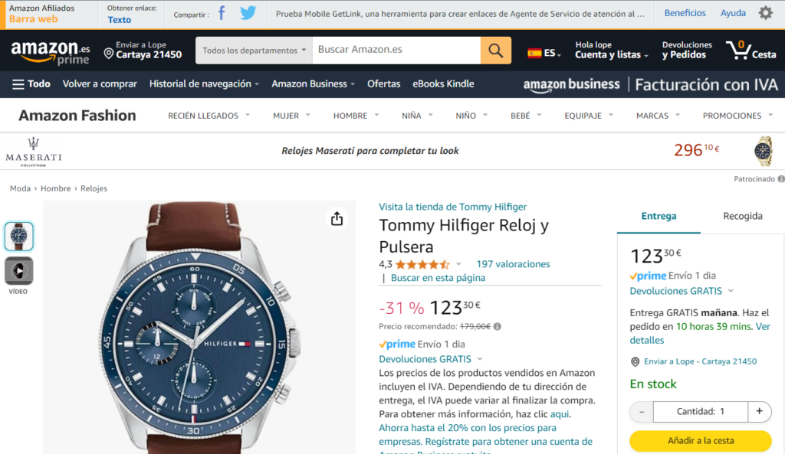{ width="560" }

I prems el botó superior ***Obtenir enllaç: Text***.

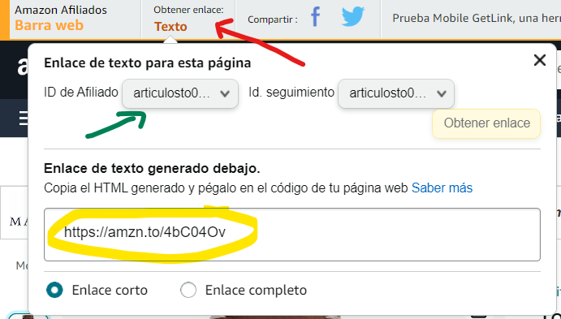{ width="440" }

En aquesta finestra pots triar amb quin identificador d'afiliat vols promocionar el producte (en pots tenir diversos). Amazon et genera automàticament un enllaç, que poses al teu web.

Si una persona visita el teu web i clica aquest enllaç, es guarda una galeta (*cookie*) al seu navegador. A partir d'aquell moment i durant 24 hores, totes les compres que faci aquesta persona a Amazon et donaran una comissió que depèn del tipus de producte. Cada família de productes té un percentatge de comissió diferent (varia de l'1 al 20 %). :material-link: [Taula de comissions](https://afiliados.amazon.es/help/node/topic/GRXPHT8U84RAYDXZ)

A final de mes, Amazon et farà una transferència amb totes les comissions que hagis generat.

A més, en qualsevol moment pots entrar al teu tauler d'afiliat per veure quantes persones han clicat l'enllaç, quantes han comprat i, fins i tot, quins articles han comprat, per saber la comissió que ha generat cada venda:

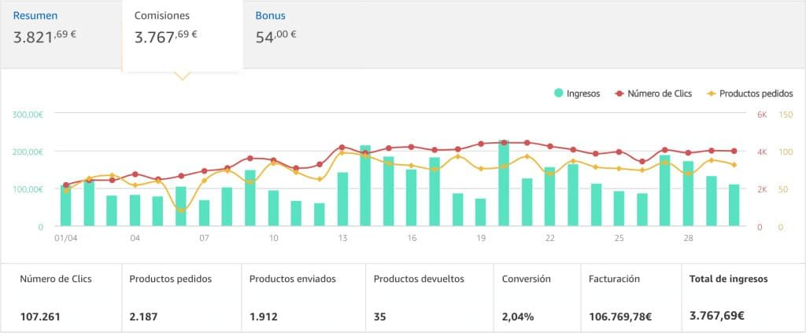{ width="560" }

Aquesta és la típica gràfica que s'ensenya als incauts perquè flipin amb els ingressos d'un mes i es llancin de cap a aquest negoci.

**Però deixa'm dir-te un parell de coses.**

Com pots veure en aquesta gràfica, els beneficis de l'afiliat són al voltant del 3,5 % de l'import de totes les vendes (ven per valor de 106.000 €, però només n'ingressa 3.000). La taxa de conversió és del 2 %: s'han d'aconseguir 100 clics a l'enllaç perquè n'acabin comprant 2 (de vegades serà un producte de 100 €, però moltes altres serà de 5 €). A més, no tothom que visita el teu web clica l'enllaç: només ho fa, aproximadament, un 3 %. Això vol dir que necessites generar molts de milers de visites al teu web per tancar aquest volum de vendes.

Un cop més: **només si ets capaç de generar aquest volum de trànsit, l'afiliació serà rendible**. I, encara que ho fos, només seria un petit complement, perquè hi ha altres models molt més rendibles.

Tot i així, si t'interessa estudiar-ne els números: :material-link: [Els 25 millors programes de màrqueting d'afiliació](https://www.hostinger.es/tutoriales/mejores-programas-de-afiliados) (en castellà).

### 6.2.4. *Marketplaces*

Els ***marketplaces*** són plataformes digitals que reuneixen molts de venedors i compradors en un sol lloc. En lloc de funcionar com una botiga en línia que ven els productes d'una sola empresa, permeten que empreses i particulars diversos ofereixin els seus productes o serveis a un públic global. Aquest model ha revolucionat el comerç electrònic perquè ofereix una infraestructura completa per a les transaccions entre tercers.

L'exemple actual més popular és **Amazon FBA** (*Fulfillment by Amazon*):

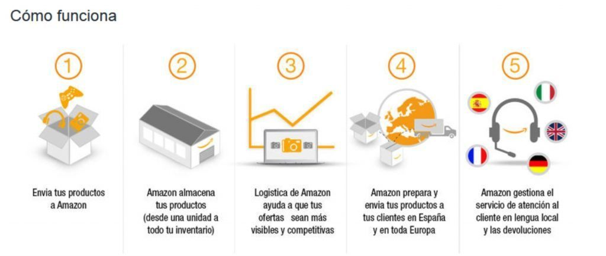{ width="560" }

Aquest model té algunes característiques que has de valorar per decidir si t'interessa.

És cert que et dona accés a un públic global amb una quantitat enorme d'usuaris, però també és cert que la competència és molt intensa i que la visibilitat dels teus productes depèn molt del preu, de manera que et veuràs obligat a reduir el marge de beneficis.

Molts de *marketplaces* ofereixen serveis addicionals de gestió de l'inventari, processament de pagaments i logística, però la majoria fan augmentar la comissió que el *marketplace* es queda de cada venda.

Un altre avantatge és que et beneficies de la confiança i la seguretat que ofereixen, però perds identitat de marca: quan tot va bé, l'usuari recorda el *marketplace*, no la marca que li va vendre el producte.

Aquests són quinze dels *marketplaces* més populars del món: Amazon, eBay, Alibaba, Etsy, Wallapop, Rakuten, Mercado Libre, JD.com, Zalando, Flipkart, Newegg, Taobao, Poshmark, Wayfair i Tmall.

### 6.2.5. Negocis de subscripció

Els **negocis de subscripció** ofereixen productes o serveis periòdicament a canvi d'una quota recurrent. Així generen ingressos constants i fomenten la fidelitat dels clients.

Pel que fa als avantatges, proporcionen ingressos recurrents i previsibles, cosa que permet a les empreses planificar-se amb estabilitat. A més, fomenten la fidelitat dels clients, que valoren la continuïtat del servei i les ofertes personalitzades segons les seves preferències.

{ width="440" }

*És el model econòmic de gairebé tots els diaris digitals.*

Ara bé, també tenen problemes: aconseguir subscriptors nous pot ser car per l'alta competència i la necessitat de demostrar constantment que el servei val la pena. Les empreses han d'invertir en màrqueting i gestionar les baixes, perquè mantenir la satisfacció dels clients és fonamental. A més, per ser rendibles, necessiten un volum important de subscriptors, i això pot ser un repte per als negocis nous.

Cada dia estàs en contacte amb aquest model quan consumeixes continguts d'Amazon Prime, Netflix o HBO, però hi ha models de subscripció molt interessants i amb molt d'èxit que no tothom coneix:

- **Birchbox**: subscripció mensual que envia capses personalitzades amb mostres de productes de bellesa.
- **Dietbon**: servei que ofereix plans de menjars saludables i personalitzats amb entrega a domicili.
- **Degusta Box**: subscripció mensual que envia a casa una selecció de productes alimentaris nous i exclusius.
- **Butlletins de pagament**: plataformes com Substack gestionen butlletins de pagament que ofereixen periòdicament informació de molt de valor i que molta gent fa servir actualment.
- **Cursos en línia**: algunes de les plataformes de formació més utilitzades, com Coursera o Udemy, permeten pagar una quota mensual i accedir a tots els cursos sense pagar-los un per un.
- **Videojocs**: plataformes com Xbox Game Pass o PlayStation Plus donen accés a una gran biblioteca de jocs, ofereixen descomptes i permeten jugar a títols nous cada mes.

La llista és il·limitada, perquè és un model molt rendible; però també és difícil de mantenir perquè hi ha molta rotació d'usuaris, és a dir, l'esforç per captar-ne és constant.

### 6.2.6. Trànsit web

El **trànsit web** és el flux de visitants que arriben a un lloc web. Per a qualsevol negoci digital, generar trànsit és probablement la tasca més important, perquè més visitants vol dir més oportunitats de venda i, al final, més ingressos. Però també és la més difícil d'aconseguir.

Un negoci amb molt de trànsit web ho ha de fer molt malament per no ingressar quantitats importants de doblers amb les vendes.

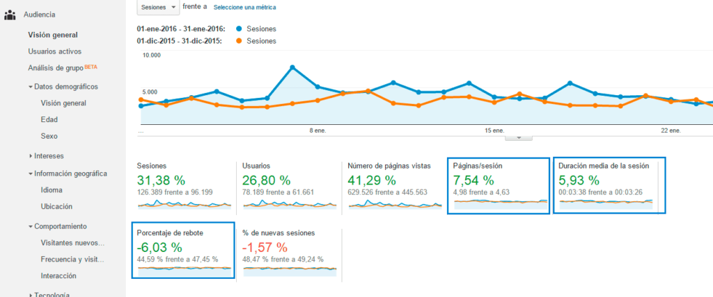{ width="560" }

*Diferents mètriques que analitzen el trànsit d'un web.*

Hi ha diverses estratègies per generar trànsit. No són excloents; de fet, el més intel·ligent és combinar-les perquè el conjunt aconsegueixi el màxim nombre de visitants. Vegem-ne les més habituals.

#### Optimització per a cercadors (SEO)

El SEO consisteix a millorar el contingut i l'estructura del web perquè sigui més visible als resultats de Google. Per exemple, una botiga de roba en línia pot optimitzar les descripcions dels productes i crear articles de blog sobre moda per atreure visitants interessats en tendències i estils.

<iframe src="https://www.youtube-nocookie.com/embed/_hNCh4oF4IE" title="Vídeo sobre el SEO" loading="lazy" allowfullscreen></iframe>

#### Publicitat de pagament per clic (PPC)

Els anuncis de pagament per clic, com els de **Google Ads**, permeten als negocis pagar perquè els seus anuncis apareguin als resultats de cerca o en webs relacionats. Cada vegada que un usuari clica l'anunci, el negoci paga una quantitat. Aquesta estratègia pot generar trànsit ràpidament i és molt efectiva per promocionar ofertes o llançaments de productes.

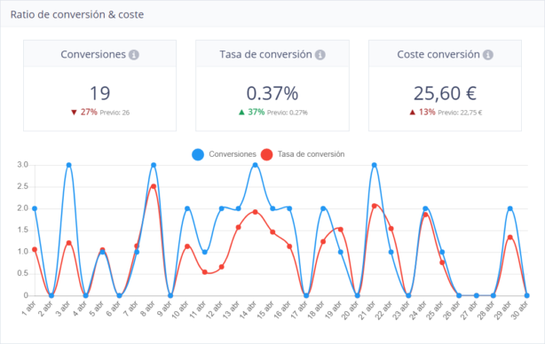{ width="520" }

#### Màrqueting a les xarxes socials

Les xarxes socials com Facebook, Instagram o TikTok són eines molt potents per atreure trànsit web. Les empreses hi poden publicar contingut atractiu, interactuar amb el seu públic i fer anuncis de pagament per dirigir visites al seu web.

{ width="440" }

Per exemple, una empresa de cosmètica pot utilitzar Instagram per mostrar tutorials de maquillatge i promocionar productes amb enllaços directes a la seva botiga en línia.

#### Màrqueting per correu electrònic

Enviar correus personalitzats i segmentats a una llista de subscriptors pot ser una manera molt efectiva d'atreure trànsit web. Les ofertes especials, els llançaments de productes nous i els butlletins informatius poden animar els destinataris a visitar el web.

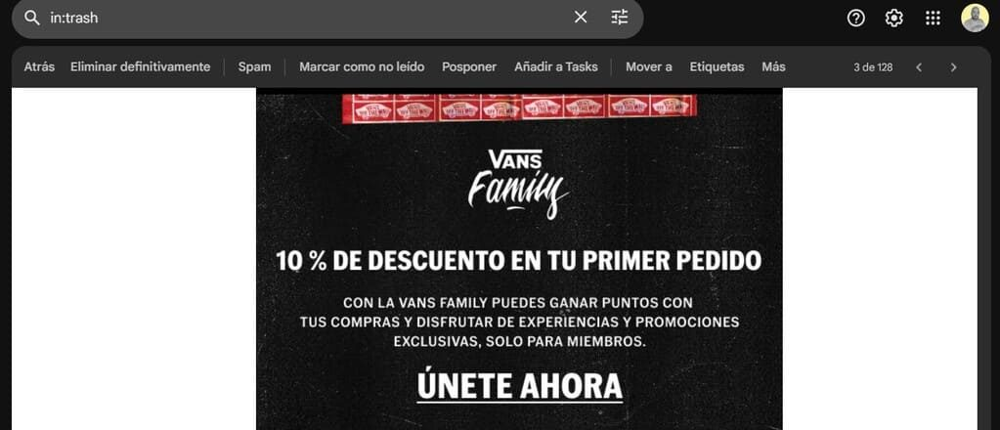{ width="440" }

*Correu de màrqueting de Vans.*

Per exemple, una llibreria en línia pot enviar correus amb recomanacions de llibres basades en les compres anteriors dels seus clients.

#### Màrqueting de continguts

Crear i compartir contingut valuós atreu un públic ben definit. Els blogs, els vídeos, les infografies o els seminaris web són exemples de contingut que pot generar trànsit. Una botiga de productes ecològics podria crear articles sobre sostenibilitat i salut ambiental per atreure persones interessades en aquests temes.

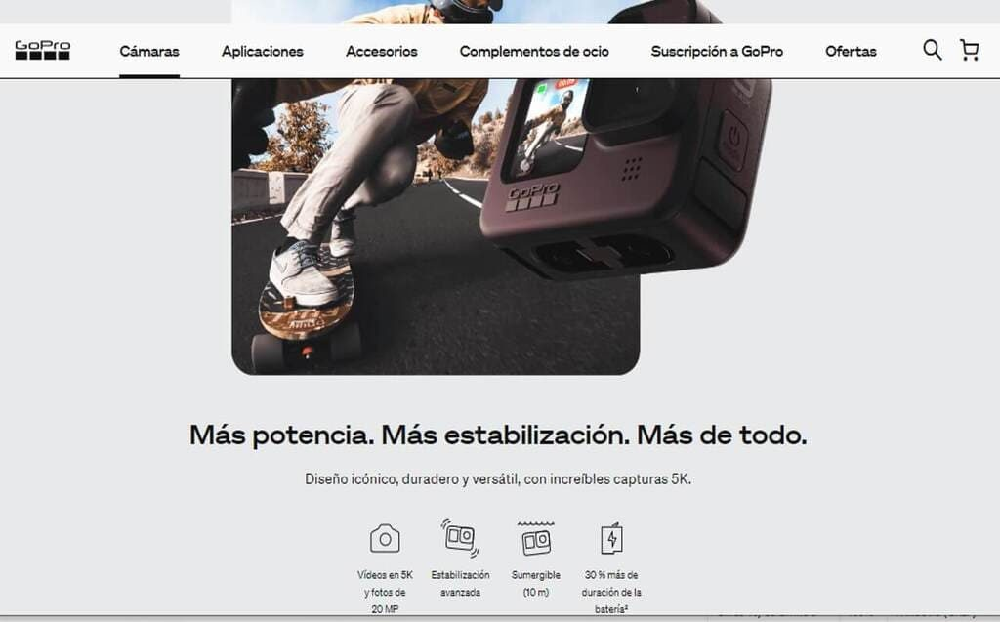{ width="440" }

*GoPro organitza concursos, premis i esdeveniments per als amants de l'aventura, i així ha creat una gran comunitat que li aporta molts de beneficis.*

#### Col·laboracions i *influencers*

Treballar amb *influencers* i amb altres marques pot ampliar l'abast i atreure trànsit nou. Els *influencers* poden promocionar productes o serveis als seus seguidors i dirigir-los al web del negoci.

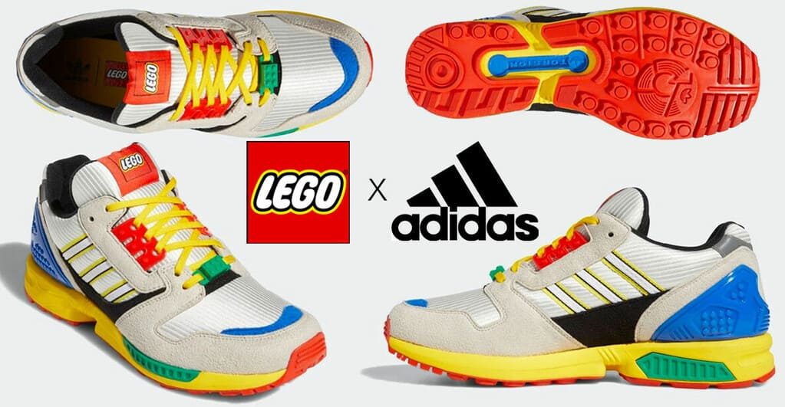{ width="440" }

*Les col·laboracions són molt rendibles perquè sumen públics que no competeixen entre ells.*

Per exemple, una marca de moda pot col·laborar amb un *influencer* d'estil de vida per promocionar una col·lecció nova, amb enllaços directes als productes.

!!! example "Exercici 6.2. Col·laboracions"
    Cerca cinc exemples de col·laboracions entre marques i elabora un document que inclogui, per a cada col·laboració, una imatge del producte on es vegi la col·laboració i una descripció (de tres línies com a mínim) de per què creus que beneficia totes dues marques.

### 6.2.7. Treballadors autònoms i serveis digitals

Aquest model permet als professionals independents (*freelancers*) oferir les seves habilitats i serveis a un públic ampli a través de plataformes digitals. En un mercat cada vegada més globalitzat, poden treballar des de qualsevol lloc i oferir serveis que van des de la programació i el disseny gràfic fins a la redacció o la consultoria.

Els avantatges d'aquest tipus de feina són evidents: flexibilitat, autonomia, conciliació de la vida laboral i familiar, accés a un mercat global, costos de funcionament reduïts, etc. Però també té inconvenients importants: ingressos inestables, una competència ferotge i l'absència de beneficis laborals com l'assegurança mèdica, les vacances pagades o els plans de pensions, cosa que obliga a planificar-se més per tenir cobertura i seguretat a llarg termini.

Hi ha molts de *marketplaces* dedicats a oferir i contractar serveis d'autònoms. Aquests són els més coneguts:

- **Fiverr i Upwork**: són dues de les plataformes més populars del món i també les fan servir autònoms d'Espanya per oferir els seus serveis. Hi poden trobar clients internacionals per a projectes de disseny gràfic, desenvolupament web, redacció o traducció, entre d'altres.

    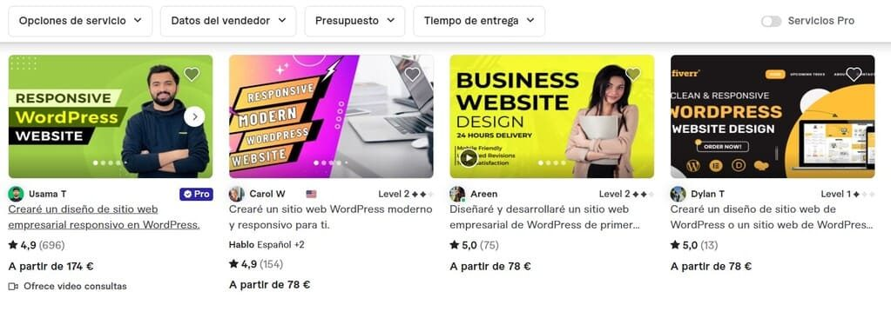{ width="440" }

- **Domestika**: aquesta plataforma, d'origen espanyol, s'ha convertit en un referent per als creatius. No només ofereix projectes per a autònoms, sinó també cursos en diverses àrees creatives perquè els professionals millorin les seves habilitats.
- **Freelancer.es**: plataforma específica per al mercat espanyol, on els autònoms poden trobar feina en àrees molt diverses, des de la tecnologia i el màrqueting fins a la consultoria o l'educació.
- **SoyFreelancer**: una altra plataforma popular a Espanya que connecta autònoms amb empreses que cerquen serveis especialitzats de programació, disseny, màrqueting digital i més.

## 6.3. Factures digitals

Tot el que envolta el comerç electrònic ha evolucionat a una velocitat de vertigen. La gestió de documents també, i un dels canvis més notables és el **pas de les factures en paper a les factures digitals**. Aquest canvi no només reflecteix un avanç tecnològic, sinó que també suposa una millora considerable de l'eficiència i la sostenibilitat dels processos administratius de les empreses.

### 6.3.1. Què són les factures digitals?

Les **factures digitals** són documents electrònics que substitueixen les factures tradicionals en paper. Contenen la mateixa informació que una factura en paper, però es generen, s'envien i es guarden de manera electrònica. Adoptar les factures digitals permet a les empreses optimitzar molt els seus processos comptables i administratius.

Les factures digitals es generen i s'envien en formats electrònics com **PDF**, **XML** o **formats específics** establerts per la normativa de cada país. A Espanya, per exemple, el format **Facturae** és molt utilitzat i acceptat per a la facturació electrònica entre empreses i amb les administracions públiques.

:material-link: [Tutorial per generar factures electròniques](https://economia.uca.es/wp-content/uploads/2021/06/Tutorial_FACTURAe.pdf) (en castellà)

Per garantir l'autenticitat i la integritat de la factura, sovint s'utilitza una **signatura digital**. Aquesta signatura certifica que la factura no s'ha modificat i que prové de l'emissor legítim, cosa que aporta una seguretat addicional.

Les factures digitals tenen la mateixa validesa legal que les de paper, sempre que compleixin la normativa. A Espanya, la **[Llei 56/2007, de mesures d'impuls de la societat de la informació](https://www.boe.es/buscar/act.php?id=BOE-A-2007-22440)**, regula l'ús de la factura electrònica.

### 6.3.2. Avantatges de les factures electròniques

Les factures digitals tenen molts d'avantatges respecte de les de paper:

- **Reducció de costos**: com que no calen paper, impressió ni arxiu físic, les empreses poden reduir molt els seus costos de funcionament. Per això moltes grans empreses han implantat sistemes de facturació electrònica.
- **Eficiència i rapidesa**: les factures digitals es poden generar i enviar en pocs segons, cosa que accelera el cicle de facturació i millora la liquiditat de les empreses. A més, es poden integrar directament en els programes de comptabilitat, cosa que redueix els errors manuals i el temps dedicat a introduir dades.
- **Sostenibilitat**: les factures digitals contribueixen a reduir el consum de paper i, per tant, a tenir cura del medi ambient.

### 6.3.3. Eines i plataformes per generar factures digitals

A Espanya, la factura electrònica és cada vegada més habitual, tant en el sector privat com en el públic. L'Administració pública ha posat en marxa la plataforma **[FACe (Punt General d'Entrada de Factures Electròniques)](https://face.gob.es/es)**, que permet als proveïdors enviar les seves factures electròniques a les entitats públiques de manera segura i eficient.

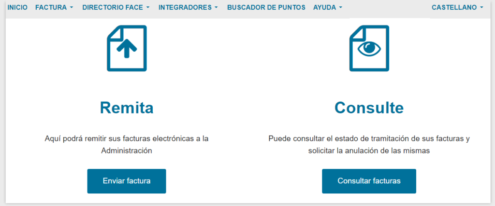{ width="520" }

En el sector privat, empreses com Iberdrola, Endesa o Repsol han desenvolupat sistemes de facturació electrònica per als seus clients i proveïdors. Aquestes iniciatives no només milloren l'eficiència interna, sinó que també donen un servei millor als clients, que poden consultar les seves factures de manera ràpida i senzilla a través de webs segurs.

## 6.4. Formes de pagament en el comerç electrònic

Conèixer les diverses formes de pagament és fonamental tant per als consumidors com per als comerciants, perquè el mètode triat pot influir en l'experiència de compra, en la seguretat de les transaccions i en l'eficiència del procés. Amb la ràpida evolució de la tecnologia financera, han aparegut moltes opcions de pagament, cadascuna amb els seus avantatges i inconvenients.

En aquest apartat farem un repàs complet de les opcions disponibles actualment, especialment de les més esteses al nostre país.

### 6.4.1. Targetes de crèdit i de dèbit

Les **targetes de crèdit i de dèbit** són, sens dubte, el mètode de pagament més estès en el comerç electrònic. La seva acceptació universal i la seva facilitat d'ús les han convertit en l'opció preferida tant per als consumidors com per als comerciants.

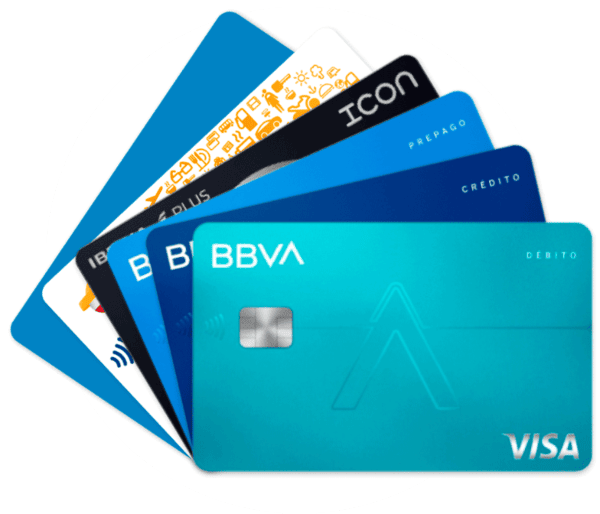{ width="360" }

Vegem com funciona cada una.

Les **targetes de crèdit** permeten fer compres amb un límit de crèdit que fixa l'emissor de la targeta, normalment un banc o una entitat financera. El titular ha de pagar l'import gastat més endavant, tot de cop o a terminis, cosa que pot comportar interessos. Aquest mètode dona flexibilitat, perquè permet comprar ara i pagar més tard.

En canvi, les **targetes de dèbit** estan vinculades directament al compte bancari de l'usuari. Quan es fa una compra, els doblers es descompten immediatament del saldo disponible. Això vol dir que només es pot gastar el que es té realment, cosa que ajuda a evitar deutes. Són populars entre les persones que volen controlar més de prop les seves despeses.

Les entitats que emeten aquestes targetes han implantat diverses mesures de seguretat per protegir les transaccions, com els **codis CVV** (*Card Verification Value*), l'autenticació en dues passes i el xifratge de la informació.

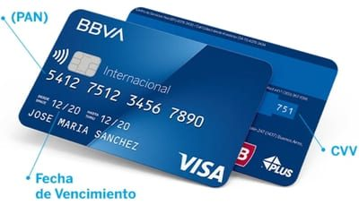{ width="420" }

A més, moltes targetes de crèdit tenen programes de recompenses que permeten acumular punts, milles aèries o reemborsaments (*cashback*) per cada compra, cosa que incentiva a utilitzar-les més.

Malgrat les mesures de seguretat, el frau amb targetes continua essent un problema important. Els consumidors han d'estar atents als intents de *phishing* i a les transaccions no autoritzades. Per això s'utilitzen tecnologies com **3D Secure** (per exemple, *Verified by Visa* i *Mastercard SecureCode*), que afegeixen una capa de protecció addicional.

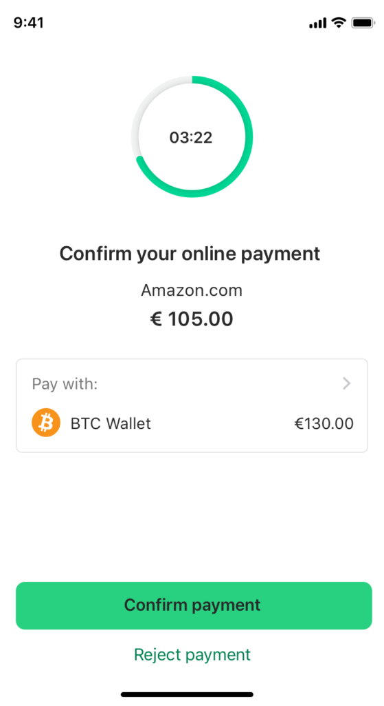{ width="240" }

Per als comerços, acceptar pagaments amb targeta té costos: comissions per transacció i tarifes de processament. Poden ser importants, especialment per a les empreses petites, i per això encara hi ha llocs on no es pot pagar amb targeta.

### 6.4.2. Passarel·les de pagament

Les **passarel·les de pagament** són serveis que permeten processar transaccions electròniques de manera segura entre compradors i venedors. Fan d'intermediàries entre el web del comerç i les entitats financeres i garanteixen que els pagaments es facin de manera segura.

Quan un client fa una compra per internet i paga, la passarel·la captura les dades de la targeta i les envia de manera segura al banc emissor. El banc autoritza o rebutja la transacció i envia la resposta a la passarel·la, que al seu torn informa el web del comerç del resultat. Tot això passa en pocs segons, i la seguretat es garanteix amb el xifratge de les dades.

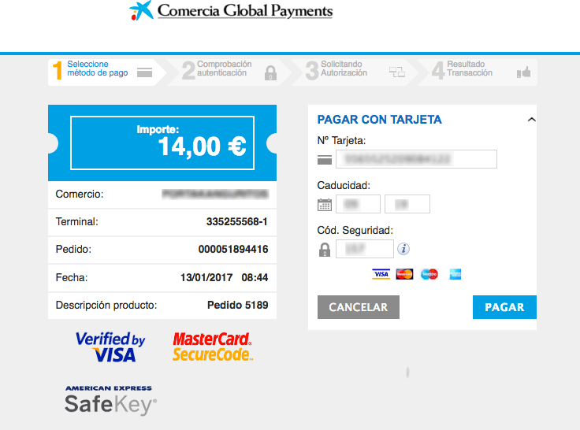{ width="440" }

Les passarel·les de pagament apliquen mesures de seguretat avançades, com el **xifratge SSL/TLS**, per protegir la informació sensible dels clients. Això ajuda a prevenir fraus i garanteix que les dades personals estiguin protegides durant la transacció.

També fan més fàcil l'experiència de compra, perquè permeten utilitzar diversos mètodes de pagament: targetes de crèdit i de dèbit, moneders electrònics i, en alguns casos, criptomonedes. Això augmenta la probabilitat de completar la venda, ja que el client pot triar el mètode que prefereix.

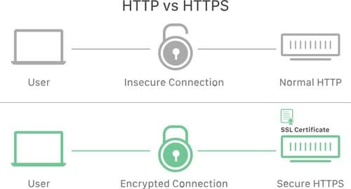{ width="440" }

Les passarel·les de pagament es poden integrar fàcilment amb les principals plataformes de comerç electrònic, com **Shopify**, **WooCommerce** o **Magento**, cosa que simplifica la configuració i la gestió dels pagaments.

A més, ofereixen eines de gestió de riscs i garanteixen el compliment de la normativa financera, com la **PSD2** (Directiva de serveis de pagament revisada) a Europa, que inclou l'**autenticació reforçada del client** (SCA).

Aquestes són les passarel·les de pagament més utilitzades a Espanya:

- **Redsys**: una de les més utilitzades, integra serveis de més de cent entitats financeres. Ofereix solucions de pagament per al comerç electrònic, amb targetes de crèdit i de dèbit i eines avançades per prevenir el frau.
- **Stripe**: una passarel·la global que s'ha fet popular per la seva facilitat d'ús i la seva seguretat. Permet acceptar pagaments amb targeta i amb altres mètodes alternatius i s'integra amb moltes plataformes de comerç electrònic.

    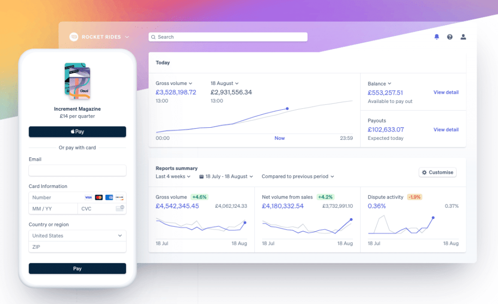{ width="520" }

- **PayPal**: coneguda a tot el món, és molt utilitzada per pagar en línia. Permet pagar amb el compte de PayPal, amb targeta o, fins i tot, a terminis. La confiança i la protecció al comprador que ofereix la fan molt popular.
- **Adyen**: plataforma de pagament que ofereix una solució global unificada per acceptar pagaments en línia, a la botiga i al mòbil. La fan servir grans empreses que cerquen una solució eficient i segura.
- **Bizum**: tot i que és més conegut pels pagaments entre particulars, també l'han començat a adoptar els comerços electrònics. Permet pagaments ràpids i segurs només amb el número de telèfon del client i està disponible a la majoria de bancs espanyols.

### 6.4.3. Moneders electrònics

Els **moneders electrònics** (o carteres digitals) són aplicacions o serveis que permeten fer pagaments i gestionar transaccions amb el mòbil o per internet. Han revolucionat la manera de pagar perquè són còmodes, segurs i ràpids, i el seu ús creix constantment gràcies a la gran implantació dels mòbils i a la digitalització dels serveis financers.

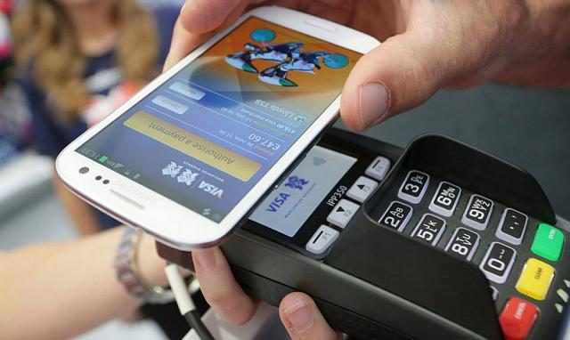{ width="440" }

Els moneders electrònics guarden de manera segura la informació de les targetes de crèdit i de dèbit i, de vegades, dels comptes bancaris. Es pot pagar a les botigues físiques acostant el mòbil a un datàfon compatible (amb tecnologia NFC) o fer compres en línia amb les dades guardades al moneder. A més, molts permeten enviar i rebre doblers entre usuaris de manera senzilla.

El seu ús creix com l'escuma perquè aporten diversos avantatges molt valorats pels usuaris:

- **Comoditat**: no cal dur targetes físiques ni efectiu. Es pot pagar amb el mòbil, cosa especialment útil en situacions quotidianes com compres ràpides o el transport públic.
- **Seguretat**: apliquen mesures de seguretat avançades, com l'autenticació biomètrica (empremta digital o reconeixement facial), l'autenticació en dues passes i el xifratge de les dades. Això redueix molt el risc de frau i de robatori d'informació.
- **Rapidesa**: els pagaments són ràpids i eficients, cosa que redueix les cues a les caixes i millora l'experiència del client.
- **Simplicitat**: ja no cal una cartera amb diverses targetes: tot és dins d'un dispositiu que duim sempre a sobre, el mòbil.

Al nostre país, els tres moneders electrònics més utilitzats, amb diferència, són:

- **Apple Pay**: permet als usuaris de dispositius Apple (iPhone, Apple Watch, iPad i Mac) pagar de manera segura i senzilla. S'accepta en una gran varietat de comerços i també serveix per comprar dins d'aplicacions.

    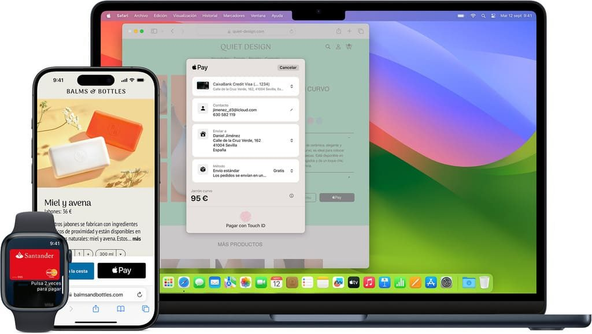{ width="440" }

- **Google Wallet** (abans Google Pay): funciona en dispositius Android i permet guardar targetes de crèdit, de dèbit i de fidelització, i pagar a les botigues físiques i per internet. És compatible amb molts de bancs espanyols i s'accepta en una gran varietat de comerços.

    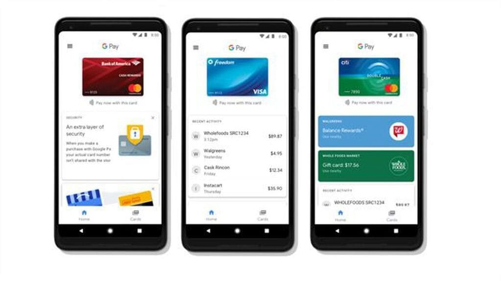{ width="360" }

- **Samsung Pay** (integrat avui a Samsung Wallet): semblant als anteriors, però per a dispositius Samsung. Oferia funcions addicionals com els pagaments MST (transmissió magnètica segura), que permetien utilitzar-lo en datàfons antics sense NFC.

    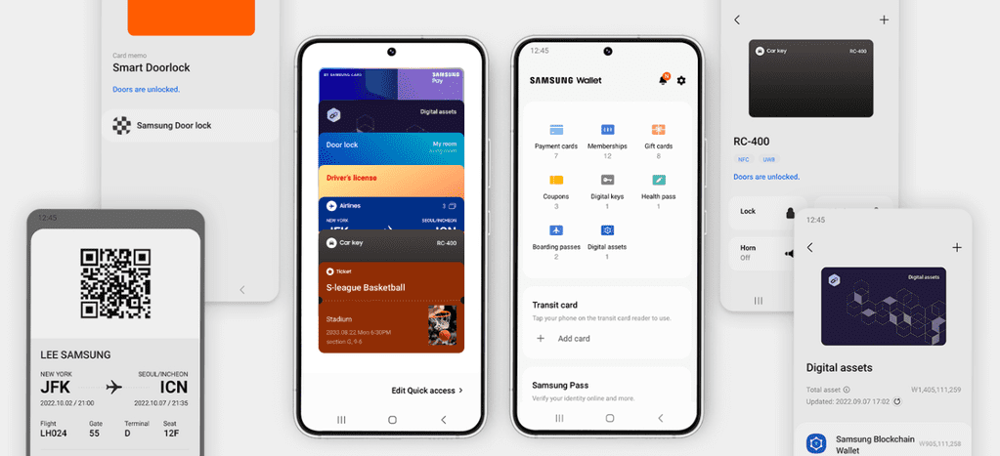{ width="440" }

### 6.4.4. Criptomonedes

Les **criptomonedes** han aparegut com una alternativa a les formes tradicionals de pagament en el comerç electrònic. Aquestes **monedes digitals** utilitzen la **criptografia** per protegir les transaccions i controlar la creació de noves unitats, i han cridat l'atenció de moltes organitzacions per la seva descentralització, la seva seguretat i el seu potencial d'anonimat.

Repassem-ne algunes característiques.

#### Descentralització

A diferència de les monedes tradicionals, emeses pels bancs centrals, les criptomonedes funcionen en xarxes descentralitzades basades en la tecnologia ***blockchain*** (cadena de blocs). Això vol dir que **no les controla cap entitat central**.

<iframe src="https://www.youtube-nocookie.com/embed/Yn8WGaO__ak" title="Vídeo sobre la tecnologia blockchain" loading="lazy" allowfullscreen></iframe>

#### Anonimat

Les transaccions amb criptomonedes són segures gràcies als algorismes criptogràfics. A més, encara que les transaccions són públiques i es poden verificar a la cadena de blocs, els usuaris poden mantenir un cert grau d'anonimat, perquè no cal revelar informació personal per fer pagaments.

#### Rapidesa

Les criptomonedes permeten fer transaccions gairebé instantànies i de baix cost a qualsevol part del món, sense intermediaris com els bancs. Això és especialment útil per al comerç internacional i per als enviaments de doblers entre països.

!!! warning "Compte amb les criptomonedes"
    El valor de les criptomonedes pot pujar i baixar molt en poc temps, i al voltant d'aquest món hi ha moltes estafes. No són una inversió segura ni recomanable si no se n'entenen bé els riscs, i en moltes plataformes cal ser major d'edat per operar-hi.

#### Criptomonedes més importants

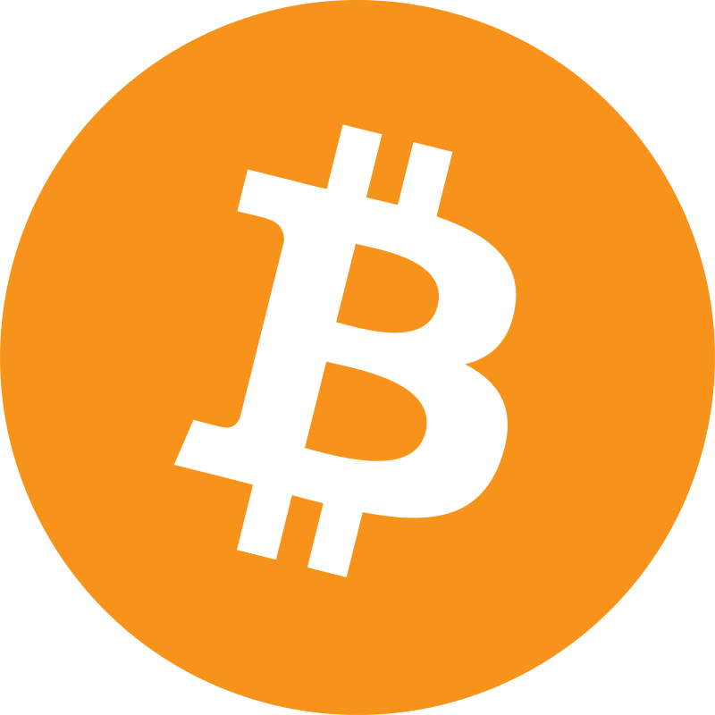{ width="120" }

El **Bitcoin (BTC)**, creat el 2009 amb el pseudònim de **Satoshi Nakamoto**, va ser la primera criptomoneda i continua essent la més utilitzada. S'ha convertit en una gran reserva de valor i en un mitjà de pagament acceptat per moltes organitzacions. El Salvador el va adoptar com a moneda de curs legal el 2021, tot i que el 2025 va reformar la llei i va deixar de ser obligatori acceptar-lo.

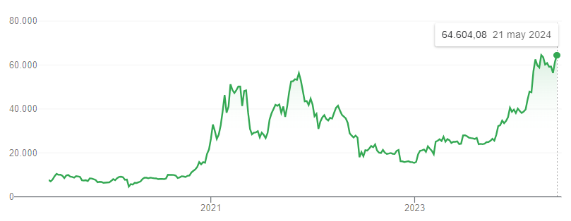{ width="480" }

*Evolució del valor del Bitcoin (BTC) fins al maig de 2024.*

A Espanya, **Bit2Me** és una de les plataformes d'intercanvi de criptomonedes més importants: permet comprar, vendre i guardar bitcoins. A més, algunes botigues en línia i establiments físics accepten pagaments en bitcoins.

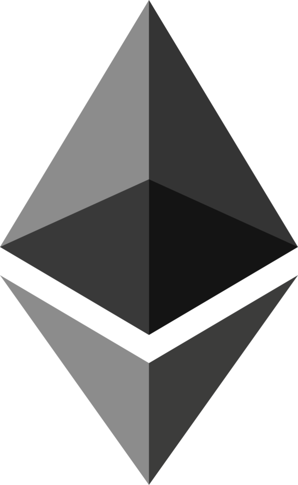{ width="80" }

**Ethereum (ETH)**, llançada el 2015, és una plataforma descentralitzada que permet crear i executar contractes intel·ligents (*smart contracts*) i aplicacions descentralitzades (*dApps*). La seva criptomoneda, l'ether, s'utilitza per pagar les transaccions i els serveis de la xarxa Ethereum.

Un exemple d'aplicació és **Aragon**, una plataforma basada en Ethereum que permet a les organitzacions crear i gestionar estructures de govern descentralitzades amb contractes intel·ligents. **Aquest tipus d'aplicacions està canviant la manera de fer negocis i de gestionar les comunitats digitals**.

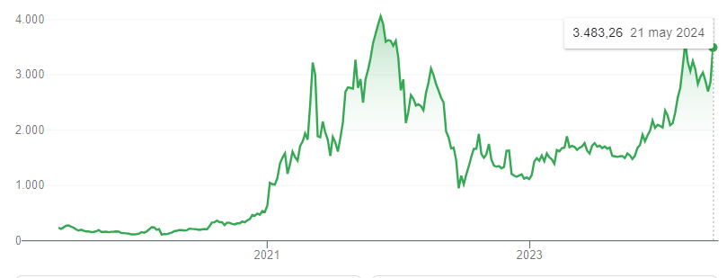{ width="480" }

*Evolució del valor d'Ethereum (ETH) fins al maig de 2024.*

#### Altres criptomonedes molt conegudes

| | |
| --- | --- |
| 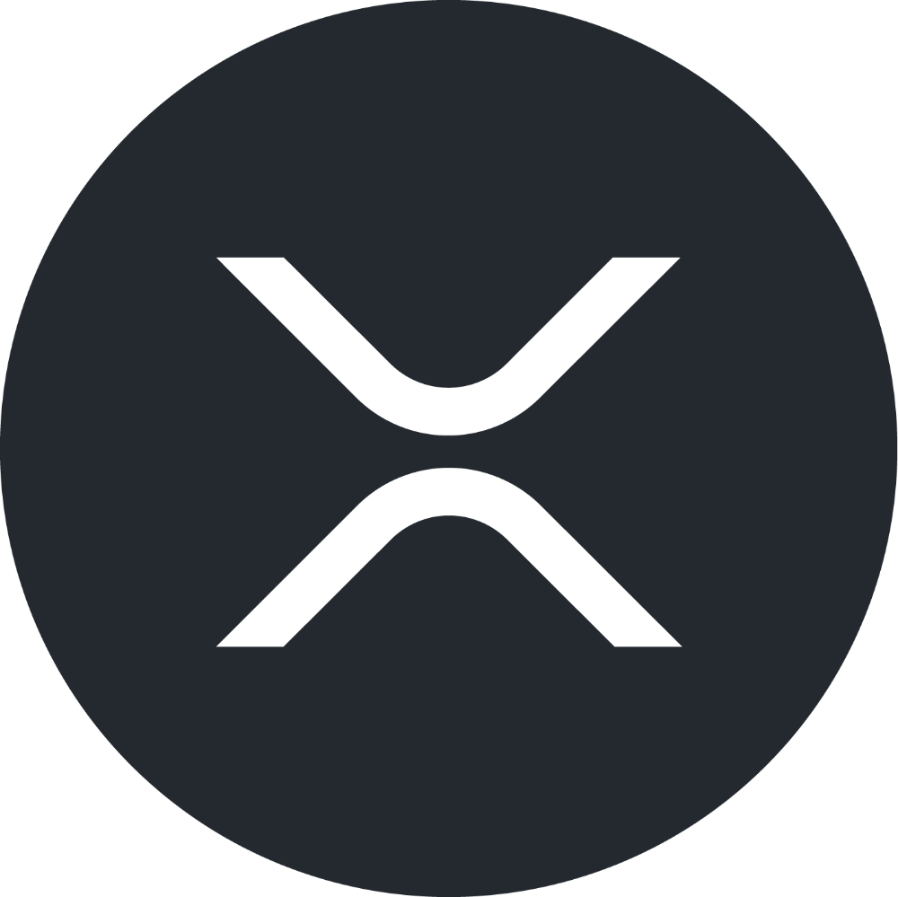{ width="80" } | **Ripple (XRP)** és alhora una plataforma de pagaments i una criptomoneda. A diferència del Bitcoin i d'Ethereum, està pensada per facilitar transaccions ràpides i econòmiques entre entitats financeres. |
| 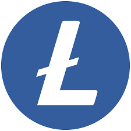{ width="80" } | **Litecoin (LTC)** és una criptomoneda que ofereix temps de confirmació de les transaccions més ràpids i una eficiència d'emmagatzematge més gran. |
| { width="80" } | **Cardano (ADA)** és una plataforma *blockchain* desenvolupada amb èmfasi en la seguretat i l'escalabilitat. La seva criptomoneda, l'ADA, s'utilitza per fer transaccions i participar en el govern de la xarxa. |

### 6.4.5. Transferències bancàries i pagaments en línia

Les **transferències bancàries i els pagaments en línia** són una manera tradicional, però encara molt utilitzada, de moure doblers, també en el comerç electrònic. Amb l'evolució de la tecnologia financera, les plataformes bancàries i els serveis especialitzats han millorat molt en rapidesa, seguretat i comoditat.

#### Transferències bancàries

Les **transferències bancàries** són el mètode tradicional per moure doblers d'un compte a un altre. Són especialment útils per a imports alts, pagaments internacionals i situacions que requereixen molta seguretat i traçabilitat. A Espanya són habituals les transferències **SEPA** (*Single Euro Payments Area*), que permeten fer transferències en euros entre els països membres amb la mateixa facilitat que una transferència nacional.

Encara que les transferències SEPA solen ser ràpides, les internacionals poden tardar diversos dies i poden tenir comissions importants.

#### Pagaments en línia amb la banca digital

Les **plataformes bancàries** permeten fer pagaments directament des del compte bancari a través d'aplicacions mòbils i webs dels bancs, que han millorat molt en funcions i facilitat d'ús.

#### Serveis especialitzats: Wise

**Wise** (abans TransferWise) és un servei financer que facilita les transferències internacionals de manera ràpida i econòmica. Utilitza un sistema que elimina molts dels costos de les transferències bancàries tradicionals. Per això l'utilitzen molt les persones que han hagut d'anar a viure a un altre país per feina.

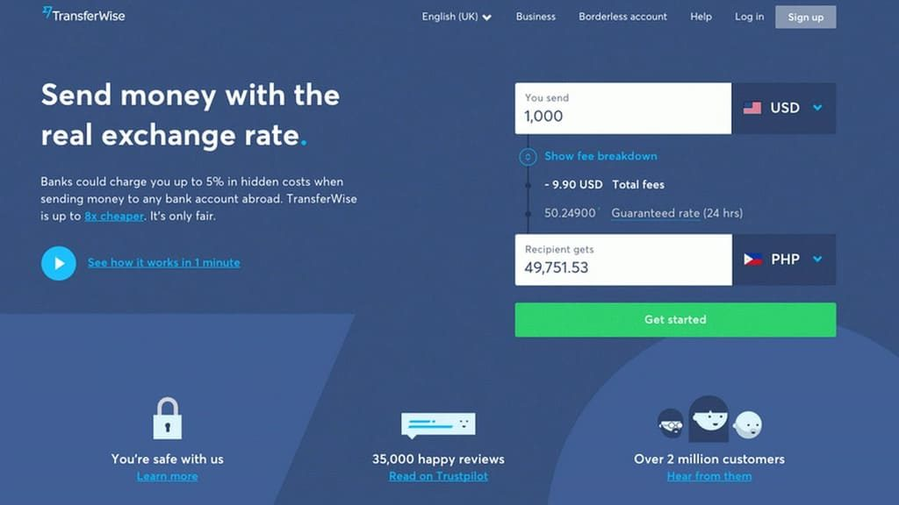{ width="480" }

#### Altres serveis de pagament en línia

A més de PayPal i Bizum, hi ha altres solucions molt interessants que han crescut moltíssim en els darrers anys, com **Revolut**.

Revolut és una plataforma financera que ofereix serveis de banca digital, com transferències internacionals i pagaments en línia. Amb un compte de Revolut es poden tenir i transferir doblers en diverses divises amb tipus de canvi competitius. També ofereix mètodes segurs per pagar per internet, com les **targetes virtuals**, que es poden activar amb una quantitat concreta, utilitzar i eliminar. D'aquesta manera, és molt difícil patir robatoris.

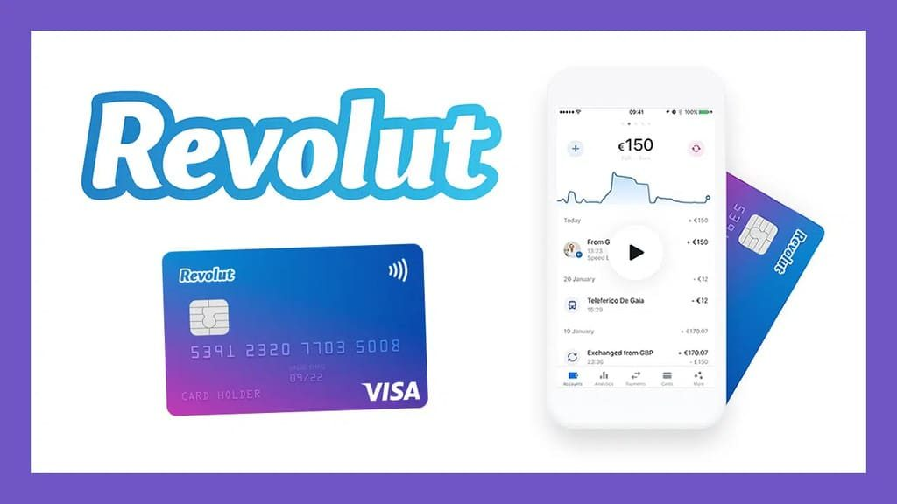{ width="440" }

### 6.4.6. Finançament a terminis

El **finançament a terminis**, també conegut com a «compra ara, paga després» (**BNPL**, de l'anglès *Buy Now, Pay Later*), és una opció de pagament que permet adquirir productes o serveis immediatament i pagar-los en quotes. Ha guanyat popularitat en el comerç electrònic per la seva flexibilitat i facilitat d'ús, com a alternativa a les targetes de crèdit tradicionals.

Normalment s'ofereix en col·laboració amb serveis financers que proporcionen el crèdit. Quan el client tria aquesta opció, la plataforma paga immediatament el cost total del producte o servei i el client es compromet a retornar la quantitat en diversos pagaments fraccionats, que poden ser setmanals, quinzenals o mensuals, segons les condicions.

Com que permet comprar sense pagar res al principi, hi ha el risc que els consumidors acumulin deutes que després no puguin pagar fàcilment. L'impagament pot perjudicar la solvència del consumidor i dificultar-li obtenir crèdit en el futur. A més, pot ser una opció perillosa, perquè algunes modalitats inclouen comissions per retard o despeses de gestió que cal tenir en compte.

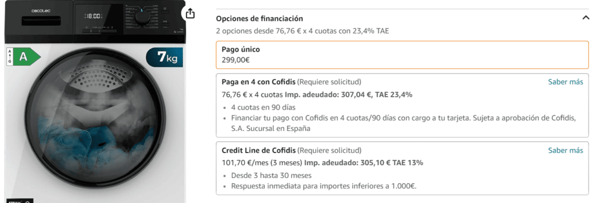{ width="560" }

*Opcions de finançament a Amazon en comprar una rentadora.*

## 6.5. Seguretat en el comerç electrònic

El creixement exponencial del comerç electrònic també ha comportat riscs importants per a la seguretat de les dades. La protecció de les dades personals i la prevenció del frau s'han convertit en pilars fonamentals per mantenir la confiança dels consumidors i la integritat de les empreses en l'entorn digital.

Per això és important acabar aquesta unitat coneixent les mesures de seguretat adequades per mantenir les nostres dades protegides.

### 6.5.1. Protecció de dades personals

La **protecció de dades personals** és un aspecte fonamental del comerç electrònic, perquè els consumidors confien informació sensible a les plataformes digitals quan hi compren: noms, adreces, números de targeta o dades de contacte, que s'han de tractar amb la màxima cura per prevenir fraus.

Vegem algunes de les mesures més eficaces per protegir les dades personals.

#### Xifratge de dades

Amb **algorismes de xifratge**, la informació sensible es converteix en un format il·legible per a qualsevol persona que no tengui la clau per desxifrar-la. Les empreses s'han d'assegurar que totes les transaccions es fan amb connexions segures (HTTPS) i que les dades emmagatzemades estan xifrades.

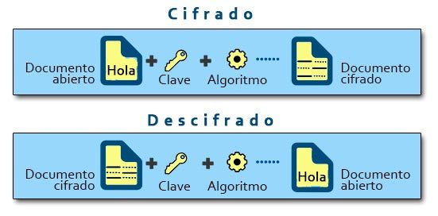{ width="440" }

#### Autenticació en dues passes (2FA)

L'**autenticació en dues passes** afegeix una capa de seguretat addicional, perquè obliga els usuaris a identificar-se de dues maneres abans d'accedir als seus comptes. Normalment es combina una cosa que l'usuari sap (una contrasenya) amb una cosa que té (un codi enviat al mòbil).

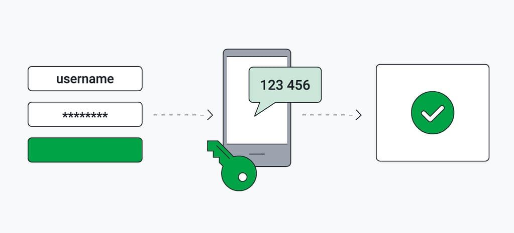{ width="440" }

#### Actualitzacions

Les empreses han de mantenir els sistemes i el programari actualitzats amb els darrers pedaços de seguretat per protegir-se de vulnerabilitats conegudes. Els ciberatacs sovint aprofiten errors del programari que es podrien haver corregit amb una actualització a temps.

#### Control d'accés

Només el personal autoritzat ha de tenir accés a les dades personals dels clients. Les empreses han d'aplicar controls d'accés estrictes i registrar totes les activitats relacionades amb les dades personals per garantir-ne la traçabilitat.

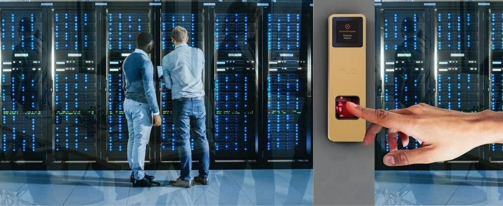{ width="440" }

#### Formació del personal

Els treballadors han d'estar ben informats sobre les bones pràctiques de seguretat i protecció de dades. Una formació periòdica ajuda a prevenir errors humans que podrien posar en perill la seguretat de les dades.

### 6.5.2. Prevenció del frau

En el comerç electrònic, **prevenir el frau** és essencial per mantenir la confiança tant dels consumidors com de les empreses. Els fraus digitals poden adoptar moltes formes, des de l'ús no autoritzat de targetes fins a la suplantació d'identitat o els atacs de *phishing*. Per reduir aquests riscs, les empreses han d'aplicar tot un conjunt de mesures de seguretat avançades.

Els principals mètodes de frau en el comerç electrònic són ben coneguts:

- ***Phishing***: intenta enganyar els usuaris perquè revelin informació personal i financera a través de correus, missatges o webs falsos que semblen legítims.
- **Robatori d'identitat**: ús no autoritzat de la informació personal d'una altra persona per fer compres.
- **Frau amb targetes**: ús de targetes robades o clonades per fer transaccions no autoritzades.
- **Frau amistós**: quan un consumidor legítim fa una compra i després afirma falsament que no ha rebut el producte o servei per reclamar-ne el reemborsament al banc.

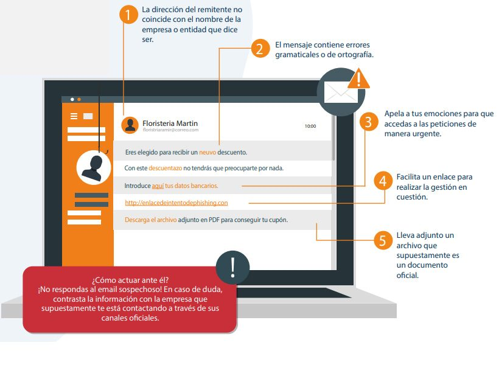{ width="440" }

*Com prevenir el phishing i com actuar-hi.*

!!! example "Ets capaç de detectar quan et volen enganyar?"
    [Demostra-ho amb aquest test de Google](https://phishingquiz.withgoogle.com/?hl=ca).

D'altra banda, hi ha estratègies de prevenció del frau aplicades en molts de sistemes: **autenticació en dues passes (2FA)**, **xifratge de dades** (com el protocol SSL/TLS), **seguiment i anàlisi de transaccions** i **verificació d'adreces (AVS)**, que compara l'adreça de facturació que dona el client amb la que té registrada el banc emissor de la targeta.

En aquest web tens moltíssims recursos per aprendre a protegir-te de tot tipus d'amenaces a la teva ciberseguretat: **[Institut Nacional de Ciberseguretat (INCIBE)](https://www.incibe.es/)**.

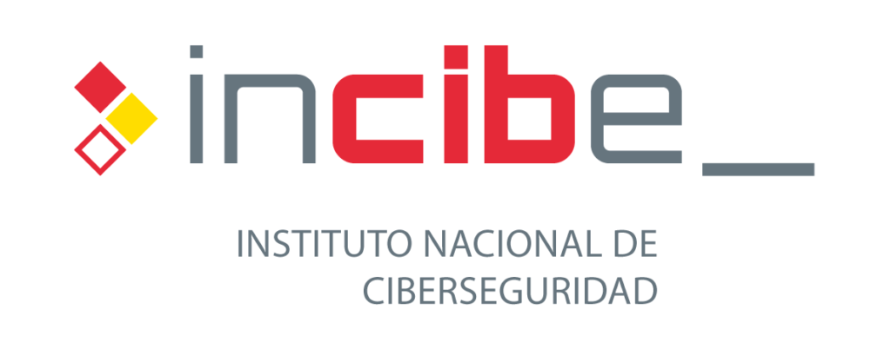{ width="300" }

---

!!! quote "Font"
    Unitat traduïda i adaptada de [«Tema 6. Comercio electrónico»](https://lopegonzalez.es/eso-y-bachillerato/digitalizacion-4o-eso/tema-6-comercio-electronico/), de Lope González Vázquez ([CC BY-NC-SA 4.0](https://creativecommons.org/licenses/by-nc-sa/4.0/deed.ca)). Canvis: traducció al català, adaptació al currículum de les Illes Balears i reorganització del format. S'han actualitzat les dades sobre El Salvador, Google Wallet i Samsung Wallet; s'ha afegit un avís sobre els riscs de les criptomonedes; s'han generalitzat algunes afirmacions sobre empreses concretes que no s'han pogut verificar, i s'ha suprimit un exemple de butlletí de pagament. Els vídeos són en castellà.
