# Unitat 7. Ciutadania digital crítica

En la societat actual, la digitalització ha transformat gairebé tots els aspectes de la nostra vida, des de la manera com ens comunicam fins a com accedim a la informació o feim gestions quotidianes. Aquesta transformació comporta grans oportunitats, però també planteja molts de debats ètics que hem d'entendre.

Estudiar la **ciutadania digital crítica** ens permet comprendre a fons els nostres drets i deures en l'entorn digital i participar activament en la societat digital. Ens ajuda a identificar i combatre la desinformació, a protegir la nostra privacitat i a utilitzar les eines tecnològiques de manera que beneficiïn tota la societat, perquè **aquesta és una bona manera de protegir la nostra democràcia**.

## 7.1. Interactivitat a la xarxa

La **interactivitat a la xarxa** és la capacitat dels usuaris d'interactuar entre ells i amb el contingut disponible a internet. És una característica fonamental de l'entorn digital, que permet una comunicació en dues direccions i una participació activa en moltes plataformes en línia.

Repassem alguns dels aspectes més importants que entren en joc quan interactuam a la xarxa.

### 7.1.1. Llibertat d'expressió

La **llibertat d'expressió** és un dret fonamental que protegeix la difusió d'idees per part de persones o col·lectius sense por de patir censura o represàlies. Aquest dret és recollit tant a la [Declaració Universal dels Drets Humans](https://www.un.org/es/about-us/universal-declaration-of-human-rights) com a l'[article 20 de la Constitució espanyola](https://app.congreso.es/consti/constitucion/indice/titulos/articulos.jsp?ini=20&tipo=2).

La llibertat d'expressió inclou diverses facultats:

- La llibertat d'**expressar i difondre lliurement pensaments, idees i opinions** de paraula, per escrit o per qualsevol altre mitjà.
- La llibertat de **producció literària, artística, científica i tècnica**.
- La llibertat de **càtedra**.
- La llibertat de **comunicar i rebre lliurement informació veraç** per qualsevol mitjà de difusió.

És a dir, **implica la possibilitat de cercar, rebre i difondre informació sense censura prèvia**.

Tanmateix, encara que la llibertat d'expressió és fonamental, **també té límits**, que estableix la mateixa Constitució. Per exemple, **no es pot utilitzar la llibertat d'expressió per incitar a l'odi, difamar persones o difondre informació falsa amb mala intenció**.

<iframe src="https://www.youtube-nocookie.com/embed/ZQS_86IpnFk" title="Vídeo sobre els límits de la llibertat d'expressió" loading="lazy" allowfullscreen></iframe>

A més, la llei regula aspectes com la **[clàusula de consciència](https://www.boe.es/buscar/act.php?id=BOE-A-1997-13374)** dels periodistes i el **[secret professional](https://www.conceptosjuridicos.com/secreto-profesional/)** en l'exercici d'aquestes llibertats.

Recorda que la llibertat d'expressió és fonamental per a una societat democràtica i plural. És un dret que **hem de protegir i exercir de manera responsable**.

!!! example "Exercici 7.1. Els límits de la llibertat d'expressió"
    El professor et facilitarà un document per treballar els límits de la llibertat d'expressió. Fes l'activitat abans de continuar amb el punt següent.

### 7.1.2. Etiqueta digital

L'**etiqueta digital** (o *netiqueta*) és el conjunt de recomanacions que busquen promoure una comunicació respectuosa, adaptades a les particularitats de la comunicació entre persones a internet.

Aquestes són les deu regles principals que has de seguir quan interactues amb altres persones a internet:

1. **Dona una bona imatge de tu mateix**: utilitza un llenguatge respectuós, vés amb compte amb el sarcasme i para atenció a la gramàtica.
2. **Respecta la privacitat dels altres**.
3. **Si hi ha alguna cosa que no diries a la cara, no la diguis a internet**.
4. **Segueix les normes de cada lloc**.
5. **Comprova els fets** i no donis per certa una informació només perquè te l'ha contada algú.
6. **Respecta el temps i els límits dels altres**.
7. **Respon tan aviat com puguis**.
8. **Mantén la teva informació actualitzada**.
9. **Envia els arxius correctament**.
10. **Sigues tolerant**.

És fonamental recordar que les nostres accions a internet afecten altres persones i que hem de ser ciutadans digitals responsables.

### 7.1.3. Propietat intel·lectual

La **propietat intel·lectual** és el conjunt de drets legals que protegeixen les creacions de la ment humana: obres literàries, artístiques i científiques, invents, marques comercials o secrets comercials. En l'entorn digital, la propietat intel·lectual és encara més rellevant per la facilitat amb què es pot copiar, distribuir i modificar contingut en línia.

{ width="140" }

Aquests en són alguns aspectes clau:

- **Drets d'autor (*copyright*)**: protegeixen les obres originals, com llibres, música, pel·lícules, fotografies o programari. Els creadors tenen el dret exclusiu de copiar, distribuir i adaptar les seves obres durant un període determinat (en general, tota la vida de l'autor i un nombre d'anys després de la seva mort). A internet és fonamental respectar els drets d'autor quan compartim contingut: no hem de descarregar, copiar ni distribuir material protegit sense permís.
- **Llicències d'ús**: defineixen com es pot utilitzar una obra protegida per drets d'autor.
- **Pirateria**: la pirateria de continguts (pel·lícules, música, programari…) és un dels grans problemes d'internet. Descarregar o compartir material protegit sense autorització és il·legal i perjudica tant els creadors com la indústria.

    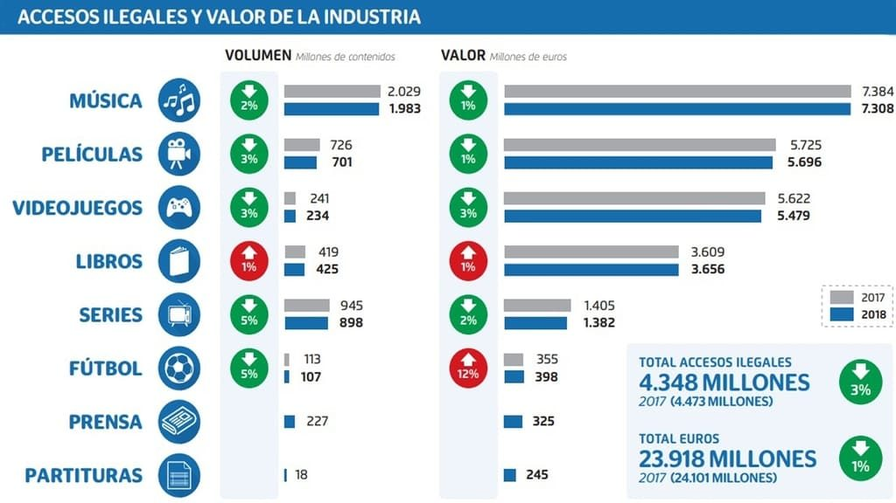{ width="440" }

- **Plagi**: consisteix a apropiar-se d'idees, textos o continguts d'altres sense citar-ne l'autoria. En l'àmbit digital, el plagi es pot produir en redaccions, blogs, presentacions i altres mitjans. :material-link: [Programes per detectar plagis](https://www.ideaspropiaseditorial.com/blog/programas-para-detectar-plagios/) (en castellà)
- **Dominis i marques comercials**: els noms de domini a internet han de ser únics i no poden vulnerar marques comercials existents. Les marques comercials protegeixen els noms, logotips i símbols que identifiquen productes o serveis.

Encara que a primera vista pot semblar que no feim res greu quan descarregam un contingut amb *copyright* i el feim servir en profit propi, estam perjudicant la creativitat i la innovació digital.

### 7.1.4. Llicències d'ús

Les **llicències d'ús** són autoritzacions que donen els titulars dels drets d'autor perquè altres persones puguin utilitzar les seves obres d'acord amb unes condicions determinades. Vegem-ne les més importants:

- ***Copyright***: és la més restrictiva. L'autor es reserva tots els drets sobre l'obra i no se'n permet cap ús sense la seva autorització prèvia. És a dir, no podem utilitzar ni tota ni una part d'una obra amb *copyright* sense el permís exprés de l'autor.

    { width="140" }

- ***Copyleft***: és un concepte relacionat amb el programari lliure. Quan una obra es distribueix amb una llicència *copyleft*, s'exigeix que totes les versions modificades o ampliades també siguin lliures. És a dir, qui comparteix contingut amb aquesta llicència garanteix que altres el puguin copiar i modificar lliurement, amb la condició que mantenguin la mateixa llicència.
- **Creative Commons**: són molt populars i s'inspiren en la idea del *copyleft*. Amb una llicència Creative Commons, l'autor permet l'ús total o parcial de la seva obra, però hi posa condicions concretes, que es combinen en diverses variants. :material-link: [Tipus de llicències Creative Commons](https://creativecommons.org/share-your-work/cclicenses/)

!!! info "Aquesta web és un exemple"
    Els materials d'aquesta web tenen una llicència **CC BY-NC-SA 4.0**: els pots compartir i adaptar sempre que en citis l'autoria (BY), no en facis un ús comercial (NC) i comparteixis les teves adaptacions amb la mateixa llicència (SA). Per això al final de cada unitat trobaràs la font original.

Hem de respectar sempre aquestes llicències i citar correctament els autors quan fem servir el seu contingut. No t'agradaria que tothom sabés que una obra reconeguda és teva? Doncs actua de la mateixa manera a internet.

## 7.2. Educació mediàtica

L'**educació mediàtica** és fonamental per formar ciutadans digitals crítics i responsables. En un món on la informació circula constantment i a una velocitat vertiginosa, saber valorar la qualitat dels continguts que consumim pot marcar la diferència entre estar ben informat o ser una capsa ambulant de rumors i prejudicis.

En aquest apartat treballarem aquestes habilitats per assegurar-nos que és real el que llegim, veiem i sentim a internet.

### 7.2.1. Periodisme digital

El **periodisme digital** és una part fonamental de la interacció en línia. Aquestes en són les característiques principals:

- **Rapidesa**: permet difondre les notícies més ràpidament. Les xarxes socials, sobretot, fan que la informació arribi a un públic global en pocs segons.
- **Verificació de fonts**: els periodistes han de comprovar la credibilitat de les fonts abans de publicar una notícia, cosa que no sempre passa. Les notícies falses i la desinformació poden tenir conseqüències molt greus. :material-link: [Principals conseqüències de les *fake news*](https://www.incibe.es/node/504093) (INCIBE, en castellà)
- **Formats multimèdia**: utilitza imatges, vídeos, infografies i altres formats per enriquir les notícies i captar l'atenció del públic.
- **Interactivitat**: els lectors poden interactuar amb les notícies a través de comentaris, enquestes i xarxes socials, cosa que genera conversa sobre els temes d'actualitat.
- **Responsabilitat**: els periodistes digitals han de seguir els mateixos principis ètics que els dels mitjans tradicionals. La precisió, la imparcialitat i la responsabilitat són fonamentals.
- **Reptes de finançament**: el model de negoci del periodisme digital és complicat perquè molts de continguts en línia són gratuïts. La publicitat, les subscripcions i altres estratègies són clau per a la seva sostenibilitat econòmica.

    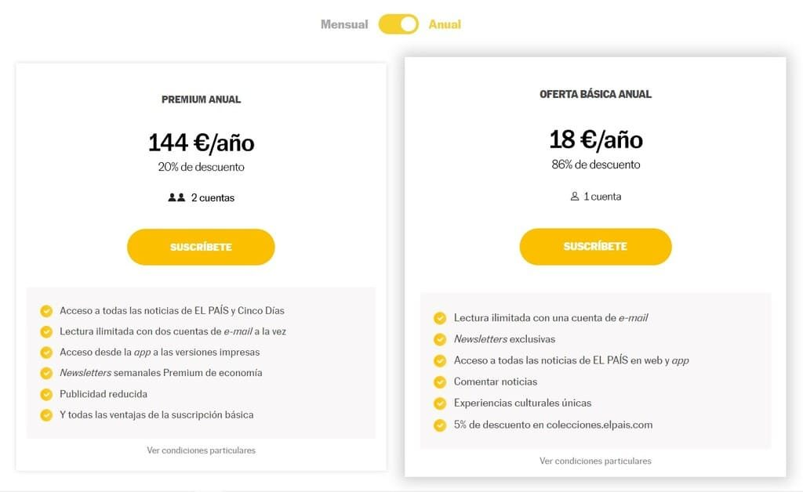{ width="400" }

Vegem alguns exemples relacionats amb el periodisme digital:

- **Investigació de filtracions de dades**: el cas de **Cambridge Analytica** va ser un autèntic escàndol informatiu. Aquesta empresa va utilitzar dades de milions d'usuaris de Facebook per influir en eleccions i campanyes polítiques. Els periodistes van tenir un paper clau per investigar i destapar l'escàndol.

    

    <iframe src="https://www.youtube-nocookie.com/embed/BBu7IxSv-dk" title="Vídeo sobre el cas Cambridge Analytica" loading="lazy" allowfullscreen></iframe>
    

- **Cobertura en temps real d'esdeveniments importants**: durant desastres naturals, crisis polítiques o esdeveniments esportius, els mitjans digitals ofereixen informació actualitzada al moment. Per exemple, la cobertura de l'huracà María a Puerto Rico el 2017 va ser fonamental per mantenir informada la població.
- **Reportatges multimèdia**: els periodistes digitals creen continguts interactius i visualment atractius, amb gràfics, vídeos i narracions multimèdia, per aprofundir en temes complexos com la desigualtat econòmica o el canvi climàtic.
- **Verificació de fets (*fact-checking*)**: organitzacions com **Snopes** o **FactCheck.org** es dediquen a comprovar la veracitat de les notícies que circulen per internet i desmenteixen rumors i desinformació, fins i tot quan els han creat els mateixos periodistes.
- **Periodisme ciutadà**: les xarxes socials permeten que la ciutadania informi sobre el que passa al seu entorn. Per exemple, durant les protestes de la Primavera Àrab, moltes persones van compartir imatges i vídeos en temps real a X (llavors Twitter) i Facebook, que van ser molt importants per crear una consciència global del problema.

### 7.2.2. Blogosfera

La **blogosfera** és el conjunt de tots els blogs que existeixen. Aquests blogs estan interconnectats mitjançant enllaços i han creat una cultura pròpia. Si has estat completament desconnectat els darrers vint anys, aquí en tens l'anatomia:

- **Estructura**: els blogs solen tenir una estructura cronològica inversa, amb les publicacions més recents primer. Els autors hi poden incloure text, imatges, vídeos i enllaços.
- **Diversitat de veus**: la blogosfera permet que persones d'orígens i perspectives molt diferents comparteixin les seves opinions, cosa que enriqueix el panorama informatiu i fomenta el diàleg.
- **Credibilitat**: alguns blogs s'han convertit en fonts d'informació influents. Tot i així, és important valorar-ne la credibilitat i tenir en compte possibles biaixos.
- **Comportament semblant a la selecció natural**: a la blogosfera, els elements que es repliquen (temes populars, mems o notícies) es propaguen i evolucionen, d'una manera semblant a la selecció natural en biologia.
- **Seguiment**: hi ha eines que analitzen la blogosfera estudiant els enllaços que entren i surten de cada blog. Permeten detectar tendències, temes en auge o productes populars entre els autors de blogs.

Saps quins són alguns dels webs i blogs més visitats a Espanya, o si més no de quins temes tracten? Pensa-hi un minut i després compara-ho amb aquests exemples: diaris digitals com **El Español**, **El País** o **El Confidencial**; blogs de tecnologia com **Xataka**; de videojocs com **Vida Extra**; de moda i estil de vida com **Trendencias**; de gastronomia com **Directo al Paladar**; d'economia com **Cinco Días**, o d'esports com **Marca** o **As**.

### 7.2.3. Estratègies comunicatives

Les **estratègies comunicatives** són un conjunt de tècniques que s'utilitzen per transmetre missatges de manera efectiva a través de mitjans digitals. És important dominar-les per comunicar idees, opinions i informació de manera clara i convincent.

#### Coneix el teu públic

Perquè una comunicació sigui efectiva, cal saber a qui t'adreces. Has d'adaptar el missatge a les característiques, els interessos i les necessitats del teu públic.

Per exemple, una empresa tecnològica que llança una aplicació de *fitness* pot fer servir a TikTok un llenguatge juvenil i reptes virals per atreure adolescents, mentre que a LinkedIn comparteix estudis de casos i articles tècnics per atreure professionals de la salut i l'esport.

#### Claredat i concisió

A internet, l'atenció dels usuaris és molt limitada. Per això, els missatges han de ser clars i concisos. Evita l'argot innecessari i vés al gra. Utilitza paràgrafs curts, llistes i títols per facilitar la lectura i la comprensió.

Per exemple, mitjans de comunicació com BBC News utilitzen titulars breus i directes a les xarxes socials, amb enllaços a articles més detallats, perquè els usuaris captin ràpidament la idea principal.

#### Ús de recursos multimèdia

El contingut audiovisual pot millorar molt l'efectivitat de la comunicació. Utilitza imatges, infografies, vídeos i presentacions per reforçar el missatge.

Per exemple, els mapes de resultats electorals dels diaris digitals resumeixen dades complexes de manera visual i atractiva i les fan més fàcils d'entendre.

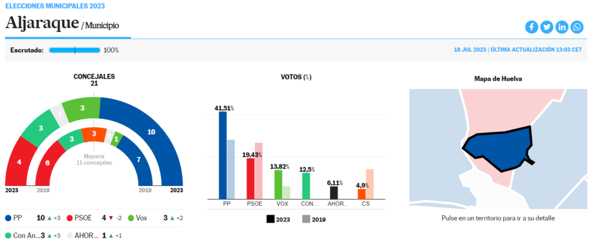{ width="520" }

#### Interacció

Anima el teu públic a interactuar amb tu a través de comentaris, enquestes i debats. Respon a les seves preguntes i comentaris per fomentar un diàleg obert. Aquesta resposta no només t'ajuda a millorar el missatge, sinó que també enforteix la relació amb el teu públic.

Per exemple, la marca de roba esportiva Nike anima els seguidors d'Instagram a compartir fotos dels seus entrenaments amb una etiqueta concreta i respon als comentaris, i així crea una comunitat activa i participativa.

#### *Storytelling*

El *storytelling* (o narrativa) és una estratègia molt potent per fer que el missatge es recordi. Contar una història emotiva pot captar l'atenció del públic i generar-hi una connexió emocional.

Per exemple, l'ONG Save the Children comparteix històries personals d'infants i famílies a qui ha ajudat amb continguts multimèdia, i així connecta emocionalment amb el públic.

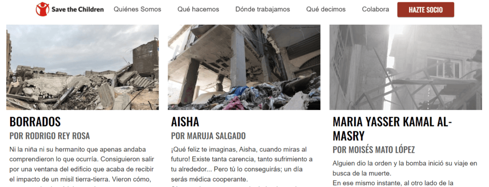{ width="520" }

#### Personalització

La personalització consisteix a adaptar la comunicació a les preferències de cada usuari. S'utilitzen dades i eines d'anàlisi per enviar missatges personalitzats. Per exemple, els correus electrònics amb el nom del destinatari i un contingut rellevant per a ell solen tenir més obertures i més respostes.

#### Coherència

Mantén una identitat i un to coherents en totes les teves comunicacions. Això ajuda a construir una marca reconeixible. Assegura't que tots els elements del missatge, des de l'estil visual fins al llenguatge, estan d'acord amb la imatge que vols projectar.

Per exemple, Starbucks manté una identitat visual i un to coherents en totes les seves plataformes, des de l'aplicació mòbil fins a les xarxes socials, perquè els usuaris en reconeguin l'estil.

#### Transparència

La comunicació ètica també és molt important. Sigues honest i transparent en els teus missatges. No difonguis informació falsa o enganyosa i cita sempre les teves fonts. La transparència genera credibilitat.

Per exemple, l'empresa de roba de muntanya Patagonia destaca per la seva transparència sobre l'impacte ambiental dels seus productes: publica informes detallats i mostra els seus esforços de sostenibilitat en tots els seus espais digitals.

#### Adaptabilitat

L'entorn digital canvia constantment. És important estar al dia de les noves tendències de comunicació i ser flexible per adaptar les estratègies a les necessitats i els comportaments del públic.

Per exemple, durant la pandèmia de la COVID-19, moltes universitats van adaptar ràpidament la seva comunicació i van utilitzar plataformes de videoconferència i xarxes socials per mantenir informats els estudiants i oferir-los suport educatiu a distància.

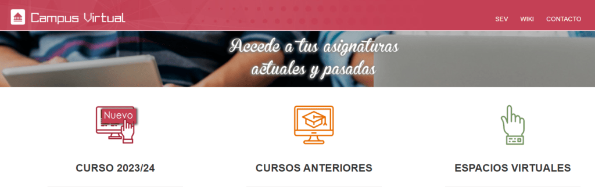{ width="520" }

### 7.2.4. Ús crític de la xarxa

L'**ús crític de la xarxa** implica saber analitzar, valorar i utilitzar de manera reflexiva la informació que trobam a internet. En una època en què la informació és abundant i les *fake news* es difonen ràpidament, és imprescindible que la ciutadania sàpiga destriar la veracitat i la qualitat dels continguts que consumeix i comparteix.

Vegem alguns dels aspectes més importants per fer un ús crític de la xarxa.

#### Avaluació de les fonts

Comprovar la credibilitat de les fonts és bàsic. Això implica:

- Investigar qui és l'**autor** del contingut i quina autoritat té en el tema.
- Comprovar si el web on hi ha la informació és **conegut per la seva serietat**.
- Revisar quan es va publicar la informació per assegurar-se que està **actualitzada**.

Per exemple, abans de compartir una notícia sobre un descobriment científic, comprova si prové d'una revista científica reconeguda, com *Nature* o *Science*, i si ha estat revisada per altres experts.

#### Contrast de la informació

No hem de confiar cegament en una sola font. És important contrastar la informació amb altres fonts per confirmar-ne la veracitat. Això ajuda a evitar la propagació de rumors i notícies falses.

Per exemple, quan llegeixis una notícia sobre un conflicte internacional, cerca informació en diversos mitjans de països diferents per tenir-ne una visió més completa i equilibrada.

#### Reconeixement de biaixos

Tots els mitjans i autors poden tenir algun biaix. És fonamental ser-ne conscients i reflexionar sobre com poden influir en la manera de presentar la informació. Identificar el biaix ens ajuda a mirar les dades de manera més crítica.

Per exemple, cal reconèixer que un article d'opinió d'un diari pot reflectir la inclinació política de l'autor o del mitjà, i cercar punts de vista alternatius per tenir-ne una perspectiva més equilibrada. Una bona pràctica és comparar com titulen una mateixa notícia dos diaris amb línies editorials diferents: sovint, l'enfocament, les paraules triades i allò que es destaca canvien molt.

#### Anàlisi del contingut

La informació s'ha d'analitzar no només pel que diu, sinó també per com ho diu. Identificar recursos retòrics, com el llenguatge emotiu o sensacionalista, ajuda a descobrir la intenció del missatge.

Per exemple, una notícia amb titulars exagerats o alarmistes potser vol captar l'atenció més que informar de manera objectiva. Compara aquest enfocament amb fonts que presentin els fets de manera més equilibrada.

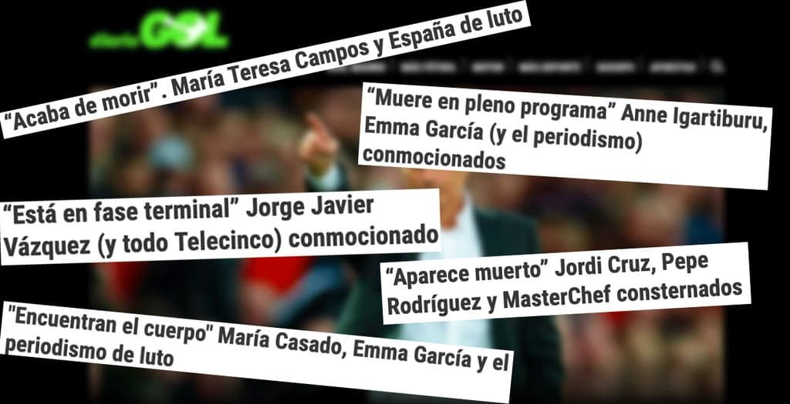{ width="440" }

#### Protecció de la privacitat

L'ús crític de la xarxa també implica ser conscient de les dades personals que compartim i de com s'utilitzen. Protegir la privacitat és important per evitar un mal ús de la nostra informació. Per exemple, configura bé les opcions de privacitat a les xarxes socials i vés amb compte a l'hora de donar informació personal en webs desconeguts.

#### Pensament crític

Fomentar el pensament crític i un escepticisme saludable és clau per no acceptar automàticament tota la informació que trobam a internet. Qüestionar i reflexionar sobre el que llegim ens ajuda a estar més ben informats.

Per exemple, davant d'un anunci que promet resultats miraculosos amb un producte, investiga si hi ha estudis científics i opinions d'experts que ho avalin.

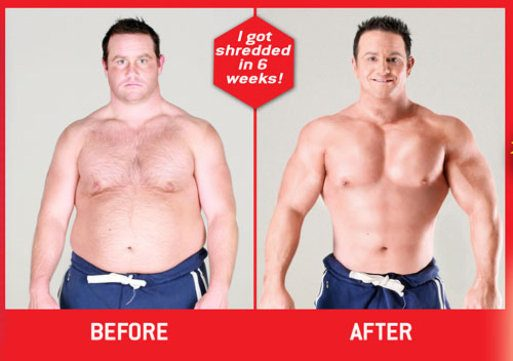{ width="360" }

#### Participació responsable

Ser un usuari crític de la xarxa també implica participar activament en la creació i la difusió de continguts de qualitat. Contribuir a la conversa en línia de manera constructiva enforteix la comunitat digital: crear i compartir articles ben documentats, citar les fonts, fomentar debats respectuosos, etc.

### 7.2.5. Eines per detectar notícies falses

Hi ha moltíssimes eines que ens ajuden a identificar els senyals d'alarma (*red flags*) que indiquen que una informació que llegim, veiem o sentim pot ser falsa. Vegem-ne algunes de les més populars perquè tenguis una bona capsa d'eines quan dubtis de la veracitat d'una informació.

#### Verificació de fets (*fact-checking*)

Hi ha moltes organitzacions dedicades a verificar fets, que revisen i confirmen la veracitat de les notícies. Algunes de les més reconegudes són:

- **Maldita.es**: plataforma espanyola que verifica notícies i desmenteix rumors.
- **Newtral**: una altra organització espanyola que verifica fets i analitza continguts mediàtics.
- **Snopes**: un dels llocs de verificació de fets més antics i reconeguts internacionalment.

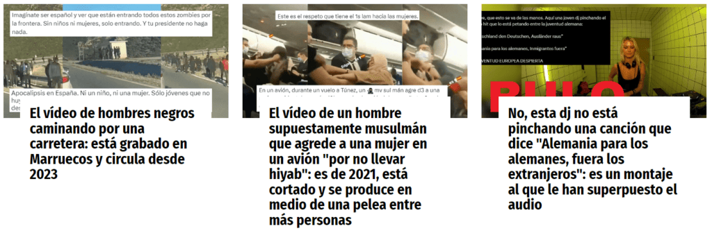{ width="520" }

#### Aplicacions

Hi ha diverses aplicacions, incloses extensions del navegador, que ajuden a identificar notícies falses. Analitzen el contingut de les pàgines web i avisen sobre la credibilitat de la informació. Per exemple:

- **NewsGuard**: extensió del navegador que valora la fiabilitat dels webs de notícies i els dona una puntuació de confiança.
- **Fact Check Explorer** de Google: permet cercar verificacions de fets fetes per organitzacions especialitzades.

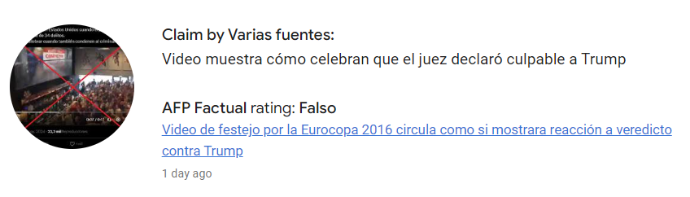{ width="440" }

#### Verificació de continguts multimèdia

Els continguts multimèdia es poden manipular per difondre informació falsa. Les eines de verificació visual permeten comprovar-ne l'autenticitat:

- **Cerca inversa d'imatges de Google**: permet trobar l'origen d'una imatge a internet. És útil perquè sovint es fan servir imatges de fets passats per mostrar una realitat actual que no és certa.
- **TinEye**: una altra eina de cerca inversa d'imatges que en rastreja la procedència i mostra on ha aparegut.
- **InVID**: eina que analitza vídeos per verificar-ne l'autenticitat i l'origen, útil per comprovar vídeos virals.

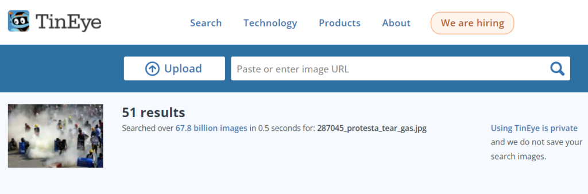{ width="520" }

*TinEye: hi puges una imatge i et diu en quins webs apareix.*

#### Eines de les xarxes socials

Les xarxes socials tenen un paper molt important en la difusió de notícies falses, però també poden ser útils per verificar-les. Algunes plataformes han incorporat sistemes per identificar informació falsa, com les notes de context que afegeixen els mateixos usuaris a X. A més, seguir els comptes de les organitzacions de verificació de fets a les xarxes socials pot ser molt útil.

#### Sentit comú

Encara que no és una eina com a tal, **aplicar el sentit comú és el millor mètode per saber si una notícia és certa o no**. Moltes vegades llegim a internet informacions molt rellevants que tendrien un impacte tremend en el nostre entorn; però, quan anam als principals portals de notícies del país, no n'hi trobam ni rastre. Pots estar segur que has llegit una notícia falsa.

## 7.3. Gestions administratives

Estudiar les **gestions administratives** en línia és imprescindible per entendre com la digitalització ha transformat la relació entre la ciutadania i l'Administració pública.

Actualment, poder fer tràmits de manera digital ha agilitzat molts de processos i ha fet els serveis públics més eficients i accessibles. En els apartats següents veurem diversos aspectes de les gestions administratives per internet per aprofitar al màxim els avantatges de l'administració electrònica.

### 7.3.1. Serveis públics en línia

Aquests serveis permeten fer tràmits de manera més ràpida, eficient i accessible, sense haver d'anar físicament a les oficines. Vegem-ne alguns dels més rellevants.

#### Seu electrònica de l'Administració

La **[seu electrònica de l'Administració General de l'Estat](https://sede.administracion.gob.es/PAG_Sede/HomeSede.html)** és una plataforma que centralitza centenars de tràmits.

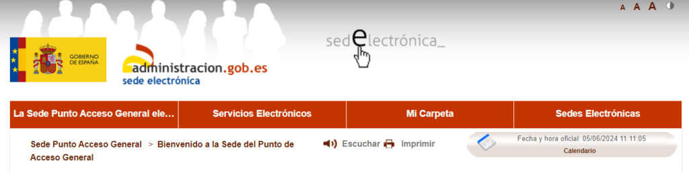{ width="520" }

Des d'aquest portal, la ciutadania pot fer gestions com aquestes:

- **Sol·licitar certificats**, com el de naixement.
- **Presentar declaracions**, per exemple la declaració de la renda a través de l'Agència Tributària.
- **Consultar expedients**: accedir a informació sobre l'estat dels procediments administratius i rebre notificacions oficials.

A les Illes Balears, la **[seu electrònica del Govern](https://www.caib.es/seucaib/)** ofereix els tràmits de l'Administració autonòmica.

#### Seguretat Social

La **[Seguretat Social](https://www.seg-social.es/wps/portal/wss/internet/Inicio)** ofereix molts de serveis en línia per gestionar aspectes relacionats amb la vida laboral i la protecció social.

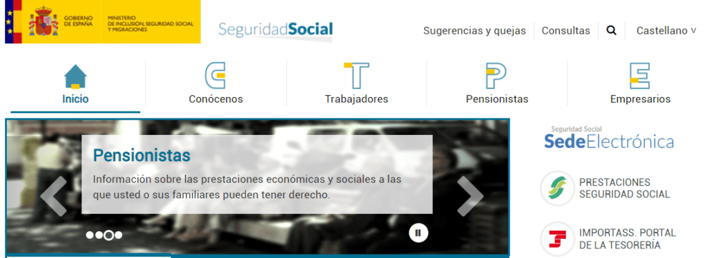{ width="520" }

Entre els serveis més destacats hi ha:

- **Consulta de la vida laboral**: permet obtenir un informe detallat dels períodes cotitzats.
- **Sol·licitud de prestacions**, com l'atur, la jubilació o les ajudes per incapacitat.
- **Canvi de dades personals**, com el domicili o l'estat civil.

#### Salut digital

Els serveis de salut també s'han digitalitzat i ens permeten gestionar la nostra salut de manera més eficient. A les Illes Balears, el Servei de Salut (IB-Salut) ofereix la [cita prèvia en línia](https://www.ibsalut.es/ciutadania-ca/cita-previa-ibsalut) i el portal **[EspaiSalut](https://espaisalut.ibsalut.es/)** (abans Portal del Pacient).

Entre els serveis més habituals hi ha:

- **Cita prèvia**: demanar hora amb el metge de família o amb especialistes per internet.
- **Consulta de la història clínica**: accés a informes mèdics, resultats d'anàlisis i receptes electròniques.
- **Telemedicina**: consultes mèdiques per videotrucada, especialment útils en zones rurals, on hi ha menys personal sanitari.

#### Trànsit

La **[Direcció General de Trànsit (DGT)](https://www.dgt.es/inicio/)** ofereix diversos serveis en línia per fer tràmits relacionats amb els vehicles i els permisos de conduir.

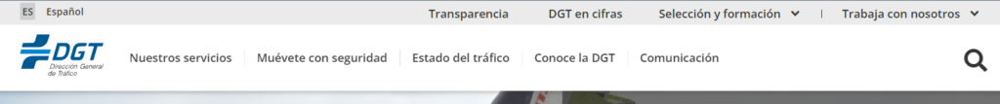

Entre aquests serveis hi ha:

- **Renovació del permís de conduir**: sol·licitud i seguiment del procés.
- **Pagament de multes**: pagar sancions de trànsit de manera ràpida.
- **Consulta de punts del permís**: comprovar el saldo de punts i rebre avisos si se'n perden.

#### Ministeri de l'Interior

El **[Ministeri de l'Interior](https://www.interior.gob.es/opencms/es/servicios-al-ciudadano/tramites-y-gestiones/dni/cita-previa/)** permet demanar cita prèvia per renovar el DNI o el passaport sense cues i sense sortir de casa.

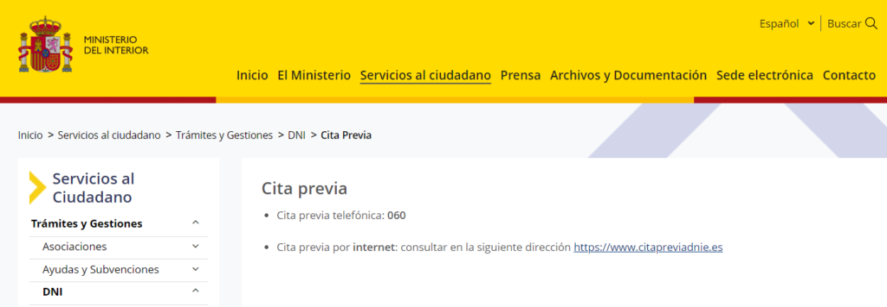{ width="520" }

#### Administració local

Molts d'ajuntaments ja s'han digitalitzat i ofereixen serveis en línia per pagar imposts municipals, demanar llicències d'obres, consultar el padró o comunicar canvis de domicili.

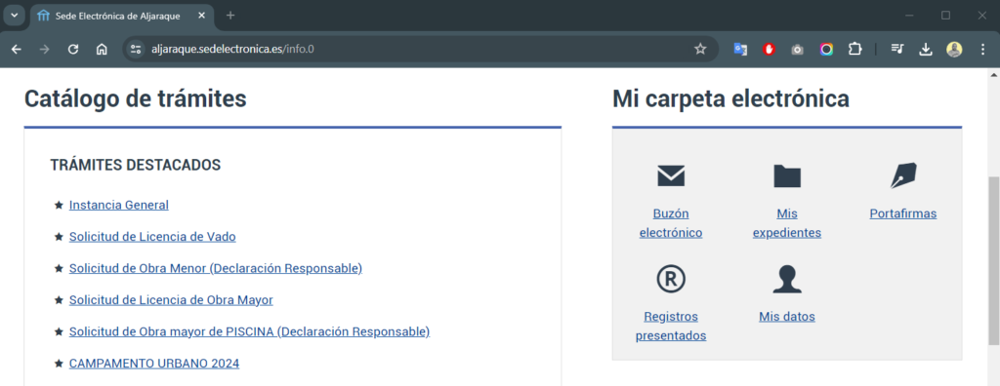{ width="520" }

*Seu electrònica d'un ajuntament.*

### 7.3.2. Registres oficials

Els **registres oficials** són plataformes digitals que permeten a la ciutadania fer inscripcions, consultes i gestions relacionades amb diversos aspectes legals i administratius. Vegem-ne alguns dels més importants.

#### Registre Civil

El **[Registre Civil](https://www.mjusticia.gob.es/BUSCADIR/ServletControlador?apartado=buscadorGeneral&tipo=RC)** s'encarrega d'inscriure fets de la vida de les persones, com naixements, matrimonis, defuncions i canvis de nom. Amb els serveis en línia es pot:

- **Sol·licitar certificats**: obtenir còpies dels certificats de naixement, matrimoni i defunció.
- **Inscriure fets**: registrar naixements i defuncions de manera digital.
- **Canviar el nom o els llinatges**: gestionar sol·licituds de canvi de nom o de llinatges.

#### Registre de la Propietat

El **[Registre de la Propietat](https://www.mjusticia.gob.es/ca/ciudadania/registros/propiedad-mercantiles/registro-propiedad)** s'encarrega d'inscriure i fer públics els drets sobre béns immobles.

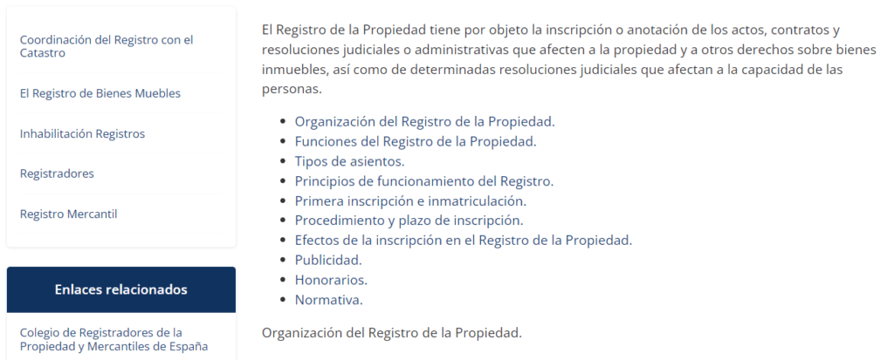{ width="520" }

Ofereix tràmits com:

- **Consulta de notes simples**: obtenir informació bàsica sobre la situació jurídica d'un immoble, com qui n'és el titular i quines càrregues té.
- **Certificacions registrals**: sol·licitar certificats que acreditin la titularitat i les càrregues d'una propietat.
- **Inscripció d'escriptures**: registrar la compra, la venda o la donació de propietats de manera telemàtica.

#### Registre Mercantil

El **[Registre Mercantil](https://www.mjusticia.gob.es/es/ciudadania/registros/propiedad-mercantiles/registro-mercantil)** té la funció d'inscriure i fer públics els actes i documents relacionats amb les empreses.

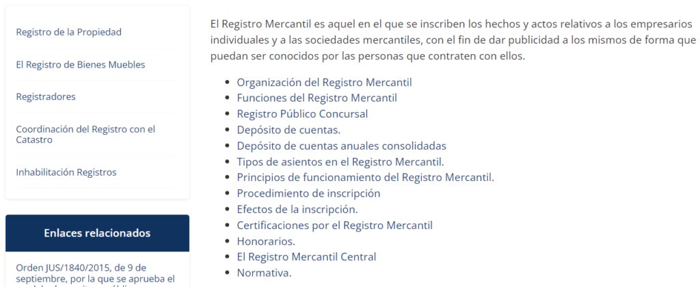{ width="520" }

Inclou, entre d'altres:

- **Inscripció de societats**: registrar la constitució d'empreses noves, les modificacions dels estatuts i la dissolució de societats.
- **Dipòsit de comptes anuals**: presentar i consultar els comptes anuals de les empreses, un requisit legal per a totes les societats.
- **Certificacions mercantils**: obtenir certificats que acreditin l'existència i la situació jurídica d'una empresa.

#### Registre Electrònic General

El **[Registre Electrònic General de l'Administració General de l'Estat (REG-AGE)](https://sede.administracion.gob.es/PAG_Sede/ServiciosElectronicos/RegistroElectronicoGeneral.html)** és un punt central per presentar documents adreçats a qualsevol òrgan de l'Administració General de l'Estat i als organismes i entitats vinculats.

Des del REG-AGE, la ciutadania pot presentar sol·licituds, escrits i comunicacions perquè es tramitin.

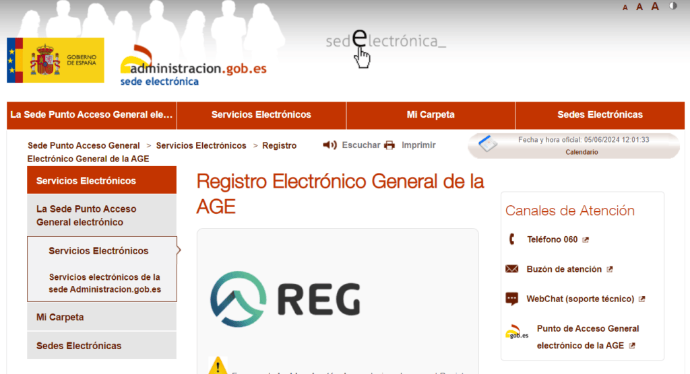{ width="520" }

A més, el REG-AGE permet enviar telemàticament documents a altres administracions públiques integrades en el Sistema d'Interconnexió de Registres.

#### Altres registres i serveis

A més del REG-AGE, hi ha altres serveis oficials, com el **[sistema Cl@ve](https://clave.gob.es/clave_Home/clave.html)**, el **[certificat electrònic de la FNMT](https://www.sede.fnmt.gob.es/certificados/persona-fisica)**, la **[Direcció Electrònica Habilitada Única (DEHú)](https://dehu.redsara.es/)** o les seus electròniques de l'**[Agència Tributària](https://sede.agenciatributaria.gob.es/)** i del **[Servei Públic d'Ocupació Estatal](https://www.sepe.es/HomeSepe)**.

Malgrat els molts beneficis, la digitalització dels registres oficials també presenta alguns problemes, com la necessitat de garantir la inclusió digital i l'accessibilitat per a tota la ciutadania, sigui quin sigui el seu nivell de competència digital. També és fonamental mantenir la seguretat i la privacitat de les dades personals en totes les gestions que feim per internet.

Finalment, i és molt important, els tràmits telemàtics tenen un gran problema: sovint no són intuïtius, cosa que deixa fora, i en una clara situació de discriminació, les persones amb menys coneixements digitals.

Per afrontar aquests problemes, algunes administracions han posat en marxa programes de formació i d'ajuda perquè la ciutadania pugui utilitzar els serveis en línia. Per exemple, a les Illes Balears el programa **[Grans Actius](https://gransactius.org/)** ofereix formació digital a persones majors de 55 anys.

Tot i que és un primer pas, encara hi ha moltes dificultats perquè les persones amb menys recursos i coneixements es puguin beneficiar d'aquests serveis tan importants igual que la resta de la població.

### 7.3.3. Certificats oficials

Els **certificats oficials** són documents emesos per l'Administració pública que acrediten determinades dades de les persones. Es poden demanar per a molts de fins: tràmits administratius, laborals, educatius o legals. La digitalització d'aquests serveis ha fet molt més fàcil obtenir-los, de manera ràpida i des de qualsevol lloc.

#### Certificat digital

El **certificat digital** és un document electrònic (un arxiu) que permet identificar el titular de manera segura a internet. És imprescindible per fer tràmits en línia amb l'Administració. Entre les seves aplicacions hi ha:

- **Signatura electrònica**: permet signar documents digitalment amb la mateixa validesa legal que una signatura manuscrita.
- **Accés a serveis digitals**: facilita l'accés a serveis públics (com els que hem vist als apartats anteriors) i privats que requereixen una identificació segura.

:material-link: [Aprèn a utilitzar la signatura electrònica pas a pas](https://firmaelectronica.gob.es/)

#### Certificat d'empadronament

El **certificat d'empadronament** acredita el lloc de residència d'una persona i la seva inscripció al padró municipal. Es demana per a molts de tràmits, com la matrícula escolar, la sol·licitud de beques o la renovació del DNI. Es pot sol·licitar en línia a la seu electrònica de l'ajuntament.

#### Certificat d'antecedents penals

El **certificat d'antecedents penals** acredita si una persona té o no antecedents penals. És necessari per a alguns tràmits laborals, d'adopció o de sol·licitud de visats. El Ministeri de Justícia permet [demanar-lo en línia](https://sede.mjusticia.gob.es/es/tramites/certificado-antecedentes).

#### Certificat de naixement

El **certificat de naixement** acredita el naixement d'una persona i en recull informació bàsica, com la data i el lloc de naixement. És necessari per a tràmits com obtenir el DNI o el passaport o fer la inscripció en un centre educatiu. Es pot [sol·licitar](https://sede.mjusticia.gob.es/es/tramites/certificado-nacimiento) a la seu electrònica del Registre Civil.

#### Certificat de matrimoni

El **certificat de matrimoni** acredita la celebració d'un matrimoni i és necessari per a diversos tràmits legals, com demanar beneficis fiscals, tramitar herències o obtenir la nacionalitat. Es pot [sol·licitar en línia](https://sede.mjusticia.gob.es/es/tramites/certificado-matrimonio) a la seu electrònica del Registre Civil.

#### Certificat de defunció

El **certificat de defunció** acredita la mort d'una persona i és necessari per a tràmits com la liquidació d'herències, la cancel·lació de comptes bancaris o la sol·licitud de pensions de viduïtat. Es pot [sol·licitar](https://sede.mjusticia.gob.es/es/tramites/certificado-defuncion) a la seu electrònica del Registre Civil.

#### Certificat de discapacitat

El **certificat de discapacitat** acredita el grau de discapacitat d'una persona i és necessari per accedir a determinats serveis i ajudes, com ajuts econòmics, ocupació protegida o adaptacions a la feina. Es demana als serveis socials de cada comunitat autònoma.

## 7.4. Ètica en l'ús de les dades

La recollida, l'emmagatzematge i l'anàlisi de grans quantitats d'informació afecten profundament la privacitat, la seguretat i l'equitat de tota la societat. En aquest apartat veurem els principis ètics que han de guiar l'ús de la intel·ligència artificial i de les dades, i també els dilemes que sorgeixen en aquest context.

### 7.4.1. Intel·ligència artificial

La intel·ligència artificial (IA) és una branca de la informàtica que se centra a crear sistemes capaços de fer tasques que normalment requereixen intel·ligència humana, com aprendre, raonar, percebre, entendre el llenguatge o prendre decisions.

La IA té aplicacions en camps molt diversos, des de la medicina fins a l'educació, i la seva influència en la societat actual és cada vegada més profunda.

Tot i que ofereix molts de beneficis, la IA també planteja **debats ètics importants que s'han d'afrontar per garantir-ne un ús responsable**. Alguns dels més polèmics són:

- **Protecció de dades**: la IA sovint necessita grans quantitats de dades personals, cosa que posa en risc la privacitat dels usuaris. És fonamental garantir que aquestes dades es tracten de manera segura.
- **Transparència**: els algorismes d'IA poden ser complexos i opacs, i costa entendre com prenen les decisions. És important desenvolupar sistemes transparents, les decisions dels quals es puguin explicar amb un llenguatge comprensible per a qualsevol ciutadà.
- **Biaixos**: la IA pot perpetuar i fins i tot amplificar biaixos existents si s'entrena amb dades esbiaixades. És fonamental identificar i eliminar aquests biaixos per evitar la discriminació.
- **Impacte en l'ocupació**: l'automatització impulsada per la IA pot fer desaparèixer feines tradicionals, cosa que genera preocupació pel futur del treball i per la necessitat de tornar a formar els treballadors.
- **Responsabilitat**: determinar qui és responsable quan una IA pren decisions errònies o causa danys és un repte molt complex. Calen marcs legals clars per afrontar aquestes situacions.

Un cas que il·lustra els reptes ètics de la IA és l'ús de sistemes de reconeixement facial per part de la policia. Aquests sistemes han rebut crítiques per la seva inexactitud i pels seus biaixos racials, que **han provocat detencions errònies i vulneracions de la privacitat**. Empreses com IBM, Microsoft i Amazon van respondre a aquestes preocupacions deixant de vendre la seva tecnologia de reconeixement facial a la policia fins que hi hagués una regulació clara.

!!! note "Per saber-ne més"
    La Unió Europea ha aprovat el **Reglament d'intel·ligència artificial**, la primera llei general sobre IA del món, que classifica els sistemes d'IA segons el seu nivell de risc i prohibeix alguns usos considerats inacceptables.

### 7.4.2. Biaixos algorítmics i ideològics

Els **algorismes** (els conjunts de regles i procediments que utilitzen els sistemes d'intel·ligència artificial per prendre decisions) poden tenir biaixos que afectin l'equitat i la justícia en molts d'àmbits. Aquests biaixos poden venir de les dades amb què s'entrenen els algorismes o de les decisions de disseny i desenvolupament.

Un **biaix algorítmic** es produeix quan un sistema d'intel·ligència artificial dona resultats que afavoreixen sistemàticament un grup per sobre d'un altre. Els principals tipus de biaix són:

- **Biaix de selecció**: es produeix quan les dades d'entrenament no representen bé el conjunt de la població. Per exemple, un sistema de reconeixement facial entrenat principalment amb imatges de persones blanques pot tenir dificultats per identificar correctament persones d'altres grups ètnics. O un generador d'imatges que, quan li demanes «un director d'empresa», sempre dibuixa un home.
- **Biaix de confirmació**: es produeix quan els algorismes estan dissenyats o ajustats per confirmar les expectatives o creences dels desenvolupadors. Per exemple, un algorisme de recomanació que prioritza continguts semblants als que l'usuari ja ha consumit pot perpetuar una visió limitada i homogènia (com passa especialment a TikTok).
- **Biaix d'agrupació**: passa quan les dades s'agrupen de manera que certes característiques demogràfiques queden sobrerepresentades, cosa que pot portar a conclusions errònies o discriminatòries. Per exemple, sistemes predictius que assignen més risc de delinquir a persones de determinats orígens.

<iframe src="https://www.youtube-nocookie.com/embed/fP_f-aNZFLo" title="Vídeo sobre els biaixos algorítmics" loading="lazy" allowfullscreen></iframe>

A més dels biaixos algorítmics, els **biaixos ideològics** també poden influir en la manera com es dissenyen i s'utilitzen els sistemes d'intel·ligència artificial. Reflecteixen les creences i els valors dels desenvolupadors, de les empreses tecnològiques i de les societats en què operen.

Aquests són els biaixos ideològics més freqüents:

- **Influència corporativa**: les grans empreses poden dissenyar algorismes que afavoreixin els seus interessos econòmics. Per exemple, les xarxes socials poden prioritzar els continguts que augmenten la participació dels usuaris, encara que siguin polaritzadors o desinformatius.
- **Control governamental**: els governs poden utilitzar algorismes per reforçar la seva agenda política i controlar la informació. Per exemple, en alguns països, els sistemes de censura en línia filtren i eliminen els continguts crítics amb el govern.
- **Cultura**: els desenvolupadors d'IA poden incorporar sense adonar-se'n els seus propis valors i suposicions als algorismes. Per exemple, un algorisme de publicitat pot perpetuar estereotips de gènere si les dades d'entrenament reflecteixen rols de gènere tradicionals.

:material-link: [El biaix ideològic en la IA: la crisi de Google](https://actions.es/analisis-y-recoleccion-de-datos-el-sesgo-ideologico-en-la-ia/) (en castellà)

!!! example "Exercici 7.2. Biaixos cognitius"
    Acabam d'estudiar els biaixos algorítmics i ideològics de la intel·ligència artificial. Però el nostre cervell també en té: són els biaixos cognitius, que condicionen molt les decisions que prenem. Molts d'ells els aprofiten els experts en sistemes digitals perquè comprem, utilitzem un producte determinat o, simplement, passem més temps a les plataformes.

    En [aquest enllaç](https://ceciliacorespsicologa.es/50-sesgos-cognitivos/) (en castellà) tens cinquanta biaixos cognitius ben coneguts.

    Tria'n cinc i grava un vídeo d'almenys tres minuts en què expliquis què són i posis un exemple de com els pateixes tu mateix.

### 7.4.3. Obsolescència programada

L'**obsolescència programada** és la pràctica de dissenyar productes o sistemes amb una vida útil limitada de manera intencionada. En l'àmbit de l'ètica de les dades, té a veure amb la manera com es gestionen i s'emmagatzemen les dades digitals.

Així és com aquesta pràctica pot limitar la llibertat dels usuaris:

- **Durada de les dades**: les dades poden quedar obsoletes amb el temps per canvis en la tecnologia, en els formats d'arxiu o en els estàndards. Per exemple, un arxiu desat en un format concret podria quedar inaccessible si aquest format queda obsolet i ningú no ofereix cap manera de convertir-lo a formats més moderns.
- **Emmagatzematge a llarg termini**: les organitzacions han de pensar com conservar les dades a llarg termini, sobretot si es tracta d'informació important o històrica. De vegades, quan demanes el registre dels teus moviments bancaris, te'l limiten a un nombre d'anys i els anteriors no estan disponibles o t'has de pagar per accedir-hi.
- **Actualització de sistemes**: els sistemes informàtics i les aplicacions també poden patir obsolescència programada. Les actualitzacions constants poden fer que les versions anteriors siguin incompatibles o funcionin pitjor. Per exemple, un programa dissenyat per a una versió anterior d'un sistema operatiu podria deixar de funcionar després d'una actualització. O el fabricant pot deixar d'oferir actualitzacions del sistema operatiu a dispositius que encara funcionen perfectament.
- **Transparència**: és important que les organitzacions siguin transparents sobre quant de temps pensen conservar les dades que recullen. A més, han d'assumir la responsabilitat que les dades no quedin inaccessibles per decisions de disseny o actualitzacions i, en tot cas, oferir solucions de portabilitat perquè continuïn essent útils.

### 7.4.4. Sobirania tecnològica

La **sobirania tecnològica** és el control i l'autonomia que té una organització (des d'un país fins a una petita empresa) sobre la seva infraestructura tecnològica i les dades que gestiona.

Aquests en són alguns aspectes clau:

- **Independència tecnològica**: la sobirania tecnològica implica no dependre exclusivament de tecnologies o serveis estrangers. Els països i les organitzacions han de desenvolupar i mantenir les seves pròpies capacitats tecnològiques per evitar vulnerabilitats i riscs. Per exemple, Rússia ha desenvolupat la seva pròpia infraestructura d'internet, coneguda com a Runet, per mantenir el control sobre la seva xarxa interna.
- **Protecció de dades**: la sobirania tecnològica també té a veure amb la protecció de les dades personals i empresarials. Les lleis han de garantir que les dades no siguin explotades per empreses o governs estrangers sense el consentiment adequat. Per exemple, la Unió Europea aplica el Reglament general de protecció de dades (RGPD) per protegir les dades dels ciutadans europeus.
- **Programari i maquinari lliure**: fomentar l'ús de programari i maquinari de codi obert o lliure és fonamental per a la sobirania tecnològica, perquè permet revisar-lo, personalitzar-lo i adaptar-lo a les necessitats locals. Per exemple, algunes administracions públiques europees promouen el programari lliure per reduir la dependència de proveïdors estrangers.
- **Infraestructures crítiques**: els països han d'assegurar-se que les seves infraestructures crítiques (xarxes de comunicació, energia, transport…) no estan controlades per actors estrangers, per evitar possibles amenaces a la seguretat nacional. Per exemple, alguns països exigeixen que determinades dades dels seus ciutadans es guardin en centres de dades situats dins del seu territori.

### 7.4.5. Digitalització sostenible

La **digitalització sostenible** és l'ús responsable i conscient de la tecnologia per reduir-ne l'impacte ambiental.

Vegem alguns camps on podem aplicar solucions que afavoreixin aquesta sostenibilitat:

- **Eficiència energètica**: la digitalització consumeix energia, sobretot als centres de dades i als dispositius electrònics. Ser sostenible implica utilitzar maquinari i programari eficients. Per exemple, empreses com Google i Microsoft inverteixen en centres de dades alimentats amb energies renovables i en tecnologies de refrigeració avançades per reduir el consum d'energia.
- **Gestió dels residus electrònics**: l'obsolescència ràpida dels dispositius genera una gran quantitat de residus. La digitalització sostenible implica reciclar i reutilitzar els equips en lloc de llençar-los. Per exemple, programes com l'Apple Trade In permeten tornar els dispositius antics perquè es reciclin o es reacondicionin.
- **Accés equitatiu**: la digitalització ha de ser accessible per a tothom, independentment del lloc on visqui o del seu nivell socioeconòmic. Ser sostenible implica garantir que les comunitats més desfavorides tenguin accés a la tecnologia i a la formació necessària per aprofitar-la.

Encara que no ho sembli, gestos com evitar descarregar arxius grans sense necessitat o utilitzar serveis al núvol amb un emmagatzematge eficient redueixen l'impacte energètic de la digitalització.

## 7.5. Activisme en línia

L'**activisme en línia** s'ha convertit en una eina molt potent per a la participació ciutadana i la mobilització social. La facilitat d'accés a internet i a les tecnologies digitals ha transformat la manera com les persones poden influir en les decisions polítiques.

En aquest apartat veurem diverses formes d'activisme digital: les plataformes d'iniciativa ciutadana, el cibervoluntariat i les comunitats de maquinari i programari lliures. Entendre aquestes formes d'activisme és fonamental per aprofitar les oportunitats que ofereixen per promoure el canvi social.

### 7.5.1. Plataformes d'iniciativa ciutadana

Les **plataformes d'iniciativa ciutadana** són eines digitals que permeten a la ciutadania organitzar-se, debatre i promoure accions col·lectives per afrontar problemes de tota mena. Faciliten la participació democràtica i la mobilització de la societat civil i ofereixen una via per influir en les decisions polítiques i fomentar el canvi social.

Aquestes plataformes permeten fer accions com:

- **Signar peticions**: iniciar peticions sobre temes que preocupen i recollir signatures de suport.
- **Organitzar mobilitzacions**: facilitar l'organització d'actes públics, com manifestacions o reunions veïnals.
- **Debatre**: oferir espais de debat on es poden discutir problemes i proposar solucions.
- **Accedir a recursos**: oferir eines per organitzar-se i defensar causes.

Repassem-ne cinc de les més conegudes:

1. **[Change.org](https://www.change.org/)**: una de les plataformes de peticions més grans del món, on qualsevol persona pot iniciar una campanya i recollir signatures.

    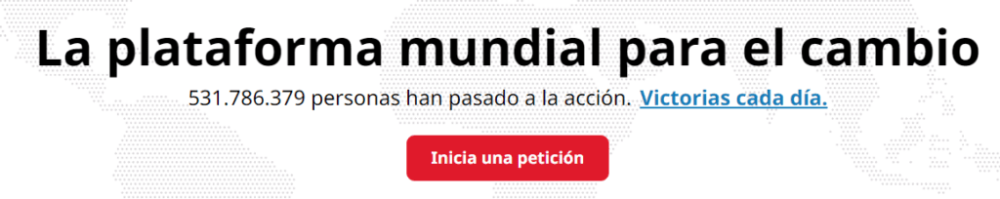{ width="520" }

2. **[Avaaz](https://secure.avaaz.org/page/es/)**: ha organitzat campanyes per defensar els drets de les persones refugiades i combatre el canvi climàtic, amb milions de signatures.
3. **[WeMove.EU](https://wemove.eu/es)**: plataforma europea que impulsa campanyes ciutadanes sobre temes com el medi ambient o la protecció de dades.

    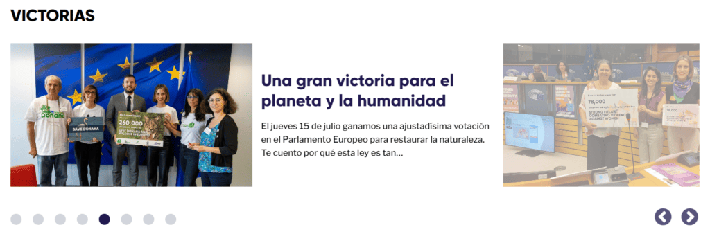{ width="520" }

4. **[Decidim](https://decidim.org/es/)**: plataforma de programari lliure per a la participació ciutadana. L'Ajuntament de Barcelona la va crear i la utilitza perquè la ciutadania participi en l'elaboració del pressupost municipal i en la presa de decisions sobre projectes comunitaris, i avui la fan servir moltes altres administracions.

    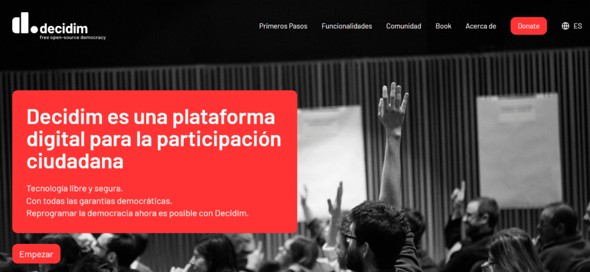{ width="520" }

5. **[Goteo](https://www.goteo.org/)**: plataforma de micromecenatge que ha finançat molts de projectes socials a Espanya, com iniciatives d'economia circular, educació comunitària o desenvolupament de programari lliure.

    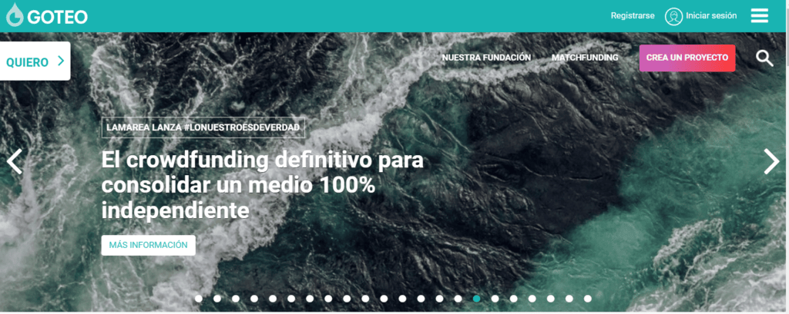{ width="520" }

Tot i els seus beneficis, les plataformes d'iniciativa ciutadana també s'enfronten a problemes importants: la desinformació i la manipulació, una participació desigual per culpa de la bretxa digital i un impacte limitat, ja que la majoria de mobilitzacions no aconsegueixen canvis polítics o legislatius concrets.

!!! example "Exercici 7.3. Plataformes d'iniciativa ciutadana"
    Tria, de la plataforma que vulguis, cinc propostes que signaries perquè hi estàs d'acord i dues que no signaries mai.

    Després, grava un vídeo d'almenys cinc minuts en què expliquis què es demana en cada una i per què hi estàs a favor o en contra.

### 7.5.2. Cibervoluntariat

El **cibervoluntariat** és una forma de voluntariat que es fa a través d'internet i altres tecnologies digitals. Permet a les persones oferir el seu temps i les seves habilitats per donar suport a causes diverses sense haver de ser-hi físicament. En un món digitalitzat com el nostre, amplia molt les oportunitats de participar en tota mena de causes.

Aquí tens alguns exemples, per si encara no tens clar en quines activitats pots aportar el teu temps per ajudar els altres sense sortir de casa:

- **Formació en competències digitals**: l'organització **[Cibervoluntarios.org](https://www.cibervoluntarios.org/)** connecta voluntaris amb persones que necessiten millorar les seves competències digitals i ofereix tallers i tutories en línia sobre l'ús d'internet, les eines de productivitat o les xarxes socials.

    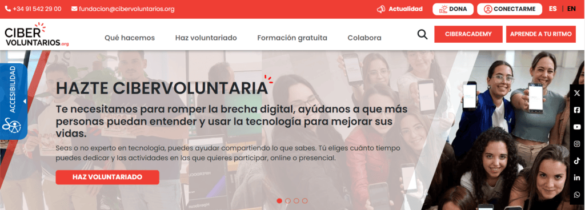{ width="520" }

- **Assistència tècnica**: **[Volunteers for Ukraine](https://volunteersforukraine.org/)** és una plataforma que connecta voluntaris amb organitzacions que necessiten ajuda per als seus projectes humanitaris.

    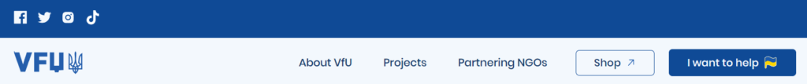

- **Creació de contingut**: **[Translators without Borders](https://translatorswithoutborders.org/)** mobilitza voluntaris per traduir informació vital, com recursos de salut i educació, a molts d'idiomes, perquè hi puguin accedir persones de regions diferents del món.

    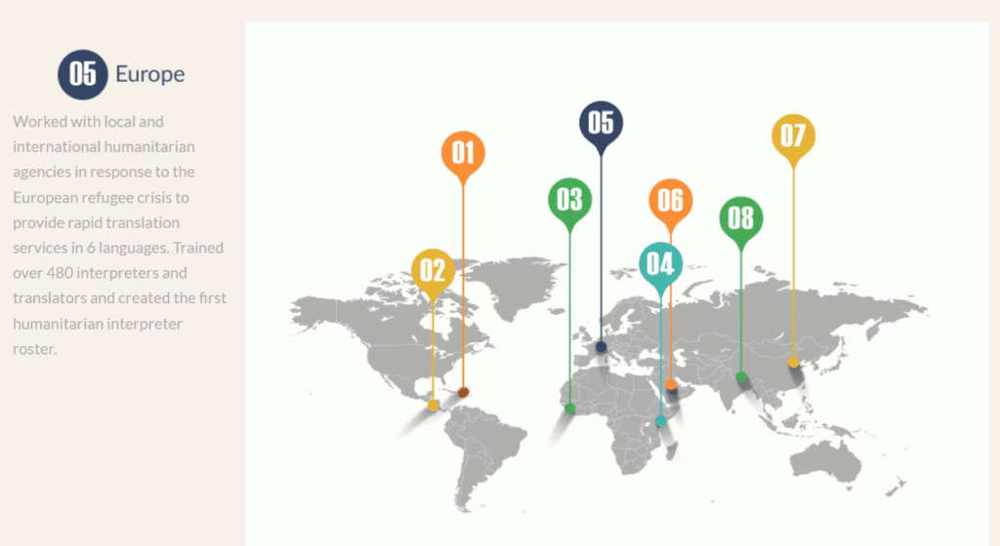{ width="520" }

- **Suport a emprenedors**: **[MicroMentor](https://es.micromentor.org/)** és una plataforma que connecta emprenedors amb mentors voluntaris que els assessoren en diversos aspectes del negoci, des del màrqueting fins a la gestió financera.

    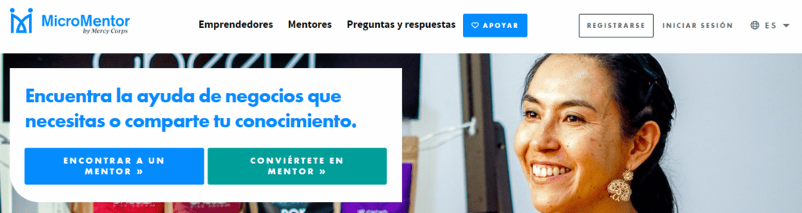{ width="520" }

- **Cartografia de zones vulnerables**: l'**[Humanitarian OpenStreetMap Team](https://www.hotosm.org/)** mobilitza voluntaris per cartografiar regions que no tenen dades cartogràfiques detallades. Les organitzacions d'ajuda humanitària utilitzen aquests mapes durant les emergències, com terratrèmols o inundacions, per planificar i coordinar la seva feina.

    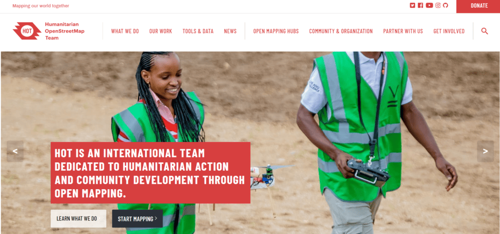{ width="520" }

- **Suport a la recerca científica**: **[Zooniverse](https://www.zooniverse.org/)** és una plataforma que permet als voluntaris col·laborar en projectes científics molt diversos, des de classificar galàxies fins a identificar animals en vídeos de càmeres de fototrampeig, i així contribuir a l'avanç de la ciència.

    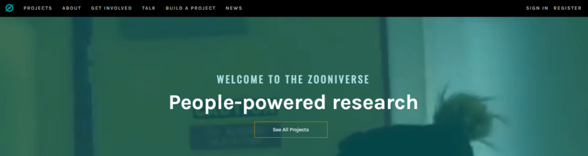{ width="520" }

### 7.5.3. Comunitats de maquinari i programari lliures

Les **comunitats de maquinari i programari lliures** són grups de persones que col·laboren per desenvolupar tecnologies accessibles per a tothom. Es basen en els principis de **llibertat**, **col·laboració** i **transparència** i permeten que qualsevol persona utilitzi, modifiqui i distribueixi les seves creacions.

Alguns exemples destacats d'aquestes comunitats són:

- **Linux**: és un dels projectes de programari lliure més coneguts i utilitzats del món. És un sistema operatiu inspirat en Unix desenvolupat de manera col·laborativa per milers de programadors. Distribucions com **[Ubuntu](https://ubuntu.com/)**, **[Fedora](https://fedoraproject.org/es/)** o **[Debian](https://www.debian.org/index.ca.html)** s'utilitzen molt en servidors i ordinadors personals i són una alternativa lliure als sistemes operatius propietaris.
- **Arduino**: és una plataforma de maquinari lliure que **[facilita la creació de projectes electrònics](https://www.arduino.cc/)**. Consisteix en unes plaques de desenvolupament i un entorn de programació fàcil d'utilitzar. La seva comunitat ha desenvolupat projectes innombrables, des de simples sensors de temperatura fins a robots complexos, i els comparteix obertament perquè altres els puguin reproduir.

    

    <iframe src="https://www.youtube-nocookie.com/embed/Zs9MZosVuqo" title="Vídeo sobre Arduino" loading="lazy" allowfullscreen></iframe>
    

- **Mozilla**: és una organització sense ànim de lucre dedicada a **[promoure el programari lliure i una internet oberta](https://www.mozilla.org/ca/)**. El seu producte més conegut és el navegador **Firefox**, una alternativa als navegadors propietaris centrada en la privacitat i la seguretat, que millora contínuament gràcies a les aportacions de la comunitat.

    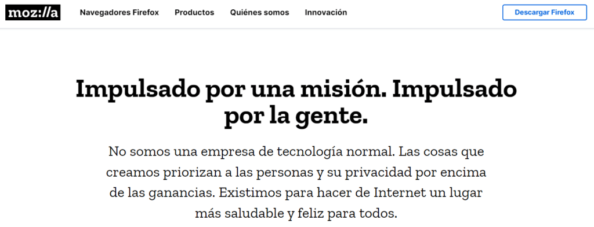{ width="520" }

- **Raspberry Pi**: és una sèrie d'ordinadors de placa única de baix cost pensats per ensenyar informàtica i desenvolupar projectes electrònics. Les comunitats de **[Raspberry Pi](https://www.raspberrypi.com/)** han creat moltíssims recursos educatius i projectes innovadors, des d'estacions meteorològiques fins a sistemes de domòtica, i els comparteixen lliurement.

    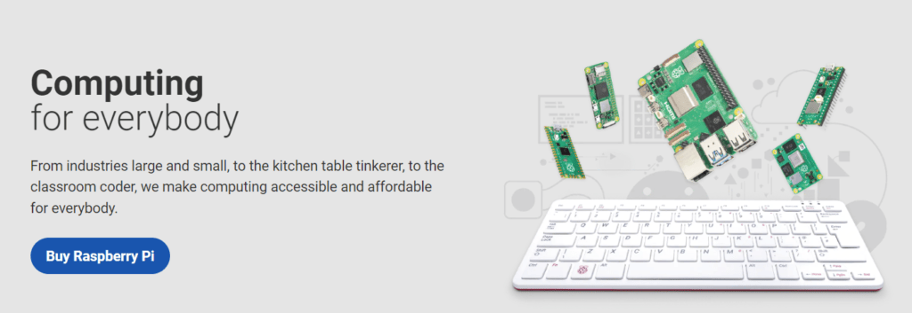{ width="520" }

- **LibreOffice**: és un paquet ofimàtic de codi obert amb aplicacions de processament de textos, fulls de càlcul, presentacions, dibuix i bases de dades. Desenvolupat per The Document Foundation, **[LibreOffice](https://www.libreoffice.org/)** és una alternativa gratuïta als paquets ofimàtics propietaris, que utilitzen governs, empreses i particulars de tot el món.
- **Blender**: és una aplicació de codi obert per crear gràfics i animacions en 3D. La seva comunitat ha crescut moltíssim i ha contribuït a desenvolupar un programa sòlid que competeix amb eines comercials. **[Blender](https://www.blender.org/)** s'ha utilitzat en la producció de pel·lícules, videojocs i efectes visuals d'alta qualitat.

    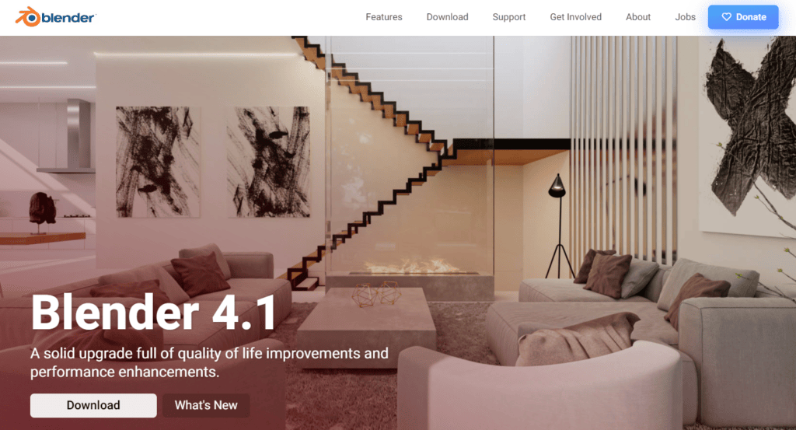{ width="520" }

- **Nextcloud**: és una plataforma de programari lliure que permet muntar el teu propi servei d'emmagatzematge al núvol, com a alternativa a serveis comercials com Google Drive o Dropbox. Amb **[Nextcloud](https://nextcloud.com/es/)** es poden guardar, compartir i sincronitzar arxius de manera segura i privada, mantenint el control total de les dades.

    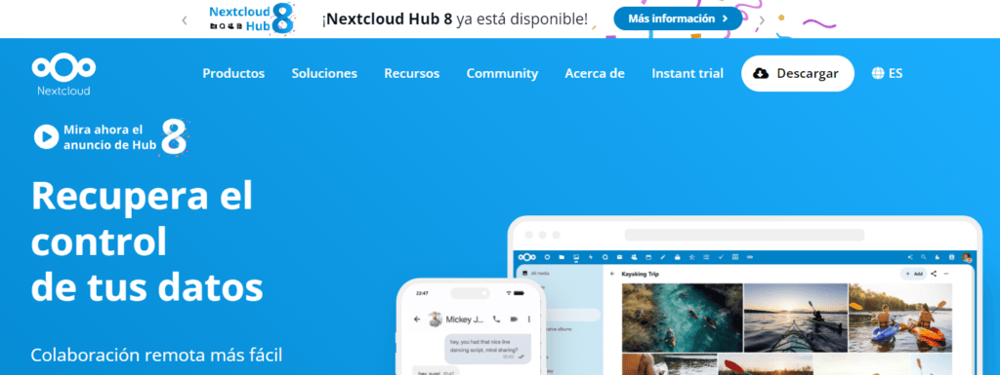{ width="520" }

---

!!! quote "Font"
    Unitat traduïda i adaptada de [«Tema 7. Ciudadanía digital crítica»](https://lopegonzalez.es/eso-y-bachillerato/digitalizacion-4o-eso/tema-7-ciudadania-digital-critica/), de Lope González Vázquez ([CC BY-NC-SA 4.0](https://creativecommons.org/licenses/by-nc-sa/4.0/deed.ca)). Canvis: traducció al català, adaptació al currículum i als serveis de les Illes Balears (IB-Salut, seu electrònica del Govern, Grans Actius), reorganització del format i afegits breus sobre la llicència d'aquesta web i el Reglament europeu d'IA. S'han suavitzat o generalitzat algunes afirmacions que no s'han pogut verificar, s'ha eliminat el rànquing de blogs i s'ha substituït la comparació de titulars de dos diaris per una indicació general. Els vídeos i bona part dels enllaços externs són en castellà.
