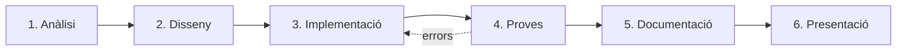

# Projecte final. Una aplicació de terminal documentada

Ha arribat el moment de posar-ho tot en pràctica. En aquest projecte desenvoluparàs, de principi a fi, una **aplicació de terminal en Python** que resolgui un problema real, seguint les fases del cicle de vida que vam veure a la unitat 8 i amb la documentació que vam veure a la unitat 9.

!!! abstract "Què has de lliurar"
    1. El **document d'anàlisi i disseny**: requisits, casos d'ús i descomposició del problema.
    2. El **codi font** de l'aplicació, llegible i comentat.
    3. La **taula de proves** completada.
    4. El fitxer **`README.md`**.
    5. El **manual d'usuari**.
    6. Una **presentació breu** en què mostris l'aplicació en funcionament.

## P.1. Requisits tècnics mínims

La teva aplicació ha de:

- Funcionar a la terminal i organitzar-se amb un **menú** que es repeteixi fins que l'usuari triï sortir.
- Fer servir **estructures condicionals** i **iteratives**.
- Guardar les dades en **llistes** i, almenys en una part del programa, en una **taula** (llista de llistes).
- **Manipular cadenes de caràcters** (cercar, transformar, validar, donar format…).
- **Validar totes les entrades** de l'usuari: el programa no s'ha d'aturar mai amb un error, escrigui el que escrigui l'usuari.
- Presentar la informació de manera **clara i ordenada**, amb missatges comprensibles.
- Tenir una **capçalera** i **comentaris** útils, noms descriptius i constants amb nom.

## P.2. Idees de projecte

Pots triar una d'aquestes propostes o proposar-ne una de pròpia, que haurà d'aprovar el professor. En tots els casos, **les dades es perden en tancar el programa**: guardar-les en fitxers o en bases de dades és un contingut de PTD II.

| Projecte | Descripció |
| --- | --- |
| **Biblioteca d'aula** | Alta i baixa de llibres, préstecs i devolucions, consulta de quins llibres té cada alumne i quins estan disponibles. |
| **Quadern de notes** | Taula d'alumnes × activitats: introduir i modificar notes, mitjanes per alumne i per activitat, llistat ordenat, estadístiques del grup. |
| **Joc de preguntes** | Banc de preguntes per categories, partida amb preguntes a l'atzar, puntuació, rànquing de jugadors de la sessió. |
| **Penjat** | Paraules per categories i nivells de dificultat, dibuix del penjat amb caràcters, lletres ja provades, partides de dos jugadors. |
| **Tres en ratlla** | Tauler de 3 × 3, dos jugadors o contra l'ordinador (jugades a l'atzar), detecció de guanyador i d'empat, marcador. |
| **Caixa forta de missatges** | Xifratge i desxifratge amb Cèsar i Vigenère, trencament per força bruta, anàlisi de freqüència de lletres. |
| **Inventari d'una botiga** | Productes amb preu i estoc, entrades i vendes, avisos d'estoc baix, tiquet de venda amb format. |
| **Reserves de l'aula d'informàtica** | Taula de dies × hores, reservar i anul·lar franges, visualitzar la setmana, impedir reserves dobles. |

## P.3. Fases del projecte



### Fase 1. Anàlisi

- Descriu en un paràgraf el problema que resol la teva aplicació i per a qui és.
- Escriu la llista de **requisits funcionals** (què ha de fer) i **no funcionals** (com ho ha de fer). Numera'ls: RF1, RF2… i RNF1, RNF2…
- Escriu almenys **tres casos d'ús** complets.

### Fase 2. Disseny

- Fes el **diagrama de descomposició** (disseny descendent) de l'aplicació.
- Decideix **com guardaràs les dades**: quines llistes i taules necessites i què representa cada posició. Per exemple: «`llibres` és una llista de llistes; cada fila és `[títol, autor, disponible]`».
- Dibuixa com serà el **menú** i com es veuran les pantalles principals a la terminal.
- Fes el **diagrama de flux** o el **pseudocodi** de les dues operacions més complexes.

### Fase 3. Implementació

Programa **per parts**, provant cada part abans de passar a la següent. Un bon ordre és:

1. El menú, amb opcions que de moment només mostren un missatge.
2. Les dades inicials d'exemple, perquè no hagis d'introduir-les cada vegada que proves.
3. Les opcions una a una, començant per la més senzilla (normalment, mostrar les dades).
4. La validació de les entrades.
5. El format de la sortida.

!!! tip "Esquelet per començar"
    Pots partir d'aquest esquelet i adaptar-lo al teu projecte:

    ```python
    """
    Programa:    [Nom de l'aplicació]
    Autoria:     [Nom i llinatges]
    Data:        [Data]
    Descripció:  [Què fa l'aplicació, en una o dues frases]
    """

    # Dades inicials d'exemple: cada fila és [títol, autor, disponible]
    llibres = [
        ["El Petit Príncep", "Antoine de Saint-Exupéry", True],
        ["Mecanoscrit del segon origen", "Manuel de Pedrolo", True],
    ]

    while True:
        print()
        print("=== BIBLIOTECA D'AULA ===")
        print("1. Veure els llibres")
        print("2. Afegir un llibre")
        print("0. Sortir")
        opcio = input("Tria una opció: ").strip()

        if opcio == "1":
            if len(llibres) == 0:
                print("No hi ha cap llibre.")
            for i in range(len(llibres)):
                titol = llibres[i][0]
                autor = llibres[i][1]
                if llibres[i][2]:
                    estat = "disponible"
                else:
                    estat = "prestat"
                print(f"{i + 1:>2}. {titol:<32} {autor:<28} {estat}")

        elif opcio == "2":
            titol = input("Títol: ").strip()
            autor = input("Autor: ").strip()
            if titol == "" or autor == "":
                print("El títol i l'autor no poden estar buits.")
            else:
                llibres.append([titol, autor, True])
                print(f"S'ha afegit «{titol}».")

        elif opcio == "0":
            print("Fins aviat!")
            break

        else:
            print("Opció no vàlida. Escriu el número d'una de les opcions del menú.")
    ```

### Fase 4. Proves

- Fes la **taula de proves** de l'aplicació, amb casos normals, casos límit i dades incorrectes per a cada opció del menú.
- Executa totes les proves i completa la taula. Corregeix els errors que trobis i torna a provar.
- Demana a una altra persona que faci servir l'aplicació **sense mirar el codi** i apunta on s'encalla (com a l'exercici 9.4).

### Fase 5. Documentació

- Revisa la **capçalera** i els **comentaris** del codi.
- Escriu el **`README.md`** i el **manual d'usuari** amb les estructures de la unitat 9.

### Fase 6. Presentació

Presenta el projecte a la classe en uns 5 minuts: quin problema resol, una demostració en directe de les funcions principals, la part que t'ha costat més i com l'has resolta, i què milloraries si tinguessis més temps.

## P.4. Llista de comprovació abans de lliurar

- [ ] L'aplicació s'executa sense errors des del principi.
- [ ] He provat totes les opcions del menú, també amb dades incorrectes, i el programa no s'atura mai amb un error.
- [ ] Faig servir llistes i almenys una taula (llista de llistes).
- [ ] Manipulo cadenes de caràcters.
- [ ] Els noms de les variables són descriptius i les constants tenen nom.
- [ ] El codi té capçalera i comentaris útils, i els comentaris estan actualitzats.
- [ ] Els missatges a l'usuari són clars i indiquen què s'ha d'escriure.
- [ ] La taula de proves està completa.
- [ ] El `README.md` i el manual d'usuari corresponen a la versió que lliuro.

!!! info "I l'any que ve?"
    A PTD II podràs millorar aquest mateix projecte: organitzar el codi en **funcions** i **classes**, guardar les dades en **fitxers** o en una **base de dades** perquè no es perdin en tancar el programa, i fer-lo funcionar amb dades reals.

---

!!! quote "Font"
    Projecte de creació pròpia per al currículum de Programació i Tractament de Dades I de les Illes Balears. Els llibres de les dades d'exemple són reals: *El Petit Príncep*, d'Antoine de Saint-Exupéry, i *Mecanoscrit del segon origen*, de Manuel de Pedrolo.
