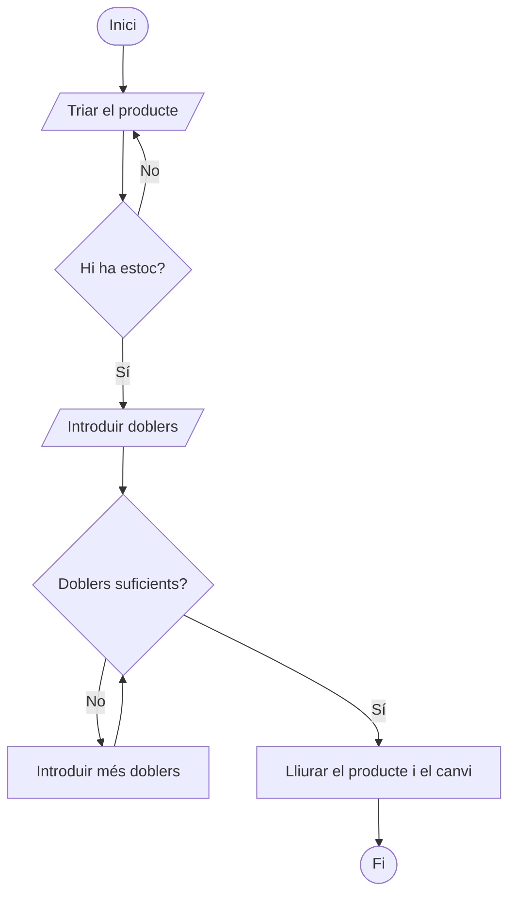
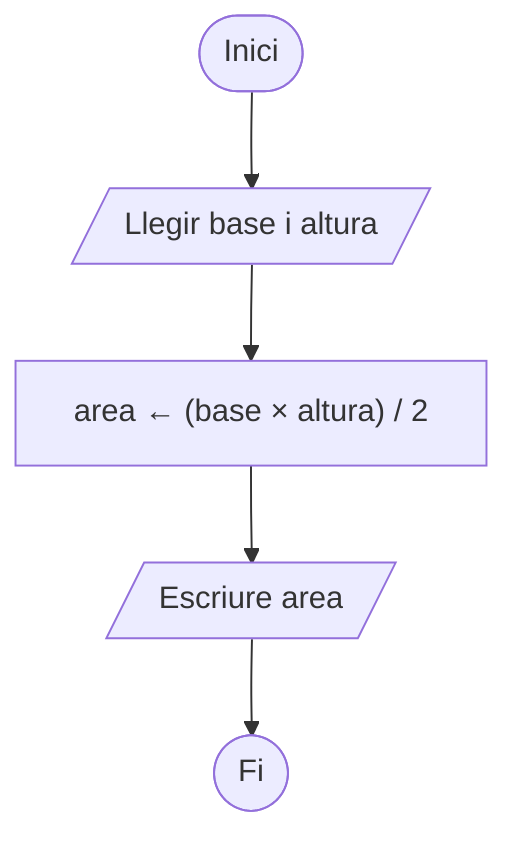

# Unitat 1. Pensament computacional i algorísmia

Avui, entendre la tecnologia és una competència fonamental que dona un avantatge important a qui la domina. Aprendre a programar té una utilitat pràctica indiscutible i, a més, és una de les habilitats més demandades per sectors professionals molt diversos.

Programar no és només una qüestió tècnica: és una manera nova d'afrontar la resolució de problemes. Desenvolupa el **pensament lògic i estructurat**, necessari per descompondre problemes complexos en passes més fàcils d'abordar, i això no només serveix en l'àmbit tecnològic, sinó també en moltes situacions quotidianes. A més, saber programar ens ajuda a **entendre millor el món digital que ens envolta** i ens converteix en creadors, no només en consumidors de la tecnologia que fan altres.

## 1.1. Instruccions i seqüenciació

Un dels principis fonamentals de la programació és la capacitat de **donar instruccions** clares i precises **perquè l'ordinador faci les tasques correctament**.

Per exemple, quan dius al teu germà petit «gira el tap cap a l'altre costat» o «posa la peça groga damunt la verda», li dones instruccions. Amb l'ordinador feim el mateix.

Aquestes instruccions són la base de qualsevol programa i han de seguir un ordre lògic que permeti arribar a l'objectiu. Aquí entra en joc la **seqüenciació**: l'organització correcta de les accions que ha de fer un programa per complir la seva funció.

La seqüenciació és important perquè un programa segueix un flux d'execució estricte: **l'ordre en què es donen les instruccions influeix directament en el resultat final**, igual que, si no segueixes l'ordre d'una recepta de cuina, no obtindràs el plat que esperaves.

## 1.2. Algorismes

Un **algorisme** és un conjunt d'instruccions ordenades que descriuen, pas a pas, com fer una tasca o resoldre un problema.

Aleshores, una recepta de cuina és un algorisme? Efectivament.

En programació, aquestes passes són instruccions que l'ordinador executa per obtenir un resultat. Els algorismes són fonamentals perquè permeten escriure programes que no només resolen problemes concrets, sinó que també són eficients i consumeixen la menor quantitat possible de recursos (temps, memòria, processador…).

Per exemple, un algorisme per cercar un llibre en una biblioteca podria ser així:

1. **Inici**: entrar a la biblioteca.
2. **Cerca**: anar a la secció que correspon al gènere del llibre.
3. **Selecció**: cercar el llibre pel títol, en ordre alfabètic.
4. **Comprovació**: si el llibre hi és, agafar-lo; si no hi és, cercar-ne un altre o demanar-ho al bibliotecari.
5. **Fi**: sortir de la biblioteca amb el llibre.

Cada una d'aquestes passes forma part de l'algorisme, i ometre'n qualsevol podria fer que no aconseguíssim l'objectiu: trobar el llibre i endur-nos-el.

A més de programar, utilitzam algorismes cada dia sense adonar-nos-en: quan organitzam les tasques del dia, quan decidim la ruta més ràpida per arribar a un lloc o quan feim la compra al supermercat seguint un ordre que ens estalviï temps.

Vegem dos algorismes molt senzills:

=== "Preparar un cafè"

    1. Omplir d'aigua el dipòsit de la cafetera.
    2. Posar-hi el cafè.
    3. Engegar la cafetera.
    4. Esperar que el cafè estigui fet.
    5. Servir el cafè a la tassa.

=== "Calcular l'àrea d'un triangle"

    1. Obtenir la base del triangle.
    2. Obtenir l'altura del triangle.
    3. Multiplicar la base per l'altura.
    4. Dividir el resultat entre 2.
    5. Mostrar el resultat.

Si canviam l'ordre d'aquestes passes, el resultat no serà el que esperàvem. Aquests dos algorismes són molt senzills, però pensa en les passes que ha de seguir un cotxe autònom per prendre decisions mentre circula per una ciutat. Ja no és tan fàcil, oi? Els algorismes poden tenir nivells de complexitat molt diferents, i expressar-los com una llista de passes no sempre és l'opció més adequada.

## 1.3. Maneres d'expressar un algorisme

Quan una solució té centenars o milers de passes, expressar-la en llenguatge natural és feixuc, costa d'entendre (tant per a les persones com per a les màquines) i és molt difícil de mantenir. Per això necessitam maneres més àgils d'expressar els algorismes. Ens centrarem en dues de les més habituals: els **diagrames de flux** i el **pseudocodi**.

### 1.3.1. Diagrames de flux

Els **diagrames de flux** són representacions gràfiques de les passes d'un procés, amb símbols connectats per fletxes. Faciliten veure la seqüència d'operacions i són molt útils per planificar i explicar algorismes complexos. Els pots imaginar com un mapa que et guia per camins diferents segons les decisions que prens a cada punt.

Aquests en són els components principals:

| Símbol | Nom | Funció |
| --- | --- | --- |
| Oval o rectangle arrodonit | **Terminal** | Representa l'inici o el final de l'algorisme. |
| Rectangle | **Procés** | Representa qualsevol acció o càlcul. |
| Rombe | **Decisió** | Avalua una condició i, segons el resultat, segueix un camí o un altre. |
| Paral·lelogram | **Entrada/sortida** | Representa la lectura de dades (entrada) o la presentació de resultats (sortida). |
| Fletxa | **Flux** | Indica quina és la instrucció següent. |

Vegem un diagrama de flux que controla les accions per treure un producte d'una màquina expenedora:



Com veus, tot diagrama de flux ha de complir algunes regles. Entre les més habituals:

- Ha de començar en un únic punt.
- Ha d'acabar, és a dir, no hi pot haver bucles infinits.
- Les decisions només tenen dues sortides possibles: sí o no.

Hi ha moltes eines per fer diagrames de flux. Aquestes són algunes de les més recomanables:

- **[draw.io (diagrams.net)](https://www.drawio.com/)**: gratuïta, funciona des del navegador i s'integra amb Google Drive.
- **[Lucidchart](https://www.lucidchart.com/pages/es)**: permet crear diagrames complexos de manera senzilla i col·laborativa, també des del navegador.
- **[Microsoft Visio](https://www.microsoft.com/es-es/microsoft-365/visio/flowchart-software)**: adequada si es fan servir altres programes de Microsoft Office.

!!! example "Exercici 1.1. Diagrames de flux"
    Dissenya un diagrama de flux per a cada un d'aquests algorismes senzills:

    1. **Decidir quina roba posar-se.** Segons la temperatura, considera tres franges: menys de 15 °C (roba d'hivern), entre 15 °C i 25 °C (roba de mitja temporada) i més de 25 °C (roba d'estiu).
    2. **Triar un mitjà de transport.** Si plou, agafa el cotxe; si no, si la distància és inferior a 3 km, vés a peu; si no, agafa la bicicleta.
    3. **Calcular el total a pagar en una botiga.** El client introdueix la quantitat de productes i el preu per unitat. El total és la quantitat multiplicada pel preu per unitat.
    4. **Saber si un nombre és parell o senar.** El diagrama ha de determinar si un nombre enter és parell o senar.
    5. **Fregir un ou.** Considera passes com triar la paella, escalfar l'oli, rompre l'ou, el temps de cocció, etc.

    **Lliurament**: exporta cada diagrama en format d'imatge i penja'ls a l'aula virtual abans de la data límit.

### 1.3.2. Pseudocodi

Els diagrames de flux són molt útils per prendre decisions de disseny i ens acosten una passa més del llenguatge natural al codi de programació. Tot i així, encara en són lluny.

El **pseudocodi** és una manera d'expressar un algorisme amb frases i estructures que imiten el codi de programació, però en un llenguatge més accessible i menys rígid. No està pensat perquè l'executi una màquina, sinó perquè l'entenguin les persones.

```text title="Pseudocodi"
Inici
    Si plou llavors
        Agafar el paraigua
    Sinó
        No agafar el paraigua
    FiSi
Fi
```

Aquest mètode és especialment útil per explicar una lògica complexa abans de programar-la en un llenguatge concret.

L'avantatge d'escriure els algorismes en pseudocodi és que **no cal conèixer la sintaxi de cap llenguatge de programació**: són tan expressius que traduir-los a qualsevol llenguatge és molt ràpid. Així, especialistes de llenguatges diferents poden debatre el codi d'un programa escrit en un llenguatge comú que tothom entén.

Vegem com quedaria l'algorisme de l'àrea del triangle en pseudocodi:

```text title="Pseudocodi"
Inici
    Llegir base
    Llegir altura
    area ← (base × altura) / 2
    Escriure area
Fi
```

I el mateix algorisme en diagrama de flux:



!!! example "Exercici 1.2. Del diagrama al pseudocodi"
    Escriu en pseudocodi els cinc algorismes que has representat amb diagrames de flux a l'exercici 1.1.

## 1.4. Del pseudocodi al codi

El **codi** és el mitjà amb què els programadors donam instruccions a un ordinador perquè faci una sèrie de tasques. En essència, el codi és el llenguatge que utilitzam per comunicar-nos amb les màquines: **utilitzam el codi per escriure algorismes que un ordinador pugui entendre**.

És com quan escrius una recepta per a algú que no ha cuinat mai: si no expliques cada passa amb precisió, és probable que el plat no surti bé. Amb el codi passa el mateix: cada instrucció ha de ser clara i estar estructurada perquè l'ordinador la pugui executar sense errors. Per això aprendre a programar no només vol dir conèixer les regles d'un llenguatge (en el nostre cas, Python), sinó també saber estructurar bé les instruccions.

Recordes l'algorisme que calculava l'àrea d'un triangle? Aquest és el codi en Python que li donaríem a l'ordinador:

```python
base = 7
altura = 10
area = (base * altura) / 2
print("L'àrea del triangle és:", area)
```

A la unitat següent veurem com instal·lar l'entorn per programar en Python. Mentrestant, entrenem una mica el cap programant amb jocs.

!!! example "Exercici 1.3. Aprendre jugant"
    Juga almenys al primer d'aquests jocs. Si acabes aviat, continua amb els altres dos.

    - **Obligatori**: [Compute It](https://compute-it.toxicode.fr/?hour-of-code&progression=python)
    - **Recomanable**: [Silent Teacher](https://silentteacher.toxicode.fr/hour_of_code.html?theme=basic_python)
    - **Només si ets molt PRO**: [CodeCombat](https://codecombat.com/play/dungeon?hour_of_code=true)

---

!!! quote "Font"
    Unitat elaborada a partir de materials de Lope González Vázquez ([CC BY-NC-SA 4.0](https://creativecommons.org/licenses/by-nc-sa/4.0/deed.ca)): [«Tema 11. Fundamentos de programación»](https://lopegonzalez.es/eso-y-bachillerato/tic-i-1o-bachillerato/tema-11-fundamentos-de-programacion/) (TIC I) i [«Tema 1. Introducción a la programación»](https://lopegonzalez.es/eso-y-bachillerato/creacion-digital-y-pensamiento-computacional-1o-bachillerato/tema-1-introduccion-a-la-programacion/) (Creación digital y pensamiento computacional). Canvis: traducció al català, adaptació al currículum de Programació i Tractament de Dades I de les Illes Balears, reorganització i combinació de les dues fonts, diagrames de flux refets en català i pseudocodi en català. L'exercici 1.2 és propi.
