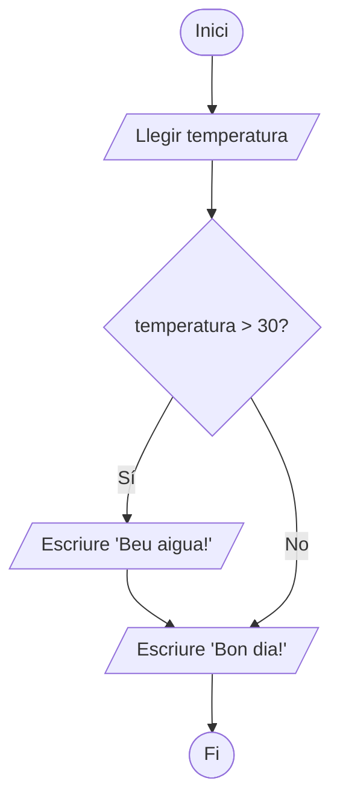

# Unitat 4. Estructures condicionals

Fins ara, els nostres programes executaven totes les instruccions, una darrere l'altra, de dalt a baix. Però els programes útils han de **prendre decisions**: mostrar un missatge o un altre, calcular d'una manera o d'una altra, segons les dades que reben.

Les **estructures de control** ens permeten dirigir el flux d'execució del programa segons unes condicions. És a dir, hi haurà instruccions que s'executaran i d'altres que no. Com es decideix quines s'executen? Depèn de les condicions que escriguem al codi. Hi ha tres grans tipus d'estructures de control: les **condicionals**, que veurem en aquesta unitat, les **iteratives** (bucles) i les **de salt**, que veurem a la unitat 5.

## 4.1. La condició: una expressió booleana

Una **condició** és qualsevol expressió que dona com a resultat `True` o `False`. A la unitat 3 ja les hem vistes: són les comparacions (`edat >= 18`, `nota == 10`) i les combinacions amb operadors lògics (`edat >= 18 and te_carnet`).

!!! tip "Comparacions encadenades"
    Python permet escriure intervals com a matemàtiques: `0 <= nota <= 10` és equivalent a `nota >= 0 and nota <= 10`, però més fàcil de llegir.

!!! example "Exercici 4.1. Avalua la condició"
    Amb `nota = 6.5`, quin és el resultat de cada condició?

    `5 <= nota < 7` · `nota > 5 and nota < 6` · `not nota >= 5` · `nota == 6.5 or nota > 10`

    ??? success "Solució"
        `True`, `False`, `False` i `True`.

## 4.2. Condicional simple: `if`

La forma més senzilla executa un bloc d'instruccions **només si** la condició és vertadera. Si és falsa, el bloc es bota i el programa continua.

```python
temperatura = float(input("Quina temperatura fa? "))

if temperatura > 30:
    print("Fa molta calor. Beu aigua!")

print("Bon dia!")   # aquesta línia s'executa sempre
```

Fixa't en tres detalls de sintaxi imprescindibles:

1. La línia de l'`if` acaba amb **dos punts** (`:`).
2. Les instruccions que depenen de la condició van **sagnades** (4 espais). El sagnat no és decoratiu: és el que indica a Python on comença i on acaba el bloc.
3. La primera línia que torna al marge esquerre ja **no** forma part del bloc.



!!! example "Exercici 4.2. Avís de bateria"
    Escriu un programa que demani el percentatge de bateria del mòbil. Si és inferior al 20 %, ha de mostrar «Bateria baixa: connecta el carregador». En tots els casos, al final ha de mostrar «Nivell de bateria: X %».

    ??? success "Solució"
        ```python
        bateria = int(input("Percentatge de bateria: "))

        if bateria < 20:
            print("Bateria baixa: connecta el carregador")

        print(f"Nivell de bateria: {bateria} %")
        ```

        La darrera línia no està sagnada: per això s'executa sempre, es compleixi o no la condició.

## 4.3. Condicional doble: `if` … `else`

Amb `else` (sinó) indicam què s'ha de fer quan la condició és **falsa**. Sempre s'executa un dels dos blocs, mai tots dos.

```python
edat = int(input("Quants d'anys tens? "))

if edat >= 18:
    print("Ets major d'edat")
else:
    print("Ets menor d'edat")
```

!!! example "Exercici 4.3. Major d'edat"
    Demana a l'usuari la seva edat i digues si és major d'edat o no.

    ??? success "Solució"
        ```python
        edat = int(input("Quants d'anys tens? "))
        if edat >= 18:
            print("Ets major d'edat")
        else:
            print("Ets menor d'edat")
        ```

!!! example "Exercici 4.4. Parell o senar"
    Demana un nombre enter i digues si és parell o senar.

    ??? success "Solució"
        ```python
        n = int(input("Escriu un nombre enter: "))
        if n % 2 == 0:
            print(f"{n} és parell")
        else:
            print(f"{n} és senar")
        ```

## 4.4. Condicional múltiple: `if` … `elif` … `else`

Quan hi ha més de dues possibilitats, afegim tantes branques `elif` (abreviatura d'*else if*, «sinó, si») com calguin.

```python linenums="1"
edat = 20

if edat < 18:
    print("Ets menor d'edat")
elif edat >= 18 and edat < 65:
    print("Ets una persona adulta")
else:
    print("Jubilat! Enhorabona")
```

Vegem què fa aquest codi línia a línia. A la línia 1 cream la variable `edat` i hi guardam el valor 20. La resta és una estructura condicional amb dues condicions:

- A la línia 3 preguntam: «És `edat` menor que 18?». Si ho és, s'executa el bloc que té a dins (línia 4) i **ja no es comprova res més** (línies 5 a 8).
- Si no ho és, el programa bota a la línia 5 i comprova la segona condició: «És `edat` major o igual que 18 i menor que 65?». Si ho és, s'executa la línia 6 i s'acaba l'estructura.
- Si tampoc no ho és, s'executa el bloc de l'`else` (línia 8).

!!! info "Només s'executa una branca"
    Python comprova les condicions **en ordre** i executa **només la primera** que és vertadera. Per això, a la línia 5 la part `edat >= 18` és redundant: si hem arribat fins allà, ja sabem que l'edat no és menor que 18. Podríem escriure simplement `elif edat < 65:`. L'`else` final és opcional.

!!! warning "Error freqüent: l'ordre de les condicions"
    Aquest programa té un error. Saps quin?

    ```python
    nota = 9.5
    if nota >= 5:
        print("Aprovat")
    elif nota >= 9:
        print("Excel·lent")
    ```

    ??? success "Resposta"
        Qualsevol nota de 9 o més també és major o igual que 5, de manera que sempre entra a la primera branca i mai no arriba a mostrar «Excel·lent». Quan les condicions se solapen, cal posar primer la més restrictiva (`nota >= 9`).

!!! example "Exercici 4.5. El major de dos"
    Demana dos nombres i mostra quin és el major. Tingues en compte que poden ser iguals.

    ??? success "Solució"
        ```python
        a = float(input("Primer nombre: "))
        b = float(input("Segon nombre: "))
        if a > b:
            print(f"El major és {a}")
        elif b > a:
            print(f"El major és {b}")
        else:
            print("Són iguals")
        ```

!!! example "Exercici 4.6. Positiu, negatiu o zero"
    Demana un nombre i digues si és positiu, negatiu o zero.

    ??? success "Solució"
        ```python
        n = float(input("Escriu un nombre: "))
        if n > 0:
            print("Positiu")
        elif n < 0:
            print("Negatiu")
        else:
            print("Zero")
        ```

!!! example "Exercici 4.7. Qualificacions"
    Demana una nota de 0 a 10 i mostra la qualificació: insuficient (menys de 5), suficient (de 5 a menys de 6), bé (de 6 a menys de 7), notable (de 7 a menys de 9) o excel·lent (9 o més). Si la nota no és entre 0 i 10, mostra un missatge d'error.

    ??? success "Solució"
        ```python
        nota = float(input("Nota (0-10): "))
        if not 0 <= nota <= 10:
            print("La nota ha de ser entre 0 i 10")
        elif nota < 5:
            print("Insuficient")
        elif nota < 6:
            print("Suficient")
        elif nota < 7:
            print("Bé")
        elif nota < 9:
            print("Notable")
        else:
            print("Excel·lent")
        ```

## 4.5. Condicionals niades

Dins un bloc condicional hi pot haver qualsevol instrucció, també un altre `if`. Parlam aleshores de **condicionals niades** (o imbricades).

```python
te_entrada = input("Tens entrada? (s/n) ") == "s"
edat = int(input("Quants d'anys tens? "))

if te_entrada:
    if edat >= 16:
        print("Pots entrar al concert")
    else:
        print("Has d'anar acompanyat d'una persona adulta")
else:
    print("Primer has de comprar l'entrada")
```

Niar condicionals és útil, però si hi ha massa nivells, el codi costa molt de llegir. Sovint es pot simplificar amb operadors lògics o amb `elif`:

=== "Niat"

    ```python
    if edat >= 18:
        if te_carnet:
            print("Pots conduir")
    ```

=== "Amb `and`"

    ```python
    if edat >= 18 and te_carnet:
        print("Pots conduir")
    ```

!!! example "Exercici 4.8. Any de traspàs"
    Un any és de traspàs si és divisible entre 4, excepte els que són divisibles entre 100, que només ho són si també són divisibles entre 400. Així, 2024 i 2000 són de traspàs, però 1900 no. Demana un any i digues si és de traspàs.

    ??? success "Solució"
        ```python
        any_ = int(input("Escriu un any: "))
        if (any_ % 4 == 0 and any_ % 100 != 0) or any_ % 400 == 0:
            print(f"{any_} és de traspàs")
        else:
            print(f"{any_} no és de traspàs")
        ```

        Hem escrit `any_` amb guió baix perquè `any` és el nom d'una funció de Python i és millor no tapar-la.

!!! example "Exercici 4.9. Tarifa del bus"
    Una línia de bus cobra 2 € el bitllet ordinari. Els menors de 14 anys i els majors de 65 paguen la meitat, i els menors de 6 anys viatgen gratis. Demana l'edat i mostra el preu del bitllet.

    ??? success "Solució"
        ```python
        edat = int(input("Edat del viatger: "))
        PREU = 2.0
        if edat < 6:
            preu = 0
        elif edat < 14 or edat > 65:
            preu = PREU / 2
        else:
            preu = PREU
        print(f"El bitllet costa {preu:.2f} €")
        ```

        Els preus i les edats d'aquest exercici són inventats.

## 4.6. Selecció per casos: `match` … `case`

Quan hem de comparar **una mateixa variable** amb molts de valors concrets, una cadena d'`elif` es fa llarga. Des de la versió 3.10, Python té l'estructura `match`, semblant al `switch` d'altres llenguatges.

```python
dia = int(input("Escriu un nombre de l'1 al 7: "))

match dia:
    case 1:
        print("Dilluns")
    case 2:
        print("Dimarts")
    case 3:
        print("Dimecres")
    case 4:
        print("Dijous")
    case 5:
        print("Divendres")
    case 6 | 7:
        print("Cap de setmana!")
    case _:
        print("Aquest dia no existeix")
```

- `case 6 | 7` agrupa diversos valors en un mateix cas.
- `case _` és el cas per defecte, equivalent a l'`else`: s'executa si no coincideix cap dels anteriors.

!!! info "Compte amb la versió"
    `match` no funciona en versions de Python anteriors a la 3.10. Si el teu entorn dona un error de sintaxi en aquesta línia, comprova la versió o fes servir `if` … `elif`.

!!! example "Exercici 4.10. Dies de la setmana"
    Demana un nombre de l'1 al 7 i mostra el dia de la setmana corresponent. Resol-lo primer amb `if` … `elif` i després amb `match`.

    ??? success "Solució amb `if` … `elif`"
        ```python
        dia = int(input("Escriu un nombre de l'1 al 7: "))
        if dia == 1:
            print("Dilluns")
        elif dia == 2:
            print("Dimarts")
        elif dia == 3:
            print("Dimecres")
        elif dia == 4:
            print("Dijous")
        elif dia == 5:
            print("Divendres")
        elif dia == 6:
            print("Dissabte")
        elif dia == 7:
            print("Diumenge")
        else:
            print("Nombre no vàlid")
        ```

        La versió amb `match` és l'exemple de l'apartat 4.6, amb un `case` per al dissabte i un altre per al diumenge. A la unitat 7 veurem una manera molt més curta de fer-ho amb una llista.

## 4.7. Reptes

!!! example "Repte 4.1. Calculadora"
    Escriu una calculadora que demani dos nombres i una operació (`+`, `-`, `*` o `/`) i mostri el resultat. Resol-la amb `match`. Si l'operació no és cap de les quatre, ha de mostrar un missatge d'error, i si l'usuari intenta dividir entre zero, també.

    ??? success "Solució"
        ```python
        a = float(input("Primer nombre: "))
        operacio = input("Operació (+, -, *, /): ")
        b = float(input("Segon nombre: "))

        match operacio:
            case "+":
                print(f"{a} + {b} = {a + b}")
            case "-":
                print(f"{a} - {b} = {a - b}")
            case "*":
                print(f"{a} * {b} = {a * b}")
            case "/":
                if b == 0:
                    print("No es pot dividir entre zero")
                else:
                    print(f"{a} / {b} = {a / b}")
            case _:
                print("Operació no vàlida")
        ```

!!! example "Repte 4.2. Pedra, paper, tisora"
    Programa el joc de pedra, paper, tisora contra l'ordinador. L'usuari escriu la seva jugada i l'ordinador en tria una a l'atzar. El programa mostra les dues jugades i qui ha guanyat. Per fer que l'ordinador triï a l'atzar, escriu `import random` a la primera línia i fes servir `random.randint(1, 3)`, que retorna un enter a l'atzar entre 1 i 3.

    ??? success "Solució"
        ```python
        import random

        usuari = input("Pedra, paper o tisora? ").strip().lower()

        numero = random.randint(1, 3)
        if numero == 1:
            ordinador = "pedra"
        elif numero == 2:
            ordinador = "paper"
        else:
            ordinador = "tisora"
        print(f"L'ordinador ha triat {ordinador}")

        if usuari != "pedra" and usuari != "paper" and usuari != "tisora":
            print("Jugada no vàlida")
        elif usuari == ordinador:
            print("Empat!")
        elif (usuari == "pedra" and ordinador == "tisora") or \
             (usuari == "paper" and ordinador == "pedra") or \
             (usuari == "tisora" and ordinador == "paper"):
            print("Has guanyat!")
        else:
            print("Guanya l'ordinador")
        ```

        La barra inversa `\` al final d'una línia indica que la instrucció continua a la línia següent. També es pot evitar posant tota la condició entre parèntesis.

---

!!! quote "Font"
    Unitat elaborada a partir de materials de Lope González Vázquez ([CC BY-NC-SA 4.0](https://creativecommons.org/licenses/by-nc-sa/4.0/deed.ca)): [«Tema 11. Fundamentos de programación»](https://lopegonzalez.es/eso-y-bachillerato/tic-i-1o-bachillerato/tema-11-fundamentos-de-programacion/) (TIC I) i [«Tema 1. Introducción a la programación»](https://lopegonzalez.es/eso-y-bachillerato/creacion-digital-y-pensamiento-computacional-1o-bachillerato/tema-1-introduccion-a-la-programacion/) (Creación digital y pensamiento computacional). Canvis: traducció al català i adaptació al currículum de Programació i Tractament de Dades I de les Illes Balears. Els enunciats dels exercicis 4.3 a 4.7 i 4.10 provenen dels exercicis resolts de Lope (el 4.7, amb l'escala de qualificacions adaptada). Són propis els apartats 4.1, 4.2, 4.3, 4.5 i 4.6 (`match`), els requadres, el diagrama de flux, la resta d'exercicis, els reptes i totes les solucions.
