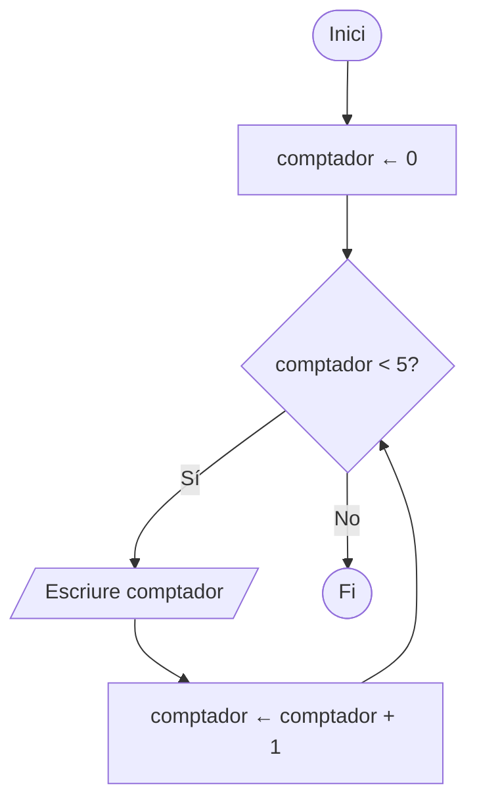

# Unitat 5. Estructures iteratives

Imagina que has de mostrar a la pantalla els nombres de l'1 al 1.000. Podries escriure mil vegades `print()`, però seria absurd. Els ordinadors són molt bons fent la mateixa feina moltes vegades sense cansar-se, i per aprofitar-ho tenim les **estructures iteratives** o **repetitives**, conegudes popularment com a **bucles**.

Cada repetició del bloc d'instruccions d'un bucle s'anomena **iteració**. En Python tenim dos tipus de bucles: `for` i `while`.

## 5.1. El bucle `for`

El bucle `for` s'utilitza per repetir un bloc de codi **quan sabem exactament quantes vegades el volem repetir**, o quan volem recórrer tots els elements d'una seqüència (una cadena, una llista…).

```python
for numero in range(5):
    print(numero)   # Mostra 0 1 2 3 4
```

A cada iteració, la variable `numero` pren el valor següent de la seqüència que genera `range()`. Com amb l'`if`, la línia acaba amb dos punts i el bloc que es repeteix va sagnat.

### 5.1.1. La funció `range()`

`range()` genera una seqüència de nombres enters i admet 1, 2 o 3 paràmetres:

| Crida | Significat | Valors que genera |
| --- | --- | --- |
| `range(5)` | Des de 0 fins a 5, **sense incloure el 5** | 0, 1, 2, 3, 4 |
| `range(5, 7)` | Des de 5 fins a 7, sense incloure el 7 | 5, 6 |
| `range(5, 11, 2)` | Des de 5 fins a 11, de 2 en 2 | 5, 7, 9 |
| `range(9, 2, -2)` | Des de 9 fins a 2, de 2 en 2 cap enrere | 9, 7, 5, 3 |

!!! warning "El darrer valor no s'inclou"
    L'error més habitual amb `range()` és oblidar que el valor final no s'inclou. Per recórrer de l'1 al 10, has d'escriure `range(1, 11)`.

### 5.1.2. Recórrer una cadena

El `for` també pot recórrer directament els caràcters d'una cadena. Ho aprofitarem molt a la unitat 6.

```python
for lletra in "Python":
    print(lletra)   # P y t h o n, una lletra a cada línia
```

## 5.2. El bucle `while`

El bucle `while` («mentre»), a diferència del `for`, **es repeteix mentre una condició sigui vertadera**. És el bucle adequat quan **no sabem per endavant** quantes vegades s'haurà de repetir.

```python
comptador = 0

while comptador < 5:
    print(comptador)
    comptador = comptador + 1   # Mostra 0 1 2 3 4
```



Abans de cada iteració es comprova la condició. Si és vertadera, s'executa el bloc i es torna a comprovar; si és falsa, el bucle s'acaba i el programa continua amb la instrucció següent.

!!! danger "Bucles infinits"
    Si dins el bucle no canvia res que faci que la condició acabi sent falsa, el bucle no s'aturarà mai. Prova d'eliminar la línia `comptador = comptador + 1` de l'exemple anterior: el programa mostrarà zeros sense parar. Per aturar un programa penjat, prem ++ctrl+c++ o el botó d'aturar del teu IDE.

Un ús molt habitual del `while` és **validar dades**: tornar a demanar una dada fins que sigui correcta.

```python
nota = float(input("Nota (0-10): "))
while nota < 0 or nota > 10:
    print("La nota ha de ser entre 0 i 10.")
    nota = float(input("Nota (0-10): "))
print("Nota desada:", nota)
```

!!! tip "`for` o `while`?"
    - Saps quantes vegades s'ha de repetir, o has de recórrer una seqüència? → `for`.
    - Depèn d'una condició que no saps quan es complirà (l'usuari, un càlcul, un sensor…)? → `while`.

## 5.3. Comptadors i acumuladors

Dins els bucles, hi ha dos patrons que apareixen constantment:

- Un **comptador** és una variable que s'incrementa en una quantitat fixa (normalment 1) cada vegada que passa alguna cosa. Serveix per **comptar**.
- Un **acumulador** és una variable a la qual se suma (o multiplica) un valor que canvia a cada iteració. Serveix per **sumar** o **multiplicar** moltes quantitats.

Tots dos s'han d'**inicialitzar abans del bucle**: un comptador o un acumulador de sumes, a 0; un acumulador de productes, a 1.

```python
suma = 0        # acumulador
aprovats = 0    # comptador

for i in range(5):
    nota = float(input(f"Nota de l'alumne {i + 1}: "))
    suma = suma + nota
    if nota >= 5:
        aprovats = aprovats + 1

print(f"Mitjana: {suma / 5:.2f}")
print(f"Aprovats: {aprovats}")
```

!!! info "Operadors d'assignació abreujats"
    `suma = suma + nota` es pot escriure més curt com `suma += nota`. Igualment existeixen `-=`, `*=`, `/=`, `//=` i `%=`.

## 5.4. Instruccions de salt: `break` i `continue`

Les instruccions de salt permeten alterar el flux normal d'un bucle.

`break` acaba el bucle immediatament, encara que no hagi completat totes les iteracions:

```python
for numero in range(10):
    if numero == 5:
        break
    print(numero)   # Mostra 0 1 2 3 4
```

`continue` bota la resta del bloc en la iteració actual i passa directament a la següent:

```python
for numero in range(10):
    if numero == 5:
        continue
    print(numero)   # Mostra 0 1 2 3 4 6 7 8 9
```

Un patró molt comú és un bucle `while True` (infinit a propòsit) que s'acaba amb `break` quan es compleix una condició, per exemple un menú:

```python
while True:
    opcio = input("Escriu una ordre (o 'sortir'): ")
    if opcio == "sortir":
        break
    print("Has escrit:", opcio)
print("Adéu!")
```

!!! tip "Amb moderació"
    `break` i `continue` són útils, però si n'abuses el flux del programa es fa difícil de seguir. Sovint es pot escriure una condició del `while` més clara.

## 5.5. Bucles niats

Un bucle pot contenir un altre bucle. Per cada iteració del bucle exterior, el bucle interior es fa **complet**.

```python
for fila in range(1, 4):
    for columna in range(1, 4):
        print(fila * columna, end="\t")
    print()   # salt de línia en acabar cada fila
```

```text title="Sortida"
1	2	3
2	4	6
3	6	9
```

Els bucles niats seran imprescindibles a la unitat 7 per recórrer taules (llistes de llistes).

## 5.6. Exercicis

Intenta resoldre cada problema tu tot sol i consulta la solució només quan ja no sàpigues com continuar.

!!! example "Exercici 5.1. Taula de multiplicar"
    Demana un nombre i mostra la seva taula de multiplicar de l'1 al 10.

    ??? success "Solució"
        ```python
        n = int(input("Quina taula vols? "))
        for i in range(1, 11):
            print(f"{n} x {i} = {n * i}")
        ```

!!! example "Exercici 5.2. Suma fins a n"
    Demana un nombre i calcula la suma de tots els nombres des de l'1 fins a aquest nombre.

    ??? success "Solució"
        ```python
        n = int(input("Escriu un nombre: "))
        suma = 0
        for i in range(1, n + 1):
            suma += i
        print(f"La suma de l'1 al {n} és {suma}")
        ```

!!! example "Exercici 5.3. Senars i parells"
    Demana un nombre i mostra, primer, tots els nombres senars des de l'1 fins a aquest nombre i, després, tots els parells.

    ??? success "Solució"
        ```python
        n = int(input("Escriu un nombre: "))
        print("Senars:")
        for i in range(1, n + 1, 2):
            print(i, end=" ")
        print()
        print("Parells:")
        for i in range(2, n + 1, 2):
            print(i, end=" ")
        print()
        ```

!!! example "Exercici 5.4. Factorial"
    El factorial d'un nombre n (s'escriu n!) és el producte de tots els enters des de l'1 fins a n. Per exemple, 5! = 5 × 4 × 3 × 2 × 1 = 120, i per definició 0! = 1. Demana un nombre i calcula'n el factorial.

    ??? success "Solució"
        ```python
        n = int(input("Escriu un nombre: "))
        factorial = 1   # acumulador de productes: comença a 1
        for i in range(2, n + 1):
            factorial *= i
        print(f"{n}! = {factorial}")
        ```

!!! example "Exercici 5.5. Endevina el nombre"
    El programa pensa un nombre a l'atzar entre 1 i 100 i l'usuari l'ha d'endevinar. Després de cada intent, el programa diu si el nombre secret és més gran o més petit. Quan l'encerta, mostra quants d'intents ha necessitat. Per generar el nombre, fes servir `random.randint(1, 100)` després d'escriure `import random`.

    ??? success "Solució"
        ```python
        import random

        secret = random.randint(1, 100)
        intents = 0
        intent = 0
        while intent != secret:
            intent = int(input("Quin nombre és? "))
            intents += 1
            if intent < secret:
                print("És més gran")
            elif intent > secret:
                print("És més petit")
        print(f"Encertat en {intents} intents!")
        ```

!!! example "Exercici 5.6. Nombre primer"
    Un nombre és **primer** si és major que 1 i només és divisible per ell mateix i per l'1. Demana un nombre i digues si és primer.

    ??? success "Solució"
        ```python
        n = int(input("Escriu un nombre: "))
        es_primer = n > 1
        divisor = 2
        while divisor * divisor <= n and es_primer:
            if n % divisor == 0:
                es_primer = False
            divisor += 1
        if es_primer:
            print(f"{n} és primer")
        else:
            print(f"{n} no és primer")
        ```

        No cal provar tots els divisors fins a n: si n té algun divisor, n'ha de tenir un que sigui menor o igual que la seva arrel quadrada. Per això el bucle s'atura quan `divisor * divisor` supera n.

!!! example "Exercici 5.7. Màxim comú divisor"
    Demana dos nombres enters positius i calcula'n el màxim comú divisor (MCD) amb l'**algorisme d'Euclides**: mentre el segon nombre no sigui 0, substitueix el primer pel segon i el segon pel residu de dividir el primer entre el segon. Quan el segon és 0, el primer és el MCD.

    ??? success "Solució"
        ```python
        a = int(input("Primer nombre: "))
        b = int(input("Segon nombre: "))
        x, y = a, b
        while y != 0:
            x, y = y, x % y
        print(f"El MCD de {a} i {b} és {x}")
        ```

        La línia `x, y = y, x % y` és una **assignació múltiple**: calcula primer els dos valors de la dreta i després els assigna a la vegada.

!!! example "Exercici 5.8. Successió de Fibonacci"
    La successió de Fibonacci comença amb 0 i 1, i cada terme és la suma dels dos anteriors: 0, 1, 1, 2, 3, 5, 8, 13… Demana un nombre i mostra tots els termes de la successió que no el superin.

    ??? success "Solució"
        ```python
        limit = int(input("Fins a quin nombre? "))
        a, b = 0, 1
        while a <= limit:
            print(a, end=" ")
            a, b = b, a + b
        print()
        ```

!!! example "Exercici 5.9. Nombres d'Armstrong"
    Un nombre d'Armstrong és igual a la suma de cadascuna de les seves xifres elevada al nombre total de xifres. Per exemple, 153 té 3 xifres i 1³ + 5³ + 3³ = 153. Demana un nombre i digues si és d'Armstrong. Pista: `n % 10` dona la darrera xifra i `n // 10` l'elimina.

    ??? success "Solució"
        ```python
        n = int(input("Escriu un nombre enter positiu: "))

        # Primer comptam les xifres
        xifres = 0
        resta = n
        while resta > 0:
            xifres += 1
            resta //= 10
        if n == 0:
            xifres = 1

        # Després sumam cada xifra elevada al nombre de xifres
        suma = 0
        resta = n
        while resta > 0:
            suma += (resta % 10) ** xifres
            resta //= 10

        if suma == n:
            print(f"{n} és un nombre d'Armstrong")
        else:
            print(f"{n} no és un nombre d'Armstrong")
        ```

        A la unitat 6 veurem que, convertint el nombre en cadena amb `str(n)`, les xifres es poden comptar amb `len()`.

!!! example "Exercici 5.10. Estadístiques de notes"
    Demana notes a l'usuari fins que escrigui `-1`. En acabar, mostra quantes notes ha introduït, la mitjana, la nota més alta i la més baixa. No acceptis notes fora de l'interval 0-10.

    ??? success "Solució"
        ```python
        quantes = 0
        suma = 0
        maxima = None
        minima = None

        while True:
            nota = float(input("Nota (-1 per acabar): "))
            if nota == -1:
                break
            if nota < 0 or nota > 10:
                print("Nota no vàlida")
                continue
            quantes += 1
            suma += nota
            if maxima is None or nota > maxima:
                maxima = nota
            if minima is None or nota < minima:
                minima = nota

        if quantes > 0:
            print(f"Notes: {quantes}")
            print(f"Mitjana: {suma / quantes:.2f}")
            print(f"Màxima: {maxima}  Mínima: {minima}")
        else:
            print("No has introduït cap nota")
        ```

        `None` és un valor especial de Python que vol dir «cap valor». L'utilitzam perquè, abans de la primera nota, encara no hi ha ni màxim ni mínim.

---

!!! quote "Font"
    Unitat elaborada a partir de materials de Lope González Vázquez ([CC BY-NC-SA 4.0](https://creativecommons.org/licenses/by-nc-sa/4.0/deed.ca)): [«Tema 11. Fundamentos de programación»](https://lopegonzalez.es/eso-y-bachillerato/tic-i-1o-bachillerato/tema-11-fundamentos-de-programacion/) (TIC I) i [«Tema 1. Introducción a la programación»](https://lopegonzalez.es/eso-y-bachillerato/creacion-digital-y-pensamiento-computacional-1o-bachillerato/tema-1-introduccion-a-la-programacion/) (Creación digital y pensamiento computacional). Canvis: traducció al català, adaptació al currículum de Programació i Tractament de Dades I de les Illes Balears i explicació de `range()` en taula. Els enunciats dels exercicis 5.1 a 5.4 i 5.6 a 5.9 provenen dels exercicis resolts de Lope (el 5.3 uneix dos exercicis i el 5.7 hi afegeix l'algorisme d'Euclides). Són propis els apartats 5.1.2, 5.3 i 5.5, la validació amb `while`, el patró `while True`, el diagrama de flux, els requadres, els exercicis 5.5 i 5.10 i totes les solucions.
