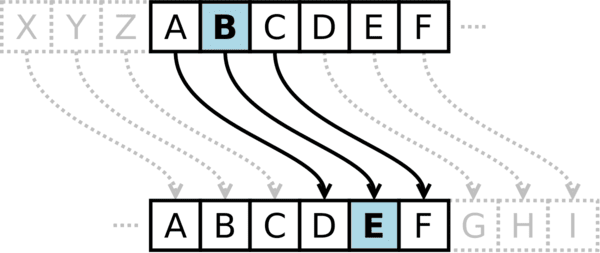

# Unitat 6. Cadenes de caràcters

Una gran part de les dades amb què treballam són text: noms, missatges, contrasenyes, adreces electròniques, codis postals… A la unitat 3 vam veure que en Python el text es guarda en **cadenes de caràcters** (tipus `str`) i que es poden unir amb `+` i repetir amb `*`. En aquesta unitat aprendrem a accedir als caràcters d'una cadena, a extreure'n trossos, a recórrer-la amb bucles i a transformar-la amb els mètodes que ofereix Python. Acabarem programant un sistema de xifratge.

## 6.1. Com es guarda una cadena

Una cadena és una **seqüència ordenada de caràcters**. Cada caràcter ocupa una posició, que s'anomena **índex**. El primer caràcter té l'índex **0**, no l'1. També es pot comptar des del final amb índexs negatius: -1 és el darrer caràcter, -2 el penúltim, etc.

| Caràcter | `P` | `y` | `t` | `h` | `o` | `n` |
| --- | --- | --- | --- | --- | --- | --- |
| Índex positiu | 0 | 1 | 2 | 3 | 4 | 5 |
| Índex negatiu | -6 | -5 | -4 | -3 | -2 | -1 |

```python
paraula = "Python"
print(paraula[0])     # P
print(paraula[3])     # h
print(paraula[-1])    # n
print(len(paraula))   # 6: la funció len() retorna la longitud
```

!!! warning "Índex fora de rang"
    Si demanes una posició que no existeix, Python dona un error `IndexError`. A `"Python"`, el darrer índex positiu és el 5, és a dir, `len(paraula) - 1`.

### 6.1.1. Les cadenes són immutables

Una vegada creada, una cadena **no es pot modificar**. Si intentes canviar-ne un caràcter, obtens un error:

```python
paraula = "Pithon"
paraula[1] = "y"   # TypeError: 'str' object does not support item assignment
```

El que sí podem fer és **crear una cadena nova** i guardar-la a la mateixa variable:

```python
paraula = "Pithon"
paraula = paraula[0] + "y" + paraula[2:]
print(paraula)   # Python
```

### 6.1.2. Caràcters especials

Hi ha caràcters que no es poden escriure directament dins una cadena. Per escriure'ls, feim servir una **seqüència d'escapament**, que comença amb una barra inversa `\`:

| Seqüència | Significat |
| --- | --- |
| `\n` | Salt de línia |
| `\t` | Tabulador |
| `\'` i `\"` | Cometa simple o doble dins una cadena delimitada per aquestes mateixes cometes |
| `\\` | Barra inversa |

```python
print("Primera línia\nSegona línia")
print('L\'ordinador')
```

Per escriure un text de diverses línies també es poden fer servir **cometes triples** (`"""` o `'''`).

## 6.2. Llesques (*slicing*)

Una **llesca** és un tros d'una cadena. S'escriu amb la sintaxi `cadena[inici:fi:pas]`, que funciona igual que `range()`: el caràcter de la posició `fi` **no s'inclou**.

```python
text = "Programació"
print(text[0:4])    # Prog     (posicions 0, 1, 2 i 3)
print(text[4:])     # ramació  (des de la 4 fins al final)
print(text[:4])     # Prog     (des del principi fins a la 3)
print(text[-3:])    # ció      (els tres darrers)
print(text[::2])    # Pormcó   (un caràcter sí i un no)
print(text[::-1])   # óicamargorP (al revés)
```

!!! tip "Girar una cadena"
    `text[::-1]` és la manera més curta de girar una cadena en Python: recorre tota la cadena amb pas -1, és a dir, de darrere cap endavant.

## 6.3. Recórrer una cadena

Com vam veure a la unitat 5, el bucle `for` pot recórrer directament els caràcters d'una cadena:

```python
for lletra in "Hola":
    print(lletra)
```

Si, a més del caràcter, necessitam la seva posició, podem recórrer els índexs amb `range(len(...))`:

```python
paraula = "Hola"
for i in range(len(paraula)):
    print(f"Posició {i}: {paraula[i]}")
```

### 6.3.1. L'operador `in`

L'operador `in` comprova si un caràcter o un tros de text és dins una cadena, i retorna `True` o `False`:

```python
print("a" in "Mallorca")       # True
print("orca" in "Mallorca")    # True
print("z" not in "Mallorca")   # True

vocals = "aeiouàèéíòóú"
lletra = "e"
if lletra in vocals:
    print("És una vocal")
```

## 6.4. Mètodes de les cadenes

Els **mètodes** són funcions que pertanyen a un tipus de dada. S'escriuen després de la variable i un punt: `cadena.metode()`. Com que les cadenes són immutables, **els mètodes no modifiquen la cadena original**: en retornen una de nova.

```python
nom = "anna"
nom.upper()          # retorna "ANNA", però nom continua sent "anna"
nom = nom.upper()    # ara sí: nom passa a ser "ANNA"
```

Aquests són alguns dels mètodes més útils:

| Mètode | Què fa | Exemple | Resultat |
| --- | --- | --- | --- |
| `upper()` | Tot en majúscules | `"hola".upper()` | `"HOLA"` |
| `lower()` | Tot en minúscules | `"HoLa".lower()` | `"hola"` |
| `capitalize()` | Primera lletra en majúscula | `"hola món".capitalize()` | `"Hola món"` |
| `title()` | Primera lletra de cada paraula en majúscula | `"hola món".title()` | `"Hola Món"` |
| `strip()` | Elimina els espais del principi i del final | `"  hola  ".strip()` | `"hola"` |
| `replace(a, b)` | Substitueix `a` per `b` | `"cotxe".replace("t", "")` | `"coxe"` |
| `count(a)` | Compta quantes vegades apareix `a` | `"banana".count("a")` | `3` |
| `find(a)` | Posició de la primera aparició de `a` (-1 si no hi és) | `"banana".find("n")` | `2` |
| `startswith(a)` | Comprova si comença per `a` | `"Palma".startswith("Pa")` | `True` |
| `endswith(a)` | Comprova si acaba per `a` | `"foto.png".endswith(".png")` | `True` |
| `isdigit()` | Comprova si tots els caràcters són xifres | `"2024".isdigit()` | `True` |
| `isalpha()` | Comprova si tots els caràcters són lletres | `"Sóller".isalpha()` | `True` |
| `isupper()` / `islower()` | Comprova si està en majúscules o en minúscules | `"ABC".isupper()` | `True` |
| `split(sep)` | Divideix la cadena en trossos per `sep` (per defecte, pels espais) | `"a,b,c".split(",")` | `['a', 'b', 'c']` |
| `sep.join(llista)` | Uneix els trossos amb `sep` entre ells | `"-".join(["a", "b", "c"])` | `"a-b-c"` |

`split()` i `join()` treballen amb **llistes**, que veurem a la unitat 7. De moment, n'hi ha prou de saber que `split()` retorna una llista i que `len()` ens diu quants elements té:

```python
frase = "Aprendre a programar és divertit"
paraules = frase.split()
print(len(paraules))   # 5
```

!!! tip "Validar dades abans de convertir-les"
    A la unitat 3 vam veure que `int("hola")` provoca un error. Amb `isdigit()` podem comprovar-ho abans:

    ```python
    text = input("Quants d'anys tens? ")
    if text.isdigit():
        edat = int(text)
        print(f"L'any que ve en faràs {edat + 1}")
    else:
        print("Això no és un nombre enter positiu")
    ```

## 6.5. Exercicis

!!! example "Exercici 6.1. Paraula al revés"
    Demana una paraula i mostra-la al revés. Resol-ho de dues maneres: amb una llesca i amb un bucle.

    ??? success "Solució"
        ```python
        paraula = input("Escriu una paraula: ")

        # Amb una llesca
        print(paraula[::-1])

        # Amb un bucle: afegim cada lletra davant de les anteriors
        reves = ""
        for lletra in paraula:
            reves = lletra + reves
        print(reves)
        ```

!!! example "Exercici 6.2. Palíndroms"
    Un **palíndrom** és una paraula o frase que es llegeix igual d'esquerra a dreta que de dreta a esquerra, com «Anna» o «radar». Demana una paraula i digues si és un palíndrom, sense tenir en compte les majúscules. Ampliació: fes que funcioni també amb frases, sense tenir en compte els espais, com «Català a l'atac».

    ??? success "Solució"
        ```python
        text = input("Escriu una paraula o frase: ")
        net = text.lower().replace(" ", "")
        if net == net[::-1]:
            print("És un palíndrom")
        else:
            print("No és un palíndrom")
        ```

        Per a l'ampliació amb «Català a l'atac» cal eliminar també els apòstrofs i els accents. Una manera és quedar-se només amb les lletres (`isalpha()`) i substituir cada vocal accentuada per la vocal sense accent amb `replace()`.

!!! example "Exercici 6.3. Comptar vocals"
    Demana una frase i compta quantes vocals té, incloses les accentuades.

    ??? success "Solució"
        ```python
        frase = input("Escriu una frase: ")
        vocals = "aeiouàèéíòóúïü"
        comptador = 0
        for lletra in frase.lower():
            if lletra in vocals:
                comptador += 1
        print(f"La frase té {comptador} vocals")
        ```

!!! example "Exercici 6.4. Sigles"
    Demana el nom d'una organització i mostra'n les sigles amb les inicials en majúscula de cada paraula. Per exemple, «institut d'educació secundària» → «IDS». Pista: `split()`.

    ??? success "Solució"
        ```python
        nom = input("Nom de l'organització: ")
        sigles = ""
        for paraula in nom.split():
            sigles += paraula[0].upper()
        print(sigles)
        ```

!!! example "Exercici 6.5. Adreça electrònica"
    Demana una adreça electrònica i comprova que té exactament una `@`, que hi ha text abans i després de l'`@`, i que després de l'`@` hi ha almenys un punt. Si és correcta, mostra el nom d'usuari (la part anterior a l'`@`) i el domini (la part posterior).

    ??? success "Solució"
        ```python
        adreca = input("Adreça electrònica: ").strip()
        posicio = adreca.find("@")
        if adreca.count("@") != 1 or posicio == 0 or posicio == len(adreca) - 1:
            print("Adreça no vàlida")
        else:
            usuari = adreca[:posicio]
            domini = adreca[posicio + 1:]
            if "." not in domini:
                print("Adreça no vàlida: al domini hi falta un punt")
            else:
                print(f"Usuari: {usuari}")
                print(f"Domini: {domini}")
        ```

        Aquesta validació és molt bàsica: comprovar de debò que una adreça és vàlida és força més complicat.

!!! example "Exercici 6.6. Contrasenya segura"
    Demana una contrasenya i comprova que té almenys 8 caràcters, alguna majúscula, alguna minúscula i alguna xifra. Si no compleix alguna condició, digues quina.

    ??? success "Solució"
        ```python
        contrasenya = input("Contrasenya: ")
        te_majuscula = False
        te_minuscula = False
        te_xifra = False
        for c in contrasenya:
            if c.isupper():
                te_majuscula = True
            elif c.islower():
                te_minuscula = True
            elif c.isdigit():
                te_xifra = True

        segura = True
        if len(contrasenya) < 8:
            print("Ha de tenir almenys 8 caràcters")
            segura = False
        if not te_majuscula:
            print("Ha de tenir alguna majúscula")
            segura = False
        if not te_minuscula:
            print("Ha de tenir alguna minúscula")
            segura = False
        if not te_xifra:
            print("Ha de tenir alguna xifra")
            segura = False
        if segura:
            print("Contrasenya segura")
        ```

## 6.6. Miniprojecte: el xifratge de Cèsar

El **xifratge de Cèsar** és un dels mètodes de xifratge més antics i senzills que existeixen. S'atribueix a **Juli Cèsar**, que l'hauria utilitzat per enviar missatges secrets als seus generals. Consisteix a **desplaçar cada lletra del missatge un nombre fix de posicions a l'alfabet**.



El mecanisme és simple:

- Es tria un nombre de desplaçament, que és la **clau**.
- Cada lletra del missatge se substitueix per la lletra que hi ha aquest nombre de posicions més endavant a l'alfabet.
- En arribar al final de l'alfabet, es torna a començar per la A.

Amb clau 3: A → D, B → E, C → F… X → A, Y → B, Z → C. Així, el missatge `HOLA MON` es converteix en `KROD PRQ`. Per desxifrar-lo, s'aplica el mateix procés amb la clau negativa (-3).

Per programar-lo, aprofitarem les funcions `ord()` i `chr()` de la unitat 3, i l'operador `%` per tornar a començar l'alfabet. Treballarem amb l'alfabet anglès de 26 lletres (de la A a la Z, sense Ç ni vocals accentuades); els altres caràcters es deixen tal com estan.

```python
missatge = input("Missatge: ")
clau = int(input("Clau (negativa per desxifrar): "))

resultat = ""
for caracter in missatge:
    if "a" <= caracter <= "z" or "A" <= caracter <= "Z":
        if caracter.isupper():
            base = ord("A")
        else:
            base = ord("a")
        posicio = ord(caracter) - base            # 0 per a la A, 25 per a la Z
        nova_posicio = (posicio + clau) % 26      # si passa de 25, torna a començar
        resultat += chr(base + nova_posicio)
    else:
        resultat += caracter                      # espais, signes, accents... no canvien

print("Resultat:", resultat)
```

```text title="Exemple d'execució"
Missatge: Hola Mon
Clau (negativa per desxifrar): 3
Resultat: Krod Prq
```

!!! info "Per què fa falta `% 26`?"
    La Y és la posició 24. Amb clau 3, 24 + 3 = 27, que no correspon a cap lletra. Però 27 % 26 = 1, que és la B. El mòdul fa que, en passar de la Z, es torni a començar per la A. També funciona amb claus negatives: en Python, (0 - 3) % 26 = 23, que és la X.

El xifratge de Cèsar és **molt insegur**: com que només hi ha 25 claus possibles, es pot trencar per **força bruta** provant-les totes en un instant. A més, no amaga els patrons de la llengua: la lletra més freqüent del missatge original continua sent la més freqüent del missatge xifrat. Tot i això, és una eina excel·lent per entendre els conceptes de clau, xifratge, desxifratge i vulnerabilitat.

!!! example "Exercici 6.7. Trencar el xifratge per força bruta"
    Fes un programa que demani un missatge xifrat amb el xifratge de Cèsar i mostri el resultat de desxifrar-lo amb **totes** les claus possibles (de l'1 al 25). Llegeix-los i descobreix quin és el missatge original d'aquest text: `Vxumxgsgx éy jobkxzoz`.

    ??? success "Solució"
        ```python
        xifrat = input("Missatge xifrat: ")
        for clau in range(1, 26):
            resultat = ""
            for caracter in xifrat:
                if "a" <= caracter <= "z" or "A" <= caracter <= "Z":
                    if caracter.isupper():
                        base = ord("A")
                    else:
                        base = ord("a")
                    resultat += chr(base + (ord(caracter) - base - clau) % 26)
                else:
                    resultat += caracter
            print(f"Clau {clau:2}: {resultat}")
        ```

        El missatge es llegeix amb la clau 6.

!!! example "Exercici 6.8. Ampliació: xifratge de Vigenère"
    El **xifratge de Vigenère** millora el de Cèsar fent servir una **paraula clau**: cada lletra del missatge es desplaça segons la lletra corresponent de la paraula clau (A = 0, B = 1, C = 2…), que es repeteix tantes vegades com calgui. Per exemple, amb la paraula clau `LLUM`, la primera lletra del missatge es desplaça 11 posicions (L), la segona 11 (L), la tercera 20 (U), la quarta 12 (M), la cinquena torna a desplaçar-se 11, etc. Programa'l per a missatges en majúscules i sense espais.

    ??? success "Solució"
        ```python
        missatge = input("Missatge (majúscules, sense espais): ").upper()
        paraula_clau = input("Paraula clau: ").upper()

        resultat = ""
        for i in range(len(missatge)):
            lletra_clau = paraula_clau[i % len(paraula_clau)]
            desplacament = ord(lletra_clau) - ord("A")
            posicio = ord(missatge[i]) - ord("A")
            resultat += chr(ord("A") + (posicio + desplacament) % 26)
        print("Missatge xifrat:", resultat)
        ```

        `i % len(paraula_clau)` fa que, quan s'acaba la paraula clau, es torni a començar per la primera lletra.

---

!!! quote "Font"
    Unitat elaborada en bona part amb material propi, a partir de la base de Lope González Vázquez ([CC BY-NC-SA 4.0](https://creativecommons.org/licenses/by-nc-sa/4.0/deed.ca)). De [«Tema 11. Fundamentos de programación»](https://lopegonzalez.es/eso-y-bachillerato/tic-i-1o-bachillerato/tema-11-fundamentos-de-programacion/) (TIC I) provenen els enunciats dels exercicis 6.1 a 6.3. De [«Tema 8. Criptografía»](https://lopegonzalez.es/eso-y-bachillerato/creacion-digital-y-pensamiento-computacional-1o-bachillerato/tema-8-criptografia/) (Creación digital y pensamiento computacional) provenen l'explicació del xifratge de Cèsar, les seves limitacions i la imatge. El codi de Lope, que utilitza funcions, s'ha reescrit sense funcions perquè aquestes no es treballen fins a PTD II. Són propis els apartats 6.1 a 6.4, els exercicis 6.4 a 6.8 i totes les solucions.
