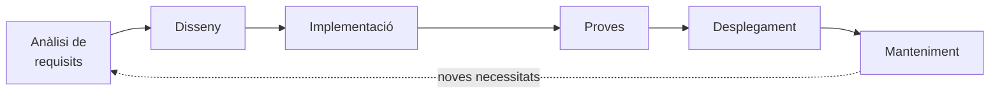
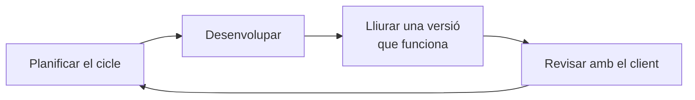
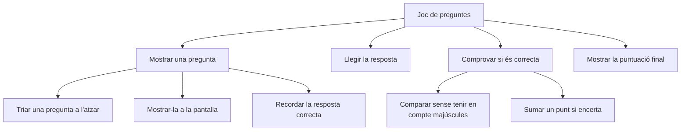

# Unitat 8. Cicle de vida d'un projecte

Quan pensam en una aplicació que feim servir cada dia, com una xarxa social, un joc o l'aplicació del banc, és fàcil imaginar que algú es va asseure davant l'ordinador, va escriure codi durant uns quants dies i el programa ja estava llest.

Però en realitat no funciona així, **ni de lluny**. Crear programari és un procés molt més organitzat i planificat, que s'estructura en el que anomenam **cicle de vida del programari**.

Podem comparar-ho amb la construcció d'una casa. Abans de posar el primer maó, un arquitecte fa plànols, s'estudien les necessitats dels futurs habitants, es dissenyen els espais, es construeix amb els materials adequats i finalment es revisa que tot funcioni (electricitat, lampisteria…). Només quan tot està provat es certifica i la casa es pot habitar. Amb el programari passa exactament el mateix: hi ha fases clares que guien el projecte des de la idea inicial fins a l'aplicació acabada.

## 8.1. Les fases del cicle de vida

Les fases concretes varien segons l'autor i el model de treball, però les més habituals són aquestes:



1. **Anàlisi de requisits.** S'estudia què necessita realment l'usuari. Imagina que el teu institut vol una aplicació per reservar els ordinadors de la biblioteca. No es comença programant: primer es pregunta qui la farà servir, quines funcions són necessàries, si ha d'enviar avisos… El resultat d'aquesta fase és una llista de requisits per escrit, validada amb el client.
2. **Disseny.** Un cop enteses les necessitats, es decideix **com** es construirà el sistema: com s'organitzen les dades, com seran les pantalles i els menús, quins algorismes es faran servir. A l'exemple, es definiria com es guarden les reserves, com hi accedeix cada alumne i com s'evita que dues persones reservin el mateix ordinador a la mateixa hora. És l'equivalent als plànols de l'arquitecte.
3. **Implementació** (o programació). Ara sí, s'escriu el codi seguint el disseny.
4. **Proves.** Abans de lliurar el programa, es comprova que funciona bé i que fa el que demanaven els requisits. Aquí es detecten errors com que l'aplicació permeti reservar un ordinador a una hora ja ocupada.
5. **Desplegament.** El programa es posa a disposició dels usuaris: s'instal·la, es publica o es distribueix, i es lliuren els manuals.
6. **Manteniment.** Els usuaris fan servir el programa, en troben errors i demanen funcions noves. Es corregeix, s'actualitza i es millora. Sol ser **la fase més llarga** de tot el cicle.

Si t'hi fixes, aquest procés també passa en el teu dia a dia. Quan preparau un treball en grup, primer decidiu què s'ha de fer (anàlisi), després repartiu les tasques i en feis un esquema (disseny), l'elaborau (implementació), el revisau junts (proves) i finalment el lliurau (desplegament). I el millorau si el professor us en fa comentaris (manteniment).

!!! info "La fase més important"
    Si demanam a persones que dirigeixen projectes de programari quina és la fase més important, moltes respondran que l'anàlisi de requisits: si no entenem què vol el client, mai no podrem lliurar un projecte que satisfaci les seves necessitats. Hi ha una vinyeta clàssica que ho resumeix: el gronxador que demanava el client, el que va entendre el cap de projecte, el que va dissenyar l'analista, el que va programar el programador… i el que el client realment necessitava, que era una roda penjada d'una branca.

## 8.2. Els requisits

Un **requisit** és una condició o capacitat que ha de complir el programa. Es distingeixen dos tipus:

| Tipus | Què descriu | Exemples (aplicació de reserves de la biblioteca) |
| --- | --- | --- |
| **Funcionals** | **Què** ha de fer el programa | L'alumne pot reservar un ordinador per a una franja horària. No es pot reservar un ordinador ja ocupat. El professorat pot veure totes les reserves del dia. |
| **No funcionals** | **Com** ho ha de fer: qualitat, rendiment, restriccions | Una reserva s'ha de poder fer en menys de 30 segons. Ha de funcionar al mòbil. Només hi poden accedir els usuaris del centre. |

Els requisits han de ser **concrets i comprovables**. «L'aplicació ha de ser ràpida» no és un bon requisit, perquè no es pot comprovar; «La llista de reserves s'ha de mostrar en menys de 2 segons» sí que ho és.

### 8.2.1. Els casos d'ús

Una de les maneres més intuïtives de descriure què espera l'usuari d'una aplicació són els **casos d'ús**. Un cas d'ús descriu **qui** (l'actor) fa **què** (la interacció) amb el sistema i **per a què** (l'objectiu). Es descriu des del punt de vista de l'usuari, i té aquestes parts:

- **Títol**: prestar un llibre.
- **Actor**: usuari de la biblioteca.
- **Objectiu**: l'actor vol endur-se en préstec un llibre de la biblioteca.
- **Flux d'esdeveniments**:
    1. L'usuari accedeix al sistema amb el seu número de soci.
    2. Cerca el llibre amb el cercador.
    3. Selecciona el llibre i tria l'opció «Prestar».
    4. El sistema comprova si el llibre està disponible.
    5. Si ho està, el sistema registra el préstec i fixa la data de devolució. Si no ho està, n'informa l'usuari i li ofereix reservar-lo.
    6. L'usuari rep la confirmació del préstec amb la data de devolució.
- **Precondicions**: l'usuari està registrat al sistema i té el carnet actiu.
- **Postcondicions**: el llibre queda marcat com a prestat i no està disponible per a altres usuaris fins que es torni.

## 8.3. Metodologies de desenvolupament

Ja sabem que el cicle de vida té diverses fases. Però com s'organitzen? Sempre es fan en el mateix ordre i una sola vegada? Al llarg de la història de la informàtica s'han creat diferents **metodologies de desenvolupament**, que són maneres d'organitzar la feina d'un projecte. Es poden classificar en dos grans grups: **tradicionals** i **àgils**.

### 8.3.1. Metodologies tradicionals

Les metodologies tradicionals segueixen un enfocament **seqüencial i planificat**: cada fase es completa abans de passar a la següent, i l'abast, els requisits, els terminis i els costs es fixen al principi. Són adequades quan els requisits són clars i és poc probable que canviïn.

- **Model en cascada.** Les fases es fan una darrere l'altra, com si fossin graons. És fàcil d'entendre, però molt rígid: si el client demana un canvi al final, és molt car d'incorporar.

    ```mermaid
    flowchart LR
        A[Anàlisi] --> B[Disseny] --> C[Implementació] --> D[Proves] --> E[Desplegament] --> F[Manteniment]
    ```

- **Model en V.** Semblant a la cascada, però cada fase de construcció té associada una fase de proves que la verifica: les proves de cada peça, les proves de conjunt, i les proves d'acceptació amb el client, que comproven els requisits inicials.

- **Model en espiral.** En lloc de fer-ho tot d'una vegada, es treballa en «voltes» o cicles. A cada volta es planifica, s'analitzen els riscs, es dissenya i es construeix una part, es prova i s'avança una mica més. S'assembla a construir una maqueta inicial i millorar-la a cada volta.

### 8.3.2. Metodologies àgils

Les metodologies àgils són les més utilitzades avui en dia. Es basen en la idea que els requisits canvien i que és millor **adaptar-s'hi** que intentar preveure-ho tot al principi. Es treballa en equips petits, el projecte es divideix en cicles curts d'unes poques setmanes i, al final de cada cicle, es lliura una versió que **ja funciona**, encara que sigui molt bàsica. El client la prova, en dona la seva opinió i el projecte es reorienta si cal.



Les metodologies àgils més conegudes són:

- **Scrum.** El projecte es divideix en ***sprints*** (cicles d'una a quatre setmanes). Totes les funcionalitats pendents es recullen en una llista anomenada ***product backlog***, normalment en forma d'**històries d'usuari** («Com a alumne, vull reservar un ordinador per poder fer els deures a la biblioteca»). Cada dia l'equip fa una reunió breu (la ***daily***) per posar en comú què ha fet, què farà i quins problemes té. Hi ha rols definits: el ***product owner*** representa el client i prioritza les tasques; l'***scrum master*** vetlla perquè l'equip segueixi la metodologia i resol els obstacles; i l'**equip de desenvolupament** construeix el producte.
- **Kanban.** Les tasques es representen com a targetes en un tauler dividit en columnes (per exemple, «Per fer», «Fent» i «Fet») que van avançant a mesura que es completen. És molt visual i permet veure d'un cop d'ull l'estat del projecte. Eines com Trello funcionen així.
- **Programació extrema (XP).** Posa l'accent en la qualitat tècnica, amb pràctiques com la **programació en parella** (dues persones en un mateix ordinador: una escriu i l'altra revisa), escriure les proves abans que el codi i millorar contínuament el codi existent.

| | Tradicionals (cascada) | Àgils (Scrum) |
| --- | --- | --- |
| Planificació | Tota al principi | Contínua, a cada cicle |
| Canvis en els requisits | Costosos | Esperats i benvinguts |
| Lliuraments | Un de sol, al final | Freqüents, cada poques setmanes |
| Participació del client | Sobretot al principi i al final | Constant |
| Adequades per a… | Projectes amb requisits clars i estables | Projectes amb requisits incerts o canviants |

## 8.4. Descompondre el problema: el disseny descendent

Quan t'enfrontes a un problema complex, com organitzar el viatge de fi de curs, si ho intentes fer tot de cop, t'aclapara: el lloc, el transport, l'allotjament, els doblers, el menjar, les activitats, les autoritzacions… El més lògic és **dividir el problema en parts més petites** i que diferents persones s'encarreguin de cada una.

En programació passa exactament el mateix. L'estratègia s'anomena **disseny descendent** (*top-down*): es parteix de la idea general i es **descompon a poc a poc en tasques més simples**, fins que cada una es pot traduir fàcilment a codi. Vegem-ho amb un joc de preguntes i respostes:



Així, un projecte que semblava enorme es converteix en una col·lecció de petits objectius assolibles. És el que ja feies, sense saber-ho, quan descomponies un algorisme en passes a la unitat 1. A PTD II veurem com cada una d'aquestes peces es pot convertir en una **funció**.

## 8.5. Les proves

Provar no vol dir executar el programa una vegada i veure que «sembla que va». Les proves s'han de **planificar**: abans de provar, es decideix quines dades s'introduiran i quin resultat s'espera. Després es compara el resultat obtingut amb l'esperat.

### 8.5.1. Tipus d'errors

Quan escrivim un programa, el més habitual és que no funcioni a la primera. Això no vol dir que ho haguem fet malament: forma part del procés. Els errors poden ser de tres tipus:

| Tipus | Quan apareix | Exemple en Python |
| --- | --- | --- |
| **De sintaxi** | Abans d'executar: Python no entén el codi | Oblidar els dos punts: `if x > 5` |
| **D'execució** | Durant l'execució: passa una cosa inesperada i el programa s'atura | Dividir entre zero, `int("hola")`, accedir a una posició que no existeix d'una llista |
| **De lògica** | El programa funciona, però fa una cosa diferent del que hauria de fer | Calcular la mitjana dividint entre un nombre equivocat |

Els errors de lògica són els més difícils de detectar, perquè Python no avisa de res. Per trobar-los, calen proves ben planificades.

### 8.5.2. Taula de proves

Una **taula de proves** recull els casos que es provaran. És important no provar només els casos «normals», sinó també els **casos límit** (els valors just a la frontera entre dues respostes) i les **dades incorrectes**. Per exemple, per al programa de qualificacions de l'exercici 4.7:

| Cas | Entrada | Resultat esperat | Resultat obtingut | Correcte? |
| --- | --- | --- | --- | --- |
| Normal | 7.5 | Notable | | |
| Límit | 5 | Suficient | | |
| Límit | 4.99 | Insuficient | | |
| Límit | 9 | Excel·lent | | |
| Límit | 0 | Insuficient | | |
| Fora de rang | 11 | Missatge d'error | | |
| Fora de rang | -1 | Missatge d'error | | |
| Dada incorrecta | set | ? | | |

!!! question "Pensa-hi"
    Què passa amb la darrera prova? El programa s'atura amb un error `ValueError`, perquè `float("set")` no es pot convertir. És un error d'execució que el programa no controla. A la unitat 6 vam veure com evitar-ho en alguns casos amb `isdigit()`.

## 8.6. Control de versions i treball en equip

Quan treballam en un projecte, hi feim canvis constantment. El problema apareix quan, després de molts d'intents, ja no sabem quina era la versió que funcionava, o volem recuperar una cosa que vam esborrar fa uns dies. Segur que et sona:

```text
treball_final_v1.docx
treball_final_v2_bo.docx
treball_final_definitiu.docx
treball_final_DEFINITIU_ara_si.docx
```

Per evitar-ho existeix el **control de versions**: un sistema que guarda l'historial de tots els canvis d'un projecte. Cada vegada que es desa una versió, el sistema registra quins canvis s'han fet, quan i qui els ha fet. És com una màquina del temps: si alguna cosa falla, es pot tornar exactament a la versió que funcionava sense perdre la feina posterior.

L'eina de control de versions més utilitzada és **Git**, i la plataforma més coneguda per allotjar projectes Git a Internet és **GitHub**. De fet, aquesta mateixa web està allotjada a GitHub i té tot el seu historial de canvis guardat amb Git.

El control de versions també permet que **diverses persones treballin sobre el mateix projecte** sense trepitjar-se la feina. I és que, encara que sovint imaginam el programador com algú que treballa tot sol davant l'ordinador, en la realitat professional el programari es desenvolupa gairebé sempre **en equip**: programadors, dissenyadors, analistes, persones que fan proves, redactors de documentació… Cada part ha d'encaixar amb les altres, i això exigeix **comunicació constant, responsabilitat i coordinació**.

## 8.7. Exercicis

!!! example "Exercici 8.1. Analitzar requisits"
    El departament d'Educació Física del teu institut vol una aplicació per gestionar el préstec de material esportiu (pilotes, raquetes, cons…) a l'hora del pati. Treballant en grup:

    1. Escriu almenys 10 preguntes que faries al departament abans de començar a dissenyar res.
    2. Imagina les respostes i escriu una llista de requisits funcionals i una altra de no funcionals.
    3. Revisa que cada requisit sigui concret i comprovable.

!!! example "Exercici 8.2. Casos d'ús"
    Escriu un cas d'ús complet (títol, actor, objectiu, flux d'esdeveniments, precondicions i postcondicions) per a cada una d'aquestes situacions:

    1. «Reservar una habitació» en una web de reserves d'hotels, des de la cerca fins a la confirmació.
    2. «Comprar entrades» per a un concert, des de la cerca de l'esdeveniment fins a la recepció de les entrades digitals.
    3. «Demanar un taxi» amb una aplicació mòbil, des que s'obre l'aplicació fins que el taxi arriba.

!!! example "Exercici 8.3. Qui és qui a Scrum"
    L'associació de mares i pares de l'institut encarrega a la vostra empresa, *In Code We Trust*, una petita botiga en línia per vendre les dessuadores de l'institut. En **Toni** representa l'associació: explica què volen i provarà l'aplicació. La **Júlia**, de la vostra empresa, és l'única que coneix tots els detalls del projecte. Quan ho té clar, es reuneix amb l'**Andrea** i li explica totes les necessitats, per exemple:

    - La botiga ha de mostrar a la part superior els 5 articles més venuts de l'últim mes.
    - Per comprar, cal estar registrat i iniciar sessió.
    - El pagament s'ha de fer amb targeta i amb el menor nombre de passes possible.
    - Els usuaris han de poder tornar un producte amb un sol clic.

    L'Andrea ho analitza tot i penja a la paret del despatx un gran mural amb totes les funcionalitats que ha de tenir l'aplicació. Després es reuneix amb la **Laura** i fan un pla de feina per a les dues setmanes següents (el pla T1): faran el registre i l'inici de sessió, i l'àrea privada on l'usuari veu els seus productes comprats i fa devolucions.

    L'endemà a primera hora, l'Andrea i la Laura es reuneixen amb dos programadors, en **Pau** i la **Sílvia**. La Laura els explica com treballaran. En Pau planteja un dubte que la Laura li resol, i cadascú torna al seu lloc. Dos dies després, en Toni diu a la Júlia que voldrien que el registre es pogués fer amb un sol clic amb un compte de Google. L'endemà, l'Andrea es reuneix de nou amb la Laura, en Pau i la Sílvia per explicar-los la novetat. La Sílvia pregunta com ha de canviar la seva feina d'avui, i la Laura li ho aclareix.

    Completa aquesta taula, justificant cada resposta:

    | Pregunta | Resposta i justificació |
    | --- | --- |
    | Qui és el client? | |
    | Qui és l'*scrum master*? | |
    | Qui és el *product owner*? | |
    | Qui és l'usuari? | |
    | Qui forma l'equip de desenvolupament? | |
    | Què fan servir com a *product backlog*? | |
    | Escriu tres històries d'usuari | |
    | Identifica un *sprint* | |
    | Identifica una *daily* | |

!!! example "Exercici 8.4. Disseny descendent"
    Descompon amb un diagrama en arbre, com el de l'apartat 8.4, un programa que gestioni la biblioteca d'aula: donar d'alta llibres, prestar-los, tornar-los i consultar quins llibres té cada alumne. Arriba fins a un nivell en què cada tasca sigui prou petita per programar-la directament.

!!! example "Exercici 8.5. Taula de proves"
    Fes la taula de proves de l'exercici 4.9 (tarifa del bus). Inclou casos normals, casos límit i dades incorrectes. Executa el programa amb cada cas, completa les columnes «Resultat obtingut» i «Correcte?» i, si trobes algun error, corregeix-lo.

---

!!! quote "Font"
    Unitat elaborada a partir de materials de Lope González Vázquez ([CC BY-NC-SA 4.0](https://creativecommons.org/licenses/by-nc-sa/4.0/deed.ca)): [«Tema 1. Ingeniería del software»](https://lopegonzalez.es/eso-y-bachillerato/programacion-y-computacion-2o-bachillerato/tema-1-ingenieria-del-software/) (Programación y computación) i [«Tema 2. Ingeniería del software»](https://lopegonzalez.es/eso-y-bachillerato/tic-ii-2o-bachillerato/tema-2-ingenieria-del-software/) (TIC II). Canvis: traducció al català, adaptació al currículum de Programació i Tractament de Dades I de les Illes Balears i síntesi de les dues fonts. Els diagrames s'han refet en català; no s'han reproduït les imatges originals (captures d'aplicacions comercials, fotografies i diagrames amb text en castellà). L'exercici 8.3 adapta l'exercici «In Code We Trust» de Lope, amb el context i els noms canviats; l'enunciat de l'exercici 8.2 prové de Lope. Són propis els apartats 8.2 (tipus de requisits), 8.5.2 (taula de proves), la taula comparativa de metodologies, els exercicis 8.1, 8.4 i 8.5 i l'adaptació dels exemples.
